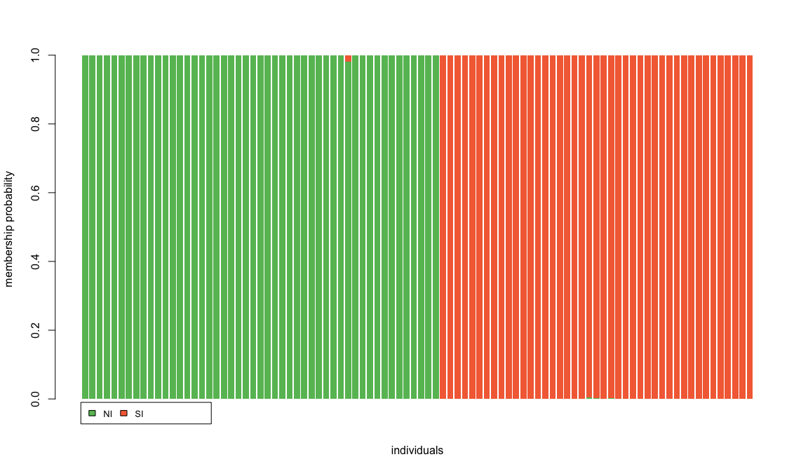

Using the adegenet package in R  to run some tests on my GBS dataset. Hopefully some interesting and nice plots as well. 
Loading all the packages I need.


```r
library(adegenet)
library(ape)
library(RColorBrewer)
```

I prepared the input in the pop_structure directory, they are `.raw` Plink files, that you can obtain with the PLINK `--recode A` command.
Importing the input file:


```r
GBS <- read.PLINK(file="../pop_structure/maxmiss90_common_snps.raw", map.file = "../pop_structure/maxmiss90_common_snps.map")
```

```
## 
##  Reading PLINK raw format into a genlight object...
```

```
## Loading required package: parallel
```

```
## 
##  Reading loci information... 
## 
##  Reading and converting genotypes... 
## .
##  Building final object... 
## 
## ...done.
```

That reminds me that `parallel` is also a required package. Luckily enough, adegenet look for it and loads it on its own. A few checks on the dataset before starting:


```r
# checking that population and individual names are fine
GBS@pop
```

```
##  [1] KapitiIsland        KapitiIsland        KapitiIsland       
##  [4] KapitiIsland        KapitiIsland        KapitiIsland       
##  [7] KapitiIsland        KapitiIsland        KapitiIsland       
## [10] KapitiIsland        KapitiIsland        KapitiIsland       
## [13] KapitiIsland        LittleBarrierIsland LittleBarrierIsland
## [16] LittleBarrierIsland LittleBarrierIsland LittleBarrierIsland
## [19] LittleBarrierIsland LittleBarrierIsland LittleBarrierIsland
## [22] LittleBarrierIsland LittleBarrierIsland LittleBarrierIsland
## [25] LittleBarrierIsland LittleBarrierIsland LittleBarrierIsland
## [28] Pureora             Pureora             Pureora            
## [31] Pureora             Pureora             Pureora            
## [34] Pureora             Pureora             Pureora            
## [37] Pureora             Zealandia           Zealandia          
## [40] Zealandia           Zealandia           Zealandia          
## [43] Zealandia           Zealandia           Zealandia          
## [46] Zealandia           Zealandia           Zealandia          
## [49] Zealandia           CodfishIsland       CodfishIsland      
## [52] CodfishIsland       CodfishIsland       CodfishIsland      
## [55] CodfishIsland       CodfishIsland       Fiordland          
## [58] Fiordland           Fiordland           Fiordland          
## [61] Fiordland           Fiordland           Fiordland          
## [64] Fiordland           Fiordland           Fiordland          
## [67] Fiordland           Nelson              Nelson             
## [70] Nelson              Nelson              Nelson             
## [73] Nelson              Nelson              Nelson             
## [76] Westland            Westland            Westland           
## [79] Westland            Westland            Westland           
## [82] Westland            Westland            Westland           
## [85] Westland            Westland            Westland           
## [88] Westland            Westland            Westland           
## [91] Westland            Westland           
## 8 Levels: CodfishIsland Fiordland KapitiIsland ... Zealandia
```

```r
indNames(GBS)
```

```
##  [1] "NI_KAP01" "NI_KAP02" "NI_KAP03" "NI_KAP04" "NI_KAP05" "NI_KAP06"
##  [7] "NI_KAP07" "NI_KAP08" "NI_KAP09" "NI_KAP10" "NI_KAP11" "NI_KAP12"
## [13] "NI_KAP13" "NI_LBI01" "NI_LBI02" "NI_LBI03" "NI_LBI04" "NI_LBI05"
## [19] "NI_LBI06" "NI_LBI07" "NI_LBI08" "NI_LBI09" "NI_LBI10" "NI_LBI11"
## [25] "NI_LBI12" "NI_LBI13" "NI_LBI14" "NI_PUR01" "NI_PUR02" "NI_PUR03"
## [31] "NI_PUR04" "NI_PUR05" "NI_PUR06" "NI_PUR07" "NI_PUR08" "NI_PUR09"
## [37] "NI_PUR10" "NI_ZEA01" "NI_ZEA02" "NI_ZEA03" "NI_ZEA04" "NI_ZEA05"
## [43] "NI_ZEA06" "NI_ZEA07" "NI_ZEA08" "NI_ZEA09" "NI_ZEA10" "NI_ZEA11"
## [49] "NI_ZEA12" "SI_COD01" "SI_COD02" "SI_COD03" "SI_COD04" "SI_COD05"
## [55] "SI_COD06" "SI_COD07" "SI_FIO02" "SI_FIO03" "SI_FIO05" "SI_FIO06"
## [61] "SI_FIO07" "SI_FIO08" "SI_FIO09" "SI_FIO10" "SI_FIO11" "SI_FIO12"
## [67] "SI_FIO13" "SI_NEL01" "SI_NEL02" "SI_NEL03" "SI_NEL04" "SI_NEL05"
## [73] "SI_NEL06" "SI_NEL07" "SI_NEL08" "SI_WES01" "SI_WES02" "SI_WES03"
## [79] "SI_WES04" "SI_WES05" "SI_WES06" "SI_WES07" "SI_WES08" "SI_WES09"
## [85] "SI_WES10" "SI_WES11" "SI_WES12" "SI_WES13" "SI_WES14" "SI_WES15"
## [91] "SI_WES16" "SI_WES17"
```

```r
# checking missing data and allele frequency distributions
glPlot(GBS)
```


```r
myFreq <- glMean(GBS)
myFreq <- c(myFreq, 1-myFreq)
hist(myFreq, proba=TRUE, col="#A6D96A", xlab="Allele frequencies",
     main="Distribution of allele frequencies", nclass=20)
temp <- density(myFreq, bw=.05)
lines(temp$x, temp$y*2,lwd=3)
```


Everything as expected.
First, I can plot a tree, from distances calculated from allele frequencies. 


```r
tre <- nj(dist(as.matrix(GBS)))
palette=(c(rep("#D9EF8B", 13), rep("#1A9850", 14), rep("#66BD63", 10), rep("#A6D96A", 12), 
           rep("#D73027", 7), rep("#F46D43", 11), rep("#FEE08B", 8), rep("#FDAE61", 17)))
plot(tre, "p", cex=0.5, no.margin = TRUE, tip.col=palette, font=4, node.pos=2, edge.width=1.2)
```


```r
# branch length is quite long, and very shallow, so it is difficult to see the deep relations, also plotting without branch lengths:
plot(tre, "p", cex=0.5, FALSE, no.margin = TRUE, tip.col=palette, font=4, node.pos=1, edge.width=1.2)
```


```r
# and plotting this way the labels are more visible:
plot(tre, "r", cex=0.8, FALSE, no.margin = TRUE, tip.col=palette, font=4, node.pos=2, edge.width=1.2)
```


Now, I want to try and see if we can identify some clusters within this data without using the a priori population information. To make it less computationally expensive, I am first performing the PCA calculations. I am keeping 100 PCA components at this stage (which includes all of them), so I can see how many of them actually contribute to the variation. Then, I am retaining a high number of clusters (`max.n.clust=40`) to test at first. A BIC test is used to evaluate the likelihood of each number of clusters.


```r
GBS_pca <- glPca(GBS, useC = FALSE, parallel = TRUE, nf=100)
barplot(GBS_pca$eig, main="eigenvalues", col=heat.colors(length(GBS_pca$eig))) #this is output automatically if nf=NULL, but Rmarkdown won't let me
```


```r
grp <- find.clusters(GBS, max.n.clust=40, glPca = GBS_pca, n.pca=100, choose = FALSE, stat = "BIC")
plot(grp$Kstat, type = "o", xlab = "number of clusters (K)", #again, as above, I normally set choose=TRUE and the plot is output automatically
     ylab = "BIC", col = "blue",
     main = "Value of BIC versus number of clusters")
```


```r
grp <- find.clusters(GBS, max.n.clust=40, glPca = GBS_pca, n.pca=100, n.clust = 2)
```

I can see that the most likely number of clusters is 2 (the lowest BIC) and I can check what individuals correspond to what group:


```r
table(pop(GBS), grp$grp)
```

```
##                      
##                        1  2
##   CodfishIsland        0  7
##   Fiordland            0 11
##   KapitiIsland        13  0
##   LittleBarrierIsland  0 14
##   Nelson               0  8
##   Pureora              0 10
##   Westland             0 17
##   Zealandia            0 12
```

So, in this analysis too, the only group that stands out from the rest of the samples is Kapiti Island, much like in the ADMIXTURE tests.
What would be more significative then is to use DAPC to figure out what the discriminants between the 8 populations are. In practice, DAPC gets the a priori information that we have 8 clusters in our dataset and looks for the discriminants that better explain those clusters. The number of PC components that are kept for the DAPC is quite important though: too many PCs and you overfit the data, overdiscriminating the clusters. Example, if I were to keep all PC components:


```r
dapc_pops <- dapc(GBS, glPca = GBS_pca, n.da = 10, n.pca = 100)
myCol <- c("#D73027", "#F46D43", "#D9EF8B", "#1A9850", "#FEE08B", "#66BD63", "#FDAE61", "#A6D96A")
scatter(dapc_pops, scree.pca = FALSE, bg="white", pch=20, cstar=0, col=myCol, solid=.6,
        cex=3, clab=0, leg=TRUE, posi.da="bottomright")
```


 
There are some tests implemented in adegenet to actually make sure to keep the right number of PCs. The a-score is a measure of _"the trade-off between power of discrimination and overfitting"_. It uses a randomisation of the data to measure when the successful reassignment is due to the analysis and when it is due to random discrimination and it penalises the reassignment score by the number of PCs retained. The second test is the cross-validation, CV, can also be used to find the right spot between too many and too few PCs. It splits the data in a training set and a validation set, and tests the accuracy with which the retained PCs on the training set can predict the assignment of the validation set, and the process is repeated through n replicates. The suggestion is then to keep the number of PCs that gives the lowest Mean Square Error (ideally this would also be the number of PCs that has the Highest Mean Success).


```r
temp <- optim.a.score(dapc_pops)
```


```r
mat <- tab(GBS, NA.method="mean")
xval <- xvalDapc(mat, pop(GBS), n.pca.max = 100, training.set = 0.8,
                 result = "groupMean", center = TRUE, scale = FALSE,
                 n.pca = NULL, n.rep = 30, xval.plot = TRUE, parallel = "multicore", ncpus = 6)
```


```r
xval[2:6]
```

```
## $`Median and Confidence Interval for Random Chance`
##       2.5%        50%      97.5% 
## 0.06229791 0.12351720 0.20063413 
## 
## $`Mean Successful Assignment by Number of PCs of PCA`
##        10        20        30        40        50        60        70 
## 0.8243056 0.9048611 0.8826389 0.8451389 0.7541667 0.5812500 0.4659722 
## 
## $`Number of PCs Achieving Highest Mean Success`
## [1] "20"
## 
## $`Root Mean Squared Error by Number of PCs of PCA`
##        10        20        30        40        50        60        70 
## 0.1954710 0.1159327 0.1476572 0.1766539 0.2651650 0.4316909 0.5442646 
## 
## $`Number of PCs Achieving Lowest MSE`
## [1] "20"
```

Looks like the _"goldilocks point"_ here is around 15-20 PCs. Let's see what this means for the actual DAPC analysis, when I keep those parameters. I can always keep all discriminant functions, since they are only (number_of_groups - 1), so maximum 7 in this case. 


```r
dapc_opt <- dapc(GBS, glPca = GBS_pca, n.da = 10, n.pca = 20)
myCol <- c("#D73027", "#F46D43", "#D9EF8B", "#1A9850", "#FEE08B", "#66BD63", "#FDAE61", "#A6D96A")
scatter(dapc_opt, scree.pca = FALSE, bg="white", pch=20, cstar=0, col=myCol, solid=.6,
        cex=3, clab=0, leg=TRUE, posi.da="topleft") # withouth labels, with legend
```


There you go. With an optimised number of PCs, the first two (and the strongest) discriminant functions only distinguish Kapiti Island and Zealandia from all the rest grouped together, as in other tests. Particularly, D1 (on the x axis) seems to be splitting Kapiti and Zealandia from everything else, while D2 (on the y axis) is separating Kapiti and Zealandia from each other. 
Let's plot the rest of the components and see what they are picking up.


All the other discriminants seem to be trying to distinguish some of the rest of the group (but in doing so Kapiti and Zealandia end up in the very middle of the undistiguished group). D3 and D4 in particular seem to separate the northern NI and the southern SI. 
Overall, it does not look like these discriminants would be able to tell all populations apart, but only Kapiti and Zealandia, and maybe Little Barrier Island. I can use a "structure"-like plot to see if that's the case.


```
##  [1] "NI_KAP01" "NI_KAP02" "NI_KAP03" "NI_KAP04" "NI_KAP05" "NI_KAP06"
##  [7] "NI_KAP07" "NI_KAP08" "NI_KAP09" "NI_KAP10" "NI_KAP11" "NI_KAP12"
## [13] "NI_KAP13" "NI_LBI01" "NI_LBI02" "NI_LBI03" "NI_LBI04" "NI_LBI05"
## [19] "NI_LBI06" "NI_LBI07" "NI_LBI08" "NI_LBI09" "NI_LBI10" "NI_LBI11"
## [25] "NI_LBI12" "NI_LBI13" "NI_LBI14" "NI_PUR01" "NI_PUR02" "NI_PUR03"
## [31] "NI_PUR04" "NI_PUR05" "NI_PUR06" "NI_PUR07" "NI_PUR08" "NI_PUR09"
## [37] "NI_PUR10" "NI_ZEA01" "NI_ZEA02" "NI_ZEA03" "NI_ZEA04" "NI_ZEA05"
## [43] "NI_ZEA06" "NI_ZEA07" "NI_ZEA08" "NI_ZEA09" "NI_ZEA10" "NI_ZEA11"
## [49] "NI_ZEA12" "SI_COD01" "SI_COD02" "SI_COD03" "SI_COD04" "SI_COD05"
## [55] "SI_COD06" "SI_COD07" "SI_FIO02" "SI_FIO03" "SI_FIO05" "SI_FIO06"
## [61] "SI_FIO07" "SI_FIO08" "SI_FIO09" "SI_FIO10" "SI_FIO11" "SI_FIO12"
## [67] "SI_FIO13" "SI_NEL01" "SI_NEL02" "SI_NEL03" "SI_NEL04" "SI_NEL05"
## [73] "SI_NEL06" "SI_NEL07" "SI_NEL08" "SI_WES01" "SI_WES02" "SI_WES03"
## [79] "SI_WES04" "SI_WES05" "SI_WES06" "SI_WES07" "SI_WES08" "SI_WES09"
## [85] "SI_WES10" "SI_WES11" "SI_WES12" "SI_WES13" "SI_WES14" "SI_WES15"
## [91] "SI_WES16" "SI_WES17"
```

There is assignment uncertainty for Pureora and for the SI populations, with some individuals assigned entirely to a different population, others just showing admixture. This is very similar to the plot I got from ADMIXTURE with K=8, maybe with a bit more discriminating power though. 
I can test this in another way, by selecting only a part of the samples from each population to perform the analysis, then seeing whether the discriminants can assign the excluded samples correctly to their population.


```r
kept.id <- unlist(tapply(1:nInd(GBS), pop(GBS),
                         function(e) sample(e, 6,replace=FALSE)))
x <- GBS[kept.id]
toRemove <- is.na(glMean(x, alleleAsUnit = FALSE)) # TRUE where NA
which(toRemove) # position of entirely non-typed loci
```

```
## ps_ch_14_12297559  ps_ch_1_91806392 
##             47404             91101
```

```r
x <- x[, !toRemove] #the PCA can randomly fail depending on the individuals kept...not good! well, not randomly, apparently it depends on whether there are loci completely untyped in the block of individuals randomly kept. I guess it can happen that removing some individuals rather than others some loci at low frequency might end up having no individuals left? I added this fix (developer's suggestion) so that if it happens that there are untyped loci they get removed before the PCA. I ran a few times and it was never more than 3-4 loci.

x.sup <- GBS[-kept.id]
x.sup <- x.sup[, !toRemove]
nInd(x)
```

```
## [1] 48
```

```r
nInd(x.sup)
```

```
## [1] 44
```

```r
x_pca <- glPca(x, useC = FALSE, parallel = TRUE, nf=100) 
dapc_x <- dapc(x, n.pca=20, n.da=10, glPca = x_pca)
pred.sup <- predict.dapc(dapc_x, newdata=x.sup)
mean(as.character(pred.sup$assign)==as.character(pop(x.sup)))
```

```
## [1] 0.4318182
```

```r
table.value(table(pred.sup$assign, pop(x.sup)), col.lab=levels(pop(x.sup)))
```


In this table, the original population is on the x axis and the inferred population is on the y axis. Again, the only individuals that are correctly reassigned are Kapiti, Zealandia, and few from Little Barrier Island. The rest are all assigned to a "Nelson" cluster, which not surprisingly was the most indisctinct cluster in the previous plots.


Finally, I want to see if I can identify a discriminant between the NI and the SI populations, and what drives it. First I am assigning all populations to either the North or the South Island, then I am running the DAPC analysis again. The number of PCs retained is the same as before, I verified that it is fine with the same optimisation tests. This time there will only be one discriminant, since the number of clusters is 2, and the plot will only have one dimension.


```r
islpop <- as.factor(c(rep("NI", 49), rep("SI", 43)))
dapc_isl <- dapc(GBS, islpop, glPca = GBS_pca, n.pca = 20, n.da = 10)
scatter(dapc_isl, scree.pca = FALSE, bg="white", pch=20, cstar=0, col=c("#66BD63", "#F46D43"), solid=.6,
        cex=3, clab=0, leg=TRUE)
```


```r
compoplot(dapc_isl, posi=NULL, lab = "", xlab="individuals", col.pal = c("#66BD63", "#F46D43"))
```



It seems like this discriminant does separate the individuals quite well, there is only a minimal overlap. And in the assignment plot only one individual seems to have some admixture (and it's from Pureora). I am keen to figure out what alleles are contributing to this discriminant, and I can do that by looking at the "loadings" of the DAPC. I am setting a threshold to identify the outliers, that is the loci that are contributing the most. The threshold here is set up to highlight only the 0.0001% of the most contributing loci (because the dataset is quite big). 


```r
contrib <- loadingplot(dapc_isl$var.contr, axis=1, thres=quantile(dapc_isl$var.contr, 0.9999))
```


It should be noted that the loading values are quite low in general, but that probably depends on the fact that I am using this many loci.
The most contributing loci are probably all snps that have different frequency in the NI vs SI populations, maybe even fixed loci. As an example, I am taking a look at the most evident outlier:


```r
tab(GBS[,28872]) -> test_outlier
mean(test_outlier[1:49])/2 #NI mean allele frequency:
```

```
## [1] 0.1915584
```

```r
mean(test_outlier[50:92])/2 #SI mean allele frequency:
```

```
## [1] 0.7299154
```

Well, not quite as extreme as I expected, but there is a noticeable difference between NI and SI. I will want to investigate these snps more, to see if they end up being in an interesting part of the genome, so I am extracting their IDs and loading value to a text file. 


```r
contributions <- cbind(GBS[,c(contrib$var.idx)]@loc.names, contrib$var.values)
write.table(contributions, file = "../pop_structure/dapc/islands_discriminants.txt", 
            row.names = FALSE, col.names = c("SNP_ID", "LOADING"), quote = FALSE, sep = "\t")
```

**Added on 02.6.19**
I decided to actually look a bit better into these loadings and increase the threshold a bit for that. SO:


```r
outliers <- loadingplot(dapc_isl$var.contr, axis=1, thres=quantile(dapc_isl$var.contr, 0.99))
```


```r
outfile <- cbind(GBS[,c(outliers$var.idx)]@loc.names, outliers$var.values)
write.table(outfile, file = "../pop_structure/dapc/subspp_loadings_outliers.txt", 
            row.names = FALSE, col.names = c("SNP_ID", "LOADING"), quote = FALSE, sep = "\t")
```
