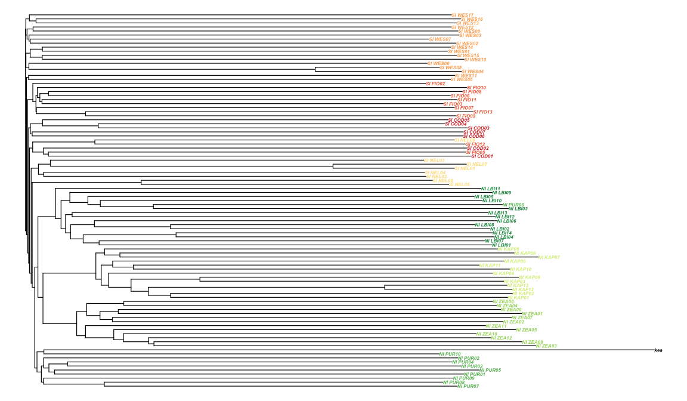
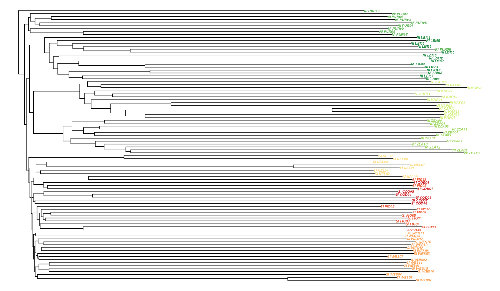

This time I am only really using ape to plot a tree with the kea set as an outgroup.
Loading all the packages I need.


```r
library(adegenet)
library(ape)
library(RColorBrewer)
```

I had added the kea snps to the vcf files I prepared to run dadi, so I prepared the input in the dadi directory, they are `.raw` Plink files, that you can obtain with the PLINK `--recode A` command, from a plink .ped file that can be converted from .vcf with vcftools.
Importing the input file:


```r
tree_GBS <- read.PLINK(file="../pop_structure/dadi/biallelic_snps_with_outgroup.raw", map.file = "../pop_structure/dadi/biallelic_snps_with_outgroup.map")
```

```
## 
##  Reading PLINK raw format into a genlight object...
```

```
## Loading required package: parallel
```

```
## 
##  Reading loci information... 
## 
##  Reading and converting genotypes... 
## .
##  Building final object... 
## 
## ...done.
```

I can go straight into plotting a tree, from distances calculated from allele frequencies. 


```r
as.matrix(dist(as.matrix(tree_GBS))) -> distance_matrix
tre <- nj(dist(as.matrix(tree_GBS)))
palette=(c(rep("#D9EF8B", 13), rep("#1A9850", 14), rep("#66BD63", 10), rep("#A6D96A", 12), 
           rep("#D73027", 7), rep("#F46D43", 11), rep("#FEE08B", 8), rep("#FDAE61", 17), "black"))
plot(tre, "p", cex=0.5, no.margin = TRUE, tip.col=palette, font=4, node.pos=2, edge.width=1.2)
```



Other shapes:


```r
plot.phylo(tre, "u", cex=0.5, no.margin = TRUE, tip.col=palette, font=4, edge.width=1.2)
```

<!-- -->

That is unrooted, so let's try:


```r
tre
```

```
## 
## Phylogenetic tree with 93 tips and 91 internal nodes.
## 
## Tip labels:
## 	NI_KAP01, NI_KAP02, NI_KAP03, NI_KAP04, NI_KAP05, NI_KAP06, ...
## 
## Unrooted; includes branch lengths.
```

```r
tre <- root(tre, outgroup = "kea", resolve.root = TRUE)
tre
```

```
## 
## Phylogenetic tree with 93 tips and 92 internal nodes.
## 
## Tip labels:
## 	NI_KAP01, NI_KAP02, NI_KAP03, NI_KAP04, NI_KAP05, NI_KAP06, ...
## 
## Rooted; includes branch lengths.
```

```r
plot.phylo(tre, "p", cex=0.5, no.margin = TRUE, tip.col=palette, font=4, edge.width=1.2)
```


Now that it is rooted I could even drop the outgroup tip:


```r
plot.phylo(drop.tip(tre, "kea"), "p", cex=0.5, no.margin = TRUE, tip.col=palette, font=4, edge.width=1.2)
```



