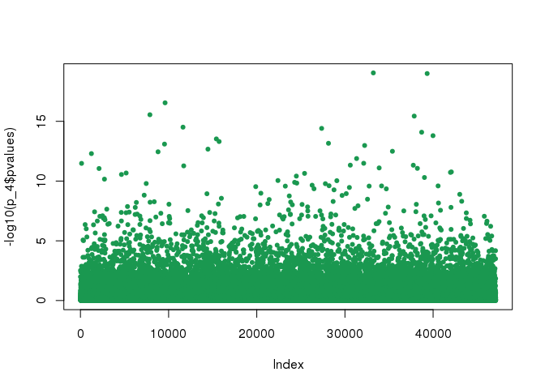

I want to use the package LEA to run some environmental association tests on my GBS data. First, I need to setup the environmental data though. I downloaded the variables I want to use from the WorldClim dataset, and I have a file with the coordinates (longitude and latitude) for my kaka individuals (or rather, their populations).
Now, I needed to install a few packages, but that went quite smoothly, they are here for reference. 


```r
install.packages("dismo")
install.packages("maptools")
install.packages("rgdal")
```

Now, loading the packages that I actually need for this first part.


```r
library(dismo)
library(maptools)
library(dplyr)
```

Loading and fixing my locations file, because I realised the order of the coordinates was wrong. These packages like to have longitude before latitude.


```r
kakalocs <- read.table("samples_locations.txt", sep="\t", header=T)
kakalocs <- tibble(kakalocs$SampleID, kakalocs$Longitude, kakalocs$Latitude)
colnames(kakalocs) <- c("SAMPLE", "LONG", "LAT")
```

Loading the bioclimatic variables files.


```r
files <- list.files("env_variables/wc2.0_2.5m_bio/", pattern='tif', full.names=TRUE)
bioclim2.5 <- stack(files)
```

Solar radiation is in a stack of its own (wd) and needs to be synthesized in a single layer if I want to have one value for the annual solar radiation, rather than twelve monthly values. I decided to go for a mean value.


```r
files_wd <- list.files("env_variables/wc2.0_2.5m_srad/", pattern='tif', full.names=TRUE)
wd <- stack(files_wd)
mean(wd) -> mean_srad
```

Now I can extract the values for my locations from the variables I want. And I can plot the maps too, because it's fun. And save the result as .env files for LEA.
Annual mean temperature.


```r
mean_temp <- extract(bioclim2.5[[1]], kakalocs[,2:3])
plot(bioclim2.5, 1, xlim=c(160,180), ylim=c(-48,-34))
points(x=kakalocs$LONG, y=kakalocs$LAT, col="red", cex=0.8)
```

<!-- -->

```r
write.table(mean_temp, "mean_temp.env", col.names = F, row.names = F, quote = F)
```

Minimum temperature of the coldest month.


```r
coldest_month <- extract(bioclim2.5[[6]], kakalocs[,2:3])
plot(bioclim2.5, 6, xlim=c(160,180), ylim=c(-48,-34))
points(x=kakalocs$LONG, y=kakalocs$LAT, col="red", cex=0.8)
```

<!-- -->

```r
write.table(coldest_month, "coldest_month.env", col.names = F, row.names = F, quote = F)
```

Annual precipitation.


```r
ann_prec <- extract(bioclim2.5[[12]], kakalocs[,2:3])
plot(bioclim2.5, 12, xlim=c(160,180), ylim=c(-48,-34))
points(x=kakalocs$LONG, y=kakalocs$LAT, col="red", cex=0.8)
```

<!-- -->

```r
write.table(ann_prec, "ann_prec.env", col.names = F, row.names = F, quote = F)
```

Solar radiation.


```r
ann_srad <- extract(mean_srad, kakalocs[,2:3])
plot(mean_srad, xlim=c(160,180), ylim=c(-48,-34))
points(x=kakalocs$LONG, y=kakalocs$LAT, col="red", cex=0.8)
```

<!-- -->

```r
write.table(ann_srad, "ann_srad.env", col.names = F, row.names = F, quote = F)
```

Now, on to use LEA for the correlations, real quick.
Nope, not on this version of R. -.-
So, sicne I can't update R on my desktop, because the OS is too out of date, I will finish writing up this script and run it in boros instead, where I have my nice R 3.5 installed and I already checked that LEA works fine.


```r
install.packages("devtools")
devtools::install_github("bcm-uga/LEA")
```

Loading packages and snp files, that I need to quickly convert in other formats.


```r
library(LEA)
library(RColorBrewer)
snpfile = ped2lfmm("snps_for_env_tests.ped")
```

```
## 
## 	- number of detected individuals:	92
## 	- number of detected loci:		47098
```

```r
genotype = lfmm2geno("snps_for_env_tests.lfmm")
```

```
## 
## 	- number of detected individuals:	92
## 	- number of detected loci:		47098
```

Testing the population structure (this is a similar thing to admixture), just to check that the signal is the same as usual.


```r
obj.snmf = snmf(genotype, K = 1:8, entropy = T, ploidy = 2, project="new", CPU = 8)
```

```
## The project is saved into :
##  snps_for_env_tests.snmfProject 
## 
## To load the project, use:
##  project = load.snmfProject("snps_for_env_tests.snmfProject")
## 
## To remove the project, use:
##  remove.snmfProject("snps_for_env_tests.snmfProject")
## 
## [1] 881363857
## [1] "*************************************"
## [1] "*          create.dataset            *"
## [1] "*************************************"
## summary of the options:
## 
##         -n (number of individuals)                 92
##         -L (number of loci)                        47098
##         -s (seed random init)                      881363857
##         -r (percentage of masked data)             0.05
##         -x (genotype file in .geno format)         /data/denise/ModPop_analysis/env_correlations_maf05/snps_for_env_tests.geno
##         -o (output file in .geno format)           /data/denise/ModPop_analysis/env_correlations_maf05/snps_for_env_tests.snmf/masked/snps_for_env_tests_I.geno
## 
##  Write genotype file with masked data, /data/denise/ModPop_analysis/env_correlations_maf05/snps_for_env_tests.snmf/masked/snps_for_env_tests_I.geno:		OK.
## 
## [1] "*************************************"
## [1] "* sNMF K = 1  repetition 1      *"
## [1] "*************************************"
## summary of the options:
## 
##         -n (number of individuals)             92
##         -L (number of loci)                    47098
##         -K (number of ancestral pops)          1
##         -x (input file)                        /data/denise/ModPop_analysis/env_correlations_maf05/snps_for_env_tests.snmf/masked/snps_for_env_tests_I.geno
##         -q (individual admixture file)         /data/denise/ModPop_analysis/env_correlations_maf05/snps_for_env_tests.snmf/K1/run1/snps_for_env_tests_r1.1.Q
##         -g (ancestral frequencies file)        /data/denise/ModPop_analysis/env_correlations_maf05/snps_for_env_tests.snmf/K1/run1/snps_for_env_tests_r1.1.G
##         -i (number max of iterations)          200
##         -a (regularization parameter)          10
##         -s (seed random init)                  9471298449
##         -e (tolerance error)                   1E-05
##         -p (number of processes)               8
##         - diploid
## 
## Read genotype file /data/denise/ModPop_analysis/env_correlations_maf05/snps_for_env_tests.snmf/masked/snps_for_env_tests_I.geno:		OK.
## 
## 
## Main algorithm:
## 
## Least-square error: 1634091.973069
## Write individual ancestry coefficient file /data/denise/ModPop_analysis/env_correlations_maf05/snps_for_env_tests.snmf/K1/run1/snps_for_env_tests_r1.1.Q:		OK.
## Write ancestral allele frequency coefficient file /data/denise/ModPop_analysis/env_correlations_maf05/snps_for_env_tests.snmf/K1/run1/snps_for_env_tests_r1.1.G:	OK.
## 
## [1] "*************************************"
## [1] "*    cross-entropy estimation       *"
## [1] "*************************************"
## summary of the options:
## 
##         -n (number of individuals)         92
##         -L (number of loci)                47098
##         -K (number of ancestral pops)      1
##         -x (genotype file)                 /data/denise/ModPop_analysis/env_correlations_maf05/snps_for_env_tests.geno
##         -q (individual admixture)          /data/denise/ModPop_analysis/env_correlations_maf05/snps_for_env_tests.snmf/K1/run1/snps_for_env_tests_r1.1.Q
##         -g (ancestral frequencies)         /data/denise/ModPop_analysis/env_correlations_maf05/snps_for_env_tests.snmf/K1/run1/snps_for_env_tests_r1.1.G
##         -i (with masked genotypes)         /data/denise/ModPop_analysis/env_correlations_maf05/snps_for_env_tests.snmf/masked/snps_for_env_tests_I.geno
##         - diploid
## 
## Cross-Entropy (all data):	 0.63888
## Cross-Entropy (masked data):	 0.686266
## The project is saved into :
##  snps_for_env_tests.snmfProject 
## 
## To load the project, use:
##  project = load.snmfProject("snps_for_env_tests.snmfProject")
## 
## To remove the project, use:
##  remove.snmfProject("snps_for_env_tests.snmfProject")
## 
## [1] "*************************************"
## [1] "* sNMF K = 2  repetition 1      *"
## [1] "*************************************"
## summary of the options:
## 
##         -n (number of individuals)             92
##         -L (number of loci)                    47098
##         -K (number of ancestral pops)          2
##         -x (input file)                        /data/denise/ModPop_analysis/env_correlations_maf05/snps_for_env_tests.snmf/masked/snps_for_env_tests_I.geno
##         -q (individual admixture file)         /data/denise/ModPop_analysis/env_correlations_maf05/snps_for_env_tests.snmf/K2/run1/snps_for_env_tests_r1.2.Q
##         -g (ancestral frequencies file)        /data/denise/ModPop_analysis/env_correlations_maf05/snps_for_env_tests.snmf/K2/run1/snps_for_env_tests_r1.2.G
##         -i (number max of iterations)          200
##         -a (regularization parameter)          10
##         -s (seed random init)                  881363857
##         -e (tolerance error)                   1E-05
##         -p (number of processes)               8
##         - diploid
## 
## Read genotype file /data/denise/ModPop_analysis/env_correlations_maf05/snps_for_env_tests.snmf/masked/snps_for_env_tests_I.geno:		OK.
## 
## 
## Main algorithm:
## 	[                                                                           ]
## 	[========================]
## Number of iterations: 63
## 
## Least-square error: 1587519.213752
## Write individual ancestry coefficient file /data/denise/ModPop_analysis/env_correlations_maf05/snps_for_env_tests.snmf/K2/run1/snps_for_env_tests_r1.2.Q:		OK.
## Write ancestral allele frequency coefficient file /data/denise/ModPop_analysis/env_correlations_maf05/snps_for_env_tests.snmf/K2/run1/snps_for_env_tests_r1.2.G:	OK.
## 
## [1] "*************************************"
## [1] "*    cross-entropy estimation       *"
## [1] "*************************************"
## summary of the options:
## 
##         -n (number of individuals)         92
##         -L (number of loci)                47098
##         -K (number of ancestral pops)      2
##         -x (genotype file)                 /data/denise/ModPop_analysis/env_correlations_maf05/snps_for_env_tests.geno
##         -q (individual admixture)          /data/denise/ModPop_analysis/env_correlations_maf05/snps_for_env_tests.snmf/K2/run1/snps_for_env_tests_r1.2.Q
##         -g (ancestral frequencies)         /data/denise/ModPop_analysis/env_correlations_maf05/snps_for_env_tests.snmf/K2/run1/snps_for_env_tests_r1.2.G
##         -i (with masked genotypes)         /data/denise/ModPop_analysis/env_correlations_maf05/snps_for_env_tests.snmf/masked/snps_for_env_tests_I.geno
##         - diploid
## 
## Cross-Entropy (all data):	 0.608632
## Cross-Entropy (masked data):	 0.671644
## The project is saved into :
##  snps_for_env_tests.snmfProject 
## 
## To load the project, use:
##  project = load.snmfProject("snps_for_env_tests.snmfProject")
## 
## To remove the project, use:
##  remove.snmfProject("snps_for_env_tests.snmfProject")
## 
## [1] "*************************************"
## [1] "* sNMF K = 3  repetition 1      *"
## [1] "*************************************"
## summary of the options:
## 
##         -n (number of individuals)             92
##         -L (number of loci)                    47098
##         -K (number of ancestral pops)          3
##         -x (input file)                        /data/denise/ModPop_analysis/env_correlations_maf05/snps_for_env_tests.snmf/masked/snps_for_env_tests_I.geno
##         -q (individual admixture file)         /data/denise/ModPop_analysis/env_correlations_maf05/snps_for_env_tests.snmf/K3/run1/snps_for_env_tests_r1.3.Q
##         -g (ancestral frequencies file)        /data/denise/ModPop_analysis/env_correlations_maf05/snps_for_env_tests.snmf/K3/run1/snps_for_env_tests_r1.3.G
##         -i (number max of iterations)          200
##         -a (regularization parameter)          10
##         -s (seed random init)                  4646958352327805841
##         -e (tolerance error)                   1E-05
##         -p (number of processes)               8
##         - diploid
## 
## Read genotype file /data/denise/ModPop_analysis/env_correlations_maf05/snps_for_env_tests.snmf/masked/snps_for_env_tests_I.geno:		OK.
## 
## 
## Main algorithm:
## 	[                                                                           ]
## 	[===========================================]
## Number of iterations: 114
## 
## Least-square error: 1551277.766918
## Write individual ancestry coefficient file /data/denise/ModPop_analysis/env_correlations_maf05/snps_for_env_tests.snmf/K3/run1/snps_for_env_tests_r1.3.Q:		OK.
## Write ancestral allele frequency coefficient file /data/denise/ModPop_analysis/env_correlations_maf05/snps_for_env_tests.snmf/K3/run1/snps_for_env_tests_r1.3.G:	OK.
## 
## [1] "*************************************"
## [1] "*    cross-entropy estimation       *"
## [1] "*************************************"
## summary of the options:
## 
##         -n (number of individuals)         92
##         -L (number of loci)                47098
##         -K (number of ancestral pops)      3
##         -x (genotype file)                 /data/denise/ModPop_analysis/env_correlations_maf05/snps_for_env_tests.geno
##         -q (individual admixture)          /data/denise/ModPop_analysis/env_correlations_maf05/snps_for_env_tests.snmf/K3/run1/snps_for_env_tests_r1.3.Q
##         -g (ancestral frequencies)         /data/denise/ModPop_analysis/env_correlations_maf05/snps_for_env_tests.snmf/K3/run1/snps_for_env_tests_r1.3.G
##         -i (with masked genotypes)         /data/denise/ModPop_analysis/env_correlations_maf05/snps_for_env_tests.snmf/masked/snps_for_env_tests_I.geno
##         - diploid
## 
## Cross-Entropy (all data):	 0.585906
## Cross-Entropy (masked data):	 0.667446
## The project is saved into :
##  snps_for_env_tests.snmfProject 
## 
## To load the project, use:
##  project = load.snmfProject("snps_for_env_tests.snmfProject")
## 
## To remove the project, use:
##  remove.snmfProject("snps_for_env_tests.snmfProject")
## 
## [1] "*************************************"
## [1] "* sNMF K = 4  repetition 1      *"
## [1] "*************************************"
## summary of the options:
## 
##         -n (number of individuals)             92
##         -L (number of loci)                    47098
##         -K (number of ancestral pops)          4
##         -x (input file)                        /data/denise/ModPop_analysis/env_correlations_maf05/snps_for_env_tests.snmf/masked/snps_for_env_tests_I.geno
##         -q (individual admixture file)         /data/denise/ModPop_analysis/env_correlations_maf05/snps_for_env_tests.snmf/K4/run1/snps_for_env_tests_r1.4.Q
##         -g (ancestral frequencies file)        /data/denise/ModPop_analysis/env_correlations_maf05/snps_for_env_tests.snmf/K4/run1/snps_for_env_tests_r1.4.G
##         -i (number max of iterations)          200
##         -a (regularization parameter)          10
##         -s (seed random init)                  881363857
##         -e (tolerance error)                   1E-05
##         -p (number of processes)               8
##         - diploid
## 
## Read genotype file /data/denise/ModPop_analysis/env_correlations_maf05/snps_for_env_tests.snmf/masked/snps_for_env_tests_I.geno:		OK.
## 
## 
## Main algorithm:
## 	[                                                                           ]
## 	[================]
## Number of iterations: 43
## 
## Least-square error: 1519194.747165
## Write individual ancestry coefficient file /data/denise/ModPop_analysis/env_correlations_maf05/snps_for_env_tests.snmf/K4/run1/snps_for_env_tests_r1.4.Q:		OK.
## Write ancestral allele frequency coefficient file /data/denise/ModPop_analysis/env_correlations_maf05/snps_for_env_tests.snmf/K4/run1/snps_for_env_tests_r1.4.G:	OK.
## 
## [1] "*************************************"
## [1] "*    cross-entropy estimation       *"
## [1] "*************************************"
## summary of the options:
## 
##         -n (number of individuals)         92
##         -L (number of loci)                47098
##         -K (number of ancestral pops)      4
##         -x (genotype file)                 /data/denise/ModPop_analysis/env_correlations_maf05/snps_for_env_tests.geno
##         -q (individual admixture)          /data/denise/ModPop_analysis/env_correlations_maf05/snps_for_env_tests.snmf/K4/run1/snps_for_env_tests_r1.4.Q
##         -g (ancestral frequencies)         /data/denise/ModPop_analysis/env_correlations_maf05/snps_for_env_tests.snmf/K4/run1/snps_for_env_tests_r1.4.G
##         -i (with masked genotypes)         /data/denise/ModPop_analysis/env_correlations_maf05/snps_for_env_tests.snmf/masked/snps_for_env_tests_I.geno
##         - diploid
## 
## Cross-Entropy (all data):	 0.565361
## Cross-Entropy (masked data):	 0.669539
## The project is saved into :
##  snps_for_env_tests.snmfProject 
## 
## To load the project, use:
##  project = load.snmfProject("snps_for_env_tests.snmfProject")
## 
## To remove the project, use:
##  remove.snmfProject("snps_for_env_tests.snmfProject")
## 
## [1] "*************************************"
## [1] "* sNMF K = 5  repetition 1      *"
## [1] "*************************************"
## summary of the options:
## 
##         -n (number of individuals)             92
##         -L (number of loci)                    47098
##         -K (number of ancestral pops)          5
##         -x (input file)                        /data/denise/ModPop_analysis/env_correlations_maf05/snps_for_env_tests.snmf/masked/snps_for_env_tests_I.geno
##         -q (individual admixture file)         /data/denise/ModPop_analysis/env_correlations_maf05/snps_for_env_tests.snmf/K5/run1/snps_for_env_tests_r1.5.Q
##         -g (ancestral frequencies file)        /data/denise/ModPop_analysis/env_correlations_maf05/snps_for_env_tests.snmf/K5/run1/snps_for_env_tests_r1.5.G
##         -i (number max of iterations)          200
##         -a (regularization parameter)          10
##         -s (seed random init)                  1869192137617
##         -e (tolerance error)                   1E-05
##         -p (number of processes)               8
##         - diploid
## 
## Read genotype file /data/denise/ModPop_analysis/env_correlations_maf05/snps_for_env_tests.snmf/masked/snps_for_env_tests_I.geno:		OK.
## 
## 
## Main algorithm:
## 	[                                                                           ]
## 	[====================================]
## Number of iterations: 97
## 
## Least-square error: 1497719.505380
## Write individual ancestry coefficient file /data/denise/ModPop_analysis/env_correlations_maf05/snps_for_env_tests.snmf/K5/run1/snps_for_env_tests_r1.5.Q:		OK.
## Write ancestral allele frequency coefficient file /data/denise/ModPop_analysis/env_correlations_maf05/snps_for_env_tests.snmf/K5/run1/snps_for_env_tests_r1.5.G:	OK.
## 
## [1] "*************************************"
## [1] "*    cross-entropy estimation       *"
## [1] "*************************************"
## summary of the options:
## 
##         -n (number of individuals)         92
##         -L (number of loci)                47098
##         -K (number of ancestral pops)      5
##         -x (genotype file)                 /data/denise/ModPop_analysis/env_correlations_maf05/snps_for_env_tests.geno
##         -q (individual admixture)          /data/denise/ModPop_analysis/env_correlations_maf05/snps_for_env_tests.snmf/K5/run1/snps_for_env_tests_r1.5.Q
##         -g (ancestral frequencies)         /data/denise/ModPop_analysis/env_correlations_maf05/snps_for_env_tests.snmf/K5/run1/snps_for_env_tests_r1.5.G
##         -i (with masked genotypes)         /data/denise/ModPop_analysis/env_correlations_maf05/snps_for_env_tests.snmf/masked/snps_for_env_tests_I.geno
##         - diploid
## 
## Cross-Entropy (all data):	 0.554928
## Cross-Entropy (masked data):	 0.675271
## The project is saved into :
##  snps_for_env_tests.snmfProject 
## 
## To load the project, use:
##  project = load.snmfProject("snps_for_env_tests.snmfProject")
## 
## To remove the project, use:
##  remove.snmfProject("snps_for_env_tests.snmfProject")
## 
## [1] "*************************************"
## [1] "* sNMF K = 6  repetition 1      *"
## [1] "*************************************"
## summary of the options:
## 
##         -n (number of individuals)             92
##         -L (number of loci)                    47098
##         -K (number of ancestral pops)          6
##         -x (input file)                        /data/denise/ModPop_analysis/env_correlations_maf05/snps_for_env_tests.snmf/masked/snps_for_env_tests_I.geno
##         -q (individual admixture file)         /data/denise/ModPop_analysis/env_correlations_maf05/snps_for_env_tests.snmf/K6/run1/snps_for_env_tests_r1.6.Q
##         -g (ancestral frequencies file)        /data/denise/ModPop_analysis/env_correlations_maf05/snps_for_env_tests.snmf/K6/run1/snps_for_env_tests_r1.6.G
##         -i (number max of iterations)          200
##         -a (regularization parameter)          10
##         -s (seed random init)                  881363857
##         -e (tolerance error)                   1E-05
##         -p (number of processes)               8
##         - diploid
## 
## Read genotype file /data/denise/ModPop_analysis/env_correlations_maf05/snps_for_env_tests.snmf/masked/snps_for_env_tests_I.geno:		OK.
## 
## 
## Main algorithm:
## 	[                                                                           ]
## 	[=================================================================]
## Number of iterations: 173
## 
## Least-square error: 1472750.842056
## Write individual ancestry coefficient file /data/denise/ModPop_analysis/env_correlations_maf05/snps_for_env_tests.snmf/K6/run1/snps_for_env_tests_r1.6.Q:		OK.
## Write ancestral allele frequency coefficient file /data/denise/ModPop_analysis/env_correlations_maf05/snps_for_env_tests.snmf/K6/run1/snps_for_env_tests_r1.6.G:	OK.
## 
## [1] "*************************************"
## [1] "*    cross-entropy estimation       *"
## [1] "*************************************"
## summary of the options:
## 
##         -n (number of individuals)         92
##         -L (number of loci)                47098
##         -K (number of ancestral pops)      6
##         -x (genotype file)                 /data/denise/ModPop_analysis/env_correlations_maf05/snps_for_env_tests.geno
##         -q (individual admixture)          /data/denise/ModPop_analysis/env_correlations_maf05/snps_for_env_tests.snmf/K6/run1/snps_for_env_tests_r1.6.Q
##         -g (ancestral frequencies)         /data/denise/ModPop_analysis/env_correlations_maf05/snps_for_env_tests.snmf/K6/run1/snps_for_env_tests_r1.6.G
##         -i (with masked genotypes)         /data/denise/ModPop_analysis/env_correlations_maf05/snps_for_env_tests.snmf/masked/snps_for_env_tests_I.geno
##         - diploid
## 
## Cross-Entropy (all data):	 0.543835
## Cross-Entropy (masked data):	 0.681801
## The project is saved into :
##  snps_for_env_tests.snmfProject 
## 
## To load the project, use:
##  project = load.snmfProject("snps_for_env_tests.snmfProject")
## 
## To remove the project, use:
##  remove.snmfProject("snps_for_env_tests.snmfProject")
## 
## [1] "*************************************"
## [1] "* sNMF K = 7  repetition 1      *"
## [1] "*************************************"
## summary of the options:
## 
##         -n (number of individuals)             92
##         -L (number of loci)                    47098
##         -K (number of ancestral pops)          7
##         -x (input file)                        /data/denise/ModPop_analysis/env_correlations_maf05/snps_for_env_tests.snmf/masked/snps_for_env_tests_I.geno
##         -q (individual admixture file)         /data/denise/ModPop_analysis/env_correlations_maf05/snps_for_env_tests.snmf/K7/run1/snps_for_env_tests_r1.7.Q
##         -g (ancestral frequencies file)        /data/denise/ModPop_analysis/env_correlations_maf05/snps_for_env_tests.snmf/K7/run1/snps_for_env_tests_r1.7.G
##         -i (number max of iterations)          200
##         -a (regularization parameter)          10
##         -s (seed random init)                  881363857
##         -e (tolerance error)                   1E-05
##         -p (number of processes)               8
##         - diploid
## 
## Read genotype file /data/denise/ModPop_analysis/env_correlations_maf05/snps_for_env_tests.snmf/masked/snps_for_env_tests_I.geno:		OK.
## 
## 
## Main algorithm:
## 	[                                                                           ]
## 	[==============================================================]
## Number of iterations: 166
## 
## Least-square error: 1450282.470302
## Write individual ancestry coefficient file /data/denise/ModPop_analysis/env_correlations_maf05/snps_for_env_tests.snmf/K7/run1/snps_for_env_tests_r1.7.Q:		OK.
## Write ancestral allele frequency coefficient file /data/denise/ModPop_analysis/env_correlations_maf05/snps_for_env_tests.snmf/K7/run1/snps_for_env_tests_r1.7.G:	OK.
## 
## [1] "*************************************"
## [1] "*    cross-entropy estimation       *"
## [1] "*************************************"
## summary of the options:
## 
##         -n (number of individuals)         92
##         -L (number of loci)                47098
##         -K (number of ancestral pops)      7
##         -x (genotype file)                 /data/denise/ModPop_analysis/env_correlations_maf05/snps_for_env_tests.geno
##         -q (individual admixture)          /data/denise/ModPop_analysis/env_correlations_maf05/snps_for_env_tests.snmf/K7/run1/snps_for_env_tests_r1.7.Q
##         -g (ancestral frequencies)         /data/denise/ModPop_analysis/env_correlations_maf05/snps_for_env_tests.snmf/K7/run1/snps_for_env_tests_r1.7.G
##         -i (with masked genotypes)         /data/denise/ModPop_analysis/env_correlations_maf05/snps_for_env_tests.snmf/masked/snps_for_env_tests_I.geno
##         - diploid
## 
## Cross-Entropy (all data):	 0.534933
## Cross-Entropy (masked data):	 0.684645
## The project is saved into :
##  snps_for_env_tests.snmfProject 
## 
## To load the project, use:
##  project = load.snmfProject("snps_for_env_tests.snmfProject")
## 
## To remove the project, use:
##  remove.snmfProject("snps_for_env_tests.snmfProject")
## 
## [1] "*************************************"
## [1] "* sNMF K = 8  repetition 1      *"
## [1] "*************************************"
## summary of the options:
## 
##         -n (number of individuals)             92
##         -L (number of loci)                    47098
##         -K (number of ancestral pops)          8
##         -x (input file)                        /data/denise/ModPop_analysis/env_correlations_maf05/snps_for_env_tests.snmf/masked/snps_for_env_tests_I.geno
##         -q (individual admixture file)         /data/denise/ModPop_analysis/env_correlations_maf05/snps_for_env_tests.snmf/K8/run1/snps_for_env_tests_r1.8.Q
##         -g (ancestral frequencies file)        /data/denise/ModPop_analysis/env_correlations_maf05/snps_for_env_tests.snmf/K8/run1/snps_for_env_tests_r1.8.G
##         -i (number max of iterations)          200
##         -a (regularization parameter)          10
##         -s (seed random init)                  881363857
##         -e (tolerance error)                   1E-05
##         -p (number of processes)               8
##         - diploid
## 
## Read genotype file /data/denise/ModPop_analysis/env_correlations_maf05/snps_for_env_tests.snmf/masked/snps_for_env_tests_I.geno:		OK.
## 
## 
## Main algorithm:
## 	[                                                                           ]
## 	[=========================================================]
## Number of iterations: 152
## 
## Least-square error: 1426847.100622
## Write individual ancestry coefficient file /data/denise/ModPop_analysis/env_correlations_maf05/snps_for_env_tests.snmf/K8/run1/snps_for_env_tests_r1.8.Q:		OK.
## Write ancestral allele frequency coefficient file /data/denise/ModPop_analysis/env_correlations_maf05/snps_for_env_tests.snmf/K8/run1/snps_for_env_tests_r1.8.G:	OK.
## 
## [1] "*************************************"
## [1] "*    cross-entropy estimation       *"
## [1] "*************************************"
## summary of the options:
## 
##         -n (number of individuals)         92
##         -L (number of loci)                47098
##         -K (number of ancestral pops)      8
##         -x (genotype file)                 /data/denise/ModPop_analysis/env_correlations_maf05/snps_for_env_tests.geno
##         -q (individual admixture)          /data/denise/ModPop_analysis/env_correlations_maf05/snps_for_env_tests.snmf/K8/run1/snps_for_env_tests_r1.8.Q
##         -g (ancestral frequencies)         /data/denise/ModPop_analysis/env_correlations_maf05/snps_for_env_tests.snmf/K8/run1/snps_for_env_tests_r1.8.G
##         -i (with masked genotypes)         /data/denise/ModPop_analysis/env_correlations_maf05/snps_for_env_tests.snmf/masked/snps_for_env_tests_I.geno
##         - diploid
## 
## Cross-Entropy (all data):	 0.524252
## Cross-Entropy (masked data):	 0.692162
## The project is saved into :
##  snps_for_env_tests.snmfProject 
## 
## To load the project, use:
##  project = load.snmfProject("snps_for_env_tests.snmfProject")
## 
## To remove the project, use:
##  remove.snmfProject("snps_for_env_tests.snmfProject")
```

```r
plot(obj.snmf)
```

<!-- -->

```r
barplot(t(Q(obj.snmf, K = 4)), col = c(values=brewer.pal(4, "RdYlGn")))
```

<!-- -->

Everything seems to be as usual, so I am running the imputation for missing data, to check that everything is fine again and because they specify that it is recommended before the environmental associations.


```r
obj.snmf = snmf("snps_for_env_tests.lfmm", K = 4,
                       entropy = TRUE, repetitions = 10,
                       project = "new", CPU = 8)
```

```
## [1] "*********************************************************"
## [1] " Conversion from the lfmm format to the geno format"
## [1] "*********************************************************"
## The project is saved into :
##  snps_for_env_tests.snmfProject 
## 
## To load the project, use:
##  project = load.snmfProject("snps_for_env_tests.snmfProject")
## 
## To remove the project, use:
##  remove.snmfProject("snps_for_env_tests.snmfProject")
## 
## [1] 1013618945
## [1] "*************************************"
## [1] "*          create.dataset            *"
## [1] "*************************************"
## summary of the options:
## 
##         -n (number of individuals)                 92
##         -L (number of loci)                        47098
##         -s (seed random init)                      1013618945
##         -r (percentage of masked data)             0.05
##         -x (genotype file in .geno format)         /data/denise/ModPop_analysis/env_correlations_maf05/snps_for_env_tests.geno
##         -o (output file in .geno format)           /data/denise/ModPop_analysis/env_correlations_maf05/snps_for_env_tests.snmf/masked/snps_for_env_tests_I.geno
## 
##  Write genotype file with masked data, /data/denise/ModPop_analysis/env_correlations_maf05/snps_for_env_tests.snmf/masked/snps_for_env_tests_I.geno:		OK.
## 
## [1] "*************************************"
## [1] "* sNMF K = 4  repetition 1      *"
## [1] "*************************************"
## summary of the options:
## 
##         -n (number of individuals)             92
##         -L (number of loci)                    47098
##         -K (number of ancestral pops)          4
##         -x (input file)                        /data/denise/ModPop_analysis/env_correlations_maf05/snps_for_env_tests.snmf/masked/snps_for_env_tests_I.geno
##         -q (individual admixture file)         /data/denise/ModPop_analysis/env_correlations_maf05/snps_for_env_tests.snmf/K4/run1/snps_for_env_tests_r1.4.Q
##         -g (ancestral frequencies file)        /data/denise/ModPop_analysis/env_correlations_maf05/snps_for_env_tests.snmf/K4/run1/snps_for_env_tests_r1.4.G
##         -i (number max of iterations)          200
##         -a (regularization parameter)          10
##         -s (seed random init)                  1013618945
##         -e (tolerance error)                   1E-05
##         -p (number of processes)               8
##         - diploid
## 
## Read genotype file /data/denise/ModPop_analysis/env_correlations_maf05/snps_for_env_tests.snmf/masked/snps_for_env_tests_I.geno:		OK.
## 
## 
## Main algorithm:
## 	[                                                                           ]
## 	[===============]
## Number of iterations: 39
## 
## Least-square error: 1520774.323449
## Write individual ancestry coefficient file /data/denise/ModPop_analysis/env_correlations_maf05/snps_for_env_tests.snmf/K4/run1/snps_for_env_tests_r1.4.Q:		OK.
## Write ancestral allele frequency coefficient file /data/denise/ModPop_analysis/env_correlations_maf05/snps_for_env_tests.snmf/K4/run1/snps_for_env_tests_r1.4.G:	OK.
## 
## [1] "*************************************"
## [1] "*    cross-entropy estimation       *"
## [1] "*************************************"
## summary of the options:
## 
##         -n (number of individuals)         92
##         -L (number of loci)                47098
##         -K (number of ancestral pops)      4
##         -x (genotype file)                 /data/denise/ModPop_analysis/env_correlations_maf05/snps_for_env_tests.geno
##         -q (individual admixture)          /data/denise/ModPop_analysis/env_correlations_maf05/snps_for_env_tests.snmf/K4/run1/snps_for_env_tests_r1.4.Q
##         -g (ancestral frequencies)         /data/denise/ModPop_analysis/env_correlations_maf05/snps_for_env_tests.snmf/K4/run1/snps_for_env_tests_r1.4.G
##         -i (with masked genotypes)         /data/denise/ModPop_analysis/env_correlations_maf05/snps_for_env_tests.snmf/masked/snps_for_env_tests_I.geno
##         - diploid
## 
## Cross-Entropy (all data):	 0.565726
## Cross-Entropy (masked data):	 0.665955
## The project is saved into :
##  snps_for_env_tests.snmfProject 
## 
## To load the project, use:
##  project = load.snmfProject("snps_for_env_tests.snmfProject")
## 
## To remove the project, use:
##  remove.snmfProject("snps_for_env_tests.snmfProject")
## 
## [1] 476703051
## [1] "*************************************"
## [1] "*          create.dataset            *"
## [1] "*************************************"
## summary of the options:
## 
##         -n (number of individuals)                 92
##         -L (number of loci)                        47098
##         -s (seed random init)                      476703051
##         -r (percentage of masked data)             0.05
##         -x (genotype file in .geno format)         /data/denise/ModPop_analysis/env_correlations_maf05/snps_for_env_tests.geno
##         -o (output file in .geno format)           /data/denise/ModPop_analysis/env_correlations_maf05/snps_for_env_tests.snmf/masked/snps_for_env_tests_I.geno
## 
##  Write genotype file with masked data, /data/denise/ModPop_analysis/env_correlations_maf05/snps_for_env_tests.snmf/masked/snps_for_env_tests_I.geno:		OK.
## 
## [1] "*************************************"
## [1] "* sNMF K = 4  repetition 2      *"
## [1] "*************************************"
## summary of the options:
## 
##         -n (number of individuals)             92
##         -L (number of loci)                    47098
##         -K (number of ancestral pops)          4
##         -x (input file)                        /data/denise/ModPop_analysis/env_correlations_maf05/snps_for_env_tests.snmf/masked/snps_for_env_tests_I.geno
##         -q (individual admixture file)         /data/denise/ModPop_analysis/env_correlations_maf05/snps_for_env_tests.snmf/K4/run2/snps_for_env_tests_r2.4.Q
##         -g (ancestral frequencies file)        /data/denise/ModPop_analysis/env_correlations_maf05/snps_for_env_tests.snmf/K4/run2/snps_for_env_tests_r2.4.G
##         -i (number max of iterations)          200
##         -a (regularization parameter)          10
##         -s (seed random init)                  476703051
##         -e (tolerance error)                   1E-05
##         -p (number of processes)               8
##         - diploid
## 
## Read genotype file /data/denise/ModPop_analysis/env_correlations_maf05/snps_for_env_tests.snmf/masked/snps_for_env_tests_I.geno:		OK.
## 
## 
## Main algorithm:
## 	[                                                                           ]
## 	[=======================]
## Number of iterations: 61
## 
## Least-square error: 1519455.785658
## Write individual ancestry coefficient file /data/denise/ModPop_analysis/env_correlations_maf05/snps_for_env_tests.snmf/K4/run2/snps_for_env_tests_r2.4.Q:		OK.
## Write ancestral allele frequency coefficient file /data/denise/ModPop_analysis/env_correlations_maf05/snps_for_env_tests.snmf/K4/run2/snps_for_env_tests_r2.4.G:	OK.
## 
## [1] "*************************************"
## [1] "*    cross-entropy estimation       *"
## [1] "*************************************"
## summary of the options:
## 
##         -n (number of individuals)         92
##         -L (number of loci)                47098
##         -K (number of ancestral pops)      4
##         -x (genotype file)                 /data/denise/ModPop_analysis/env_correlations_maf05/snps_for_env_tests.geno
##         -q (individual admixture)          /data/denise/ModPop_analysis/env_correlations_maf05/snps_for_env_tests.snmf/K4/run2/snps_for_env_tests_r2.4.Q
##         -g (ancestral frequencies)         /data/denise/ModPop_analysis/env_correlations_maf05/snps_for_env_tests.snmf/K4/run2/snps_for_env_tests_r2.4.G
##         -i (with masked genotypes)         /data/denise/ModPop_analysis/env_correlations_maf05/snps_for_env_tests.snmf/masked/snps_for_env_tests_I.geno
##         - diploid
## 
## Cross-Entropy (all data):	 0.565407
## Cross-Entropy (masked data):	 0.666694
## The project is saved into :
##  snps_for_env_tests.snmfProject 
## 
## To load the project, use:
##  project = load.snmfProject("snps_for_env_tests.snmfProject")
## 
## To remove the project, use:
##  remove.snmfProject("snps_for_env_tests.snmfProject")
## 
## [1] 130045960
## [1] "*************************************"
## [1] "*          create.dataset            *"
## [1] "*************************************"
## summary of the options:
## 
##         -n (number of individuals)                 92
##         -L (number of loci)                        47098
##         -s (seed random init)                      130045960
##         -r (percentage of masked data)             0.05
##         -x (genotype file in .geno format)         /data/denise/ModPop_analysis/env_correlations_maf05/snps_for_env_tests.geno
##         -o (output file in .geno format)           /data/denise/ModPop_analysis/env_correlations_maf05/snps_for_env_tests.snmf/masked/snps_for_env_tests_I.geno
## 
##  Write genotype file with masked data, /data/denise/ModPop_analysis/env_correlations_maf05/snps_for_env_tests.snmf/masked/snps_for_env_tests_I.geno:		OK.
## 
## [1] "*************************************"
## [1] "* sNMF K = 4  repetition 3      *"
## [1] "*************************************"
## summary of the options:
## 
##         -n (number of individuals)             92
##         -L (number of loci)                    47098
##         -K (number of ancestral pops)          4
##         -x (input file)                        /data/denise/ModPop_analysis/env_correlations_maf05/snps_for_env_tests.snmf/masked/snps_for_env_tests_I.geno
##         -q (individual admixture file)         /data/denise/ModPop_analysis/env_correlations_maf05/snps_for_env_tests.snmf/K4/run3/snps_for_env_tests_r3.4.Q
##         -g (ancestral frequencies file)        /data/denise/ModPop_analysis/env_correlations_maf05/snps_for_env_tests.snmf/K4/run3/snps_for_env_tests_r3.4.G
##         -i (number max of iterations)          200
##         -a (regularization parameter)          10
##         -s (seed random init)                  130045960
##         -e (tolerance error)                   1E-05
##         -p (number of processes)               8
##         - diploid
## 
## Read genotype file /data/denise/ModPop_analysis/env_correlations_maf05/snps_for_env_tests.snmf/masked/snps_for_env_tests_I.geno:		OK.
## 
## 
## Main algorithm:
## 	[                                                                           ]
## 	[=======================]
## Number of iterations: 62
## 
## Least-square error: 1520065.931132
## Write individual ancestry coefficient file /data/denise/ModPop_analysis/env_correlations_maf05/snps_for_env_tests.snmf/K4/run3/snps_for_env_tests_r3.4.Q:		OK.
## Write ancestral allele frequency coefficient file /data/denise/ModPop_analysis/env_correlations_maf05/snps_for_env_tests.snmf/K4/run3/snps_for_env_tests_r3.4.G:	OK.
## 
## [1] "*************************************"
## [1] "*    cross-entropy estimation       *"
## [1] "*************************************"
## summary of the options:
## 
##         -n (number of individuals)         92
##         -L (number of loci)                47098
##         -K (number of ancestral pops)      4
##         -x (genotype file)                 /data/denise/ModPop_analysis/env_correlations_maf05/snps_for_env_tests.geno
##         -q (individual admixture)          /data/denise/ModPop_analysis/env_correlations_maf05/snps_for_env_tests.snmf/K4/run3/snps_for_env_tests_r3.4.Q
##         -g (ancestral frequencies)         /data/denise/ModPop_analysis/env_correlations_maf05/snps_for_env_tests.snmf/K4/run3/snps_for_env_tests_r3.4.G
##         -i (with masked genotypes)         /data/denise/ModPop_analysis/env_correlations_maf05/snps_for_env_tests.snmf/masked/snps_for_env_tests_I.geno
##         - diploid
## 
## Cross-Entropy (all data):	 0.565301
## Cross-Entropy (masked data):	 0.67072
## The project is saved into :
##  snps_for_env_tests.snmfProject 
## 
## To load the project, use:
##  project = load.snmfProject("snps_for_env_tests.snmfProject")
## 
## To remove the project, use:
##  remove.snmfProject("snps_for_env_tests.snmfProject")
## 
## [1] 1872405586
## [1] "*************************************"
## [1] "*          create.dataset            *"
## [1] "*************************************"
## summary of the options:
## 
##         -n (number of individuals)                 92
##         -L (number of loci)                        47098
##         -s (seed random init)                      1872405586
##         -r (percentage of masked data)             0.05
##         -x (genotype file in .geno format)         /data/denise/ModPop_analysis/env_correlations_maf05/snps_for_env_tests.geno
##         -o (output file in .geno format)           /data/denise/ModPop_analysis/env_correlations_maf05/snps_for_env_tests.snmf/masked/snps_for_env_tests_I.geno
## 
##  Write genotype file with masked data, /data/denise/ModPop_analysis/env_correlations_maf05/snps_for_env_tests.snmf/masked/snps_for_env_tests_I.geno:		OK.
## 
## [1] "*************************************"
## [1] "* sNMF K = 4  repetition 4      *"
## [1] "*************************************"
## summary of the options:
## 
##         -n (number of individuals)             92
##         -L (number of loci)                    47098
##         -K (number of ancestral pops)          4
##         -x (input file)                        /data/denise/ModPop_analysis/env_correlations_maf05/snps_for_env_tests.snmf/masked/snps_for_env_tests_I.geno
##         -q (individual admixture file)         /data/denise/ModPop_analysis/env_correlations_maf05/snps_for_env_tests.snmf/K4/run4/snps_for_env_tests_r4.4.Q
##         -g (ancestral frequencies file)        /data/denise/ModPop_analysis/env_correlations_maf05/snps_for_env_tests.snmf/K4/run4/snps_for_env_tests_r4.4.G
##         -i (number max of iterations)          200
##         -a (regularization parameter)          10
##         -s (seed random init)                  1872405586
##         -e (tolerance error)                   1E-05
##         -p (number of processes)               8
##         - diploid
## 
## Read genotype file /data/denise/ModPop_analysis/env_correlations_maf05/snps_for_env_tests.snmf/masked/snps_for_env_tests_I.geno:		OK.
## 
## 
## Main algorithm:
## 	[                                                                           ]
## 	[============================================]
## Number of iterations: 118
## 
## Least-square error: 1527296.497341
## Write individual ancestry coefficient file /data/denise/ModPop_analysis/env_correlations_maf05/snps_for_env_tests.snmf/K4/run4/snps_for_env_tests_r4.4.Q:		OK.
## Write ancestral allele frequency coefficient file /data/denise/ModPop_analysis/env_correlations_maf05/snps_for_env_tests.snmf/K4/run4/snps_for_env_tests_r4.4.G:	OK.
## 
## [1] "*************************************"
## [1] "*    cross-entropy estimation       *"
## [1] "*************************************"
## summary of the options:
## 
##         -n (number of individuals)         92
##         -L (number of loci)                47098
##         -K (number of ancestral pops)      4
##         -x (genotype file)                 /data/denise/ModPop_analysis/env_correlations_maf05/snps_for_env_tests.geno
##         -q (individual admixture)          /data/denise/ModPop_analysis/env_correlations_maf05/snps_for_env_tests.snmf/K4/run4/snps_for_env_tests_r4.4.Q
##         -g (ancestral frequencies)         /data/denise/ModPop_analysis/env_correlations_maf05/snps_for_env_tests.snmf/K4/run4/snps_for_env_tests_r4.4.G
##         -i (with masked genotypes)         /data/denise/ModPop_analysis/env_correlations_maf05/snps_for_env_tests.snmf/masked/snps_for_env_tests_I.geno
##         - diploid
## 
## Cross-Entropy (all data):	 0.575503
## Cross-Entropy (masked data):	 0.669046
## The project is saved into :
##  snps_for_env_tests.snmfProject 
## 
## To load the project, use:
##  project = load.snmfProject("snps_for_env_tests.snmfProject")
## 
## To remove the project, use:
##  remove.snmfProject("snps_for_env_tests.snmfProject")
## 
## [1] 1872287142
## [1] "*************************************"
## [1] "*          create.dataset            *"
## [1] "*************************************"
## summary of the options:
## 
##         -n (number of individuals)                 92
##         -L (number of loci)                        47098
##         -s (seed random init)                      1872287142
##         -r (percentage of masked data)             0.05
##         -x (genotype file in .geno format)         /data/denise/ModPop_analysis/env_correlations_maf05/snps_for_env_tests.geno
##         -o (output file in .geno format)           /data/denise/ModPop_analysis/env_correlations_maf05/snps_for_env_tests.snmf/masked/snps_for_env_tests_I.geno
## 
##  Write genotype file with masked data, /data/denise/ModPop_analysis/env_correlations_maf05/snps_for_env_tests.snmf/masked/snps_for_env_tests_I.geno:		OK.
## 
## [1] "*************************************"
## [1] "* sNMF K = 4  repetition 5      *"
## [1] "*************************************"
## summary of the options:
## 
##         -n (number of individuals)             92
##         -L (number of loci)                    47098
##         -K (number of ancestral pops)          4
##         -x (input file)                        /data/denise/ModPop_analysis/env_correlations_maf05/snps_for_env_tests.snmf/masked/snps_for_env_tests_I.geno
##         -q (individual admixture file)         /data/denise/ModPop_analysis/env_correlations_maf05/snps_for_env_tests.snmf/K4/run5/snps_for_env_tests_r5.4.Q
##         -g (ancestral frequencies file)        /data/denise/ModPop_analysis/env_correlations_maf05/snps_for_env_tests.snmf/K4/run5/snps_for_env_tests_r5.4.G
##         -i (number max of iterations)          200
##         -a (regularization parameter)          10
##         -s (seed random init)                  13876153403754206630
##         -e (tolerance error)                   1E-05
##         -p (number of processes)               8
##         - diploid
## 
## Read genotype file /data/denise/ModPop_analysis/env_correlations_maf05/snps_for_env_tests.snmf/masked/snps_for_env_tests_I.geno:		OK.
## 
## 
## Main algorithm:
## 	[                                                                           ]
## 	[===============]
## Number of iterations: 40
## 
## Least-square error: 1520424.229101
## Write individual ancestry coefficient file /data/denise/ModPop_analysis/env_correlations_maf05/snps_for_env_tests.snmf/K4/run5/snps_for_env_tests_r5.4.Q:		OK.
## Write ancestral allele frequency coefficient file /data/denise/ModPop_analysis/env_correlations_maf05/snps_for_env_tests.snmf/K4/run5/snps_for_env_tests_r5.4.G:	OK.
## 
## [1] "*************************************"
## [1] "*    cross-entropy estimation       *"
## [1] "*************************************"
## summary of the options:
## 
##         -n (number of individuals)         92
##         -L (number of loci)                47098
##         -K (number of ancestral pops)      4
##         -x (genotype file)                 /data/denise/ModPop_analysis/env_correlations_maf05/snps_for_env_tests.geno
##         -q (individual admixture)          /data/denise/ModPop_analysis/env_correlations_maf05/snps_for_env_tests.snmf/K4/run5/snps_for_env_tests_r5.4.Q
##         -g (ancestral frequencies)         /data/denise/ModPop_analysis/env_correlations_maf05/snps_for_env_tests.snmf/K4/run5/snps_for_env_tests_r5.4.G
##         -i (with masked genotypes)         /data/denise/ModPop_analysis/env_correlations_maf05/snps_for_env_tests.snmf/masked/snps_for_env_tests_I.geno
##         - diploid
## 
## Cross-Entropy (all data):	 0.565465
## Cross-Entropy (masked data):	 0.667686
## The project is saved into :
##  snps_for_env_tests.snmfProject 
## 
## To load the project, use:
##  project = load.snmfProject("snps_for_env_tests.snmfProject")
## 
## To remove the project, use:
##  remove.snmfProject("snps_for_env_tests.snmfProject")
## 
## [1] 73746063
## [1] "*************************************"
## [1] "*          create.dataset            *"
## [1] "*************************************"
## summary of the options:
## 
##         -n (number of individuals)                 92
##         -L (number of loci)                        47098
##         -s (seed random init)                      73746063
##         -r (percentage of masked data)             0.05
##         -x (genotype file in .geno format)         /data/denise/ModPop_analysis/env_correlations_maf05/snps_for_env_tests.geno
##         -o (output file in .geno format)           /data/denise/ModPop_analysis/env_correlations_maf05/snps_for_env_tests.snmf/masked/snps_for_env_tests_I.geno
## 
##  Write genotype file with masked data, /data/denise/ModPop_analysis/env_correlations_maf05/snps_for_env_tests.snmf/masked/snps_for_env_tests_I.geno:		OK.
## 
## [1] "*************************************"
## [1] "* sNMF K = 4  repetition 6      *"
## [1] "*************************************"
## summary of the options:
## 
##         -n (number of individuals)             92
##         -L (number of loci)                    47098
##         -K (number of ancestral pops)          4
##         -x (input file)                        /data/denise/ModPop_analysis/env_correlations_maf05/snps_for_env_tests.snmf/masked/snps_for_env_tests_I.geno
##         -q (individual admixture file)         /data/denise/ModPop_analysis/env_correlations_maf05/snps_for_env_tests.snmf/K4/run6/snps_for_env_tests_r6.4.Q
##         -g (ancestral frequencies file)        /data/denise/ModPop_analysis/env_correlations_maf05/snps_for_env_tests.snmf/K4/run6/snps_for_env_tests_r6.4.G
##         -i (number max of iterations)          200
##         -a (regularization parameter)          10
##         -s (seed random init)                  73746063
##         -e (tolerance error)                   1E-05
##         -p (number of processes)               8
##         - diploid
## 
## Read genotype file /data/denise/ModPop_analysis/env_correlations_maf05/snps_for_env_tests.snmf/masked/snps_for_env_tests_I.geno:		OK.
## 
## 
## Main algorithm:
## 	[                                                                           ]
## 	[======================]
## Number of iterations: 59
## 
## Least-square error: 1520418.787199
## Write individual ancestry coefficient file /data/denise/ModPop_analysis/env_correlations_maf05/snps_for_env_tests.snmf/K4/run6/snps_for_env_tests_r6.4.Q:		OK.
## Write ancestral allele frequency coefficient file /data/denise/ModPop_analysis/env_correlations_maf05/snps_for_env_tests.snmf/K4/run6/snps_for_env_tests_r6.4.G:	OK.
## 
## [1] "*************************************"
## [1] "*    cross-entropy estimation       *"
## [1] "*************************************"
## summary of the options:
## 
##         -n (number of individuals)         92
##         -L (number of loci)                47098
##         -K (number of ancestral pops)      4
##         -x (genotype file)                 /data/denise/ModPop_analysis/env_correlations_maf05/snps_for_env_tests.geno
##         -q (individual admixture)          /data/denise/ModPop_analysis/env_correlations_maf05/snps_for_env_tests.snmf/K4/run6/snps_for_env_tests_r6.4.Q
##         -g (ancestral frequencies)         /data/denise/ModPop_analysis/env_correlations_maf05/snps_for_env_tests.snmf/K4/run6/snps_for_env_tests_r6.4.G
##         -i (with masked genotypes)         /data/denise/ModPop_analysis/env_correlations_maf05/snps_for_env_tests.snmf/masked/snps_for_env_tests_I.geno
##         - diploid
## 
## Cross-Entropy (all data):	 0.565323
## Cross-Entropy (masked data):	 0.666916
## The project is saved into :
##  snps_for_env_tests.snmfProject 
## 
## To load the project, use:
##  project = load.snmfProject("snps_for_env_tests.snmfProject")
## 
## To remove the project, use:
##  remove.snmfProject("snps_for_env_tests.snmfProject")
## 
## [1] 604541045
## [1] "*************************************"
## [1] "*          create.dataset            *"
## [1] "*************************************"
## summary of the options:
## 
##         -n (number of individuals)                 92
##         -L (number of loci)                        47098
##         -s (seed random init)                      604541045
##         -r (percentage of masked data)             0.05
##         -x (genotype file in .geno format)         /data/denise/ModPop_analysis/env_correlations_maf05/snps_for_env_tests.geno
##         -o (output file in .geno format)           /data/denise/ModPop_analysis/env_correlations_maf05/snps_for_env_tests.snmf/masked/snps_for_env_tests_I.geno
## 
##  Write genotype file with masked data, /data/denise/ModPop_analysis/env_correlations_maf05/snps_for_env_tests.snmf/masked/snps_for_env_tests_I.geno:		OK.
## 
## [1] "*************************************"
## [1] "* sNMF K = 4  repetition 7      *"
## [1] "*************************************"
## summary of the options:
## 
##         -n (number of individuals)             92
##         -L (number of loci)                    47098
##         -K (number of ancestral pops)          4
##         -x (input file)                        /data/denise/ModPop_analysis/env_correlations_maf05/snps_for_env_tests.snmf/masked/snps_for_env_tests_I.geno
##         -q (individual admixture file)         /data/denise/ModPop_analysis/env_correlations_maf05/snps_for_env_tests.snmf/K4/run7/snps_for_env_tests_r7.4.Q
##         -g (ancestral frequencies file)        /data/denise/ModPop_analysis/env_correlations_maf05/snps_for_env_tests.snmf/K4/run7/snps_for_env_tests_r7.4.G
##         -i (number max of iterations)          200
##         -a (regularization parameter)          10
##         -s (seed random init)                  604541045
##         -e (tolerance error)                   1E-05
##         -p (number of processes)               8
##         - diploid
## 
## Read genotype file /data/denise/ModPop_analysis/env_correlations_maf05/snps_for_env_tests.snmf/masked/snps_for_env_tests_I.geno:		OK.
## 
## 
## Main algorithm:
## 	[                                                                           ]
## 	[======================]
## Number of iterations: 58
## 
## Least-square error: 1519519.707967
## Write individual ancestry coefficient file /data/denise/ModPop_analysis/env_correlations_maf05/snps_for_env_tests.snmf/K4/run7/snps_for_env_tests_r7.4.Q:		OK.
## Write ancestral allele frequency coefficient file /data/denise/ModPop_analysis/env_correlations_maf05/snps_for_env_tests.snmf/K4/run7/snps_for_env_tests_r7.4.G:	OK.
## 
## [1] "*************************************"
## [1] "*    cross-entropy estimation       *"
## [1] "*************************************"
## summary of the options:
## 
##         -n (number of individuals)         92
##         -L (number of loci)                47098
##         -K (number of ancestral pops)      4
##         -x (genotype file)                 /data/denise/ModPop_analysis/env_correlations_maf05/snps_for_env_tests.geno
##         -q (individual admixture)          /data/denise/ModPop_analysis/env_correlations_maf05/snps_for_env_tests.snmf/K4/run7/snps_for_env_tests_r7.4.Q
##         -g (ancestral frequencies)         /data/denise/ModPop_analysis/env_correlations_maf05/snps_for_env_tests.snmf/K4/run7/snps_for_env_tests_r7.4.G
##         -i (with masked genotypes)         /data/denise/ModPop_analysis/env_correlations_maf05/snps_for_env_tests.snmf/masked/snps_for_env_tests_I.geno
##         - diploid
## 
## Cross-Entropy (all data):	 0.565256
## Cross-Entropy (masked data):	 0.668713
## The project is saved into :
##  snps_for_env_tests.snmfProject 
## 
## To load the project, use:
##  project = load.snmfProject("snps_for_env_tests.snmfProject")
## 
## To remove the project, use:
##  remove.snmfProject("snps_for_env_tests.snmfProject")
## 
## [1] 22079964
## [1] "*************************************"
## [1] "*          create.dataset            *"
## [1] "*************************************"
## summary of the options:
## 
##         -n (number of individuals)                 92
##         -L (number of loci)                        47098
##         -s (seed random init)                      22079964
##         -r (percentage of masked data)             0.05
##         -x (genotype file in .geno format)         /data/denise/ModPop_analysis/env_correlations_maf05/snps_for_env_tests.geno
##         -o (output file in .geno format)           /data/denise/ModPop_analysis/env_correlations_maf05/snps_for_env_tests.snmf/masked/snps_for_env_tests_I.geno
## 
##  Write genotype file with masked data, /data/denise/ModPop_analysis/env_correlations_maf05/snps_for_env_tests.snmf/masked/snps_for_env_tests_I.geno:		OK.
## 
## [1] "*************************************"
## [1] "* sNMF K = 4  repetition 8      *"
## [1] "*************************************"
## summary of the options:
## 
##         -n (number of individuals)             92
##         -L (number of loci)                    47098
##         -K (number of ancestral pops)          4
##         -x (input file)                        /data/denise/ModPop_analysis/env_correlations_maf05/snps_for_env_tests.snmf/masked/snps_for_env_tests_I.geno
##         -q (individual admixture file)         /data/denise/ModPop_analysis/env_correlations_maf05/snps_for_env_tests.snmf/K4/run8/snps_for_env_tests_r8.4.Q
##         -g (ancestral frequencies file)        /data/denise/ModPop_analysis/env_correlations_maf05/snps_for_env_tests.snmf/K4/run8/snps_for_env_tests_r8.4.G
##         -i (number max of iterations)          200
##         -a (regularization parameter)          10
##         -s (seed random init)                  22079964
##         -e (tolerance error)                   1E-05
##         -p (number of processes)               8
##         - diploid
## 
## Read genotype file /data/denise/ModPop_analysis/env_correlations_maf05/snps_for_env_tests.snmf/masked/snps_for_env_tests_I.geno:		OK.
## 
## 
## Main algorithm:
## 	[                                                                           ]
## 	[========================]
## Number of iterations: 64
## 
## Least-square error: 1520119.390066
## Write individual ancestry coefficient file /data/denise/ModPop_analysis/env_correlations_maf05/snps_for_env_tests.snmf/K4/run8/snps_for_env_tests_r8.4.Q:		OK.
## Write ancestral allele frequency coefficient file /data/denise/ModPop_analysis/env_correlations_maf05/snps_for_env_tests.snmf/K4/run8/snps_for_env_tests_r8.4.G:	OK.
## 
## [1] "*************************************"
## [1] "*    cross-entropy estimation       *"
## [1] "*************************************"
## summary of the options:
## 
##         -n (number of individuals)         92
##         -L (number of loci)                47098
##         -K (number of ancestral pops)      4
##         -x (genotype file)                 /data/denise/ModPop_analysis/env_correlations_maf05/snps_for_env_tests.geno
##         -q (individual admixture)          /data/denise/ModPop_analysis/env_correlations_maf05/snps_for_env_tests.snmf/K4/run8/snps_for_env_tests_r8.4.Q
##         -g (ancestral frequencies)         /data/denise/ModPop_analysis/env_correlations_maf05/snps_for_env_tests.snmf/K4/run8/snps_for_env_tests_r8.4.G
##         -i (with masked genotypes)         /data/denise/ModPop_analysis/env_correlations_maf05/snps_for_env_tests.snmf/masked/snps_for_env_tests_I.geno
##         - diploid
## 
## Cross-Entropy (all data):	 0.565478
## Cross-Entropy (masked data):	 0.666073
## The project is saved into :
##  snps_for_env_tests.snmfProject 
## 
## To load the project, use:
##  project = load.snmfProject("snps_for_env_tests.snmfProject")
## 
## To remove the project, use:
##  remove.snmfProject("snps_for_env_tests.snmfProject")
## 
## [1] 482309068
## [1] "*************************************"
## [1] "*          create.dataset            *"
## [1] "*************************************"
## summary of the options:
## 
##         -n (number of individuals)                 92
##         -L (number of loci)                        47098
##         -s (seed random init)                      482309068
##         -r (percentage of masked data)             0.05
##         -x (genotype file in .geno format)         /data/denise/ModPop_analysis/env_correlations_maf05/snps_for_env_tests.geno
##         -o (output file in .geno format)           /data/denise/ModPop_analysis/env_correlations_maf05/snps_for_env_tests.snmf/masked/snps_for_env_tests_I.geno
## 
##  Write genotype file with masked data, /data/denise/ModPop_analysis/env_correlations_maf05/snps_for_env_tests.snmf/masked/snps_for_env_tests_I.geno:		OK.
## 
## [1] "*************************************"
## [1] "* sNMF K = 4  repetition 9      *"
## [1] "*************************************"
## summary of the options:
## 
##         -n (number of individuals)             92
##         -L (number of loci)                    47098
##         -K (number of ancestral pops)          4
##         -x (input file)                        /data/denise/ModPop_analysis/env_correlations_maf05/snps_for_env_tests.snmf/masked/snps_for_env_tests_I.geno
##         -q (individual admixture file)         /data/denise/ModPop_analysis/env_correlations_maf05/snps_for_env_tests.snmf/K4/run9/snps_for_env_tests_r9.4.Q
##         -g (ancestral frequencies file)        /data/denise/ModPop_analysis/env_correlations_maf05/snps_for_env_tests.snmf/K4/run9/snps_for_env_tests_r9.4.G
##         -i (number max of iterations)          200
##         -a (regularization parameter)          10
##         -s (seed random init)                  9223372037337084876
##         -e (tolerance error)                   1E-05
##         -p (number of processes)               8
##         - diploid
## 
## Read genotype file /data/denise/ModPop_analysis/env_correlations_maf05/snps_for_env_tests.snmf/masked/snps_for_env_tests_I.geno:		OK.
## 
## 
## Main algorithm:
## 	[                                                                           ]
## 	[===================]
## Number of iterations: 52
## 
## Least-square error: 1520583.861751
## Write individual ancestry coefficient file /data/denise/ModPop_analysis/env_correlations_maf05/snps_for_env_tests.snmf/K4/run9/snps_for_env_tests_r9.4.Q:		OK.
## Write ancestral allele frequency coefficient file /data/denise/ModPop_analysis/env_correlations_maf05/snps_for_env_tests.snmf/K4/run9/snps_for_env_tests_r9.4.G:	OK.
## 
## [1] "*************************************"
## [1] "*    cross-entropy estimation       *"
## [1] "*************************************"
## summary of the options:
## 
##         -n (number of individuals)         92
##         -L (number of loci)                47098
##         -K (number of ancestral pops)      4
##         -x (genotype file)                 /data/denise/ModPop_analysis/env_correlations_maf05/snps_for_env_tests.geno
##         -q (individual admixture)          /data/denise/ModPop_analysis/env_correlations_maf05/snps_for_env_tests.snmf/K4/run9/snps_for_env_tests_r9.4.Q
##         -g (ancestral frequencies)         /data/denise/ModPop_analysis/env_correlations_maf05/snps_for_env_tests.snmf/K4/run9/snps_for_env_tests_r9.4.G
##         -i (with masked genotypes)         /data/denise/ModPop_analysis/env_correlations_maf05/snps_for_env_tests.snmf/masked/snps_for_env_tests_I.geno
##         - diploid
## 
## Cross-Entropy (all data):	 0.565311
## Cross-Entropy (masked data):	 0.672077
## The project is saved into :
##  snps_for_env_tests.snmfProject 
## 
## To load the project, use:
##  project = load.snmfProject("snps_for_env_tests.snmfProject")
## 
## To remove the project, use:
##  remove.snmfProject("snps_for_env_tests.snmfProject")
## 
## [1] 1523987006
## [1] "*************************************"
## [1] "*          create.dataset            *"
## [1] "*************************************"
## summary of the options:
## 
##         -n (number of individuals)                 92
##         -L (number of loci)                        47098
##         -s (seed random init)                      1523987006
##         -r (percentage of masked data)             0.05
##         -x (genotype file in .geno format)         /data/denise/ModPop_analysis/env_correlations_maf05/snps_for_env_tests.geno
##         -o (output file in .geno format)           /data/denise/ModPop_analysis/env_correlations_maf05/snps_for_env_tests.snmf/masked/snps_for_env_tests_I.geno
## 
##  Write genotype file with masked data, /data/denise/ModPop_analysis/env_correlations_maf05/snps_for_env_tests.snmf/masked/snps_for_env_tests_I.geno:		OK.
## 
## [1] "*************************************"
## [1] "* sNMF K = 4  repetition 10      *"
## [1] "*************************************"
## summary of the options:
## 
##         -n (number of individuals)             92
##         -L (number of loci)                    47098
##         -K (number of ancestral pops)          4
##         -x (input file)                        /data/denise/ModPop_analysis/env_correlations_maf05/snps_for_env_tests.snmf/masked/snps_for_env_tests_I.geno
##         -q (individual admixture file)         /data/denise/ModPop_analysis/env_correlations_maf05/snps_for_env_tests.snmf/K4/run10/snps_for_env_tests_r10.4.Q
##         -g (ancestral frequencies file)        /data/denise/ModPop_analysis/env_correlations_maf05/snps_for_env_tests.snmf/K4/run10/snps_for_env_tests_r10.4.G
##         -i (number max of iterations)          200
##         -a (regularization parameter)          10
##         -s (seed random init)                  1523987006
##         -e (tolerance error)                   1E-05
##         -p (number of processes)               8
##         - diploid
## 
## Read genotype file /data/denise/ModPop_analysis/env_correlations_maf05/snps_for_env_tests.snmf/masked/snps_for_env_tests_I.geno:		OK.
## 
## 
## Main algorithm:
## 	[                                                                           ]
## 	[===========================]
## Number of iterations: 73
## 
## Least-square error: 1519148.712805
## Write individual ancestry coefficient file /data/denise/ModPop_analysis/env_correlations_maf05/snps_for_env_tests.snmf/K4/run10/snps_for_env_tests_r10.4.Q:		OK.
## Write ancestral allele frequency coefficient file /data/denise/ModPop_analysis/env_correlations_maf05/snps_for_env_tests.snmf/K4/run10/snps_for_env_tests_r10.4.G:	OK.
## 
## [1] "*************************************"
## [1] "*    cross-entropy estimation       *"
## [1] "*************************************"
## summary of the options:
## 
##         -n (number of individuals)         92
##         -L (number of loci)                47098
##         -K (number of ancestral pops)      4
##         -x (genotype file)                 /data/denise/ModPop_analysis/env_correlations_maf05/snps_for_env_tests.geno
##         -q (individual admixture)          /data/denise/ModPop_analysis/env_correlations_maf05/snps_for_env_tests.snmf/K4/run10/snps_for_env_tests_r10.4.Q
##         -g (ancestral frequencies)         /data/denise/ModPop_analysis/env_correlations_maf05/snps_for_env_tests.snmf/K4/run10/snps_for_env_tests_r10.4.G
##         -i (with masked genotypes)         /data/denise/ModPop_analysis/env_correlations_maf05/snps_for_env_tests.snmf/masked/snps_for_env_tests_I.geno
##         - diploid
## 
## Cross-Entropy (all data):	 0.565418
## Cross-Entropy (masked data):	 0.665301
## The project is saved into :
##  snps_for_env_tests.snmfProject 
## 
## To load the project, use:
##  project = load.snmfProject("snps_for_env_tests.snmfProject")
## 
## To remove the project, use:
##  remove.snmfProject("snps_for_env_tests.snmfProject")
```

```r
# select the run with the lowest cross-entropy value
best = which.min(cross.entropy(obj.snmf, K = 4))
barplot(t(Q(obj.snmf, K = 4, run = best)), col = c(values=brewer.pal(4, "RdYlGn")))
```

<!-- -->

```r
# Impute the missing genotypes
impute(obj.snmf, "snps_for_env_tests.lfmm",
       method = 'mode', K = 4, run = best)
```

```
## Missing genotype imputation for K = 4 
## Missing genotype imputation for run = 10 
## Results are written in the file:  snps_for_env_tests.lfmm_imputed.lfmm
```

```r
file.rename("snps_for_env_tests.lfmm_imputed.lfmm", "snps_for_env_tests_imputed.lfmm")
```

```
## [1] TRUE
```

Now, time to finally run those association tests on this dataset. Starting with the mean temp variable.
In the documentation they recommend running the test with different Ks around the value identified with snmf, with multiple repetitions for each K (repetitions=5-10), a decent number of cycles (e.g. -i 6000) and half of that as burning cycles (-b 3000). So, here we go.


```r
mean_temp = lfmm("snps_for_env_tests_imputed.lfmm", "mean_temp.env", 
                K = 2:5, repetitions = 5, iterations = 6000, burnin = 3000, project="new", CPU = 8)
```

```
## The project is saved into :
##  snps_for_env_tests_imputed_mean_temp.lfmmProject 
## 
## To load the project, use:
##  project = load.lfmmProject("snps_for_env_tests_imputed_mean_temp.lfmmProject")
## 
## To remove the project, use:
##  remove.lfmmProject("snps_for_env_tests_imputed_mean_temp.lfmmProject")
## 
## [1] "********************************"
## [1] "* K = 2  repetition 1  d = 1   *"
## [1] "********************************"
## Summary of the options:
## 
##         -n (number of individuals)      92
##         -L (number of loci)             47098
##         -K (number of latent factors)   2
##         -o (output file)                snps_for_env_tests_imputed_mean_temp.lfmm/K2/run1/snps_for_env_tests_imputed_r1
##         -i (number of iterations)       6000
##         -b (burnin)                     3000
##         -s (seed random init)           5588195795
##         -p (number of processes (CPU))  8
##         -x (genotype file)              snps_for_env_tests_imputed.lfmm
##         -v (variable file)              mean_temp.env
##         -D (number of covariables)      1
##         -d (the dth covariable)         1
## 
## Read variable file:
##  	mean_temp.env		OK.
## 
## Read genotype file:
##  	snps_for_env_tests_imputed.lfmm		OK.
## 
## <<<<
## 	 Analyse for variable 1
## 
## 		Start of the Gibbs Sampler algorithm.
## 
## 	[                                                                           ]
## 	[===========================================================================]
## 
## 		End of the Gibbs Sampler algorithm.
## 
## 	ED:4333050.917	 DIC: 4320813.174 
## 
## 	The statistics for the run are registered in:
##  		snps_for_env_tests_imputed_mean_temp.lfmm/K2/run1/snps_for_env_tests_imputed_r1_s1.2.dic.
## 
## 	The zscores for variable 1 are registered in:
##  		snps_for_env_tests_imputed_mean_temp.lfmm/K2/run1/snps_for_env_tests_imputed_r1_s1.2.zscore.
## 	The columns are: zscores, -log10(p-values), p-values.
## 
## 	-------------------------
## 	The execution for variable 1 worked without error.
## >>>>
## 
## The project is saved into :
##  snps_for_env_tests_imputed_mean_temp.lfmmProject 
## 
## To load the project, use:
##  project = load.lfmmProject("snps_for_env_tests_imputed_mean_temp.lfmmProject")
## 
## To remove the project, use:
##  remove.lfmmProject("snps_for_env_tests_imputed_mean_temp.lfmmProject")
## 
## [1] "********************************"
## [1] "* K = 3  repetition 1  d = 1   *"
## [1] "********************************"
## Summary of the options:
## 
##         -n (number of individuals)      92
##         -L (number of loci)             47098
##         -K (number of latent factors)   3
##         -o (output file)                snps_for_env_tests_imputed_mean_temp.lfmm/K3/run1/snps_for_env_tests_imputed_r1
##         -i (number of iterations)       6000
##         -b (burnin)                     3000
##         -s (seed random init)           5588195795
##         -p (number of processes (CPU))  8
##         -x (genotype file)              snps_for_env_tests_imputed.lfmm
##         -v (variable file)              mean_temp.env
##         -D (number of covariables)      1
##         -d (the dth covariable)         1
## 
## Read variable file:
##  	mean_temp.env		OK.
## 
## Read genotype file:
##  	snps_for_env_tests_imputed.lfmm		OK.
## 
## <<<<
## 	 Analyse for variable 1
## 
## 		Start of the Gibbs Sampler algorithm.
## 
## 	[                                                                           ]
## 	[===========================================================================]
## 
## 		End of the Gibbs Sampler algorithm.
## 
## 	ED:4333049.489	 DIC: 4332940.083 
## 
## 	The statistics for the run are registered in:
##  		snps_for_env_tests_imputed_mean_temp.lfmm/K3/run1/snps_for_env_tests_imputed_r1_s1.3.dic.
## 
## 	The zscores for variable 1 are registered in:
##  		snps_for_env_tests_imputed_mean_temp.lfmm/K3/run1/snps_for_env_tests_imputed_r1_s1.3.zscore.
## 	The columns are: zscores, -log10(p-values), p-values.
## 
## 	-------------------------
## 	The execution for variable 1 worked without error.
## >>>>
## 
## The project is saved into :
##  snps_for_env_tests_imputed_mean_temp.lfmmProject 
## 
## To load the project, use:
##  project = load.lfmmProject("snps_for_env_tests_imputed_mean_temp.lfmmProject")
## 
## To remove the project, use:
##  remove.lfmmProject("snps_for_env_tests_imputed_mean_temp.lfmmProject")
## 
## [1] "********************************"
## [1] "* K = 4  repetition 1  d = 1   *"
## [1] "********************************"
## Summary of the options:
## 
##         -n (number of individuals)      92
##         -L (number of loci)             47098
##         -K (number of latent factors)   4
##         -o (output file)                snps_for_env_tests_imputed_mean_temp.lfmm/K4/run1/snps_for_env_tests_imputed_r1
##         -i (number of iterations)       6000
##         -b (burnin)                     3000
##         -s (seed random init)           5588195795
##         -p (number of processes (CPU))  8
##         -x (genotype file)              snps_for_env_tests_imputed.lfmm
##         -v (variable file)              mean_temp.env
##         -D (number of covariables)      1
##         -d (the dth covariable)         1
## 
## Read variable file:
##  	mean_temp.env		OK.
## 
## Read genotype file:
##  	snps_for_env_tests_imputed.lfmm		OK.
## 
## <<<<
## 	 Analyse for variable 1
## 
## 		Start of the Gibbs Sampler algorithm.
## 
## 	[                                                                           ]
## 	[===========================================================================]
## 
## 		End of the Gibbs Sampler algorithm.
## 
## 	ED:4333047.219	 DIC: 4333074.251 
## 
## 	The statistics for the run are registered in:
##  		snps_for_env_tests_imputed_mean_temp.lfmm/K4/run1/snps_for_env_tests_imputed_r1_s1.4.dic.
## 
## 	The zscores for variable 1 are registered in:
##  		snps_for_env_tests_imputed_mean_temp.lfmm/K4/run1/snps_for_env_tests_imputed_r1_s1.4.zscore.
## 	The columns are: zscores, -log10(p-values), p-values.
## 
## 	-------------------------
## 	The execution for variable 1 worked without error.
## >>>>
## 
## The project is saved into :
##  snps_for_env_tests_imputed_mean_temp.lfmmProject 
## 
## To load the project, use:
##  project = load.lfmmProject("snps_for_env_tests_imputed_mean_temp.lfmmProject")
## 
## To remove the project, use:
##  remove.lfmmProject("snps_for_env_tests_imputed_mean_temp.lfmmProject")
## 
## [1] "********************************"
## [1] "* K = 5  repetition 1  d = 1   *"
## [1] "********************************"
## Summary of the options:
## 
##         -n (number of individuals)      92
##         -L (number of loci)             47098
##         -K (number of latent factors)   5
##         -o (output file)                snps_for_env_tests_imputed_mean_temp.lfmm/K5/run1/snps_for_env_tests_imputed_r1
##         -i (number of iterations)       6000
##         -b (burnin)                     3000
##         -s (seed random init)           5588195795
##         -p (number of processes (CPU))  8
##         -x (genotype file)              snps_for_env_tests_imputed.lfmm
##         -v (variable file)              mean_temp.env
##         -D (number of covariables)      1
##         -d (the dth covariable)         1
## 
## Read variable file:
##  	mean_temp.env		OK.
## 
## Read genotype file:
##  	snps_for_env_tests_imputed.lfmm		OK.
## 
## <<<<
## 	 Analyse for variable 1
## 
## 		Start of the Gibbs Sampler algorithm.
## 
## 	[                                                                           ]
## 	[===========================================================================]
## 
## 		End of the Gibbs Sampler algorithm.
## 
## 	ED:4333048.567	 DIC: 4331177.405 
## 
## 	The statistics for the run are registered in:
##  		snps_for_env_tests_imputed_mean_temp.lfmm/K5/run1/snps_for_env_tests_imputed_r1_s1.5.dic.
## 
## 	The zscores for variable 1 are registered in:
##  		snps_for_env_tests_imputed_mean_temp.lfmm/K5/run1/snps_for_env_tests_imputed_r1_s1.5.zscore.
## 	The columns are: zscores, -log10(p-values), p-values.
## 
## 	-------------------------
## 	The execution for variable 1 worked without error.
## >>>>
## 
## The project is saved into :
##  snps_for_env_tests_imputed_mean_temp.lfmmProject 
## 
## To load the project, use:
##  project = load.lfmmProject("snps_for_env_tests_imputed_mean_temp.lfmmProject")
## 
## To remove the project, use:
##  remove.lfmmProject("snps_for_env_tests_imputed_mean_temp.lfmmProject")
## 
## [1] "********************************"
## [1] "* K = 2  repetition 2  d = 1   *"
## [1] "********************************"
## Summary of the options:
## 
##         -n (number of individuals)      92
##         -L (number of loci)             47098
##         -K (number of latent factors)   2
##         -o (output file)                snps_for_env_tests_imputed_mean_temp.lfmm/K2/run2/snps_for_env_tests_imputed_r2
##         -i (number of iterations)       6000
##         -b (burnin)                     3000
##         -s (seed random init)           4602237786
##         -p (number of processes (CPU))  8
##         -x (genotype file)              snps_for_env_tests_imputed.lfmm
##         -v (variable file)              mean_temp.env
##         -D (number of covariables)      1
##         -d (the dth covariable)         1
## 
## Read variable file:
##  	mean_temp.env		OK.
## 
## Read genotype file:
##  	snps_for_env_tests_imputed.lfmm		OK.
## 
## <<<<
## 	 Analyse for variable 1
## 
## 		Start of the Gibbs Sampler algorithm.
## 
## 	[                                                                           ]
## 	[===========================================================================]
## 
## 		End of the Gibbs Sampler algorithm.
## 
## 	ED:4333050.93	 DIC: 4318750.743 
## 
## 	The statistics for the run are registered in:
##  		snps_for_env_tests_imputed_mean_temp.lfmm/K2/run2/snps_for_env_tests_imputed_r2_s1.2.dic.
## 
## 	The zscores for variable 1 are registered in:
##  		snps_for_env_tests_imputed_mean_temp.lfmm/K2/run2/snps_for_env_tests_imputed_r2_s1.2.zscore.
## 	The columns are: zscores, -log10(p-values), p-values.
## 
## 	-------------------------
## 	The execution for variable 1 worked without error.
## >>>>
## 
## The project is saved into :
##  snps_for_env_tests_imputed_mean_temp.lfmmProject 
## 
## To load the project, use:
##  project = load.lfmmProject("snps_for_env_tests_imputed_mean_temp.lfmmProject")
## 
## To remove the project, use:
##  remove.lfmmProject("snps_for_env_tests_imputed_mean_temp.lfmmProject")
## 
## [1] "********************************"
## [1] "* K = 3  repetition 2  d = 1   *"
## [1] "********************************"
## Summary of the options:
## 
##         -n (number of individuals)      92
##         -L (number of loci)             47098
##         -K (number of latent factors)   3
##         -o (output file)                snps_for_env_tests_imputed_mean_temp.lfmm/K3/run2/snps_for_env_tests_imputed_r2
##         -i (number of iterations)       6000
##         -b (burnin)                     3000
##         -s (seed random init)           4602237786
##         -p (number of processes (CPU))  8
##         -x (genotype file)              snps_for_env_tests_imputed.lfmm
##         -v (variable file)              mean_temp.env
##         -D (number of covariables)      1
##         -d (the dth covariable)         1
## 
## Read variable file:
##  	mean_temp.env		OK.
## 
## Read genotype file:
##  	snps_for_env_tests_imputed.lfmm		OK.
## 
## <<<<
## 	 Analyse for variable 1
## 
## 		Start of the Gibbs Sampler algorithm.
## 
## 	[                                                                           ]
## 	[===========================================================================]
## 
## 		End of the Gibbs Sampler algorithm.
## 
## 	ED:4333048.905	 DIC: 4333075.189 
## 
## 	The statistics for the run are registered in:
##  		snps_for_env_tests_imputed_mean_temp.lfmm/K3/run2/snps_for_env_tests_imputed_r2_s1.3.dic.
## 
## 	The zscores for variable 1 are registered in:
##  		snps_for_env_tests_imputed_mean_temp.lfmm/K3/run2/snps_for_env_tests_imputed_r2_s1.3.zscore.
## 	The columns are: zscores, -log10(p-values), p-values.
## 
## 	-------------------------
## 	The execution for variable 1 worked without error.
## >>>>
## 
## The project is saved into :
##  snps_for_env_tests_imputed_mean_temp.lfmmProject 
## 
## To load the project, use:
##  project = load.lfmmProject("snps_for_env_tests_imputed_mean_temp.lfmmProject")
## 
## To remove the project, use:
##  remove.lfmmProject("snps_for_env_tests_imputed_mean_temp.lfmmProject")
## 
## [1] "********************************"
## [1] "* K = 4  repetition 2  d = 1   *"
## [1] "********************************"
## Summary of the options:
## 
##         -n (number of individuals)      92
##         -L (number of loci)             47098
##         -K (number of latent factors)   4
##         -o (output file)                snps_for_env_tests_imputed_mean_temp.lfmm/K4/run2/snps_for_env_tests_imputed_r2
##         -i (number of iterations)       6000
##         -b (burnin)                     3000
##         -s (seed random init)           4602237786
##         -p (number of processes (CPU))  8
##         -x (genotype file)              snps_for_env_tests_imputed.lfmm
##         -v (variable file)              mean_temp.env
##         -D (number of covariables)      1
##         -d (the dth covariable)         1
## 
## Read variable file:
##  	mean_temp.env		OK.
## 
## Read genotype file:
##  	snps_for_env_tests_imputed.lfmm		OK.
## 
## <<<<
## 	 Analyse for variable 1
## 
## 		Start of the Gibbs Sampler algorithm.
## 
## 	[                                                                           ]
## 	[===========================================================================]
## 
## 		End of the Gibbs Sampler algorithm.
## 
## 	ED:4333047.273	 DIC: 4333068.661 
## 
## 	The statistics for the run are registered in:
##  		snps_for_env_tests_imputed_mean_temp.lfmm/K4/run2/snps_for_env_tests_imputed_r2_s1.4.dic.
## 
## 	The zscores for variable 1 are registered in:
##  		snps_for_env_tests_imputed_mean_temp.lfmm/K4/run2/snps_for_env_tests_imputed_r2_s1.4.zscore.
## 	The columns are: zscores, -log10(p-values), p-values.
## 
## 	-------------------------
## 	The execution for variable 1 worked without error.
## >>>>
## 
## The project is saved into :
##  snps_for_env_tests_imputed_mean_temp.lfmmProject 
## 
## To load the project, use:
##  project = load.lfmmProject("snps_for_env_tests_imputed_mean_temp.lfmmProject")
## 
## To remove the project, use:
##  remove.lfmmProject("snps_for_env_tests_imputed_mean_temp.lfmmProject")
## 
## [1] "********************************"
## [1] "* K = 5  repetition 2  d = 1   *"
## [1] "********************************"
## Summary of the options:
## 
##         -n (number of individuals)      92
##         -L (number of loci)             47098
##         -K (number of latent factors)   5
##         -o (output file)                snps_for_env_tests_imputed_mean_temp.lfmm/K5/run2/snps_for_env_tests_imputed_r2
##         -i (number of iterations)       6000
##         -b (burnin)                     3000
##         -s (seed random init)           4602237786
##         -p (number of processes (CPU))  8
##         -x (genotype file)              snps_for_env_tests_imputed.lfmm
##         -v (variable file)              mean_temp.env
##         -D (number of covariables)      1
##         -d (the dth covariable)         1
## 
## Read variable file:
##  	mean_temp.env		OK.
## 
## Read genotype file:
##  	snps_for_env_tests_imputed.lfmm		OK.
## 
## <<<<
## 	 Analyse for variable 1
## 
## 		Start of the Gibbs Sampler algorithm.
## 
## 	[                                                                           ]
## 	[===========================================================================]
## 
## 		End of the Gibbs Sampler algorithm.
## 
## 	ED:4333047.947	 DIC: 4330962.099 
## 
## 	The statistics for the run are registered in:
##  		snps_for_env_tests_imputed_mean_temp.lfmm/K5/run2/snps_for_env_tests_imputed_r2_s1.5.dic.
## 
## 	The zscores for variable 1 are registered in:
##  		snps_for_env_tests_imputed_mean_temp.lfmm/K5/run2/snps_for_env_tests_imputed_r2_s1.5.zscore.
## 	The columns are: zscores, -log10(p-values), p-values.
## 
## 	-------------------------
## 	The execution for variable 1 worked without error.
## >>>>
## 
## The project is saved into :
##  snps_for_env_tests_imputed_mean_temp.lfmmProject 
## 
## To load the project, use:
##  project = load.lfmmProject("snps_for_env_tests_imputed_mean_temp.lfmmProject")
## 
## To remove the project, use:
##  remove.lfmmProject("snps_for_env_tests_imputed_mean_temp.lfmmProject")
## 
## [1] "********************************"
## [1] "* K = 2  repetition 3  d = 1   *"
## [1] "********************************"
## Summary of the options:
## 
##         -n (number of individuals)      92
##         -L (number of loci)             47098
##         -K (number of latent factors)   2
##         -o (output file)                snps_for_env_tests_imputed_mean_temp.lfmm/K2/run3/snps_for_env_tests_imputed_r3
##         -i (number of iterations)       6000
##         -b (burnin)                     3000
##         -s (seed random init)           5081372821
##         -p (number of processes (CPU))  8
##         -x (genotype file)              snps_for_env_tests_imputed.lfmm
##         -v (variable file)              mean_temp.env
##         -D (number of covariables)      1
##         -d (the dth covariable)         1
## 
## Read variable file:
##  	mean_temp.env		OK.
## 
## Read genotype file:
##  	snps_for_env_tests_imputed.lfmm		OK.
## 
## <<<<
## 	 Analyse for variable 1
## 
## 		Start of the Gibbs Sampler algorithm.
## 
## 	[                                                                           ]
## 	[===========================================================================]
## 
## 		End of the Gibbs Sampler algorithm.
## 
## 	ED:4333050.623	 DIC: 4322539.89 
## 
## 	The statistics for the run are registered in:
##  		snps_for_env_tests_imputed_mean_temp.lfmm/K2/run3/snps_for_env_tests_imputed_r3_s1.2.dic.
## 
## 	The zscores for variable 1 are registered in:
##  		snps_for_env_tests_imputed_mean_temp.lfmm/K2/run3/snps_for_env_tests_imputed_r3_s1.2.zscore.
## 	The columns are: zscores, -log10(p-values), p-values.
## 
## 	-------------------------
## 	The execution for variable 1 worked without error.
## >>>>
## 
## The project is saved into :
##  snps_for_env_tests_imputed_mean_temp.lfmmProject 
## 
## To load the project, use:
##  project = load.lfmmProject("snps_for_env_tests_imputed_mean_temp.lfmmProject")
## 
## To remove the project, use:
##  remove.lfmmProject("snps_for_env_tests_imputed_mean_temp.lfmmProject")
## 
## [1] "********************************"
## [1] "* K = 3  repetition 3  d = 1   *"
## [1] "********************************"
## Summary of the options:
## 
##         -n (number of individuals)      92
##         -L (number of loci)             47098
##         -K (number of latent factors)   3
##         -o (output file)                snps_for_env_tests_imputed_mean_temp.lfmm/K3/run3/snps_for_env_tests_imputed_r3
##         -i (number of iterations)       6000
##         -b (burnin)                     3000
##         -s (seed random init)           5081372821
##         -p (number of processes (CPU))  8
##         -x (genotype file)              snps_for_env_tests_imputed.lfmm
##         -v (variable file)              mean_temp.env
##         -D (number of covariables)      1
##         -d (the dth covariable)         1
## 
## Read variable file:
##  	mean_temp.env		OK.
## 
## Read genotype file:
##  	snps_for_env_tests_imputed.lfmm		OK.
## 
## <<<<
## 	 Analyse for variable 1
## 
## 		Start of the Gibbs Sampler algorithm.
## 
## 	[                                                                           ]
## 	[===========================================================================]
## 
## 		End of the Gibbs Sampler algorithm.
## 
## 	ED:4333049.192	 DIC: 4333041.131 
## 
## 	The statistics for the run are registered in:
##  		snps_for_env_tests_imputed_mean_temp.lfmm/K3/run3/snps_for_env_tests_imputed_r3_s1.3.dic.
## 
## 	The zscores for variable 1 are registered in:
##  		snps_for_env_tests_imputed_mean_temp.lfmm/K3/run3/snps_for_env_tests_imputed_r3_s1.3.zscore.
## 	The columns are: zscores, -log10(p-values), p-values.
## 
## 	-------------------------
## 	The execution for variable 1 worked without error.
## >>>>
## 
## The project is saved into :
##  snps_for_env_tests_imputed_mean_temp.lfmmProject 
## 
## To load the project, use:
##  project = load.lfmmProject("snps_for_env_tests_imputed_mean_temp.lfmmProject")
## 
## To remove the project, use:
##  remove.lfmmProject("snps_for_env_tests_imputed_mean_temp.lfmmProject")
## 
## [1] "********************************"
## [1] "* K = 4  repetition 3  d = 1   *"
## [1] "********************************"
## Summary of the options:
## 
##         -n (number of individuals)      92
##         -L (number of loci)             47098
##         -K (number of latent factors)   4
##         -o (output file)                snps_for_env_tests_imputed_mean_temp.lfmm/K4/run3/snps_for_env_tests_imputed_r3
##         -i (number of iterations)       6000
##         -b (burnin)                     3000
##         -s (seed random init)           5081372821
##         -p (number of processes (CPU))  8
##         -x (genotype file)              snps_for_env_tests_imputed.lfmm
##         -v (variable file)              mean_temp.env
##         -D (number of covariables)      1
##         -d (the dth covariable)         1
## 
## Read variable file:
##  	mean_temp.env		OK.
## 
## Read genotype file:
##  	snps_for_env_tests_imputed.lfmm		OK.
## 
## <<<<
## 	 Analyse for variable 1
## 
## 		Start of the Gibbs Sampler algorithm.
## 
## 	[                                                                           ]
## 	[===========================================================================]
## 
## 		End of the Gibbs Sampler algorithm.
## 
## 	ED:4333047.489	 DIC: 4333077.909 
## 
## 	The statistics for the run are registered in:
##  		snps_for_env_tests_imputed_mean_temp.lfmm/K4/run3/snps_for_env_tests_imputed_r3_s1.4.dic.
## 
## 	The zscores for variable 1 are registered in:
##  		snps_for_env_tests_imputed_mean_temp.lfmm/K4/run3/snps_for_env_tests_imputed_r3_s1.4.zscore.
## 	The columns are: zscores, -log10(p-values), p-values.
## 
## 	-------------------------
## 	The execution for variable 1 worked without error.
## >>>>
## 
## The project is saved into :
##  snps_for_env_tests_imputed_mean_temp.lfmmProject 
## 
## To load the project, use:
##  project = load.lfmmProject("snps_for_env_tests_imputed_mean_temp.lfmmProject")
## 
## To remove the project, use:
##  remove.lfmmProject("snps_for_env_tests_imputed_mean_temp.lfmmProject")
## 
## [1] "********************************"
## [1] "* K = 5  repetition 3  d = 1   *"
## [1] "********************************"
## Summary of the options:
## 
##         -n (number of individuals)      92
##         -L (number of loci)             47098
##         -K (number of latent factors)   5
##         -o (output file)                snps_for_env_tests_imputed_mean_temp.lfmm/K5/run3/snps_for_env_tests_imputed_r3
##         -i (number of iterations)       6000
##         -b (burnin)                     3000
##         -s (seed random init)           5081372821
##         -p (number of processes (CPU))  8
##         -x (genotype file)              snps_for_env_tests_imputed.lfmm
##         -v (variable file)              mean_temp.env
##         -D (number of covariables)      1
##         -d (the dth covariable)         1
## 
## Read variable file:
##  	mean_temp.env		OK.
## 
## Read genotype file:
##  	snps_for_env_tests_imputed.lfmm		OK.
## 
## <<<<
## 	 Analyse for variable 1
## 
## 		Start of the Gibbs Sampler algorithm.
## 
## 	[                                                                           ]
## 	[===========================================================================]
## 
## 		End of the Gibbs Sampler algorithm.
## 
## 	ED:4333050.115	 DIC: 4252588.776 
## 
## 	The statistics for the run are registered in:
##  		snps_for_env_tests_imputed_mean_temp.lfmm/K5/run3/snps_for_env_tests_imputed_r3_s1.5.dic.
## 
## 	The zscores for variable 1 are registered in:
##  		snps_for_env_tests_imputed_mean_temp.lfmm/K5/run3/snps_for_env_tests_imputed_r3_s1.5.zscore.
## 	The columns are: zscores, -log10(p-values), p-values.
## 
## 	-------------------------
## 	The execution for variable 1 worked without error.
## >>>>
## 
## The project is saved into :
##  snps_for_env_tests_imputed_mean_temp.lfmmProject 
## 
## To load the project, use:
##  project = load.lfmmProject("snps_for_env_tests_imputed_mean_temp.lfmmProject")
## 
## To remove the project, use:
##  remove.lfmmProject("snps_for_env_tests_imputed_mean_temp.lfmmProject")
## 
## [1] "********************************"
## [1] "* K = 2  repetition 4  d = 1   *"
## [1] "********************************"
## Summary of the options:
## 
##         -n (number of individuals)      92
##         -L (number of loci)             47098
##         -K (number of latent factors)   2
##         -o (output file)                snps_for_env_tests_imputed_mean_temp.lfmm/K2/run4/snps_for_env_tests_imputed_r4
##         -i (number of iterations)       6000
##         -b (burnin)                     3000
##         -s (seed random init)           4664843778
##         -p (number of processes (CPU))  8
##         -x (genotype file)              snps_for_env_tests_imputed.lfmm
##         -v (variable file)              mean_temp.env
##         -D (number of covariables)      1
##         -d (the dth covariable)         1
## 
## Read variable file:
##  	mean_temp.env		OK.
## 
## Read genotype file:
##  	snps_for_env_tests_imputed.lfmm		OK.
## 
## <<<<
## 	 Analyse for variable 1
## 
## 		Start of the Gibbs Sampler algorithm.
## 
## 	[                                                                           ]
## 	[===========================================================================]
## 
## 		End of the Gibbs Sampler algorithm.
## 
## 	ED:4333051.207	 DIC: 4319640.466 
## 
## 	The statistics for the run are registered in:
##  		snps_for_env_tests_imputed_mean_temp.lfmm/K2/run4/snps_for_env_tests_imputed_r4_s1.2.dic.
## 
## 	The zscores for variable 1 are registered in:
##  		snps_for_env_tests_imputed_mean_temp.lfmm/K2/run4/snps_for_env_tests_imputed_r4_s1.2.zscore.
## 	The columns are: zscores, -log10(p-values), p-values.
## 
## 	-------------------------
## 	The execution for variable 1 worked without error.
## >>>>
## 
## The project is saved into :
##  snps_for_env_tests_imputed_mean_temp.lfmmProject 
## 
## To load the project, use:
##  project = load.lfmmProject("snps_for_env_tests_imputed_mean_temp.lfmmProject")
## 
## To remove the project, use:
##  remove.lfmmProject("snps_for_env_tests_imputed_mean_temp.lfmmProject")
## 
## [1] "********************************"
## [1] "* K = 3  repetition 4  d = 1   *"
## [1] "********************************"
## Summary of the options:
## 
##         -n (number of individuals)      92
##         -L (number of loci)             47098
##         -K (number of latent factors)   3
##         -o (output file)                snps_for_env_tests_imputed_mean_temp.lfmm/K3/run4/snps_for_env_tests_imputed_r4
##         -i (number of iterations)       6000
##         -b (burnin)                     3000
##         -s (seed random init)           4664843778
##         -p (number of processes (CPU))  8
##         -x (genotype file)              snps_for_env_tests_imputed.lfmm
##         -v (variable file)              mean_temp.env
##         -D (number of covariables)      1
##         -d (the dth covariable)         1
## 
## Read variable file:
##  	mean_temp.env		OK.
## 
## Read genotype file:
##  	snps_for_env_tests_imputed.lfmm		OK.
## 
## <<<<
## 	 Analyse for variable 1
## 
## 		Start of the Gibbs Sampler algorithm.
## 
## 	[                                                                           ]
## 	[===========================================================================]
## 
## 		End of the Gibbs Sampler algorithm.
## 
## 	ED:4333048.752	 DIC: 4333034.101 
## 
## 	The statistics for the run are registered in:
##  		snps_for_env_tests_imputed_mean_temp.lfmm/K3/run4/snps_for_env_tests_imputed_r4_s1.3.dic.
## 
## 	The zscores for variable 1 are registered in:
##  		snps_for_env_tests_imputed_mean_temp.lfmm/K3/run4/snps_for_env_tests_imputed_r4_s1.3.zscore.
## 	The columns are: zscores, -log10(p-values), p-values.
## 
## 	-------------------------
## 	The execution for variable 1 worked without error.
## >>>>
## 
## The project is saved into :
##  snps_for_env_tests_imputed_mean_temp.lfmmProject 
## 
## To load the project, use:
##  project = load.lfmmProject("snps_for_env_tests_imputed_mean_temp.lfmmProject")
## 
## To remove the project, use:
##  remove.lfmmProject("snps_for_env_tests_imputed_mean_temp.lfmmProject")
## 
## [1] "********************************"
## [1] "* K = 4  repetition 4  d = 1   *"
## [1] "********************************"
## Summary of the options:
## 
##         -n (number of individuals)      92
##         -L (number of loci)             47098
##         -K (number of latent factors)   4
##         -o (output file)                snps_for_env_tests_imputed_mean_temp.lfmm/K4/run4/snps_for_env_tests_imputed_r4
##         -i (number of iterations)       6000
##         -b (burnin)                     3000
##         -s (seed random init)           4664843778
##         -p (number of processes (CPU))  8
##         -x (genotype file)              snps_for_env_tests_imputed.lfmm
##         -v (variable file)              mean_temp.env
##         -D (number of covariables)      1
##         -d (the dth covariable)         1
## 
## Read variable file:
##  	mean_temp.env		OK.
## 
## Read genotype file:
##  	snps_for_env_tests_imputed.lfmm		OK.
## 
## <<<<
## 	 Analyse for variable 1
## 
## 		Start of the Gibbs Sampler algorithm.
## 
## 	[                                                                           ]
## 	[===========================================================================]
## 
## 		End of the Gibbs Sampler algorithm.
## 
## 	ED:4333047.427	 DIC: 4333064.876 
## 
## 	The statistics for the run are registered in:
##  		snps_for_env_tests_imputed_mean_temp.lfmm/K4/run4/snps_for_env_tests_imputed_r4_s1.4.dic.
## 
## 	The zscores for variable 1 are registered in:
##  		snps_for_env_tests_imputed_mean_temp.lfmm/K4/run4/snps_for_env_tests_imputed_r4_s1.4.zscore.
## 	The columns are: zscores, -log10(p-values), p-values.
## 
## 	-------------------------
## 	The execution for variable 1 worked without error.
## >>>>
## 
## The project is saved into :
##  snps_for_env_tests_imputed_mean_temp.lfmmProject 
## 
## To load the project, use:
##  project = load.lfmmProject("snps_for_env_tests_imputed_mean_temp.lfmmProject")
## 
## To remove the project, use:
##  remove.lfmmProject("snps_for_env_tests_imputed_mean_temp.lfmmProject")
## 
## [1] "********************************"
## [1] "* K = 5  repetition 4  d = 1   *"
## [1] "********************************"
## Summary of the options:
## 
##         -n (number of individuals)      92
##         -L (number of loci)             47098
##         -K (number of latent factors)   5
##         -o (output file)                snps_for_env_tests_imputed_mean_temp.lfmm/K5/run4/snps_for_env_tests_imputed_r4
##         -i (number of iterations)       6000
##         -b (burnin)                     3000
##         -s (seed random init)           4664843778
##         -p (number of processes (CPU))  8
##         -x (genotype file)              snps_for_env_tests_imputed.lfmm
##         -v (variable file)              mean_temp.env
##         -D (number of covariables)      1
##         -d (the dth covariable)         1
## 
## Read variable file:
##  	mean_temp.env		OK.
## 
## Read genotype file:
##  	snps_for_env_tests_imputed.lfmm		OK.
## 
## <<<<
## 	 Analyse for variable 1
## 
## 		Start of the Gibbs Sampler algorithm.
## 
## 	[                                                                           ]
## 	[===========================================================================]
## 
## 		End of the Gibbs Sampler algorithm.
## 
## 	ED:4333047.407	 DIC: 4330167.585 
## 
## 	The statistics for the run are registered in:
##  		snps_for_env_tests_imputed_mean_temp.lfmm/K5/run4/snps_for_env_tests_imputed_r4_s1.5.dic.
## 
## 	The zscores for variable 1 are registered in:
##  		snps_for_env_tests_imputed_mean_temp.lfmm/K5/run4/snps_for_env_tests_imputed_r4_s1.5.zscore.
## 	The columns are: zscores, -log10(p-values), p-values.
## 
## 	-------------------------
## 	The execution for variable 1 worked without error.
## >>>>
## 
## The project is saved into :
##  snps_for_env_tests_imputed_mean_temp.lfmmProject 
## 
## To load the project, use:
##  project = load.lfmmProject("snps_for_env_tests_imputed_mean_temp.lfmmProject")
## 
## To remove the project, use:
##  remove.lfmmProject("snps_for_env_tests_imputed_mean_temp.lfmmProject")
## 
## [1] "********************************"
## [1] "* K = 2  repetition 5  d = 1   *"
## [1] "********************************"
## Summary of the options:
## 
##         -n (number of individuals)      92
##         -L (number of loci)             47098
##         -K (number of latent factors)   2
##         -o (output file)                snps_for_env_tests_imputed_mean_temp.lfmm/K2/run5/snps_for_env_tests_imputed_r5
##         -i (number of iterations)       6000
##         -b (burnin)                     3000
##         -s (seed random init)           4748979223
##         -p (number of processes (CPU))  8
##         -x (genotype file)              snps_for_env_tests_imputed.lfmm
##         -v (variable file)              mean_temp.env
##         -D (number of covariables)      1
##         -d (the dth covariable)         1
## 
## Read variable file:
##  	mean_temp.env		OK.
## 
## Read genotype file:
##  	snps_for_env_tests_imputed.lfmm		OK.
## 
## <<<<
## 	 Analyse for variable 1
## 
## 		Start of the Gibbs Sampler algorithm.
## 
## 	[                                                                           ]
## 	[===========================================================================]
## 
## 		End of the Gibbs Sampler algorithm.
## 
## 	ED:4333050.275	 DIC: 4318491.467 
## 
## 	The statistics for the run are registered in:
##  		snps_for_env_tests_imputed_mean_temp.lfmm/K2/run5/snps_for_env_tests_imputed_r5_s1.2.dic.
## 
## 	The zscores for variable 1 are registered in:
##  		snps_for_env_tests_imputed_mean_temp.lfmm/K2/run5/snps_for_env_tests_imputed_r5_s1.2.zscore.
## 	The columns are: zscores, -log10(p-values), p-values.
## 
## 	-------------------------
## 	The execution for variable 1 worked without error.
## >>>>
## 
## The project is saved into :
##  snps_for_env_tests_imputed_mean_temp.lfmmProject 
## 
## To load the project, use:
##  project = load.lfmmProject("snps_for_env_tests_imputed_mean_temp.lfmmProject")
## 
## To remove the project, use:
##  remove.lfmmProject("snps_for_env_tests_imputed_mean_temp.lfmmProject")
## 
## [1] "********************************"
## [1] "* K = 3  repetition 5  d = 1   *"
## [1] "********************************"
## Summary of the options:
## 
##         -n (number of individuals)      92
##         -L (number of loci)             47098
##         -K (number of latent factors)   3
##         -o (output file)                snps_for_env_tests_imputed_mean_temp.lfmm/K3/run5/snps_for_env_tests_imputed_r5
##         -i (number of iterations)       6000
##         -b (burnin)                     3000
##         -s (seed random init)           4748979223
##         -p (number of processes (CPU))  8
##         -x (genotype file)              snps_for_env_tests_imputed.lfmm
##         -v (variable file)              mean_temp.env
##         -D (number of covariables)      1
##         -d (the dth covariable)         1
## 
## Read variable file:
##  	mean_temp.env		OK.
## 
## Read genotype file:
##  	snps_for_env_tests_imputed.lfmm		OK.
## 
## <<<<
## 	 Analyse for variable 1
## 
## 		Start of the Gibbs Sampler algorithm.
## 
## 	[                                                                           ]
## 	[===========================================================================]
## 
## 		End of the Gibbs Sampler algorithm.
## 
## 	ED:4333050.16	 DIC: 4332914.289 
## 
## 	The statistics for the run are registered in:
##  		snps_for_env_tests_imputed_mean_temp.lfmm/K3/run5/snps_for_env_tests_imputed_r5_s1.3.dic.
## 
## 	The zscores for variable 1 are registered in:
##  		snps_for_env_tests_imputed_mean_temp.lfmm/K3/run5/snps_for_env_tests_imputed_r5_s1.3.zscore.
## 	The columns are: zscores, -log10(p-values), p-values.
## 
## 	-------------------------
## 	The execution for variable 1 worked without error.
## >>>>
## 
## The project is saved into :
##  snps_for_env_tests_imputed_mean_temp.lfmmProject 
## 
## To load the project, use:
##  project = load.lfmmProject("snps_for_env_tests_imputed_mean_temp.lfmmProject")
## 
## To remove the project, use:
##  remove.lfmmProject("snps_for_env_tests_imputed_mean_temp.lfmmProject")
## 
## [1] "********************************"
## [1] "* K = 4  repetition 5  d = 1   *"
## [1] "********************************"
## Summary of the options:
## 
##         -n (number of individuals)      92
##         -L (number of loci)             47098
##         -K (number of latent factors)   4
##         -o (output file)                snps_for_env_tests_imputed_mean_temp.lfmm/K4/run5/snps_for_env_tests_imputed_r5
##         -i (number of iterations)       6000
##         -b (burnin)                     3000
##         -s (seed random init)           4748979223
##         -p (number of processes (CPU))  8
##         -x (genotype file)              snps_for_env_tests_imputed.lfmm
##         -v (variable file)              mean_temp.env
##         -D (number of covariables)      1
##         -d (the dth covariable)         1
## 
## Read variable file:
##  	mean_temp.env		OK.
## 
## Read genotype file:
##  	snps_for_env_tests_imputed.lfmm		OK.
## 
## <<<<
## 	 Analyse for variable 1
## 
## 		Start of the Gibbs Sampler algorithm.
## 
## 	[                                                                           ]
## 	[===========================================================================]
## 
## 		End of the Gibbs Sampler algorithm.
## 
## 	ED:4333047.577	 DIC: 4333080.145 
## 
## 	The statistics for the run are registered in:
##  		snps_for_env_tests_imputed_mean_temp.lfmm/K4/run5/snps_for_env_tests_imputed_r5_s1.4.dic.
## 
## 	The zscores for variable 1 are registered in:
##  		snps_for_env_tests_imputed_mean_temp.lfmm/K4/run5/snps_for_env_tests_imputed_r5_s1.4.zscore.
## 	The columns are: zscores, -log10(p-values), p-values.
## 
## 	-------------------------
## 	The execution for variable 1 worked without error.
## >>>>
## 
## The project is saved into :
##  snps_for_env_tests_imputed_mean_temp.lfmmProject 
## 
## To load the project, use:
##  project = load.lfmmProject("snps_for_env_tests_imputed_mean_temp.lfmmProject")
## 
## To remove the project, use:
##  remove.lfmmProject("snps_for_env_tests_imputed_mean_temp.lfmmProject")
## 
## [1] "********************************"
## [1] "* K = 5  repetition 5  d = 1   *"
## [1] "********************************"
## Summary of the options:
## 
##         -n (number of individuals)      92
##         -L (number of loci)             47098
##         -K (number of latent factors)   5
##         -o (output file)                snps_for_env_tests_imputed_mean_temp.lfmm/K5/run5/snps_for_env_tests_imputed_r5
##         -i (number of iterations)       6000
##         -b (burnin)                     3000
##         -s (seed random init)           4748979223
##         -p (number of processes (CPU))  8
##         -x (genotype file)              snps_for_env_tests_imputed.lfmm
##         -v (variable file)              mean_temp.env
##         -D (number of covariables)      1
##         -d (the dth covariable)         1
## 
## Read variable file:
##  	mean_temp.env		OK.
## 
## Read genotype file:
##  	snps_for_env_tests_imputed.lfmm		OK.
## 
## <<<<
## 	 Analyse for variable 1
## 
## 		Start of the Gibbs Sampler algorithm.
## 
## 	[                                                                           ]
## 	[===========================================================================]
## 
## 		End of the Gibbs Sampler algorithm.
## 
## 	ED:4333045.789	 DIC: 4330688.738 
## 
## 	The statistics for the run are registered in:
##  		snps_for_env_tests_imputed_mean_temp.lfmm/K5/run5/snps_for_env_tests_imputed_r5_s1.5.dic.
## 
## 	The zscores for variable 1 are registered in:
##  		snps_for_env_tests_imputed_mean_temp.lfmm/K5/run5/snps_for_env_tests_imputed_r5_s1.5.zscore.
## 	The columns are: zscores, -log10(p-values), p-values.
## 
## 	-------------------------
## 	The execution for variable 1 worked without error.
## >>>>
## 
## The project is saved into :
##  snps_for_env_tests_imputed_mean_temp.lfmmProject 
## 
## To load the project, use:
##  project = load.lfmmProject("snps_for_env_tests_imputed_mean_temp.lfmmProject")
## 
## To remove the project, use:
##  remove.lfmmProject("snps_for_env_tests_imputed_mean_temp.lfmmProject")
```

```
## LFMM uses a very naive imputation method which has low power when 
##             genotypes are missing: See impute() for a better imputation method.
```

This takes a VERY LONG time.
Then I need to adjust the p-values combining the repetitions from each run, and choose the appropriate run based on the shape of the p-value histogram, which "should be flat, with a peak close to zero".


```r
p_2 = lfmm.pvalues(mean_temp, K = 2)
p_3 = lfmm.pvalues(mean_temp, K = 3)
p_4 = lfmm.pvalues(mean_temp, K = 4)
p_5 = lfmm.pvalues(mean_temp, K = 5)
par(mfrow = c(2,2))
hist(p_2$pvalues, col = "#D73027")
hist(p_3$pvalues, col = "#D9EF8B")
hist(p_4$pvalues, col = "#1A9850")
hist(p_5$pvalues, col = "#FDAE61")
```

<!-- -->

Once confirmed that K=4 is as usual our best guess, we can go on and plot the p-values of that run and see if we have any outliers. There isn't really that much of a difference between the different Ks.


```r
plot(-log10(p_4$pvalues), pch = 19, col = "#1A9850", cex = .7)
```

<!-- -->

Looks like there might be outliers here.
Then let's apply a multiple testing correction (FDR with Benjamini-Hochberg method) and extract the candidates.


```r
L = length(p_4$pvalues)
q = .05
# return a list of candidates with expected FDR .05
# Benjamini-Hochberg's algorithm:
w = which(sort(p_4$pvalues) < q * (1:L) / L)
candidates = tibble(order(p_4$pvalues)[w], sort(p_4$pvalues)[w])
dim(candidates)
```

```
## [1] 1341    2
```

```r
write.table(candidates, "sig_mean_temp.txt", sep = "\t", row.names = F,
            col.names = c("index", "p-value"), quote = F)
```

Running it all for the other variables as well. Annual precipitation.


```r
ann_prec = lfmm("snps_for_env_tests_imputed.lfmm", "ann_prec.env", 
                 K = 2:5, repetitions = 5, iterations = 6000, burnin = 3000, project="new", CPU = 8)
```

```
## The project is saved into :
##  snps_for_env_tests_imputed_ann_prec.lfmmProject 
## 
## To load the project, use:
##  project = load.lfmmProject("snps_for_env_tests_imputed_ann_prec.lfmmProject")
## 
## To remove the project, use:
##  remove.lfmmProject("snps_for_env_tests_imputed_ann_prec.lfmmProject")
## 
## [1] "********************************"
## [1] "* K = 2  repetition 1  d = 1   *"
## [1] "********************************"
## Summary of the options:
## 
##         -n (number of individuals)      92
##         -L (number of loci)             47098
##         -K (number of latent factors)   2
##         -o (output file)                snps_for_env_tests_imputed_ann_prec.lfmm/K2/run1/snps_for_env_tests_imputed_r1
##         -i (number of iterations)       6000
##         -b (burnin)                     3000
##         -s (seed random init)           15260341292426512
##         -p (number of processes (CPU))  8
##         -x (genotype file)              snps_for_env_tests_imputed.lfmm
##         -v (variable file)              ann_prec.env
##         -D (number of covariables)      1
##         -d (the dth covariable)         1
## 
## Read variable file:
##  	ann_prec.env		OK.
## 
## Read genotype file:
##  	snps_for_env_tests_imputed.lfmm		OK.
## 
## <<<<
## 	 Analyse for variable 1
## 
## 		Start of the Gibbs Sampler algorithm.
## 
## 	[                                                                           ]
## 	[===========================================================================]
## 
## 		End of the Gibbs Sampler algorithm.
## 
## 	ED:4333049.21	 DIC: 4333046.784 
## 
## 	The statistics for the run are registered in:
##  		snps_for_env_tests_imputed_ann_prec.lfmm/K2/run1/snps_for_env_tests_imputed_r1_s1.2.dic.
## 
## 	The zscores for variable 1 are registered in:
##  		snps_for_env_tests_imputed_ann_prec.lfmm/K2/run1/snps_for_env_tests_imputed_r1_s1.2.zscore.
## 	The columns are: zscores, -log10(p-values), p-values.
## 
## 	-------------------------
## 	The execution for variable 1 worked without error.
## >>>>
## 
## The project is saved into :
##  snps_for_env_tests_imputed_ann_prec.lfmmProject 
## 
## To load the project, use:
##  project = load.lfmmProject("snps_for_env_tests_imputed_ann_prec.lfmmProject")
## 
## To remove the project, use:
##  remove.lfmmProject("snps_for_env_tests_imputed_ann_prec.lfmmProject")
## 
## [1] "********************************"
## [1] "* K = 3  repetition 1  d = 1   *"
## [1] "********************************"
## Summary of the options:
## 
##         -n (number of individuals)      92
##         -L (number of loci)             47098
##         -K (number of latent factors)   3
##         -o (output file)                snps_for_env_tests_imputed_ann_prec.lfmm/K3/run1/snps_for_env_tests_imputed_r1
##         -i (number of iterations)       6000
##         -b (burnin)                     3000
##         -s (seed random init)           15819984121029904
##         -p (number of processes (CPU))  8
##         -x (genotype file)              snps_for_env_tests_imputed.lfmm
##         -v (variable file)              ann_prec.env
##         -D (number of covariables)      1
##         -d (the dth covariable)         1
## 
## Read variable file:
##  	ann_prec.env		OK.
## 
## Read genotype file:
##  	snps_for_env_tests_imputed.lfmm		OK.
## 
## <<<<
## 	 Analyse for variable 1
## 
## 		Start of the Gibbs Sampler algorithm.
## 
## 	[                                                                           ]
## 	[===========================================================================]
## 
## 		End of the Gibbs Sampler algorithm.
## 
## 	ED:4333047.963	 DIC: 4333045.805 
## 
## 	The statistics for the run are registered in:
##  		snps_for_env_tests_imputed_ann_prec.lfmm/K3/run1/snps_for_env_tests_imputed_r1_s1.3.dic.
## 
## 	The zscores for variable 1 are registered in:
##  		snps_for_env_tests_imputed_ann_prec.lfmm/K3/run1/snps_for_env_tests_imputed_r1_s1.3.zscore.
## 	The columns are: zscores, -log10(p-values), p-values.
## 
## 	-------------------------
## 	The execution for variable 1 worked without error.
## >>>>
## 
## The project is saved into :
##  snps_for_env_tests_imputed_ann_prec.lfmmProject 
## 
## To load the project, use:
##  project = load.lfmmProject("snps_for_env_tests_imputed_ann_prec.lfmmProject")
## 
## To remove the project, use:
##  remove.lfmmProject("snps_for_env_tests_imputed_ann_prec.lfmmProject")
## 
## [1] "********************************"
## [1] "* K = 4  repetition 1  d = 1   *"
## [1] "********************************"
## Summary of the options:
## 
##         -n (number of individuals)      92
##         -L (number of loci)             47098
##         -K (number of latent factors)   4
##         -o (output file)                snps_for_env_tests_imputed_ann_prec.lfmm/K4/run1/snps_for_env_tests_imputed_r1
##         -i (number of iterations)       6000
##         -b (burnin)                     3000
##         -s (seed random init)           14410423099122960
##         -p (number of processes (CPU))  8
##         -x (genotype file)              snps_for_env_tests_imputed.lfmm
##         -v (variable file)              ann_prec.env
##         -D (number of covariables)      1
##         -d (the dth covariable)         1
## 
## Read variable file:
##  	ann_prec.env		OK.
## 
## Read genotype file:
##  	snps_for_env_tests_imputed.lfmm		OK.
## 
## <<<<
## 	 Analyse for variable 1
## 
## 		Start of the Gibbs Sampler algorithm.
## 
## 	[                                                                           ]
## 	[===========================================================================]
## 
## 		End of the Gibbs Sampler algorithm.
## 
## 	ED:4333048.877	 DIC: 4329876.79 
## 
## 	The statistics for the run are registered in:
##  		snps_for_env_tests_imputed_ann_prec.lfmm/K4/run1/snps_for_env_tests_imputed_r1_s1.4.dic.
## 
## 	The zscores for variable 1 are registered in:
##  		snps_for_env_tests_imputed_ann_prec.lfmm/K4/run1/snps_for_env_tests_imputed_r1_s1.4.zscore.
## 	The columns are: zscores, -log10(p-values), p-values.
## 
## 	-------------------------
## 	The execution for variable 1 worked without error.
## >>>>
## 
## The project is saved into :
##  snps_for_env_tests_imputed_ann_prec.lfmmProject 
## 
## To load the project, use:
##  project = load.lfmmProject("snps_for_env_tests_imputed_ann_prec.lfmmProject")
## 
## To remove the project, use:
##  remove.lfmmProject("snps_for_env_tests_imputed_ann_prec.lfmmProject")
## 
## [1] "********************************"
## [1] "* K = 5  repetition 1  d = 1   *"
## [1] "********************************"
## Summary of the options:
## 
##         -n (number of individuals)      92
##         -L (number of loci)             47098
##         -K (number of latent factors)   5
##         -o (output file)                snps_for_env_tests_imputed_ann_prec.lfmm/K5/run1/snps_for_env_tests_imputed_r1
##         -i (number of iterations)       6000
##         -b (burnin)                     3000
##         -s (seed random init)           16106973835748624
##         -p (number of processes (CPU))  8
##         -x (genotype file)              snps_for_env_tests_imputed.lfmm
##         -v (variable file)              ann_prec.env
##         -D (number of covariables)      1
##         -d (the dth covariable)         1
## 
## Read variable file:
##  	ann_prec.env		OK.
## 
## Read genotype file:
##  	snps_for_env_tests_imputed.lfmm		OK.
## 
## <<<<
## 	 Analyse for variable 1
## 
## 		Start of the Gibbs Sampler algorithm.
## 
## 	[                                                                           ]
## 	[===========================================================================]
## 
## 		End of the Gibbs Sampler algorithm.
## 
## 	ED:4333049.12	 DIC: 4324376.506 
## 
## 	The statistics for the run are registered in:
##  		snps_for_env_tests_imputed_ann_prec.lfmm/K5/run1/snps_for_env_tests_imputed_r1_s1.5.dic.
## 
## 	The zscores for variable 1 are registered in:
##  		snps_for_env_tests_imputed_ann_prec.lfmm/K5/run1/snps_for_env_tests_imputed_r1_s1.5.zscore.
## 	The columns are: zscores, -log10(p-values), p-values.
## 
## 	-------------------------
## 	The execution for variable 1 worked without error.
## >>>>
## 
## The project is saved into :
##  snps_for_env_tests_imputed_ann_prec.lfmmProject 
## 
## To load the project, use:
##  project = load.lfmmProject("snps_for_env_tests_imputed_ann_prec.lfmmProject")
## 
## To remove the project, use:
##  remove.lfmmProject("snps_for_env_tests_imputed_ann_prec.lfmmProject")
## 
## [1] "********************************"
## [1] "* K = 2  repetition 2  d = 1   *"
## [1] "********************************"
## Summary of the options:
## 
##         -n (number of individuals)      92
##         -L (number of loci)             47098
##         -K (number of latent factors)   2
##         -o (output file)                snps_for_env_tests_imputed_ann_prec.lfmm/K2/run2/snps_for_env_tests_imputed_r2
##         -i (number of iterations)       6000
##         -b (burnin)                     3000
##         -s (seed random init)           5995418887
##         -p (number of processes (CPU))  8
##         -x (genotype file)              snps_for_env_tests_imputed.lfmm
##         -v (variable file)              ann_prec.env
##         -D (number of covariables)      1
##         -d (the dth covariable)         1
## 
## Read variable file:
##  	ann_prec.env		OK.
## 
## Read genotype file:
##  	snps_for_env_tests_imputed.lfmm		OK.
## 
## <<<<
## 	 Analyse for variable 1
## 
## 		Start of the Gibbs Sampler algorithm.
## 
## 	[                                                                           ]
## 	[===========================================================================]
## 
## 		End of the Gibbs Sampler algorithm.
## 
## 	ED:4333049.553	 DIC: 4333047.82 
## 
## 	The statistics for the run are registered in:
##  		snps_for_env_tests_imputed_ann_prec.lfmm/K2/run2/snps_for_env_tests_imputed_r2_s1.2.dic.
## 
## 	The zscores for variable 1 are registered in:
##  		snps_for_env_tests_imputed_ann_prec.lfmm/K2/run2/snps_for_env_tests_imputed_r2_s1.2.zscore.
## 	The columns are: zscores, -log10(p-values), p-values.
## 
## 	-------------------------
## 	The execution for variable 1 worked without error.
## >>>>
## 
## The project is saved into :
##  snps_for_env_tests_imputed_ann_prec.lfmmProject 
## 
## To load the project, use:
##  project = load.lfmmProject("snps_for_env_tests_imputed_ann_prec.lfmmProject")
## 
## To remove the project, use:
##  remove.lfmmProject("snps_for_env_tests_imputed_ann_prec.lfmmProject")
## 
## [1] "********************************"
## [1] "* K = 3  repetition 2  d = 1   *"
## [1] "********************************"
## Summary of the options:
## 
##         -n (number of individuals)      92
##         -L (number of loci)             47098
##         -K (number of latent factors)   3
##         -o (output file)                snps_for_env_tests_imputed_ann_prec.lfmm/K3/run2/snps_for_env_tests_imputed_r2
##         -i (number of iterations)       6000
##         -b (burnin)                     3000
##         -s (seed random init)           1700451591
##         -p (number of processes (CPU))  8
##         -x (genotype file)              snps_for_env_tests_imputed.lfmm
##         -v (variable file)              ann_prec.env
##         -D (number of covariables)      1
##         -d (the dth covariable)         1
## 
## Read variable file:
##  	ann_prec.env		OK.
## 
## Read genotype file:
##  	snps_for_env_tests_imputed.lfmm		OK.
## 
## <<<<
## 	 Analyse for variable 1
## 
## 		Start of the Gibbs Sampler algorithm.
## 
## 	[                                                                           ]
## 	[===========================================================================]
## 
## 		End of the Gibbs Sampler algorithm.
## 
## 	ED:4333048.187	 DIC: 4333061.725 
## 
## 	The statistics for the run are registered in:
##  		snps_for_env_tests_imputed_ann_prec.lfmm/K3/run2/snps_for_env_tests_imputed_r2_s1.3.dic.
## 
## 	The zscores for variable 1 are registered in:
##  		snps_for_env_tests_imputed_ann_prec.lfmm/K3/run2/snps_for_env_tests_imputed_r2_s1.3.zscore.
## 	The columns are: zscores, -log10(p-values), p-values.
## 
## 	-------------------------
## 	The execution for variable 1 worked without error.
## >>>>
## 
## The project is saved into :
##  snps_for_env_tests_imputed_ann_prec.lfmmProject 
## 
## To load the project, use:
##  project = load.lfmmProject("snps_for_env_tests_imputed_ann_prec.lfmmProject")
## 
## To remove the project, use:
##  remove.lfmmProject("snps_for_env_tests_imputed_ann_prec.lfmmProject")
## 
## [1] "********************************"
## [1] "* K = 4  repetition 2  d = 1   *"
## [1] "********************************"
## Summary of the options:
## 
##         -n (number of individuals)      92
##         -L (number of loci)             47098
##         -K (number of latent factors)   4
##         -o (output file)                snps_for_env_tests_imputed_ann_prec.lfmm/K4/run2/snps_for_env_tests_imputed_r2
##         -i (number of iterations)       6000
##         -b (burnin)                     3000
##         -s (seed random init)           1700451591
##         -p (number of processes (CPU))  8
##         -x (genotype file)              snps_for_env_tests_imputed.lfmm
##         -v (variable file)              ann_prec.env
##         -D (number of covariables)      1
##         -d (the dth covariable)         1
## 
## Read variable file:
##  	ann_prec.env		OK.
## 
## Read genotype file:
##  	snps_for_env_tests_imputed.lfmm		OK.
## 
## <<<<
## 	 Analyse for variable 1
## 
## 		Start of the Gibbs Sampler algorithm.
## 
## 	[                                                                           ]
## 	[===========================================================================]
## 
## 		End of the Gibbs Sampler algorithm.
## 
## 	ED: 4333048.7	 DIC: 4330503.911 
## 
## 	The statistics for the run are registered in:
##  		snps_for_env_tests_imputed_ann_prec.lfmm/K4/run2/snps_for_env_tests_imputed_r2_s1.4.dic.
## 
## 	The zscores for variable 1 are registered in:
##  		snps_for_env_tests_imputed_ann_prec.lfmm/K4/run2/snps_for_env_tests_imputed_r2_s1.4.zscore.
## 	The columns are: zscores, -log10(p-values), p-values.
## 
## 	-------------------------
## 	The execution for variable 1 worked without error.
## >>>>
## 
## The project is saved into :
##  snps_for_env_tests_imputed_ann_prec.lfmmProject 
## 
## To load the project, use:
##  project = load.lfmmProject("snps_for_env_tests_imputed_ann_prec.lfmmProject")
## 
## To remove the project, use:
##  remove.lfmmProject("snps_for_env_tests_imputed_ann_prec.lfmmProject")
## 
## [1] "********************************"
## [1] "* K = 5  repetition 2  d = 1   *"
## [1] "********************************"
## Summary of the options:
## 
##         -n (number of individuals)      92
##         -L (number of loci)             47098
##         -K (number of latent factors)   5
##         -o (output file)                snps_for_env_tests_imputed_ann_prec.lfmm/K5/run2/snps_for_env_tests_imputed_r2
##         -i (number of iterations)       6000
##         -b (burnin)                     3000
##         -s (seed random init)           1700451591
##         -p (number of processes (CPU))  8
##         -x (genotype file)              snps_for_env_tests_imputed.lfmm
##         -v (variable file)              ann_prec.env
##         -D (number of covariables)      1
##         -d (the dth covariable)         1
## 
## Read variable file:
##  	ann_prec.env		OK.
## 
## Read genotype file:
##  	snps_for_env_tests_imputed.lfmm		OK.
## 
## <<<<
## 	 Analyse for variable 1
## 
## 		Start of the Gibbs Sampler algorithm.
## 
## 	[                                                                           ]
## 	[===========================================================================]
## 
## 		End of the Gibbs Sampler algorithm.
## 
## 	ED:4333048.986	 DIC: 4323311.973 
## 
## 	The statistics for the run are registered in:
##  		snps_for_env_tests_imputed_ann_prec.lfmm/K5/run2/snps_for_env_tests_imputed_r2_s1.5.dic.
## 
## 	The zscores for variable 1 are registered in:
##  		snps_for_env_tests_imputed_ann_prec.lfmm/K5/run2/snps_for_env_tests_imputed_r2_s1.5.zscore.
## 	The columns are: zscores, -log10(p-values), p-values.
## 
## 	-------------------------
## 	The execution for variable 1 worked without error.
## >>>>
## 
## The project is saved into :
##  snps_for_env_tests_imputed_ann_prec.lfmmProject 
## 
## To load the project, use:
##  project = load.lfmmProject("snps_for_env_tests_imputed_ann_prec.lfmmProject")
## 
## To remove the project, use:
##  remove.lfmmProject("snps_for_env_tests_imputed_ann_prec.lfmmProject")
## 
## [1] "********************************"
## [1] "* K = 2  repetition 3  d = 1   *"
## [1] "********************************"
## Summary of the options:
## 
##         -n (number of individuals)      92
##         -L (number of loci)             47098
##         -K (number of latent factors)   2
##         -o (output file)                snps_for_env_tests_imputed_ann_prec.lfmm/K2/run3/snps_for_env_tests_imputed_r3
##         -i (number of iterations)       6000
##         -b (burnin)                     3000
##         -s (seed random init)           949257049
##         -p (number of processes (CPU))  8
##         -x (genotype file)              snps_for_env_tests_imputed.lfmm
##         -v (variable file)              ann_prec.env
##         -D (number of covariables)      1
##         -d (the dth covariable)         1
## 
## Read variable file:
##  	ann_prec.env		OK.
## 
## Read genotype file:
##  	snps_for_env_tests_imputed.lfmm		OK.
## 
## <<<<
## 	 Analyse for variable 1
## 
## 		Start of the Gibbs Sampler algorithm.
## 
## 	[                                                                           ]
## 	[===========================================================================]
## 
## 		End of the Gibbs Sampler algorithm.
## 
## 	ED:4333049.483	 DIC: 4333049.268 
## 
## 	The statistics for the run are registered in:
##  		snps_for_env_tests_imputed_ann_prec.lfmm/K2/run3/snps_for_env_tests_imputed_r3_s1.2.dic.
## 
## 	The zscores for variable 1 are registered in:
##  		snps_for_env_tests_imputed_ann_prec.lfmm/K2/run3/snps_for_env_tests_imputed_r3_s1.2.zscore.
## 	The columns are: zscores, -log10(p-values), p-values.
## 
## 	-------------------------
## 	The execution for variable 1 worked without error.
## >>>>
## 
## The project is saved into :
##  snps_for_env_tests_imputed_ann_prec.lfmmProject 
## 
## To load the project, use:
##  project = load.lfmmProject("snps_for_env_tests_imputed_ann_prec.lfmmProject")
## 
## To remove the project, use:
##  remove.lfmmProject("snps_for_env_tests_imputed_ann_prec.lfmmProject")
## 
## [1] "********************************"
## [1] "* K = 3  repetition 3  d = 1   *"
## [1] "********************************"
## Summary of the options:
## 
##         -n (number of individuals)      92
##         -L (number of loci)             47098
##         -K (number of latent factors)   3
##         -o (output file)                snps_for_env_tests_imputed_ann_prec.lfmm/K3/run3/snps_for_env_tests_imputed_r3
##         -i (number of iterations)       6000
##         -b (burnin)                     3000
##         -s (seed random init)           949257049
##         -p (number of processes (CPU))  8
##         -x (genotype file)              snps_for_env_tests_imputed.lfmm
##         -v (variable file)              ann_prec.env
##         -D (number of covariables)      1
##         -d (the dth covariable)         1
## 
## Read variable file:
##  	ann_prec.env		OK.
## 
## Read genotype file:
##  	snps_for_env_tests_imputed.lfmm		OK.
## 
## <<<<
## 	 Analyse for variable 1
## 
## 		Start of the Gibbs Sampler algorithm.
## 
## 	[                                                                           ]
## 	[===========================================================================]
## 
## 		End of the Gibbs Sampler algorithm.
## 
## 	ED:4333048.446	 DIC: 4333073.832 
## 
## 	The statistics for the run are registered in:
##  		snps_for_env_tests_imputed_ann_prec.lfmm/K3/run3/snps_for_env_tests_imputed_r3_s1.3.dic.
## 
## 	The zscores for variable 1 are registered in:
##  		snps_for_env_tests_imputed_ann_prec.lfmm/K3/run3/snps_for_env_tests_imputed_r3_s1.3.zscore.
## 	The columns are: zscores, -log10(p-values), p-values.
## 
## 	-------------------------
## 	The execution for variable 1 worked without error.
## >>>>
## 
## The project is saved into :
##  snps_for_env_tests_imputed_ann_prec.lfmmProject 
## 
## To load the project, use:
##  project = load.lfmmProject("snps_for_env_tests_imputed_ann_prec.lfmmProject")
## 
## To remove the project, use:
##  remove.lfmmProject("snps_for_env_tests_imputed_ann_prec.lfmmProject")
## 
## [1] "********************************"
## [1] "* K = 4  repetition 3  d = 1   *"
## [1] "********************************"
## Summary of the options:
## 
##         -n (number of individuals)      92
##         -L (number of loci)             47098
##         -K (number of latent factors)   4
##         -o (output file)                snps_for_env_tests_imputed_ann_prec.lfmm/K4/run3/snps_for_env_tests_imputed_r3
##         -i (number of iterations)       6000
##         -b (burnin)                     3000
##         -s (seed random init)           949257049
##         -p (number of processes (CPU))  8
##         -x (genotype file)              snps_for_env_tests_imputed.lfmm
##         -v (variable file)              ann_prec.env
##         -D (number of covariables)      1
##         -d (the dth covariable)         1
## 
## Read variable file:
##  	ann_prec.env		OK.
## 
## Read genotype file:
##  	snps_for_env_tests_imputed.lfmm		OK.
## 
## <<<<
## 	 Analyse for variable 1
## 
## 		Start of the Gibbs Sampler algorithm.
## 
## 	[                                                                           ]
## 	[===========================================================================]
## 
## 		End of the Gibbs Sampler algorithm.
## 
## 	ED:4333048.49	 DIC: 4331674.534 
## 
## 	The statistics for the run are registered in:
##  		snps_for_env_tests_imputed_ann_prec.lfmm/K4/run3/snps_for_env_tests_imputed_r3_s1.4.dic.
## 
## 	The zscores for variable 1 are registered in:
##  		snps_for_env_tests_imputed_ann_prec.lfmm/K4/run3/snps_for_env_tests_imputed_r3_s1.4.zscore.
## 	The columns are: zscores, -log10(p-values), p-values.
## 
## 	-------------------------
## 	The execution for variable 1 worked without error.
## >>>>
## 
## The project is saved into :
##  snps_for_env_tests_imputed_ann_prec.lfmmProject 
## 
## To load the project, use:
##  project = load.lfmmProject("snps_for_env_tests_imputed_ann_prec.lfmmProject")
## 
## To remove the project, use:
##  remove.lfmmProject("snps_for_env_tests_imputed_ann_prec.lfmmProject")
## 
## [1] "********************************"
## [1] "* K = 5  repetition 3  d = 1   *"
## [1] "********************************"
## Summary of the options:
## 
##         -n (number of individuals)      92
##         -L (number of loci)             47098
##         -K (number of latent factors)   5
##         -o (output file)                snps_for_env_tests_imputed_ann_prec.lfmm/K5/run3/snps_for_env_tests_imputed_r3
##         -i (number of iterations)       6000
##         -b (burnin)                     3000
##         -s (seed random init)           949257049
##         -p (number of processes (CPU))  8
##         -x (genotype file)              snps_for_env_tests_imputed.lfmm
##         -v (variable file)              ann_prec.env
##         -D (number of covariables)      1
##         -d (the dth covariable)         1
## 
## Read variable file:
##  	ann_prec.env		OK.
## 
## Read genotype file:
##  	snps_for_env_tests_imputed.lfmm		OK.
## 
## <<<<
## 	 Analyse for variable 1
## 
## 		Start of the Gibbs Sampler algorithm.
## 
## 	[                                                                           ]
## 	[===========================================================================]
## 
## 		End of the Gibbs Sampler algorithm.
## 
## 	ED:4333048.96	 DIC: 4326720.53 
## 
## 	The statistics for the run are registered in:
##  		snps_for_env_tests_imputed_ann_prec.lfmm/K5/run3/snps_for_env_tests_imputed_r3_s1.5.dic.
## 
## 	The zscores for variable 1 are registered in:
##  		snps_for_env_tests_imputed_ann_prec.lfmm/K5/run3/snps_for_env_tests_imputed_r3_s1.5.zscore.
## 	The columns are: zscores, -log10(p-values), p-values.
## 
## 	-------------------------
## 	The execution for variable 1 worked without error.
## >>>>
## 
## The project is saved into :
##  snps_for_env_tests_imputed_ann_prec.lfmmProject 
## 
## To load the project, use:
##  project = load.lfmmProject("snps_for_env_tests_imputed_ann_prec.lfmmProject")
## 
## To remove the project, use:
##  remove.lfmmProject("snps_for_env_tests_imputed_ann_prec.lfmmProject")
## 
## [1] "********************************"
## [1] "* K = 2  repetition 4  d = 1   *"
## [1] "********************************"
## Summary of the options:
## 
##         -n (number of individuals)      92
##         -L (number of loci)             47098
##         -K (number of latent factors)   2
##         -o (output file)                snps_for_env_tests_imputed_ann_prec.lfmm/K2/run4/snps_for_env_tests_imputed_r4
##         -i (number of iterations)       6000
##         -b (burnin)                     3000
##         -s (seed random init)           1562015298
##         -p (number of processes (CPU))  8
##         -x (genotype file)              snps_for_env_tests_imputed.lfmm
##         -v (variable file)              ann_prec.env
##         -D (number of covariables)      1
##         -d (the dth covariable)         1
## 
## Read variable file:
##  	ann_prec.env		OK.
## 
## Read genotype file:
##  	snps_for_env_tests_imputed.lfmm		OK.
## 
## <<<<
## 	 Analyse for variable 1
## 
## 		Start of the Gibbs Sampler algorithm.
## 
## 	[                                                                           ]
## 	[===========================================================================]
## 
## 		End of the Gibbs Sampler algorithm.
## 
## 	ED:4333049.402	 DIC: 4333047.288 
## 
## 	The statistics for the run are registered in:
##  		snps_for_env_tests_imputed_ann_prec.lfmm/K2/run4/snps_for_env_tests_imputed_r4_s1.2.dic.
## 
## 	The zscores for variable 1 are registered in:
##  		snps_for_env_tests_imputed_ann_prec.lfmm/K2/run4/snps_for_env_tests_imputed_r4_s1.2.zscore.
## 	The columns are: zscores, -log10(p-values), p-values.
## 
## 	-------------------------
## 	The execution for variable 1 worked without error.
## >>>>
## 
## The project is saved into :
##  snps_for_env_tests_imputed_ann_prec.lfmmProject 
## 
## To load the project, use:
##  project = load.lfmmProject("snps_for_env_tests_imputed_ann_prec.lfmmProject")
## 
## To remove the project, use:
##  remove.lfmmProject("snps_for_env_tests_imputed_ann_prec.lfmmProject")
## 
## [1] "********************************"
## [1] "* K = 3  repetition 4  d = 1   *"
## [1] "********************************"
## Summary of the options:
## 
##         -n (number of individuals)      92
##         -L (number of loci)             47098
##         -K (number of latent factors)   3
##         -o (output file)                snps_for_env_tests_imputed_ann_prec.lfmm/K3/run4/snps_for_env_tests_imputed_r4
##         -i (number of iterations)       6000
##         -b (burnin)                     3000
##         -s (seed random init)           1562015298
##         -p (number of processes (CPU))  8
##         -x (genotype file)              snps_for_env_tests_imputed.lfmm
##         -v (variable file)              ann_prec.env
##         -D (number of covariables)      1
##         -d (the dth covariable)         1
## 
## Read variable file:
##  	ann_prec.env		OK.
## 
## Read genotype file:
##  	snps_for_env_tests_imputed.lfmm		OK.
## 
## <<<<
## 	 Analyse for variable 1
## 
## 		Start of the Gibbs Sampler algorithm.
## 
## 	[                                                                           ]
## 	[===========================================================================]
## 
## 		End of the Gibbs Sampler algorithm.
## 
## 	ED:4333048.086	 DIC: 4333040.423 
## 
## 	The statistics for the run are registered in:
##  		snps_for_env_tests_imputed_ann_prec.lfmm/K3/run4/snps_for_env_tests_imputed_r4_s1.3.dic.
## 
## 	The zscores for variable 1 are registered in:
##  		snps_for_env_tests_imputed_ann_prec.lfmm/K3/run4/snps_for_env_tests_imputed_r4_s1.3.zscore.
## 	The columns are: zscores, -log10(p-values), p-values.
## 
## 	-------------------------
## 	The execution for variable 1 worked without error.
## >>>>
## 
## The project is saved into :
##  snps_for_env_tests_imputed_ann_prec.lfmmProject 
## 
## To load the project, use:
##  project = load.lfmmProject("snps_for_env_tests_imputed_ann_prec.lfmmProject")
## 
## To remove the project, use:
##  remove.lfmmProject("snps_for_env_tests_imputed_ann_prec.lfmmProject")
## 
## [1] "********************************"
## [1] "* K = 4  repetition 4  d = 1   *"
## [1] "********************************"
## Summary of the options:
## 
##         -n (number of individuals)      92
##         -L (number of loci)             47098
##         -K (number of latent factors)   4
##         -o (output file)                snps_for_env_tests_imputed_ann_prec.lfmm/K4/run4/snps_for_env_tests_imputed_r4
##         -i (number of iterations)       6000
##         -b (burnin)                     3000
##         -s (seed random init)           1562015298
##         -p (number of processes (CPU))  8
##         -x (genotype file)              snps_for_env_tests_imputed.lfmm
##         -v (variable file)              ann_prec.env
##         -D (number of covariables)      1
##         -d (the dth covariable)         1
## 
## Read variable file:
##  	ann_prec.env		OK.
## 
## Read genotype file:
##  	snps_for_env_tests_imputed.lfmm		OK.
## 
## <<<<
## 	 Analyse for variable 1
## 
## 		Start of the Gibbs Sampler algorithm.
## 
## 	[                                                                           ]
## 	[===========================================================================]
## 
## 		End of the Gibbs Sampler algorithm.
## 
## 	ED:4333048.704	 DIC: 4329705.666 
## 
## 	The statistics for the run are registered in:
##  		snps_for_env_tests_imputed_ann_prec.lfmm/K4/run4/snps_for_env_tests_imputed_r4_s1.4.dic.
## 
## 	The zscores for variable 1 are registered in:
##  		snps_for_env_tests_imputed_ann_prec.lfmm/K4/run4/snps_for_env_tests_imputed_r4_s1.4.zscore.
## 	The columns are: zscores, -log10(p-values), p-values.
## 
## 	-------------------------
## 	The execution for variable 1 worked without error.
## >>>>
## 
## The project is saved into :
##  snps_for_env_tests_imputed_ann_prec.lfmmProject 
## 
## To load the project, use:
##  project = load.lfmmProject("snps_for_env_tests_imputed_ann_prec.lfmmProject")
## 
## To remove the project, use:
##  remove.lfmmProject("snps_for_env_tests_imputed_ann_prec.lfmmProject")
## 
## [1] "********************************"
## [1] "* K = 5  repetition 4  d = 1   *"
## [1] "********************************"
## Summary of the options:
## 
##         -n (number of individuals)      92
##         -L (number of loci)             47098
##         -K (number of latent factors)   5
##         -o (output file)                snps_for_env_tests_imputed_ann_prec.lfmm/K5/run4/snps_for_env_tests_imputed_r4
##         -i (number of iterations)       6000
##         -b (burnin)                     3000
##         -s (seed random init)           1562015298
##         -p (number of processes (CPU))  8
##         -x (genotype file)              snps_for_env_tests_imputed.lfmm
##         -v (variable file)              ann_prec.env
##         -D (number of covariables)      1
##         -d (the dth covariable)         1
## 
## Read variable file:
##  	ann_prec.env		OK.
## 
## Read genotype file:
##  	snps_for_env_tests_imputed.lfmm		OK.
## 
## <<<<
## 	 Analyse for variable 1
## 
## 		Start of the Gibbs Sampler algorithm.
## 
## 	[                                                                           ]
## 	[===========================================================================]
## 
## 		End of the Gibbs Sampler algorithm.
## 
## 	ED:4333048.966	 DIC: 4324784.181 
## 
## 	The statistics for the run are registered in:
##  		snps_for_env_tests_imputed_ann_prec.lfmm/K5/run4/snps_for_env_tests_imputed_r4_s1.5.dic.
## 
## 	The zscores for variable 1 are registered in:
##  		snps_for_env_tests_imputed_ann_prec.lfmm/K5/run4/snps_for_env_tests_imputed_r4_s1.5.zscore.
## 	The columns are: zscores, -log10(p-values), p-values.
## 
## 	-------------------------
## 	The execution for variable 1 worked without error.
## >>>>
## 
## The project is saved into :
##  snps_for_env_tests_imputed_ann_prec.lfmmProject 
## 
## To load the project, use:
##  project = load.lfmmProject("snps_for_env_tests_imputed_ann_prec.lfmmProject")
## 
## To remove the project, use:
##  remove.lfmmProject("snps_for_env_tests_imputed_ann_prec.lfmmProject")
## 
## [1] "********************************"
## [1] "* K = 2  repetition 5  d = 1   *"
## [1] "********************************"
## Summary of the options:
## 
##         -n (number of individuals)      92
##         -L (number of loci)             47098
##         -K (number of latent factors)   2
##         -o (output file)                snps_for_env_tests_imputed_ann_prec.lfmm/K2/run5/snps_for_env_tests_imputed_r5
##         -i (number of iterations)       6000
##         -b (burnin)                     3000
##         -s (seed random init)           1109436709
##         -p (number of processes (CPU))  8
##         -x (genotype file)              snps_for_env_tests_imputed.lfmm
##         -v (variable file)              ann_prec.env
##         -D (number of covariables)      1
##         -d (the dth covariable)         1
## 
## Read variable file:
##  	ann_prec.env		OK.
## 
## Read genotype file:
##  	snps_for_env_tests_imputed.lfmm		OK.
## 
## <<<<
## 	 Analyse for variable 1
## 
## 		Start of the Gibbs Sampler algorithm.
## 
## 	[                                                                           ]
## 	[===========================================================================]
## 
## 		End of the Gibbs Sampler algorithm.
## 
## 	ED:4333049.416	 DIC: 4333044.231 
## 
## 	The statistics for the run are registered in:
##  		snps_for_env_tests_imputed_ann_prec.lfmm/K2/run5/snps_for_env_tests_imputed_r5_s1.2.dic.
## 
## 	The zscores for variable 1 are registered in:
##  		snps_for_env_tests_imputed_ann_prec.lfmm/K2/run5/snps_for_env_tests_imputed_r5_s1.2.zscore.
## 	The columns are: zscores, -log10(p-values), p-values.
## 
## 	-------------------------
## 	The execution for variable 1 worked without error.
## >>>>
## 
## The project is saved into :
##  snps_for_env_tests_imputed_ann_prec.lfmmProject 
## 
## To load the project, use:
##  project = load.lfmmProject("snps_for_env_tests_imputed_ann_prec.lfmmProject")
## 
## To remove the project, use:
##  remove.lfmmProject("snps_for_env_tests_imputed_ann_prec.lfmmProject")
## 
## [1] "********************************"
## [1] "* K = 3  repetition 5  d = 1   *"
## [1] "********************************"
## Summary of the options:
## 
##         -n (number of individuals)      92
##         -L (number of loci)             47098
##         -K (number of latent factors)   3
##         -o (output file)                snps_for_env_tests_imputed_ann_prec.lfmm/K3/run5/snps_for_env_tests_imputed_r5
##         -i (number of iterations)       6000
##         -b (burnin)                     3000
##         -s (seed random init)           1109436709
##         -p (number of processes (CPU))  8
##         -x (genotype file)              snps_for_env_tests_imputed.lfmm
##         -v (variable file)              ann_prec.env
##         -D (number of covariables)      1
##         -d (the dth covariable)         1
## 
## Read variable file:
##  	ann_prec.env		OK.
## 
## Read genotype file:
##  	snps_for_env_tests_imputed.lfmm		OK.
## 
## <<<<
## 	 Analyse for variable 1
## 
## 		Start of the Gibbs Sampler algorithm.
## 
## 	[                                                                           ]
## 	[===========================================================================]
## 
## 		End of the Gibbs Sampler algorithm.
## 
## 	ED:4333048.08	 DIC: 4333044.314 
## 
## 	The statistics for the run are registered in:
##  		snps_for_env_tests_imputed_ann_prec.lfmm/K3/run5/snps_for_env_tests_imputed_r5_s1.3.dic.
## 
## 	The zscores for variable 1 are registered in:
##  		snps_for_env_tests_imputed_ann_prec.lfmm/K3/run5/snps_for_env_tests_imputed_r5_s1.3.zscore.
## 	The columns are: zscores, -log10(p-values), p-values.
## 
## 	-------------------------
## 	The execution for variable 1 worked without error.
## >>>>
## 
## The project is saved into :
##  snps_for_env_tests_imputed_ann_prec.lfmmProject 
## 
## To load the project, use:
##  project = load.lfmmProject("snps_for_env_tests_imputed_ann_prec.lfmmProject")
## 
## To remove the project, use:
##  remove.lfmmProject("snps_for_env_tests_imputed_ann_prec.lfmmProject")
## 
## [1] "********************************"
## [1] "* K = 4  repetition 5  d = 1   *"
## [1] "********************************"
## Summary of the options:
## 
##         -n (number of individuals)      92
##         -L (number of loci)             47098
##         -K (number of latent factors)   4
##         -o (output file)                snps_for_env_tests_imputed_ann_prec.lfmm/K4/run5/snps_for_env_tests_imputed_r5
##         -i (number of iterations)       6000
##         -b (burnin)                     3000
##         -s (seed random init)           1109436709
##         -p (number of processes (CPU))  8
##         -x (genotype file)              snps_for_env_tests_imputed.lfmm
##         -v (variable file)              ann_prec.env
##         -D (number of covariables)      1
##         -d (the dth covariable)         1
## 
## Read variable file:
##  	ann_prec.env		OK.
## 
## Read genotype file:
##  	snps_for_env_tests_imputed.lfmm		OK.
## 
## <<<<
## 	 Analyse for variable 1
## 
## 		Start of the Gibbs Sampler algorithm.
## 
## 	[                                                                           ]
## 	[===========================================================================]
## 
## 		End of the Gibbs Sampler algorithm.
## 
## 	ED:4333048.889	 DIC: 4331201.786 
## 
## 	The statistics for the run are registered in:
##  		snps_for_env_tests_imputed_ann_prec.lfmm/K4/run5/snps_for_env_tests_imputed_r5_s1.4.dic.
## 
## 	The zscores for variable 1 are registered in:
##  		snps_for_env_tests_imputed_ann_prec.lfmm/K4/run5/snps_for_env_tests_imputed_r5_s1.4.zscore.
## 	The columns are: zscores, -log10(p-values), p-values.
## 
## 	-------------------------
## 	The execution for variable 1 worked without error.
## >>>>
## 
## The project is saved into :
##  snps_for_env_tests_imputed_ann_prec.lfmmProject 
## 
## To load the project, use:
##  project = load.lfmmProject("snps_for_env_tests_imputed_ann_prec.lfmmProject")
## 
## To remove the project, use:
##  remove.lfmmProject("snps_for_env_tests_imputed_ann_prec.lfmmProject")
## 
## [1] "********************************"
## [1] "* K = 5  repetition 5  d = 1   *"
## [1] "********************************"
## Summary of the options:
## 
##         -n (number of individuals)      92
##         -L (number of loci)             47098
##         -K (number of latent factors)   5
##         -o (output file)                snps_for_env_tests_imputed_ann_prec.lfmm/K5/run5/snps_for_env_tests_imputed_r5
##         -i (number of iterations)       6000
##         -b (burnin)                     3000
##         -s (seed random init)           1109436709
##         -p (number of processes (CPU))  8
##         -x (genotype file)              snps_for_env_tests_imputed.lfmm
##         -v (variable file)              ann_prec.env
##         -D (number of covariables)      1
##         -d (the dth covariable)         1
## 
## Read variable file:
##  	ann_prec.env		OK.
## 
## Read genotype file:
##  	snps_for_env_tests_imputed.lfmm		OK.
## 
## <<<<
## 	 Analyse for variable 1
## 
## 		Start of the Gibbs Sampler algorithm.
## 
## 	[                                                                           ]
## 	[===========================================================================]
## 
## 		End of the Gibbs Sampler algorithm.
## 
## 	ED:4333049.539	 DIC: 4322787.728 
## 
## 	The statistics for the run are registered in:
##  		snps_for_env_tests_imputed_ann_prec.lfmm/K5/run5/snps_for_env_tests_imputed_r5_s1.5.dic.
## 
## 	The zscores for variable 1 are registered in:
##  		snps_for_env_tests_imputed_ann_prec.lfmm/K5/run5/snps_for_env_tests_imputed_r5_s1.5.zscore.
## 	The columns are: zscores, -log10(p-values), p-values.
## 
## 	-------------------------
## 	The execution for variable 1 worked without error.
## >>>>
## 
## The project is saved into :
##  snps_for_env_tests_imputed_ann_prec.lfmmProject 
## 
## To load the project, use:
##  project = load.lfmmProject("snps_for_env_tests_imputed_ann_prec.lfmmProject")
## 
## To remove the project, use:
##  remove.lfmmProject("snps_for_env_tests_imputed_ann_prec.lfmmProject")
```

```
## LFMM uses a very naive imputation method which has low power when 
##             genotypes are missing: See impute() for a better imputation method.
```

```r
p_2 = lfmm.pvalues(ann_prec, K = 2)
p_3 = lfmm.pvalues(ann_prec, K = 3)
p_4 = lfmm.pvalues(ann_prec, K = 4)
p_5 = lfmm.pvalues(ann_prec, K = 5)
par(mfrow = c(2,2))
hist(p_2$pvalues, col = "#D73027")
hist(p_3$pvalues, col = "#D9EF8B")
hist(p_4$pvalues, col = "#1A9850")
hist(p_5$pvalues, col = "#FDAE61")
```

<!-- -->

Checking outliers with K=4 and writing out candidates.


```r
plot(-log10(p_4$pvalues), pch = 19, col = "#1A9850", cex = .7)
```

<!-- -->

```r
L = length(p_4$pvalues)
q = .05
# return a list of candidates with expected FDR .05
# Benjamini-Hochberg's algorithm:
w = which(sort(p_4$pvalues) < q * (1:L) / L)
candidates = tibble(order(p_4$pvalues)[w], sort(p_4$pvalues)[w])
dim(candidates)
```

```
## [1] 1460    2
```

```r
write.table(candidates, "sig_ann_prec.txt", sep = "\t", row.names = F,
            col.names = c("index", "p-value"), quote = F)
```

Then minimum temperature of the coldest month.


```r
coldest_month = lfmm("snps_for_env_tests_imputed.lfmm", "coldest_month.env", 
                 K = 2:5, repetitions = 5, iterations = 6000, burnin = 3000, project="new", CPU = 8)
```

```
## The project is saved into :
##  snps_for_env_tests_imputed_coldest_month.lfmmProject 
## 
## To load the project, use:
##  project = load.lfmmProject("snps_for_env_tests_imputed_coldest_month.lfmmProject")
## 
## To remove the project, use:
##  remove.lfmmProject("snps_for_env_tests_imputed_coldest_month.lfmmProject")
## 
## [1] "********************************"
## [1] "* K = 2  repetition 1  d = 1   *"
## [1] "********************************"
## Summary of the options:
## 
##         -n (number of individuals)      92
##         -L (number of loci)             47098
##         -K (number of latent factors)   2
##         -o (output file)                snps_for_env_tests_imputed_coldest_month.lfmm/K2/run1/snps_for_env_tests_imputed_r1
##         -i (number of iterations)       6000
##         -b (burnin)                     3000
##         -s (seed random init)           5258949740
##         -p (number of processes (CPU))  8
##         -x (genotype file)              snps_for_env_tests_imputed.lfmm
##         -v (variable file)              coldest_month.env
##         -D (number of covariables)      1
##         -d (the dth covariable)         1
## 
## Read variable file:
##  	coldest_month.env		OK.
## 
## Read genotype file:
##  	snps_for_env_tests_imputed.lfmm		OK.
## 
## <<<<
## 	 Analyse for variable 1
## 
## 		Start of the Gibbs Sampler algorithm.
## 
## 	[                                                                           ]
## 	[===========================================================================]
## 
## 		End of the Gibbs Sampler algorithm.
## 
## 	ED:4333049.509	 DIC: 4333009.73 
## 
## 	The statistics for the run are registered in:
##  		snps_for_env_tests_imputed_coldest_month.lfmm/K2/run1/snps_for_env_tests_imputed_r1_s1.2.dic.
## 
## 	The zscores for variable 1 are registered in:
##  		snps_for_env_tests_imputed_coldest_month.lfmm/K2/run1/snps_for_env_tests_imputed_r1_s1.2.zscore.
## 	The columns are: zscores, -log10(p-values), p-values.
## 
## 	-------------------------
## 	The execution for variable 1 worked without error.
## >>>>
## 
## The project is saved into :
##  snps_for_env_tests_imputed_coldest_month.lfmmProject 
## 
## To load the project, use:
##  project = load.lfmmProject("snps_for_env_tests_imputed_coldest_month.lfmmProject")
## 
## To remove the project, use:
##  remove.lfmmProject("snps_for_env_tests_imputed_coldest_month.lfmmProject")
## 
## [1] "********************************"
## [1] "* K = 3  repetition 1  d = 1   *"
## [1] "********************************"
## Summary of the options:
## 
##         -n (number of individuals)      92
##         -L (number of loci)             47098
##         -K (number of latent factors)   3
##         -o (output file)                snps_for_env_tests_imputed_coldest_month.lfmm/K3/run1/snps_for_env_tests_imputed_r1
##         -i (number of iterations)       6000
##         -b (burnin)                     3000
##         -s (seed random init)           963982444
##         -p (number of processes (CPU))  8
##         -x (genotype file)              snps_for_env_tests_imputed.lfmm
##         -v (variable file)              coldest_month.env
##         -D (number of covariables)      1
##         -d (the dth covariable)         1
## 
## Read variable file:
##  	coldest_month.env		OK.
## 
## Read genotype file:
##  	snps_for_env_tests_imputed.lfmm		OK.
## 
## <<<<
## 	 Analyse for variable 1
## 
## 		Start of the Gibbs Sampler algorithm.
## 
## 	[                                                                           ]
## 	[===========================================================================]
## 
## 		End of the Gibbs Sampler algorithm.
## 
## 	ED:4333048.742	 DIC: 4333075.793 
## 
## 	The statistics for the run are registered in:
##  		snps_for_env_tests_imputed_coldest_month.lfmm/K3/run1/snps_for_env_tests_imputed_r1_s1.3.dic.
## 
## 	The zscores for variable 1 are registered in:
##  		snps_for_env_tests_imputed_coldest_month.lfmm/K3/run1/snps_for_env_tests_imputed_r1_s1.3.zscore.
## 	The columns are: zscores, -log10(p-values), p-values.
## 
## 	-------------------------
## 	The execution for variable 1 worked without error.
## >>>>
## 
## The project is saved into :
##  snps_for_env_tests_imputed_coldest_month.lfmmProject 
## 
## To load the project, use:
##  project = load.lfmmProject("snps_for_env_tests_imputed_coldest_month.lfmmProject")
## 
## To remove the project, use:
##  remove.lfmmProject("snps_for_env_tests_imputed_coldest_month.lfmmProject")
## 
## [1] "********************************"
## [1] "* K = 4  repetition 1  d = 1   *"
## [1] "********************************"
## Summary of the options:
## 
##         -n (number of individuals)      92
##         -L (number of loci)             47098
##         -K (number of latent factors)   4
##         -o (output file)                snps_for_env_tests_imputed_coldest_month.lfmm/K4/run1/snps_for_env_tests_imputed_r1
##         -i (number of iterations)       6000
##         -b (burnin)                     3000
##         -s (seed random init)           963982444
##         -p (number of processes (CPU))  8
##         -x (genotype file)              snps_for_env_tests_imputed.lfmm
##         -v (variable file)              coldest_month.env
##         -D (number of covariables)      1
##         -d (the dth covariable)         1
## 
## Read variable file:
##  	coldest_month.env		OK.
## 
## Read genotype file:
##  	snps_for_env_tests_imputed.lfmm		OK.
## 
## <<<<
## 	 Analyse for variable 1
## 
## 		Start of the Gibbs Sampler algorithm.
## 
## 	[                                                                           ]
## 	[===========================================================================]
## 
## 		End of the Gibbs Sampler algorithm.
## 
## 	ED:4333048.247	 DIC: 4333062.346 
## 
## 	The statistics for the run are registered in:
##  		snps_for_env_tests_imputed_coldest_month.lfmm/K4/run1/snps_for_env_tests_imputed_r1_s1.4.dic.
## 
## 	The zscores for variable 1 are registered in:
##  		snps_for_env_tests_imputed_coldest_month.lfmm/K4/run1/snps_for_env_tests_imputed_r1_s1.4.zscore.
## 	The columns are: zscores, -log10(p-values), p-values.
## 
## 	-------------------------
## 	The execution for variable 1 worked without error.
## >>>>
## 
## The project is saved into :
##  snps_for_env_tests_imputed_coldest_month.lfmmProject 
## 
## To load the project, use:
##  project = load.lfmmProject("snps_for_env_tests_imputed_coldest_month.lfmmProject")
## 
## To remove the project, use:
##  remove.lfmmProject("snps_for_env_tests_imputed_coldest_month.lfmmProject")
## 
## [1] "********************************"
## [1] "* K = 5  repetition 1  d = 1   *"
## [1] "********************************"
## Summary of the options:
## 
##         -n (number of individuals)      92
##         -L (number of loci)             47098
##         -K (number of latent factors)   5
##         -o (output file)                snps_for_env_tests_imputed_coldest_month.lfmm/K5/run1/snps_for_env_tests_imputed_r1
##         -i (number of iterations)       6000
##         -b (burnin)                     3000
##         -s (seed random init)           963982444
##         -p (number of processes (CPU))  8
##         -x (genotype file)              snps_for_env_tests_imputed.lfmm
##         -v (variable file)              coldest_month.env
##         -D (number of covariables)      1
##         -d (the dth covariable)         1
## 
## Read variable file:
##  	coldest_month.env		OK.
## 
## Read genotype file:
##  	snps_for_env_tests_imputed.lfmm		OK.
## 
## <<<<
## 	 Analyse for variable 1
## 
## 		Start of the Gibbs Sampler algorithm.
## 
## 	[                                                                           ]
## 	[===========================================================================]
## 
## 		End of the Gibbs Sampler algorithm.
## 
## 	ED:4333047.019	 DIC: 4329503.666 
## 
## 	The statistics for the run are registered in:
##  		snps_for_env_tests_imputed_coldest_month.lfmm/K5/run1/snps_for_env_tests_imputed_r1_s1.5.dic.
## 
## 	The zscores for variable 1 are registered in:
##  		snps_for_env_tests_imputed_coldest_month.lfmm/K5/run1/snps_for_env_tests_imputed_r1_s1.5.zscore.
## 	The columns are: zscores, -log10(p-values), p-values.
## 
## 	-------------------------
## 	The execution for variable 1 worked without error.
## >>>>
## 
## The project is saved into :
##  snps_for_env_tests_imputed_coldest_month.lfmmProject 
## 
## To load the project, use:
##  project = load.lfmmProject("snps_for_env_tests_imputed_coldest_month.lfmmProject")
## 
## To remove the project, use:
##  remove.lfmmProject("snps_for_env_tests_imputed_coldest_month.lfmmProject")
## 
## [1] "********************************"
## [1] "* K = 2  repetition 2  d = 1   *"
## [1] "********************************"
## Summary of the options:
## 
##         -n (number of individuals)      92
##         -L (number of loci)             47098
##         -K (number of latent factors)   2
##         -o (output file)                snps_for_env_tests_imputed_coldest_month.lfmm/K2/run2/snps_for_env_tests_imputed_r2
##         -i (number of iterations)       6000
##         -b (burnin)                     3000
##         -s (seed random init)           1129515893
##         -p (number of processes (CPU))  8
##         -x (genotype file)              snps_for_env_tests_imputed.lfmm
##         -v (variable file)              coldest_month.env
##         -D (number of covariables)      1
##         -d (the dth covariable)         1
## 
## Read variable file:
##  	coldest_month.env		OK.
## 
## Read genotype file:
##  	snps_for_env_tests_imputed.lfmm		OK.
## 
## <<<<
## 	 Analyse for variable 1
## 
## 		Start of the Gibbs Sampler algorithm.
## 
## 	[                                                                           ]
## 	[===========================================================================]
## 
## 		End of the Gibbs Sampler algorithm.
## 
## 	ED:4333050.237	 DIC: 4332815.839 
## 
## 	The statistics for the run are registered in:
##  		snps_for_env_tests_imputed_coldest_month.lfmm/K2/run2/snps_for_env_tests_imputed_r2_s1.2.dic.
## 
## 	The zscores for variable 1 are registered in:
##  		snps_for_env_tests_imputed_coldest_month.lfmm/K2/run2/snps_for_env_tests_imputed_r2_s1.2.zscore.
## 	The columns are: zscores, -log10(p-values), p-values.
## 
## 	-------------------------
## 	The execution for variable 1 worked without error.
## >>>>
## 
## The project is saved into :
##  snps_for_env_tests_imputed_coldest_month.lfmmProject 
## 
## To load the project, use:
##  project = load.lfmmProject("snps_for_env_tests_imputed_coldest_month.lfmmProject")
## 
## To remove the project, use:
##  remove.lfmmProject("snps_for_env_tests_imputed_coldest_month.lfmmProject")
## 
## [1] "********************************"
## [1] "* K = 3  repetition 2  d = 1   *"
## [1] "********************************"
## Summary of the options:
## 
##         -n (number of individuals)      92
##         -L (number of loci)             47098
##         -K (number of latent factors)   3
##         -o (output file)                snps_for_env_tests_imputed_coldest_month.lfmm/K3/run2/snps_for_env_tests_imputed_r2
##         -i (number of iterations)       6000
##         -b (burnin)                     3000
##         -s (seed random init)           1129515893
##         -p (number of processes (CPU))  8
##         -x (genotype file)              snps_for_env_tests_imputed.lfmm
##         -v (variable file)              coldest_month.env
##         -D (number of covariables)      1
##         -d (the dth covariable)         1
## 
## Read variable file:
##  	coldest_month.env		OK.
## 
## Read genotype file:
##  	snps_for_env_tests_imputed.lfmm		OK.
## 
## <<<<
## 	 Analyse for variable 1
## 
## 		Start of the Gibbs Sampler algorithm.
## 
## 	[                                                                           ]
## 	[===========================================================================]
## 
## 		End of the Gibbs Sampler algorithm.
## 
## 	ED:4333048.395	 DIC: 4333072.046 
## 
## 	The statistics for the run are registered in:
##  		snps_for_env_tests_imputed_coldest_month.lfmm/K3/run2/snps_for_env_tests_imputed_r2_s1.3.dic.
## 
## 	The zscores for variable 1 are registered in:
##  		snps_for_env_tests_imputed_coldest_month.lfmm/K3/run2/snps_for_env_tests_imputed_r2_s1.3.zscore.
## 	The columns are: zscores, -log10(p-values), p-values.
## 
## 	-------------------------
## 	The execution for variable 1 worked without error.
## >>>>
## 
## The project is saved into :
##  snps_for_env_tests_imputed_coldest_month.lfmmProject 
## 
## To load the project, use:
##  project = load.lfmmProject("snps_for_env_tests_imputed_coldest_month.lfmmProject")
## 
## To remove the project, use:
##  remove.lfmmProject("snps_for_env_tests_imputed_coldest_month.lfmmProject")
## 
## [1] "********************************"
## [1] "* K = 4  repetition 2  d = 1   *"
## [1] "********************************"
## Summary of the options:
## 
##         -n (number of individuals)      92
##         -L (number of loci)             47098
##         -K (number of latent factors)   4
##         -o (output file)                snps_for_env_tests_imputed_coldest_month.lfmm/K4/run2/snps_for_env_tests_imputed_r2
##         -i (number of iterations)       6000
##         -b (burnin)                     3000
##         -s (seed random init)           1129515893
##         -p (number of processes (CPU))  8
##         -x (genotype file)              snps_for_env_tests_imputed.lfmm
##         -v (variable file)              coldest_month.env
##         -D (number of covariables)      1
##         -d (the dth covariable)         1
## 
## Read variable file:
##  	coldest_month.env		OK.
## 
## Read genotype file:
##  	snps_for_env_tests_imputed.lfmm		OK.
## 
## <<<<
## 	 Analyse for variable 1
## 
## 		Start of the Gibbs Sampler algorithm.
## 
## 	[                                                                           ]
## 	[===========================================================================]
## 
## 		End of the Gibbs Sampler algorithm.
## 
## 	ED:4333047.893	 DIC: 4333057.157 
## 
## 	The statistics for the run are registered in:
##  		snps_for_env_tests_imputed_coldest_month.lfmm/K4/run2/snps_for_env_tests_imputed_r2_s1.4.dic.
## 
## 	The zscores for variable 1 are registered in:
##  		snps_for_env_tests_imputed_coldest_month.lfmm/K4/run2/snps_for_env_tests_imputed_r2_s1.4.zscore.
## 	The columns are: zscores, -log10(p-values), p-values.
## 
## 	-------------------------
## 	The execution for variable 1 worked without error.
## >>>>
## 
## The project is saved into :
##  snps_for_env_tests_imputed_coldest_month.lfmmProject 
## 
## To load the project, use:
##  project = load.lfmmProject("snps_for_env_tests_imputed_coldest_month.lfmmProject")
## 
## To remove the project, use:
##  remove.lfmmProject("snps_for_env_tests_imputed_coldest_month.lfmmProject")
## 
## [1] "********************************"
## [1] "* K = 5  repetition 2  d = 1   *"
## [1] "********************************"
## Summary of the options:
## 
##         -n (number of individuals)      92
##         -L (number of loci)             47098
##         -K (number of latent factors)   5
##         -o (output file)                snps_for_env_tests_imputed_coldest_month.lfmm/K5/run2/snps_for_env_tests_imputed_r2
##         -i (number of iterations)       6000
##         -b (burnin)                     3000
##         -s (seed random init)           1129515893
##         -p (number of processes (CPU))  8
##         -x (genotype file)              snps_for_env_tests_imputed.lfmm
##         -v (variable file)              coldest_month.env
##         -D (number of covariables)      1
##         -d (the dth covariable)         1
## 
## Read variable file:
##  	coldest_month.env		OK.
## 
## Read genotype file:
##  	snps_for_env_tests_imputed.lfmm		OK.
## 
## <<<<
## 	 Analyse for variable 1
## 
## 		Start of the Gibbs Sampler algorithm.
## 
## 	[                                                                           ]
## 	[===========================================================================]
## 
## 		End of the Gibbs Sampler algorithm.
## 
## 	ED:4333047.55	 DIC: 4329635.002 
## 
## 	The statistics for the run are registered in:
##  		snps_for_env_tests_imputed_coldest_month.lfmm/K5/run2/snps_for_env_tests_imputed_r2_s1.5.dic.
## 
## 	The zscores for variable 1 are registered in:
##  		snps_for_env_tests_imputed_coldest_month.lfmm/K5/run2/snps_for_env_tests_imputed_r2_s1.5.zscore.
## 	The columns are: zscores, -log10(p-values), p-values.
## 
## 	-------------------------
## 	The execution for variable 1 worked without error.
## >>>>
## 
## The project is saved into :
##  snps_for_env_tests_imputed_coldest_month.lfmmProject 
## 
## To load the project, use:
##  project = load.lfmmProject("snps_for_env_tests_imputed_coldest_month.lfmmProject")
## 
## To remove the project, use:
##  remove.lfmmProject("snps_for_env_tests_imputed_coldest_month.lfmmProject")
## 
## [1] "********************************"
## [1] "* K = 2  repetition 3  d = 1   *"
## [1] "********************************"
## Summary of the options:
## 
##         -n (number of individuals)      92
##         -L (number of loci)             47098
##         -K (number of latent factors)   2
##         -o (output file)                snps_for_env_tests_imputed_coldest_month.lfmm/K2/run3/snps_for_env_tests_imputed_r3
##         -i (number of iterations)       6000
##         -b (burnin)                     3000
##         -s (seed random init)           342974994
##         -p (number of processes (CPU))  8
##         -x (genotype file)              snps_for_env_tests_imputed.lfmm
##         -v (variable file)              coldest_month.env
##         -D (number of covariables)      1
##         -d (the dth covariable)         1
## 
## Read variable file:
##  	coldest_month.env		OK.
## 
## Read genotype file:
##  	snps_for_env_tests_imputed.lfmm		OK.
## 
## <<<<
## 	 Analyse for variable 1
## 
## 		Start of the Gibbs Sampler algorithm.
## 
## 	[                                                                           ]
## 	[===========================================================================]
## 
## 		End of the Gibbs Sampler algorithm.
## 
## 	ED:4333049.267	 DIC: 4333049.885 
## 
## 	The statistics for the run are registered in:
##  		snps_for_env_tests_imputed_coldest_month.lfmm/K2/run3/snps_for_env_tests_imputed_r3_s1.2.dic.
## 
## 	The zscores for variable 1 are registered in:
##  		snps_for_env_tests_imputed_coldest_month.lfmm/K2/run3/snps_for_env_tests_imputed_r3_s1.2.zscore.
## 	The columns are: zscores, -log10(p-values), p-values.
## 
## 	-------------------------
## 	The execution for variable 1 worked without error.
## >>>>
## 
## The project is saved into :
##  snps_for_env_tests_imputed_coldest_month.lfmmProject 
## 
## To load the project, use:
##  project = load.lfmmProject("snps_for_env_tests_imputed_coldest_month.lfmmProject")
## 
## To remove the project, use:
##  remove.lfmmProject("snps_for_env_tests_imputed_coldest_month.lfmmProject")
## 
## [1] "********************************"
## [1] "* K = 3  repetition 3  d = 1   *"
## [1] "********************************"
## Summary of the options:
## 
##         -n (number of individuals)      92
##         -L (number of loci)             47098
##         -K (number of latent factors)   3
##         -o (output file)                snps_for_env_tests_imputed_coldest_month.lfmm/K3/run3/snps_for_env_tests_imputed_r3
##         -i (number of iterations)       6000
##         -b (burnin)                     3000
##         -s (seed random init)           342974994
##         -p (number of processes (CPU))  8
##         -x (genotype file)              snps_for_env_tests_imputed.lfmm
##         -v (variable file)              coldest_month.env
##         -D (number of covariables)      1
##         -d (the dth covariable)         1
## 
## Read variable file:
##  	coldest_month.env		OK.
## 
## Read genotype file:
##  	snps_for_env_tests_imputed.lfmm		OK.
## 
## <<<<
## 	 Analyse for variable 1
## 
## 		Start of the Gibbs Sampler algorithm.
## 
## 	[                                                                           ]
## 	[===========================================================================]
## 
## 		End of the Gibbs Sampler algorithm.
## 
## 	ED:4333048.211	 DIC: 4333069.074 
## 
## 	The statistics for the run are registered in:
##  		snps_for_env_tests_imputed_coldest_month.lfmm/K3/run3/snps_for_env_tests_imputed_r3_s1.3.dic.
## 
## 	The zscores for variable 1 are registered in:
##  		snps_for_env_tests_imputed_coldest_month.lfmm/K3/run3/snps_for_env_tests_imputed_r3_s1.3.zscore.
## 	The columns are: zscores, -log10(p-values), p-values.
## 
## 	-------------------------
## 	The execution for variable 1 worked without error.
## >>>>
## 
## The project is saved into :
##  snps_for_env_tests_imputed_coldest_month.lfmmProject 
## 
## To load the project, use:
##  project = load.lfmmProject("snps_for_env_tests_imputed_coldest_month.lfmmProject")
## 
## To remove the project, use:
##  remove.lfmmProject("snps_for_env_tests_imputed_coldest_month.lfmmProject")
## 
## [1] "********************************"
## [1] "* K = 4  repetition 3  d = 1   *"
## [1] "********************************"
## Summary of the options:
## 
##         -n (number of individuals)      92
##         -L (number of loci)             47098
##         -K (number of latent factors)   4
##         -o (output file)                snps_for_env_tests_imputed_coldest_month.lfmm/K4/run3/snps_for_env_tests_imputed_r3
##         -i (number of iterations)       6000
##         -b (burnin)                     3000
##         -s (seed random init)           342974994
##         -p (number of processes (CPU))  8
##         -x (genotype file)              snps_for_env_tests_imputed.lfmm
##         -v (variable file)              coldest_month.env
##         -D (number of covariables)      1
##         -d (the dth covariable)         1
## 
## Read variable file:
##  	coldest_month.env		OK.
## 
## Read genotype file:
##  	snps_for_env_tests_imputed.lfmm		OK.
## 
## <<<<
## 	 Analyse for variable 1
## 
## 		Start of the Gibbs Sampler algorithm.
## 
## 	[                                                                           ]
## 	[===========================================================================]
## 
## 		End of the Gibbs Sampler algorithm.
## 
## 	ED:4333047.881	 DIC: 4333063.847 
## 
## 	The statistics for the run are registered in:
##  		snps_for_env_tests_imputed_coldest_month.lfmm/K4/run3/snps_for_env_tests_imputed_r3_s1.4.dic.
## 
## 	The zscores for variable 1 are registered in:
##  		snps_for_env_tests_imputed_coldest_month.lfmm/K4/run3/snps_for_env_tests_imputed_r3_s1.4.zscore.
## 	The columns are: zscores, -log10(p-values), p-values.
## 
## 	-------------------------
## 	The execution for variable 1 worked without error.
## >>>>
## 
## The project is saved into :
##  snps_for_env_tests_imputed_coldest_month.lfmmProject 
## 
## To load the project, use:
##  project = load.lfmmProject("snps_for_env_tests_imputed_coldest_month.lfmmProject")
## 
## To remove the project, use:
##  remove.lfmmProject("snps_for_env_tests_imputed_coldest_month.lfmmProject")
## 
## [1] "********************************"
## [1] "* K = 5  repetition 3  d = 1   *"
## [1] "********************************"
## Summary of the options:
## 
##         -n (number of individuals)      92
##         -L (number of loci)             47098
##         -K (number of latent factors)   5
##         -o (output file)                snps_for_env_tests_imputed_coldest_month.lfmm/K5/run3/snps_for_env_tests_imputed_r3
##         -i (number of iterations)       6000
##         -b (burnin)                     3000
##         -s (seed random init)           342974994
##         -p (number of processes (CPU))  8
##         -x (genotype file)              snps_for_env_tests_imputed.lfmm
##         -v (variable file)              coldest_month.env
##         -D (number of covariables)      1
##         -d (the dth covariable)         1
## 
## Read variable file:
##  	coldest_month.env		OK.
## 
## Read genotype file:
##  	snps_for_env_tests_imputed.lfmm		OK.
## 
## <<<<
## 	 Analyse for variable 1
## 
## 		Start of the Gibbs Sampler algorithm.
## 
## 	[                                                                           ]
## 	[===========================================================================]
## 
## 		End of the Gibbs Sampler algorithm.
## 
## 	ED:4333049.013	 DIC: 4329291.173 
## 
## 	The statistics for the run are registered in:
##  		snps_for_env_tests_imputed_coldest_month.lfmm/K5/run3/snps_for_env_tests_imputed_r3_s1.5.dic.
## 
## 	The zscores for variable 1 are registered in:
##  		snps_for_env_tests_imputed_coldest_month.lfmm/K5/run3/snps_for_env_tests_imputed_r3_s1.5.zscore.
## 	The columns are: zscores, -log10(p-values), p-values.
## 
## 	-------------------------
## 	The execution for variable 1 worked without error.
## >>>>
## 
## The project is saved into :
##  snps_for_env_tests_imputed_coldest_month.lfmmProject 
## 
## To load the project, use:
##  project = load.lfmmProject("snps_for_env_tests_imputed_coldest_month.lfmmProject")
## 
## To remove the project, use:
##  remove.lfmmProject("snps_for_env_tests_imputed_coldest_month.lfmmProject")
## 
## [1] "********************************"
## [1] "* K = 2  repetition 4  d = 1   *"
## [1] "********************************"
## Summary of the options:
## 
##         -n (number of individuals)      92
##         -L (number of loci)             47098
##         -K (number of latent factors)   2
##         -o (output file)                snps_for_env_tests_imputed_coldest_month.lfmm/K2/run4/snps_for_env_tests_imputed_r4
##         -i (number of iterations)       6000
##         -b (burnin)                     3000
##         -s (seed random init)           674255294
##         -p (number of processes (CPU))  8
##         -x (genotype file)              snps_for_env_tests_imputed.lfmm
##         -v (variable file)              coldest_month.env
##         -D (number of covariables)      1
##         -d (the dth covariable)         1
## 
## Read variable file:
##  	coldest_month.env		OK.
## 
## Read genotype file:
##  	snps_for_env_tests_imputed.lfmm		OK.
## 
## <<<<
## 	 Analyse for variable 1
## 
## 		Start of the Gibbs Sampler algorithm.
## 
## 	[                                                                           ]
## 	[===========================================================================]
## 
## 		End of the Gibbs Sampler algorithm.
## 
## 	ED:4333049.658	 DIC: 4333049.177 
## 
## 	The statistics for the run are registered in:
##  		snps_for_env_tests_imputed_coldest_month.lfmm/K2/run4/snps_for_env_tests_imputed_r4_s1.2.dic.
## 
## 	The zscores for variable 1 are registered in:
##  		snps_for_env_tests_imputed_coldest_month.lfmm/K2/run4/snps_for_env_tests_imputed_r4_s1.2.zscore.
## 	The columns are: zscores, -log10(p-values), p-values.
## 
## 	-------------------------
## 	The execution for variable 1 worked without error.
## >>>>
## 
## The project is saved into :
##  snps_for_env_tests_imputed_coldest_month.lfmmProject 
## 
## To load the project, use:
##  project = load.lfmmProject("snps_for_env_tests_imputed_coldest_month.lfmmProject")
## 
## To remove the project, use:
##  remove.lfmmProject("snps_for_env_tests_imputed_coldest_month.lfmmProject")
## 
## [1] "********************************"
## [1] "* K = 3  repetition 4  d = 1   *"
## [1] "********************************"
## Summary of the options:
## 
##         -n (number of individuals)      92
##         -L (number of loci)             47098
##         -K (number of latent factors)   3
##         -o (output file)                snps_for_env_tests_imputed_coldest_month.lfmm/K3/run4/snps_for_env_tests_imputed_r4
##         -i (number of iterations)       6000
##         -b (burnin)                     3000
##         -s (seed random init)           674255294
##         -p (number of processes (CPU))  8
##         -x (genotype file)              snps_for_env_tests_imputed.lfmm
##         -v (variable file)              coldest_month.env
##         -D (number of covariables)      1
##         -d (the dth covariable)         1
## 
## Read variable file:
##  	coldest_month.env		OK.
## 
## Read genotype file:
##  	snps_for_env_tests_imputed.lfmm		OK.
## 
## <<<<
## 	 Analyse for variable 1
## 
## 		Start of the Gibbs Sampler algorithm.
## 
## 	[                                                                           ]
## 	[===========================================================================]
## 
## 		End of the Gibbs Sampler algorithm.
## 
## 	ED:4333048.62	 DIC: 4333076.842 
## 
## 	The statistics for the run are registered in:
##  		snps_for_env_tests_imputed_coldest_month.lfmm/K3/run4/snps_for_env_tests_imputed_r4_s1.3.dic.
## 
## 	The zscores for variable 1 are registered in:
##  		snps_for_env_tests_imputed_coldest_month.lfmm/K3/run4/snps_for_env_tests_imputed_r4_s1.3.zscore.
## 	The columns are: zscores, -log10(p-values), p-values.
## 
## 	-------------------------
## 	The execution for variable 1 worked without error.
## >>>>
## 
## The project is saved into :
##  snps_for_env_tests_imputed_coldest_month.lfmmProject 
## 
## To load the project, use:
##  project = load.lfmmProject("snps_for_env_tests_imputed_coldest_month.lfmmProject")
## 
## To remove the project, use:
##  remove.lfmmProject("snps_for_env_tests_imputed_coldest_month.lfmmProject")
## 
## [1] "********************************"
## [1] "* K = 4  repetition 4  d = 1   *"
## [1] "********************************"
## Summary of the options:
## 
##         -n (number of individuals)      92
##         -L (number of loci)             47098
##         -K (number of latent factors)   4
##         -o (output file)                snps_for_env_tests_imputed_coldest_month.lfmm/K4/run4/snps_for_env_tests_imputed_r4
##         -i (number of iterations)       6000
##         -b (burnin)                     3000
##         -s (seed random init)           674255294
##         -p (number of processes (CPU))  8
##         -x (genotype file)              snps_for_env_tests_imputed.lfmm
##         -v (variable file)              coldest_month.env
##         -D (number of covariables)      1
##         -d (the dth covariable)         1
## 
## Read variable file:
##  	coldest_month.env		OK.
## 
## Read genotype file:
##  	snps_for_env_tests_imputed.lfmm		OK.
## 
## <<<<
## 	 Analyse for variable 1
## 
## 		Start of the Gibbs Sampler algorithm.
## 
## 	[                                                                           ]
## 	[===========================================================================]
## 
## 		End of the Gibbs Sampler algorithm.
## 
## 	ED:4333047.865	 DIC: 4333066.986 
## 
## 	The statistics for the run are registered in:
##  		snps_for_env_tests_imputed_coldest_month.lfmm/K4/run4/snps_for_env_tests_imputed_r4_s1.4.dic.
## 
## 	The zscores for variable 1 are registered in:
##  		snps_for_env_tests_imputed_coldest_month.lfmm/K4/run4/snps_for_env_tests_imputed_r4_s1.4.zscore.
## 	The columns are: zscores, -log10(p-values), p-values.
## 
## 	-------------------------
## 	The execution for variable 1 worked without error.
## >>>>
## 
## The project is saved into :
##  snps_for_env_tests_imputed_coldest_month.lfmmProject 
## 
## To load the project, use:
##  project = load.lfmmProject("snps_for_env_tests_imputed_coldest_month.lfmmProject")
## 
## To remove the project, use:
##  remove.lfmmProject("snps_for_env_tests_imputed_coldest_month.lfmmProject")
## 
## [1] "********************************"
## [1] "* K = 5  repetition 4  d = 1   *"
## [1] "********************************"
## Summary of the options:
## 
##         -n (number of individuals)      92
##         -L (number of loci)             47098
##         -K (number of latent factors)   5
##         -o (output file)                snps_for_env_tests_imputed_coldest_month.lfmm/K5/run4/snps_for_env_tests_imputed_r4
##         -i (number of iterations)       6000
##         -b (burnin)                     3000
##         -s (seed random init)           674255294
##         -p (number of processes (CPU))  8
##         -x (genotype file)              snps_for_env_tests_imputed.lfmm
##         -v (variable file)              coldest_month.env
##         -D (number of covariables)      1
##         -d (the dth covariable)         1
## 
## Read variable file:
##  	coldest_month.env		OK.
## 
## Read genotype file:
##  	snps_for_env_tests_imputed.lfmm		OK.
## 
## <<<<
## 	 Analyse for variable 1
## 
## 		Start of the Gibbs Sampler algorithm.
## 
## 	[                                                                           ]
## 	[===========================================================================]
## 
## 		End of the Gibbs Sampler algorithm.
## 
## 	ED:4333049.144	 DIC: 4330358.067 
## 
## 	The statistics for the run are registered in:
##  		snps_for_env_tests_imputed_coldest_month.lfmm/K5/run4/snps_for_env_tests_imputed_r4_s1.5.dic.
## 
## 	The zscores for variable 1 are registered in:
##  		snps_for_env_tests_imputed_coldest_month.lfmm/K5/run4/snps_for_env_tests_imputed_r4_s1.5.zscore.
## 	The columns are: zscores, -log10(p-values), p-values.
## 
## 	-------------------------
## 	The execution for variable 1 worked without error.
## >>>>
## 
## The project is saved into :
##  snps_for_env_tests_imputed_coldest_month.lfmmProject 
## 
## To load the project, use:
##  project = load.lfmmProject("snps_for_env_tests_imputed_coldest_month.lfmmProject")
## 
## To remove the project, use:
##  remove.lfmmProject("snps_for_env_tests_imputed_coldest_month.lfmmProject")
## 
## [1] "********************************"
## [1] "* K = 2  repetition 5  d = 1   *"
## [1] "********************************"
## Summary of the options:
## 
##         -n (number of individuals)      92
##         -L (number of loci)             47098
##         -K (number of latent factors)   2
##         -o (output file)                snps_for_env_tests_imputed_coldest_month.lfmm/K2/run5/snps_for_env_tests_imputed_r5
##         -i (number of iterations)       6000
##         -b (burnin)                     3000
##         -s (seed random init)           1422778832
##         -p (number of processes (CPU))  8
##         -x (genotype file)              snps_for_env_tests_imputed.lfmm
##         -v (variable file)              coldest_month.env
##         -D (number of covariables)      1
##         -d (the dth covariable)         1
## 
## Read variable file:
##  	coldest_month.env		OK.
## 
## Read genotype file:
##  	snps_for_env_tests_imputed.lfmm		OK.
## 
## <<<<
## 	 Analyse for variable 1
## 
## 		Start of the Gibbs Sampler algorithm.
## 
## 	[                                                                           ]
## 	[===========================================================================]
## 
## 		End of the Gibbs Sampler algorithm.
## 
## 	ED:4333051.452	 DIC: 4330582.678 
## 
## 	The statistics for the run are registered in:
##  		snps_for_env_tests_imputed_coldest_month.lfmm/K2/run5/snps_for_env_tests_imputed_r5_s1.2.dic.
## 
## 	The zscores for variable 1 are registered in:
##  		snps_for_env_tests_imputed_coldest_month.lfmm/K2/run5/snps_for_env_tests_imputed_r5_s1.2.zscore.
## 	The columns are: zscores, -log10(p-values), p-values.
## 
## 	-------------------------
## 	The execution for variable 1 worked without error.
## >>>>
## 
## The project is saved into :
##  snps_for_env_tests_imputed_coldest_month.lfmmProject 
## 
## To load the project, use:
##  project = load.lfmmProject("snps_for_env_tests_imputed_coldest_month.lfmmProject")
## 
## To remove the project, use:
##  remove.lfmmProject("snps_for_env_tests_imputed_coldest_month.lfmmProject")
## 
## [1] "********************************"
## [1] "* K = 3  repetition 5  d = 1   *"
## [1] "********************************"
## Summary of the options:
## 
##         -n (number of individuals)      92
##         -L (number of loci)             47098
##         -K (number of latent factors)   3
##         -o (output file)                snps_for_env_tests_imputed_coldest_month.lfmm/K3/run5/snps_for_env_tests_imputed_r5
##         -i (number of iterations)       6000
##         -b (burnin)                     3000
##         -s (seed random init)           1422778832
##         -p (number of processes (CPU))  8
##         -x (genotype file)              snps_for_env_tests_imputed.lfmm
##         -v (variable file)              coldest_month.env
##         -D (number of covariables)      1
##         -d (the dth covariable)         1
## 
## Read variable file:
##  	coldest_month.env		OK.
## 
## Read genotype file:
##  	snps_for_env_tests_imputed.lfmm		OK.
## 
## <<<<
## 	 Analyse for variable 1
## 
## 		Start of the Gibbs Sampler algorithm.
## 
## 	[                                                                           ]
## 	[===========================================================================]
## 
## 		End of the Gibbs Sampler algorithm.
## 
## 	ED:4333048.546	 DIC: 4333077.732 
## 
## 	The statistics for the run are registered in:
##  		snps_for_env_tests_imputed_coldest_month.lfmm/K3/run5/snps_for_env_tests_imputed_r5_s1.3.dic.
## 
## 	The zscores for variable 1 are registered in:
##  		snps_for_env_tests_imputed_coldest_month.lfmm/K3/run5/snps_for_env_tests_imputed_r5_s1.3.zscore.
## 	The columns are: zscores, -log10(p-values), p-values.
## 
## 	-------------------------
## 	The execution for variable 1 worked without error.
## >>>>
## 
## The project is saved into :
##  snps_for_env_tests_imputed_coldest_month.lfmmProject 
## 
## To load the project, use:
##  project = load.lfmmProject("snps_for_env_tests_imputed_coldest_month.lfmmProject")
## 
## To remove the project, use:
##  remove.lfmmProject("snps_for_env_tests_imputed_coldest_month.lfmmProject")
## 
## [1] "********************************"
## [1] "* K = 4  repetition 5  d = 1   *"
## [1] "********************************"
## Summary of the options:
## 
##         -n (number of individuals)      92
##         -L (number of loci)             47098
##         -K (number of latent factors)   4
##         -o (output file)                snps_for_env_tests_imputed_coldest_month.lfmm/K4/run5/snps_for_env_tests_imputed_r5
##         -i (number of iterations)       6000
##         -b (burnin)                     3000
##         -s (seed random init)           5717746128
##         -p (number of processes (CPU))  8
##         -x (genotype file)              snps_for_env_tests_imputed.lfmm
##         -v (variable file)              coldest_month.env
##         -D (number of covariables)      1
##         -d (the dth covariable)         1
## 
## Read variable file:
##  	coldest_month.env		OK.
## 
## Read genotype file:
##  	snps_for_env_tests_imputed.lfmm		OK.
## 
## <<<<
## 	 Analyse for variable 1
## 
## 		Start of the Gibbs Sampler algorithm.
## 
## 	[                                                                           ]
## 	[===========================================================================]
## 
## 		End of the Gibbs Sampler algorithm.
## 
## 	ED:4333047.749	 DIC: 4333058.03 
## 
## 	The statistics for the run are registered in:
##  		snps_for_env_tests_imputed_coldest_month.lfmm/K4/run5/snps_for_env_tests_imputed_r5_s1.4.dic.
## 
## 	The zscores for variable 1 are registered in:
##  		snps_for_env_tests_imputed_coldest_month.lfmm/K4/run5/snps_for_env_tests_imputed_r5_s1.4.zscore.
## 	The columns are: zscores, -log10(p-values), p-values.
## 
## 	-------------------------
## 	The execution for variable 1 worked without error.
## >>>>
## 
## The project is saved into :
##  snps_for_env_tests_imputed_coldest_month.lfmmProject 
## 
## To load the project, use:
##  project = load.lfmmProject("snps_for_env_tests_imputed_coldest_month.lfmmProject")
## 
## To remove the project, use:
##  remove.lfmmProject("snps_for_env_tests_imputed_coldest_month.lfmmProject")
## 
## [1] "********************************"
## [1] "* K = 5  repetition 5  d = 1   *"
## [1] "********************************"
## Summary of the options:
## 
##         -n (number of individuals)      92
##         -L (number of loci)             47098
##         -K (number of latent factors)   5
##         -o (output file)                snps_for_env_tests_imputed_coldest_month.lfmm/K5/run5/snps_for_env_tests_imputed_r5
##         -i (number of iterations)       6000
##         -b (burnin)                     3000
##         -s (seed random init)           1422778832
##         -p (number of processes (CPU))  8
##         -x (genotype file)              snps_for_env_tests_imputed.lfmm
##         -v (variable file)              coldest_month.env
##         -D (number of covariables)      1
##         -d (the dth covariable)         1
## 
## Read variable file:
##  	coldest_month.env		OK.
## 
## Read genotype file:
##  	snps_for_env_tests_imputed.lfmm		OK.
## 
## <<<<
## 	 Analyse for variable 1
## 
## 		Start of the Gibbs Sampler algorithm.
## 
## 	[                                                                           ]
## 	[===========================================================================]
## 
## 		End of the Gibbs Sampler algorithm.
## 
## 	ED:4333048.634	 DIC: 4328750.216 
## 
## 	The statistics for the run are registered in:
##  		snps_for_env_tests_imputed_coldest_month.lfmm/K5/run5/snps_for_env_tests_imputed_r5_s1.5.dic.
## 
## 	The zscores for variable 1 are registered in:
##  		snps_for_env_tests_imputed_coldest_month.lfmm/K5/run5/snps_for_env_tests_imputed_r5_s1.5.zscore.
## 	The columns are: zscores, -log10(p-values), p-values.
## 
## 	-------------------------
## 	The execution for variable 1 worked without error.
## >>>>
## 
## The project is saved into :
##  snps_for_env_tests_imputed_coldest_month.lfmmProject 
## 
## To load the project, use:
##  project = load.lfmmProject("snps_for_env_tests_imputed_coldest_month.lfmmProject")
## 
## To remove the project, use:
##  remove.lfmmProject("snps_for_env_tests_imputed_coldest_month.lfmmProject")
```

```
## LFMM uses a very naive imputation method which has low power when 
##             genotypes are missing: See impute() for a better imputation method.
```

```r
p_2 = lfmm.pvalues(coldest_month, K = 2)
p_3 = lfmm.pvalues(coldest_month, K = 3)
p_4 = lfmm.pvalues(coldest_month, K = 4)
p_5 = lfmm.pvalues(coldest_month, K = 5)
par(mfrow = c(2,2))
hist(p_2$pvalues, col = "#D73027")
hist(p_3$pvalues, col = "#D9EF8B")
hist(p_4$pvalues, col = "#1A9850")
hist(p_5$pvalues, col = "#FDAE61")
```

<!-- -->

Checking outliers with K=4 and writing out candidates.


```r
plot(-log10(p_4$pvalues), pch = 19, col = "#1A9850", cex = .7)
```

<!-- -->

```r
L = length(p_4$pvalues)
q = .05
# return a list of candidates with expected FDR .05
# Benjamini-Hochberg's algorithm:
w = which(sort(p_4$pvalues) < q * (1:L) / L)
candidates = tibble(order(p_4$pvalues)[w], sort(p_4$pvalues)[w])
dim(candidates)
```

```
## [1] 1033    2
```

```r
write.table(candidates, "sig_coldest_month.txt", sep = "\t", row.names = F,
            col.names = c("index", "p-value"), quote = F)
```

Finally mean annual solar radiation.


```r
ann_srad = lfmm("snps_for_env_tests_imputed.lfmm", "ann_srad.env", 
                 K = 2:5, repetitions = 5, iterations = 6000, burnin = 3000, project="new", CPU = 8)
```

```
## The project is saved into :
##  snps_for_env_tests_imputed_ann_srad.lfmmProject 
## 
## To load the project, use:
##  project = load.lfmmProject("snps_for_env_tests_imputed_ann_srad.lfmmProject")
## 
## To remove the project, use:
##  remove.lfmmProject("snps_for_env_tests_imputed_ann_srad.lfmmProject")
## 
## [1] "********************************"
## [1] "* K = 2  repetition 1  d = 1   *"
## [1] "********************************"
## Summary of the options:
## 
##         -n (number of individuals)      92
##         -L (number of loci)             47098
##         -K (number of latent factors)   2
##         -o (output file)                snps_for_env_tests_imputed_ann_srad.lfmm/K2/run1/snps_for_env_tests_imputed_r1
##         -i (number of iterations)       6000
##         -b (burnin)                     3000
##         -s (seed random init)           1589905834
##         -p (number of processes (CPU))  8
##         -x (genotype file)              snps_for_env_tests_imputed.lfmm
##         -v (variable file)              ann_srad.env
##         -D (number of covariables)      1
##         -d (the dth covariable)         1
## 
## Read variable file:
##  	ann_srad.env		OK.
## 
## Read genotype file:
##  	snps_for_env_tests_imputed.lfmm		OK.
## 
## <<<<
## 	 Analyse for variable 1
## 
## 		Start of the Gibbs Sampler algorithm.
## 
## 	[                                                                           ]
## 	[===========================================================================]
## 
## 		End of the Gibbs Sampler algorithm.
## 
## 	ED:4333050.672	 DIC: 4332031.363 
## 
## 	The statistics for the run are registered in:
##  		snps_for_env_tests_imputed_ann_srad.lfmm/K2/run1/snps_for_env_tests_imputed_r1_s1.2.dic.
## 
## 	The zscores for variable 1 are registered in:
##  		snps_for_env_tests_imputed_ann_srad.lfmm/K2/run1/snps_for_env_tests_imputed_r1_s1.2.zscore.
## 	The columns are: zscores, -log10(p-values), p-values.
## 
## 	-------------------------
## 	The execution for variable 1 worked without error.
## >>>>
## 
## The project is saved into :
##  snps_for_env_tests_imputed_ann_srad.lfmmProject 
## 
## To load the project, use:
##  project = load.lfmmProject("snps_for_env_tests_imputed_ann_srad.lfmmProject")
## 
## To remove the project, use:
##  remove.lfmmProject("snps_for_env_tests_imputed_ann_srad.lfmmProject")
## 
## [1] "********************************"
## [1] "* K = 3  repetition 1  d = 1   *"
## [1] "********************************"
## Summary of the options:
## 
##         -n (number of individuals)      92
##         -L (number of loci)             47098
##         -K (number of latent factors)   3
##         -o (output file)                snps_for_env_tests_imputed_ann_srad.lfmm/K3/run1/snps_for_env_tests_imputed_r1
##         -i (number of iterations)       6000
##         -b (burnin)                     3000
##         -s (seed random init)           1589905834
##         -p (number of processes (CPU))  8
##         -x (genotype file)              snps_for_env_tests_imputed.lfmm
##         -v (variable file)              ann_srad.env
##         -D (number of covariables)      1
##         -d (the dth covariable)         1
## 
## Read variable file:
##  	ann_srad.env		OK.
## 
## Read genotype file:
##  	snps_for_env_tests_imputed.lfmm		OK.
## 
## <<<<
## 	 Analyse for variable 1
## 
## 		Start of the Gibbs Sampler algorithm.
## 
## 	[                                                                           ]
## 	[===========================================================================]
## 
## 		End of the Gibbs Sampler algorithm.
## 
## 	ED:4333049.623	 DIC: 4333069.45 
## 
## 	The statistics for the run are registered in:
##  		snps_for_env_tests_imputed_ann_srad.lfmm/K3/run1/snps_for_env_tests_imputed_r1_s1.3.dic.
## 
## 	The zscores for variable 1 are registered in:
##  		snps_for_env_tests_imputed_ann_srad.lfmm/K3/run1/snps_for_env_tests_imputed_r1_s1.3.zscore.
## 	The columns are: zscores, -log10(p-values), p-values.
## 
## 	-------------------------
## 	The execution for variable 1 worked without error.
## >>>>
## 
## The project is saved into :
##  snps_for_env_tests_imputed_ann_srad.lfmmProject 
## 
## To load the project, use:
##  project = load.lfmmProject("snps_for_env_tests_imputed_ann_srad.lfmmProject")
## 
## To remove the project, use:
##  remove.lfmmProject("snps_for_env_tests_imputed_ann_srad.lfmmProject")
## 
## [1] "********************************"
## [1] "* K = 4  repetition 1  d = 1   *"
## [1] "********************************"
## Summary of the options:
## 
##         -n (number of individuals)      92
##         -L (number of loci)             47098
##         -K (number of latent factors)   4
##         -o (output file)                snps_for_env_tests_imputed_ann_srad.lfmm/K4/run1/snps_for_env_tests_imputed_r1
##         -i (number of iterations)       6000
##         -b (burnin)                     3000
##         -s (seed random init)           1589905834
##         -p (number of processes (CPU))  8
##         -x (genotype file)              snps_for_env_tests_imputed.lfmm
##         -v (variable file)              ann_srad.env
##         -D (number of covariables)      1
##         -d (the dth covariable)         1
## 
## Read variable file:
##  	ann_srad.env		OK.
## 
## Read genotype file:
##  	snps_for_env_tests_imputed.lfmm		OK.
## 
## <<<<
## 	 Analyse for variable 1
## 
## 		Start of the Gibbs Sampler algorithm.
## 
## 	[                                                                           ]
## 	[===========================================================================]
## 
## 		End of the Gibbs Sampler algorithm.
## 
## 	ED:4333047.897	 DIC: 4333076.927 
## 
## 	The statistics for the run are registered in:
##  		snps_for_env_tests_imputed_ann_srad.lfmm/K4/run1/snps_for_env_tests_imputed_r1_s1.4.dic.
## 
## 	The zscores for variable 1 are registered in:
##  		snps_for_env_tests_imputed_ann_srad.lfmm/K4/run1/snps_for_env_tests_imputed_r1_s1.4.zscore.
## 	The columns are: zscores, -log10(p-values), p-values.
## 
## 	-------------------------
## 	The execution for variable 1 worked without error.
## >>>>
## 
## The project is saved into :
##  snps_for_env_tests_imputed_ann_srad.lfmmProject 
## 
## To load the project, use:
##  project = load.lfmmProject("snps_for_env_tests_imputed_ann_srad.lfmmProject")
## 
## To remove the project, use:
##  remove.lfmmProject("snps_for_env_tests_imputed_ann_srad.lfmmProject")
## 
## [1] "********************************"
## [1] "* K = 5  repetition 1  d = 1   *"
## [1] "********************************"
## Summary of the options:
## 
##         -n (number of individuals)      92
##         -L (number of loci)             47098
##         -K (number of latent factors)   5
##         -o (output file)                snps_for_env_tests_imputed_ann_srad.lfmm/K5/run1/snps_for_env_tests_imputed_r1
##         -i (number of iterations)       6000
##         -b (burnin)                     3000
##         -s (seed random init)           1589905834
##         -p (number of processes (CPU))  8
##         -x (genotype file)              snps_for_env_tests_imputed.lfmm
##         -v (variable file)              ann_srad.env
##         -D (number of covariables)      1
##         -d (the dth covariable)         1
## 
## Read variable file:
##  	ann_srad.env		OK.
## 
## Read genotype file:
##  	snps_for_env_tests_imputed.lfmm		OK.
## 
## <<<<
## 	 Analyse for variable 1
## 
## 		Start of the Gibbs Sampler algorithm.
## 
## 	[                                                                           ]
## 	[===========================================================================]
## 
## 		End of the Gibbs Sampler algorithm.
## 
## 	ED:4333048.973	 DIC: 4252511.618 
## 
## 	The statistics for the run are registered in:
##  		snps_for_env_tests_imputed_ann_srad.lfmm/K5/run1/snps_for_env_tests_imputed_r1_s1.5.dic.
## 
## 	The zscores for variable 1 are registered in:
##  		snps_for_env_tests_imputed_ann_srad.lfmm/K5/run1/snps_for_env_tests_imputed_r1_s1.5.zscore.
## 	The columns are: zscores, -log10(p-values), p-values.
## 
## 	-------------------------
## 	The execution for variable 1 worked without error.
## >>>>
## 
## The project is saved into :
##  snps_for_env_tests_imputed_ann_srad.lfmmProject 
## 
## To load the project, use:
##  project = load.lfmmProject("snps_for_env_tests_imputed_ann_srad.lfmmProject")
## 
## To remove the project, use:
##  remove.lfmmProject("snps_for_env_tests_imputed_ann_srad.lfmmProject")
## 
## [1] "********************************"
## [1] "* K = 2  repetition 2  d = 1   *"
## [1] "********************************"
## Summary of the options:
## 
##         -n (number of individuals)      92
##         -L (number of loci)             47098
##         -K (number of latent factors)   2
##         -o (output file)                snps_for_env_tests_imputed_ann_srad.lfmm/K2/run2/snps_for_env_tests_imputed_r2
##         -i (number of iterations)       6000
##         -b (burnin)                     3000
##         -s (seed random init)           599207686
##         -p (number of processes (CPU))  8
##         -x (genotype file)              snps_for_env_tests_imputed.lfmm
##         -v (variable file)              ann_srad.env
##         -D (number of covariables)      1
##         -d (the dth covariable)         1
## 
## Read variable file:
##  	ann_srad.env		OK.
## 
## Read genotype file:
##  	snps_for_env_tests_imputed.lfmm		OK.
## 
## <<<<
## 	 Analyse for variable 1
## 
## 		Start of the Gibbs Sampler algorithm.
## 
## 	[                                                                           ]
## 	[===========================================================================]
## 
## 		End of the Gibbs Sampler algorithm.
## 
## 	ED:4333050.079	 DIC: 4332244.224 
## 
## 	The statistics for the run are registered in:
##  		snps_for_env_tests_imputed_ann_srad.lfmm/K2/run2/snps_for_env_tests_imputed_r2_s1.2.dic.
## 
## 	The zscores for variable 1 are registered in:
##  		snps_for_env_tests_imputed_ann_srad.lfmm/K2/run2/snps_for_env_tests_imputed_r2_s1.2.zscore.
## 	The columns are: zscores, -log10(p-values), p-values.
## 
## 	-------------------------
## 	The execution for variable 1 worked without error.
## >>>>
## 
## The project is saved into :
##  snps_for_env_tests_imputed_ann_srad.lfmmProject 
## 
## To load the project, use:
##  project = load.lfmmProject("snps_for_env_tests_imputed_ann_srad.lfmmProject")
## 
## To remove the project, use:
##  remove.lfmmProject("snps_for_env_tests_imputed_ann_srad.lfmmProject")
## 
## [1] "********************************"
## [1] "* K = 3  repetition 2  d = 1   *"
## [1] "********************************"
## Summary of the options:
## 
##         -n (number of individuals)      92
##         -L (number of loci)             47098
##         -K (number of latent factors)   3
##         -o (output file)                snps_for_env_tests_imputed_ann_srad.lfmm/K3/run2/snps_for_env_tests_imputed_r2
##         -i (number of iterations)       6000
##         -b (burnin)                     3000
##         -s (seed random init)           4894174982
##         -p (number of processes (CPU))  8
##         -x (genotype file)              snps_for_env_tests_imputed.lfmm
##         -v (variable file)              ann_srad.env
##         -D (number of covariables)      1
##         -d (the dth covariable)         1
## 
## Read variable file:
##  	ann_srad.env		OK.
## 
## Read genotype file:
##  	snps_for_env_tests_imputed.lfmm		OK.
## 
## <<<<
## 	 Analyse for variable 1
## 
## 		Start of the Gibbs Sampler algorithm.
## 
## 	[                                                                           ]
## 	[===========================================================================]
## 
## 		End of the Gibbs Sampler algorithm.
## 
## 	ED:4333049.866	 DIC: 4333043.403 
## 
## 	The statistics for the run are registered in:
##  		snps_for_env_tests_imputed_ann_srad.lfmm/K3/run2/snps_for_env_tests_imputed_r2_s1.3.dic.
## 
## 	The zscores for variable 1 are registered in:
##  		snps_for_env_tests_imputed_ann_srad.lfmm/K3/run2/snps_for_env_tests_imputed_r2_s1.3.zscore.
## 	The columns are: zscores, -log10(p-values), p-values.
## 
## 	-------------------------
## 	The execution for variable 1 worked without error.
## >>>>
## 
## The project is saved into :
##  snps_for_env_tests_imputed_ann_srad.lfmmProject 
## 
## To load the project, use:
##  project = load.lfmmProject("snps_for_env_tests_imputed_ann_srad.lfmmProject")
## 
## To remove the project, use:
##  remove.lfmmProject("snps_for_env_tests_imputed_ann_srad.lfmmProject")
## 
## [1] "********************************"
## [1] "* K = 4  repetition 2  d = 1   *"
## [1] "********************************"
## Summary of the options:
## 
##         -n (number of individuals)      92
##         -L (number of loci)             47098
##         -K (number of latent factors)   4
##         -o (output file)                snps_for_env_tests_imputed_ann_srad.lfmm/K4/run2/snps_for_env_tests_imputed_r2
##         -i (number of iterations)       6000
##         -b (burnin)                     3000
##         -s (seed random init)           599207686
##         -p (number of processes (CPU))  8
##         -x (genotype file)              snps_for_env_tests_imputed.lfmm
##         -v (variable file)              ann_srad.env
##         -D (number of covariables)      1
##         -d (the dth covariable)         1
## 
## Read variable file:
##  	ann_srad.env		OK.
## 
## Read genotype file:
##  	snps_for_env_tests_imputed.lfmm		OK.
## 
## <<<<
## 	 Analyse for variable 1
## 
## 		Start of the Gibbs Sampler algorithm.
## 
## 	[                                                                           ]
## 	[===========================================================================]
## 
## 		End of the Gibbs Sampler algorithm.
## 
## 	ED:4333047.849	 DIC: 4333073.722 
## 
## 	The statistics for the run are registered in:
##  		snps_for_env_tests_imputed_ann_srad.lfmm/K4/run2/snps_for_env_tests_imputed_r2_s1.4.dic.
## 
## 	The zscores for variable 1 are registered in:
##  		snps_for_env_tests_imputed_ann_srad.lfmm/K4/run2/snps_for_env_tests_imputed_r2_s1.4.zscore.
## 	The columns are: zscores, -log10(p-values), p-values.
## 
## 	-------------------------
## 	The execution for variable 1 worked without error.
## >>>>
## 
## The project is saved into :
##  snps_for_env_tests_imputed_ann_srad.lfmmProject 
## 
## To load the project, use:
##  project = load.lfmmProject("snps_for_env_tests_imputed_ann_srad.lfmmProject")
## 
## To remove the project, use:
##  remove.lfmmProject("snps_for_env_tests_imputed_ann_srad.lfmmProject")
## 
## [1] "********************************"
## [1] "* K = 5  repetition 2  d = 1   *"
## [1] "********************************"
## Summary of the options:
## 
##         -n (number of individuals)      92
##         -L (number of loci)             47098
##         -K (number of latent factors)   5
##         -o (output file)                snps_for_env_tests_imputed_ann_srad.lfmm/K5/run2/snps_for_env_tests_imputed_r2
##         -i (number of iterations)       6000
##         -b (burnin)                     3000
##         -s (seed random init)           599207686
##         -p (number of processes (CPU))  8
##         -x (genotype file)              snps_for_env_tests_imputed.lfmm
##         -v (variable file)              ann_srad.env
##         -D (number of covariables)      1
##         -d (the dth covariable)         1
## 
## Read variable file:
##  	ann_srad.env		OK.
## 
## Read genotype file:
##  	snps_for_env_tests_imputed.lfmm		OK.
## 
## <<<<
## 	 Analyse for variable 1
## 
## 		Start of the Gibbs Sampler algorithm.
## 
## 	[                                                                           ]
## 	[===========================================================================]
## 
## 		End of the Gibbs Sampler algorithm.
## 
## 	ED:4333049.66	 DIC: 4323454.03 
## 
## 	The statistics for the run are registered in:
##  		snps_for_env_tests_imputed_ann_srad.lfmm/K5/run2/snps_for_env_tests_imputed_r2_s1.5.dic.
## 
## 	The zscores for variable 1 are registered in:
##  		snps_for_env_tests_imputed_ann_srad.lfmm/K5/run2/snps_for_env_tests_imputed_r2_s1.5.zscore.
## 	The columns are: zscores, -log10(p-values), p-values.
## 
## 	-------------------------
## 	The execution for variable 1 worked without error.
## >>>>
## 
## The project is saved into :
##  snps_for_env_tests_imputed_ann_srad.lfmmProject 
## 
## To load the project, use:
##  project = load.lfmmProject("snps_for_env_tests_imputed_ann_srad.lfmmProject")
## 
## To remove the project, use:
##  remove.lfmmProject("snps_for_env_tests_imputed_ann_srad.lfmmProject")
## 
## [1] "********************************"
## [1] "* K = 2  repetition 3  d = 1   *"
## [1] "********************************"
## Summary of the options:
## 
##         -n (number of individuals)      92
##         -L (number of loci)             47098
##         -K (number of latent factors)   2
##         -o (output file)                snps_for_env_tests_imputed_ann_srad.lfmm/K2/run3/snps_for_env_tests_imputed_r3
##         -i (number of iterations)       6000
##         -b (burnin)                     3000
##         -s (seed random init)           5295346042
##         -p (number of processes (CPU))  8
##         -x (genotype file)              snps_for_env_tests_imputed.lfmm
##         -v (variable file)              ann_srad.env
##         -D (number of covariables)      1
##         -d (the dth covariable)         1
## 
## Read variable file:
##  	ann_srad.env		OK.
## 
## Read genotype file:
##  	snps_for_env_tests_imputed.lfmm		OK.
## 
## <<<<
## 	 Analyse for variable 1
## 
## 		Start of the Gibbs Sampler algorithm.
## 
## 	[                                                                           ]
## 	[===========================================================================]
## 
## 		End of the Gibbs Sampler algorithm.
## 
## 	ED:4333050.145	 DIC: 4331858.654 
## 
## 	The statistics for the run are registered in:
##  		snps_for_env_tests_imputed_ann_srad.lfmm/K2/run3/snps_for_env_tests_imputed_r3_s1.2.dic.
## 
## 	The zscores for variable 1 are registered in:
##  		snps_for_env_tests_imputed_ann_srad.lfmm/K2/run3/snps_for_env_tests_imputed_r3_s1.2.zscore.
## 	The columns are: zscores, -log10(p-values), p-values.
## 
## 	-------------------------
## 	The execution for variable 1 worked without error.
## >>>>
## 
## The project is saved into :
##  snps_for_env_tests_imputed_ann_srad.lfmmProject 
## 
## To load the project, use:
##  project = load.lfmmProject("snps_for_env_tests_imputed_ann_srad.lfmmProject")
## 
## To remove the project, use:
##  remove.lfmmProject("snps_for_env_tests_imputed_ann_srad.lfmmProject")
## 
## [1] "********************************"
## [1] "* K = 3  repetition 3  d = 1   *"
## [1] "********************************"
## Summary of the options:
## 
##         -n (number of individuals)      92
##         -L (number of loci)             47098
##         -K (number of latent factors)   3
##         -o (output file)                snps_for_env_tests_imputed_ann_srad.lfmm/K3/run3/snps_for_env_tests_imputed_r3
##         -i (number of iterations)       6000
##         -b (burnin)                     3000
##         -s (seed random init)           1000378746
##         -p (number of processes (CPU))  8
##         -x (genotype file)              snps_for_env_tests_imputed.lfmm
##         -v (variable file)              ann_srad.env
##         -D (number of covariables)      1
##         -d (the dth covariable)         1
## 
## Read variable file:
##  	ann_srad.env		OK.
## 
## Read genotype file:
##  	snps_for_env_tests_imputed.lfmm		OK.
## 
## <<<<
## 	 Analyse for variable 1
## 
## 		Start of the Gibbs Sampler algorithm.
## 
## 	[                                                                           ]
## 	[===========================================================================]
## 
## 		End of the Gibbs Sampler algorithm.
## 
## 	ED:4333049.433	 DIC: 4333066.63 
## 
## 	The statistics for the run are registered in:
##  		snps_for_env_tests_imputed_ann_srad.lfmm/K3/run3/snps_for_env_tests_imputed_r3_s1.3.dic.
## 
## 	The zscores for variable 1 are registered in:
##  		snps_for_env_tests_imputed_ann_srad.lfmm/K3/run3/snps_for_env_tests_imputed_r3_s1.3.zscore.
## 	The columns are: zscores, -log10(p-values), p-values.
## 
## 	-------------------------
## 	The execution for variable 1 worked without error.
## >>>>
## 
## The project is saved into :
##  snps_for_env_tests_imputed_ann_srad.lfmmProject 
## 
## To load the project, use:
##  project = load.lfmmProject("snps_for_env_tests_imputed_ann_srad.lfmmProject")
## 
## To remove the project, use:
##  remove.lfmmProject("snps_for_env_tests_imputed_ann_srad.lfmmProject")
## 
## [1] "********************************"
## [1] "* K = 4  repetition 3  d = 1   *"
## [1] "********************************"
## Summary of the options:
## 
##         -n (number of individuals)      92
##         -L (number of loci)             47098
##         -K (number of latent factors)   4
##         -o (output file)                snps_for_env_tests_imputed_ann_srad.lfmm/K4/run3/snps_for_env_tests_imputed_r3
##         -i (number of iterations)       6000
##         -b (burnin)                     3000
##         -s (seed random init)           5295346042
##         -p (number of processes (CPU))  8
##         -x (genotype file)              snps_for_env_tests_imputed.lfmm
##         -v (variable file)              ann_srad.env
##         -D (number of covariables)      1
##         -d (the dth covariable)         1
## 
## Read variable file:
##  	ann_srad.env		OK.
## 
## Read genotype file:
##  	snps_for_env_tests_imputed.lfmm		OK.
## 
## <<<<
## 	 Analyse for variable 1
## 
## 		Start of the Gibbs Sampler algorithm.
## 
## 	[                                                                           ]
## 	[===========================================================================]
## 
## 		End of the Gibbs Sampler algorithm.
## 
## 	ED:4333047.825	 DIC: 4333070.666 
## 
## 	The statistics for the run are registered in:
##  		snps_for_env_tests_imputed_ann_srad.lfmm/K4/run3/snps_for_env_tests_imputed_r3_s1.4.dic.
## 
## 	The zscores for variable 1 are registered in:
##  		snps_for_env_tests_imputed_ann_srad.lfmm/K4/run3/snps_for_env_tests_imputed_r3_s1.4.zscore.
## 	The columns are: zscores, -log10(p-values), p-values.
## 
## 	-------------------------
## 	The execution for variable 1 worked without error.
## >>>>
## 
## The project is saved into :
##  snps_for_env_tests_imputed_ann_srad.lfmmProject 
## 
## To load the project, use:
##  project = load.lfmmProject("snps_for_env_tests_imputed_ann_srad.lfmmProject")
## 
## To remove the project, use:
##  remove.lfmmProject("snps_for_env_tests_imputed_ann_srad.lfmmProject")
## 
## [1] "********************************"
## [1] "* K = 5  repetition 3  d = 1   *"
## [1] "********************************"
## Summary of the options:
## 
##         -n (number of individuals)      92
##         -L (number of loci)             47098
##         -K (number of latent factors)   5
##         -o (output file)                snps_for_env_tests_imputed_ann_srad.lfmm/K5/run3/snps_for_env_tests_imputed_r3
##         -i (number of iterations)       6000
##         -b (burnin)                     3000
##         -s (seed random init)           1000378746
##         -p (number of processes (CPU))  8
##         -x (genotype file)              snps_for_env_tests_imputed.lfmm
##         -v (variable file)              ann_srad.env
##         -D (number of covariables)      1
##         -d (the dth covariable)         1
## 
## Read variable file:
##  	ann_srad.env		OK.
## 
## Read genotype file:
##  	snps_for_env_tests_imputed.lfmm		OK.
## 
## <<<<
## 	 Analyse for variable 1
## 
## 		Start of the Gibbs Sampler algorithm.
## 
## 	[                                                                           ]
## 	[===========================================================================]
## 
## 		End of the Gibbs Sampler algorithm.
## 
## 	ED:4333049.342	 DIC: 4269974.388 
## 
## 	The statistics for the run are registered in:
##  		snps_for_env_tests_imputed_ann_srad.lfmm/K5/run3/snps_for_env_tests_imputed_r3_s1.5.dic.
## 
## 	The zscores for variable 1 are registered in:
##  		snps_for_env_tests_imputed_ann_srad.lfmm/K5/run3/snps_for_env_tests_imputed_r3_s1.5.zscore.
## 	The columns are: zscores, -log10(p-values), p-values.
## 
## 	-------------------------
## 	The execution for variable 1 worked without error.
## >>>>
## 
## The project is saved into :
##  snps_for_env_tests_imputed_ann_srad.lfmmProject 
## 
## To load the project, use:
##  project = load.lfmmProject("snps_for_env_tests_imputed_ann_srad.lfmmProject")
## 
## To remove the project, use:
##  remove.lfmmProject("snps_for_env_tests_imputed_ann_srad.lfmmProject")
## 
## [1] "********************************"
## [1] "* K = 2  repetition 4  d = 1   *"
## [1] "********************************"
## Summary of the options:
## 
##         -n (number of individuals)      92
##         -L (number of loci)             47098
##         -K (number of latent factors)   2
##         -o (output file)                snps_for_env_tests_imputed_ann_srad.lfmm/K2/run4/snps_for_env_tests_imputed_r4
##         -i (number of iterations)       6000
##         -b (burnin)                     3000
##         -s (seed random init)           1012703611
##         -p (number of processes (CPU))  8
##         -x (genotype file)              snps_for_env_tests_imputed.lfmm
##         -v (variable file)              ann_srad.env
##         -D (number of covariables)      1
##         -d (the dth covariable)         1
## 
## Read variable file:
##  	ann_srad.env		OK.
## 
## Read genotype file:
##  	snps_for_env_tests_imputed.lfmm		OK.
## 
## <<<<
## 	 Analyse for variable 1
## 
## 		Start of the Gibbs Sampler algorithm.
## 
## 	[                                                                           ]
## 	[===========================================================================]
## 
## 		End of the Gibbs Sampler algorithm.
## 
## 	ED:4333049.877	 DIC: 4332516.325 
## 
## 	The statistics for the run are registered in:
##  		snps_for_env_tests_imputed_ann_srad.lfmm/K2/run4/snps_for_env_tests_imputed_r4_s1.2.dic.
## 
## 	The zscores for variable 1 are registered in:
##  		snps_for_env_tests_imputed_ann_srad.lfmm/K2/run4/snps_for_env_tests_imputed_r4_s1.2.zscore.
## 	The columns are: zscores, -log10(p-values), p-values.
## 
## 	-------------------------
## 	The execution for variable 1 worked without error.
## >>>>
## 
## The project is saved into :
##  snps_for_env_tests_imputed_ann_srad.lfmmProject 
## 
## To load the project, use:
##  project = load.lfmmProject("snps_for_env_tests_imputed_ann_srad.lfmmProject")
## 
## To remove the project, use:
##  remove.lfmmProject("snps_for_env_tests_imputed_ann_srad.lfmmProject")
## 
## [1] "********************************"
## [1] "* K = 3  repetition 4  d = 1   *"
## [1] "********************************"
## Summary of the options:
## 
##         -n (number of individuals)      92
##         -L (number of loci)             47098
##         -K (number of latent factors)   3
##         -o (output file)                snps_for_env_tests_imputed_ann_srad.lfmm/K3/run4/snps_for_env_tests_imputed_r4
##         -i (number of iterations)       6000
##         -b (burnin)                     3000
##         -s (seed random init)           1012703611
##         -p (number of processes (CPU))  8
##         -x (genotype file)              snps_for_env_tests_imputed.lfmm
##         -v (variable file)              ann_srad.env
##         -D (number of covariables)      1
##         -d (the dth covariable)         1
## 
## Read variable file:
##  	ann_srad.env		OK.
## 
## Read genotype file:
##  	snps_for_env_tests_imputed.lfmm		OK.
## 
## <<<<
## 	 Analyse for variable 1
## 
## 		Start of the Gibbs Sampler algorithm.
## 
## 	[                                                                           ]
## 	[===========================================================================]
## 
## 		End of the Gibbs Sampler algorithm.
## 
## 	ED:4333049.101	 DIC: 4333070.333 
## 
## 	The statistics for the run are registered in:
##  		snps_for_env_tests_imputed_ann_srad.lfmm/K3/run4/snps_for_env_tests_imputed_r4_s1.3.dic.
## 
## 	The zscores for variable 1 are registered in:
##  		snps_for_env_tests_imputed_ann_srad.lfmm/K3/run4/snps_for_env_tests_imputed_r4_s1.3.zscore.
## 	The columns are: zscores, -log10(p-values), p-values.
## 
## 	-------------------------
## 	The execution for variable 1 worked without error.
## >>>>
## 
## The project is saved into :
##  snps_for_env_tests_imputed_ann_srad.lfmmProject 
## 
## To load the project, use:
##  project = load.lfmmProject("snps_for_env_tests_imputed_ann_srad.lfmmProject")
## 
## To remove the project, use:
##  remove.lfmmProject("snps_for_env_tests_imputed_ann_srad.lfmmProject")
## 
## [1] "********************************"
## [1] "* K = 4  repetition 4  d = 1   *"
## [1] "********************************"
## Summary of the options:
## 
##         -n (number of individuals)      92
##         -L (number of loci)             47098
##         -K (number of latent factors)   4
##         -o (output file)                snps_for_env_tests_imputed_ann_srad.lfmm/K4/run4/snps_for_env_tests_imputed_r4
##         -i (number of iterations)       6000
##         -b (burnin)                     3000
##         -s (seed random init)           1012703611
##         -p (number of processes (CPU))  8
##         -x (genotype file)              snps_for_env_tests_imputed.lfmm
##         -v (variable file)              ann_srad.env
##         -D (number of covariables)      1
##         -d (the dth covariable)         1
## 
## Read variable file:
##  	ann_srad.env		OK.
## 
## Read genotype file:
##  	snps_for_env_tests_imputed.lfmm		OK.
## 
## <<<<
## 	 Analyse for variable 1
## 
## 		Start of the Gibbs Sampler algorithm.
## 
## 	[                                                                           ]
## 	[===========================================================================]
## 
## 		End of the Gibbs Sampler algorithm.
## 
## 	ED:4333047.584	 DIC: 4333062.623 
## 
## 	The statistics for the run are registered in:
##  		snps_for_env_tests_imputed_ann_srad.lfmm/K4/run4/snps_for_env_tests_imputed_r4_s1.4.dic.
## 
## 	The zscores for variable 1 are registered in:
##  		snps_for_env_tests_imputed_ann_srad.lfmm/K4/run4/snps_for_env_tests_imputed_r4_s1.4.zscore.
## 	The columns are: zscores, -log10(p-values), p-values.
## 
## 	-------------------------
## 	The execution for variable 1 worked without error.
## >>>>
## 
## The project is saved into :
##  snps_for_env_tests_imputed_ann_srad.lfmmProject 
## 
## To load the project, use:
##  project = load.lfmmProject("snps_for_env_tests_imputed_ann_srad.lfmmProject")
## 
## To remove the project, use:
##  remove.lfmmProject("snps_for_env_tests_imputed_ann_srad.lfmmProject")
## 
## [1] "********************************"
## [1] "* K = 5  repetition 4  d = 1   *"
## [1] "********************************"
## Summary of the options:
## 
##         -n (number of individuals)      92
##         -L (number of loci)             47098
##         -K (number of latent factors)   5
##         -o (output file)                snps_for_env_tests_imputed_ann_srad.lfmm/K5/run4/snps_for_env_tests_imputed_r4
##         -i (number of iterations)       6000
##         -b (burnin)                     3000
##         -s (seed random init)           1012703611
##         -p (number of processes (CPU))  8
##         -x (genotype file)              snps_for_env_tests_imputed.lfmm
##         -v (variable file)              ann_srad.env
##         -D (number of covariables)      1
##         -d (the dth covariable)         1
## 
## Read variable file:
##  	ann_srad.env		OK.
## 
## Read genotype file:
##  	snps_for_env_tests_imputed.lfmm		OK.
## 
## <<<<
## 	 Analyse for variable 1
## 
## 		Start of the Gibbs Sampler algorithm.
## 
## 	[                                                                           ]
## 	[===========================================================================]
## 
## 		End of the Gibbs Sampler algorithm.
## 
## 	ED: 4333050.5	 DIC: 4223078.302 
## 
## 	The statistics for the run are registered in:
##  		snps_for_env_tests_imputed_ann_srad.lfmm/K5/run4/snps_for_env_tests_imputed_r4_s1.5.dic.
## 
## 	The zscores for variable 1 are registered in:
##  		snps_for_env_tests_imputed_ann_srad.lfmm/K5/run4/snps_for_env_tests_imputed_r4_s1.5.zscore.
## 	The columns are: zscores, -log10(p-values), p-values.
## 
## 	-------------------------
## 	The execution for variable 1 worked without error.
## >>>>
## 
## The project is saved into :
##  snps_for_env_tests_imputed_ann_srad.lfmmProject 
## 
## To load the project, use:
##  project = load.lfmmProject("snps_for_env_tests_imputed_ann_srad.lfmmProject")
## 
## To remove the project, use:
##  remove.lfmmProject("snps_for_env_tests_imputed_ann_srad.lfmmProject")
## 
## [1] "********************************"
## [1] "* K = 2  repetition 5  d = 1   *"
## [1] "********************************"
## Summary of the options:
## 
##         -n (number of individuals)      92
##         -L (number of loci)             47098
##         -K (number of latent factors)   2
##         -o (output file)                snps_for_env_tests_imputed_ann_srad.lfmm/K2/run5/snps_for_env_tests_imputed_r5
##         -i (number of iterations)       6000
##         -b (burnin)                     3000
##         -s (seed random init)           1805712765
##         -p (number of processes (CPU))  8
##         -x (genotype file)              snps_for_env_tests_imputed.lfmm
##         -v (variable file)              ann_srad.env
##         -D (number of covariables)      1
##         -d (the dth covariable)         1
## 
## Read variable file:
##  	ann_srad.env		OK.
## 
## Read genotype file:
##  	snps_for_env_tests_imputed.lfmm		OK.
## 
## <<<<
## 	 Analyse for variable 1
## 
## 		Start of the Gibbs Sampler algorithm.
## 
## 	[                                                                           ]
## 	[===========================================================================]
## 
## 		End of the Gibbs Sampler algorithm.
## 
## 	ED:4333049.895	 DIC: 4332553.287 
## 
## 	The statistics for the run are registered in:
##  		snps_for_env_tests_imputed_ann_srad.lfmm/K2/run5/snps_for_env_tests_imputed_r5_s1.2.dic.
## 
## 	The zscores for variable 1 are registered in:
##  		snps_for_env_tests_imputed_ann_srad.lfmm/K2/run5/snps_for_env_tests_imputed_r5_s1.2.zscore.
## 	The columns are: zscores, -log10(p-values), p-values.
## 
## 	-------------------------
## 	The execution for variable 1 worked without error.
## >>>>
## 
## The project is saved into :
##  snps_for_env_tests_imputed_ann_srad.lfmmProject 
## 
## To load the project, use:
##  project = load.lfmmProject("snps_for_env_tests_imputed_ann_srad.lfmmProject")
## 
## To remove the project, use:
##  remove.lfmmProject("snps_for_env_tests_imputed_ann_srad.lfmmProject")
## 
## [1] "********************************"
## [1] "* K = 3  repetition 5  d = 1   *"
## [1] "********************************"
## Summary of the options:
## 
##         -n (number of individuals)      92
##         -L (number of loci)             47098
##         -K (number of latent factors)   3
##         -o (output file)                snps_for_env_tests_imputed_ann_srad.lfmm/K3/run5/snps_for_env_tests_imputed_r5
##         -i (number of iterations)       6000
##         -b (burnin)                     3000
##         -s (seed random init)           1805712765
##         -p (number of processes (CPU))  8
##         -x (genotype file)              snps_for_env_tests_imputed.lfmm
##         -v (variable file)              ann_srad.env
##         -D (number of covariables)      1
##         -d (the dth covariable)         1
## 
## Read variable file:
##  	ann_srad.env		OK.
## 
## Read genotype file:
##  	snps_for_env_tests_imputed.lfmm		OK.
## 
## <<<<
## 	 Analyse for variable 1
## 
## 		Start of the Gibbs Sampler algorithm.
## 
## 	[                                                                           ]
## 	[===========================================================================]
## 
## 		End of the Gibbs Sampler algorithm.
## 
## 	ED:4333049.291	 DIC: 4333017.16 
## 
## 	The statistics for the run are registered in:
##  		snps_for_env_tests_imputed_ann_srad.lfmm/K3/run5/snps_for_env_tests_imputed_r5_s1.3.dic.
## 
## 	The zscores for variable 1 are registered in:
##  		snps_for_env_tests_imputed_ann_srad.lfmm/K3/run5/snps_for_env_tests_imputed_r5_s1.3.zscore.
## 	The columns are: zscores, -log10(p-values), p-values.
## 
## 	-------------------------
## 	The execution for variable 1 worked without error.
## >>>>
## 
## The project is saved into :
##  snps_for_env_tests_imputed_ann_srad.lfmmProject 
## 
## To load the project, use:
##  project = load.lfmmProject("snps_for_env_tests_imputed_ann_srad.lfmmProject")
## 
## To remove the project, use:
##  remove.lfmmProject("snps_for_env_tests_imputed_ann_srad.lfmmProject")
## 
## [1] "********************************"
## [1] "* K = 4  repetition 5  d = 1   *"
## [1] "********************************"
## Summary of the options:
## 
##         -n (number of individuals)      92
##         -L (number of loci)             47098
##         -K (number of latent factors)   4
##         -o (output file)                snps_for_env_tests_imputed_ann_srad.lfmm/K4/run5/snps_for_env_tests_imputed_r5
##         -i (number of iterations)       6000
##         -b (burnin)                     3000
##         -s (seed random init)           1805712765
##         -p (number of processes (CPU))  8
##         -x (genotype file)              snps_for_env_tests_imputed.lfmm
##         -v (variable file)              ann_srad.env
##         -D (number of covariables)      1
##         -d (the dth covariable)         1
## 
## Read variable file:
##  	ann_srad.env		OK.
## 
## Read genotype file:
##  	snps_for_env_tests_imputed.lfmm		OK.
## 
## <<<<
## 	 Analyse for variable 1
## 
## 		Start of the Gibbs Sampler algorithm.
## 
## 	[                                                                           ]
## 	[===========================================================================]
## 
## 		End of the Gibbs Sampler algorithm.
## 
## 	ED:4333047.882	 DIC: 4333014.012 
## 
## 	The statistics for the run are registered in:
##  		snps_for_env_tests_imputed_ann_srad.lfmm/K4/run5/snps_for_env_tests_imputed_r5_s1.4.dic.
## 
## 	The zscores for variable 1 are registered in:
##  		snps_for_env_tests_imputed_ann_srad.lfmm/K4/run5/snps_for_env_tests_imputed_r5_s1.4.zscore.
## 	The columns are: zscores, -log10(p-values), p-values.
## 
## 	-------------------------
## 	The execution for variable 1 worked without error.
## >>>>
## 
## The project is saved into :
##  snps_for_env_tests_imputed_ann_srad.lfmmProject 
## 
## To load the project, use:
##  project = load.lfmmProject("snps_for_env_tests_imputed_ann_srad.lfmmProject")
## 
## To remove the project, use:
##  remove.lfmmProject("snps_for_env_tests_imputed_ann_srad.lfmmProject")
## 
## [1] "********************************"
## [1] "* K = 5  repetition 5  d = 1   *"
## [1] "********************************"
## Summary of the options:
## 
##         -n (number of individuals)      92
##         -L (number of loci)             47098
##         -K (number of latent factors)   5
##         -o (output file)                snps_for_env_tests_imputed_ann_srad.lfmm/K5/run5/snps_for_env_tests_imputed_r5
##         -i (number of iterations)       6000
##         -b (burnin)                     3000
##         -s (seed random init)           1805712765
##         -p (number of processes (CPU))  8
##         -x (genotype file)              snps_for_env_tests_imputed.lfmm
##         -v (variable file)              ann_srad.env
##         -D (number of covariables)      1
##         -d (the dth covariable)         1
## 
## Read variable file:
##  	ann_srad.env		OK.
## 
## Read genotype file:
##  	snps_for_env_tests_imputed.lfmm		OK.
## 
## <<<<
## 	 Analyse for variable 1
## 
## 		Start of the Gibbs Sampler algorithm.
## 
## 	[                                                                           ]
## 	[===========================================================================]
## 
## 		End of the Gibbs Sampler algorithm.
## 
## 	ED:4333046.671	 DIC: 4330731.595 
## 
## 	The statistics for the run are registered in:
##  		snps_for_env_tests_imputed_ann_srad.lfmm/K5/run5/snps_for_env_tests_imputed_r5_s1.5.dic.
## 
## 	The zscores for variable 1 are registered in:
##  		snps_for_env_tests_imputed_ann_srad.lfmm/K5/run5/snps_for_env_tests_imputed_r5_s1.5.zscore.
## 	The columns are: zscores, -log10(p-values), p-values.
## 
## 	-------------------------
## 	The execution for variable 1 worked without error.
## >>>>
## 
## The project is saved into :
##  snps_for_env_tests_imputed_ann_srad.lfmmProject 
## 
## To load the project, use:
##  project = load.lfmmProject("snps_for_env_tests_imputed_ann_srad.lfmmProject")
## 
## To remove the project, use:
##  remove.lfmmProject("snps_for_env_tests_imputed_ann_srad.lfmmProject")
```

```
## LFMM uses a very naive imputation method which has low power when 
##             genotypes are missing: See impute() for a better imputation method.
```

```r
p_2 = lfmm.pvalues(ann_srad, K = 2)
p_3 = lfmm.pvalues(ann_srad, K = 3)
p_4 = lfmm.pvalues(ann_srad, K = 4)
p_5 = lfmm.pvalues(ann_srad, K = 5)
par(mfrow = c(2,2))
hist(p_2$pvalues, col = "#D73027")
hist(p_3$pvalues, col = "#D9EF8B")
hist(p_4$pvalues, col = "#1A9850")
hist(p_5$pvalues, col = "#FDAE61")
```

<!-- -->

Checking outliers with K=4 and writing out candidates.


```r
plot(-log10(p_4$pvalues), pch = 19, col = "#1A9850", cex = .7)
```

<!-- -->

```r
L = length(p_4$pvalues)
q = .05
# return a list of candidates with expected FDR .05
# Benjamini-Hochberg's algorithm:
w = which(sort(p_4$pvalues) < q * (1:L) / L)
candidates = tibble(order(p_4$pvalues)[w], sort(p_4$pvalues)[w])
dim(candidates)
```

```
## [1] 1253    2
```

```r
write.table(candidates, "sig_ann_srad.txt", sep = "\t", row.names = F,
            col.names = c("index", "p-value"), quote = F)
```
