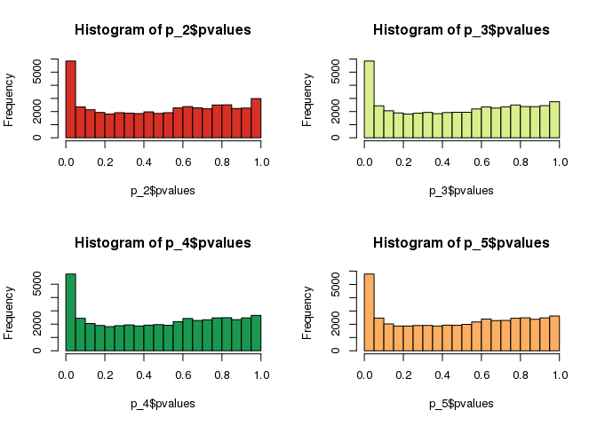

I want to use the package LEA to run some environmental association tests on my GBS data. First, I need to setup the environmental data though. I downloaded the variables I want to use from the WorldClim dataset, and I have a file with the coordinates (longitude and latitude) for my kaka individuals (or rather, their populations).
Now, I needed to install a few packages, but that went quite smoothly, they are here for reference.


```r
install.packages("dismo")
install.packages("maptools")
install.packages("rgdal")
```

Now, loading the packages that I actually need for this first part.


```r
library(dismo)
library(maptools)
library(dplyr)
```

Loading and fixing my locations file, because I realised the order of the coordinates was wrong. These packages like to have longitude before latitude.


```r
kakalocs <- read.table("samples_locations.txt", sep="\t", header=T)
kakalocs <- tibble(kakalocs$SampleID, kakalocs$Longitude, kakalocs$Latitude)
colnames(kakalocs) <- c("SAMPLE", "LONG", "LAT")
```

Loading the bioclimatic variables files.


```r
files <- list.files("env_variables/wc2.0_2.5m_bio/", pattern='tif', full.names=TRUE)
bioclim2.5 <- stack(files)
```

Solar radiation is in a stack of its own (wd) and needs to be synthesized in a single layer if I want to have one value for the annual solar radiation, rather than twelve monthly values. I decided to go for a mean value.


```r
files_wd <- list.files("env_variables/wc2.0_2.5m_srad/", pattern='tif', full.names=TRUE)
wd <- stack(files_wd)
mean(wd) -> mean_srad
```

Now I can extract the values for my locations from the variables I want. And I can plot the maps too, because it's fun. And save the result as .env files for LEA.
Annual mean temperature.


```r
mean_temp <- extract(bioclim2.5[[1]], kakalocs[,2:3])
plot(bioclim2.5, 1, xlim=c(160,180), ylim=c(-48,-34))
points(x=kakalocs$LONG, y=kakalocs$LAT, col="red", cex=0.8)
```

<!-- -->

```r
write.table(mean_temp, "mean_temp.env", col.names = F, row.names = F, quote = F)
```

Minimum temperature of the coldest month.


```r
coldest_month <- extract(bioclim2.5[[6]], kakalocs[,2:3])
plot(bioclim2.5, 6, xlim=c(160,180), ylim=c(-48,-34))
points(x=kakalocs$LONG, y=kakalocs$LAT, col="red", cex=0.8)
```

<!-- -->

```r
write.table(coldest_month, "coldest_month.env", col.names = F, row.names = F, quote = F)
```

Annual precipitation.


```r
ann_prec <- extract(bioclim2.5[[12]], kakalocs[,2:3])
plot(bioclim2.5, 12, xlim=c(160,180), ylim=c(-48,-34))
points(x=kakalocs$LONG, y=kakalocs$LAT, col="red", cex=0.8)
```

<!-- -->

```r
write.table(ann_prec, "ann_prec.env", col.names = F, row.names = F, quote = F)
```

Solar radiation.


```r
ann_srad <- extract(mean_srad, kakalocs[,2:3])
plot(mean_srad, xlim=c(160,180), ylim=c(-48,-34))
points(x=kakalocs$LONG, y=kakalocs$LAT, col="red", cex=0.8)
```

<!-- -->

```r
write.table(ann_srad, "ann_srad.env", col.names = F, row.names = F, quote = F)
```

Now, on to use LEA for the correlations, real quick.
Nope, not on this version of R. -.-
So, sicne I can't update R on my desktop, because the OS is too out of date, I will finish writing up this script and run it in boros instead, where I have my nice R 3.5 installed and I already checked that LEA works fine.


```r
install.packages("devtools")
devtools::install_github("bcm-uga/LEA")
```

Loading packages and snp files, that I need to quickly convert in other formats.


```r
library(LEA)
library(RColorBrewer)
snpfile = ped2lfmm("snps_for_env_tests.ped")
```

```
## 
## 	- number of detected individuals:	92
## 	- number of detected loci:		47098
```

```r
genotype = lfmm2geno("snps_for_env_tests.lfmm")
```

```
## 
## 	- number of detected individuals:	92
## 	- number of detected loci:		47098
```

Testing the population structure (this is a similar thing to admixture), just to check that the signal is the same as usual.


```r
obj.snmf = snmf(genotype, K = 1:8, entropy = T, ploidy = 2, project="new", CPU = 8)
```

```
## The project is saved into :
##  snps_for_env_tests.snmfProject 
## 
## To load the project, use:
##  project = load.snmfProject("snps_for_env_tests.snmfProject")
## 
## To remove the project, use:
##  remove.snmfProject("snps_for_env_tests.snmfProject")
## 
## [1] 269340024
## [1] "*************************************"
## [1] "*          create.dataset            *"
## [1] "*************************************"
## summary of the options:
## 
##         -n (number of individuals)                 92
##         -L (number of loci)                        47098
##         -s (seed random init)                      269340024
##         -r (percentage of masked data)             0.05
##         -x (genotype file in .geno format)         /data/denise/ModPop_analysis/env_correlations/snps_for_env_tests.geno
##         -o (output file in .geno format)           /data/denise/ModPop_analysis/env_correlations/snps_for_env_tests.snmf/masked/snps_for_env_tests_I.geno
## 
##  Write genotype file with masked data, /data/denise/ModPop_analysis/env_correlations/snps_for_env_tests.snmf/masked/snps_for_env_tests_I.geno:		OK.
## 
## [1] "*************************************"
## [1] "* sNMF K = 1  repetition 1      *"
## [1] "*************************************"
## summary of the options:
## 
##         -n (number of individuals)             92
##         -L (number of loci)                    47098
##         -K (number of ancestral pops)          1
##         -x (input file)                        /data/denise/ModPop_analysis/env_correlations/snps_for_env_tests.snmf/masked/snps_for_env_tests_I.geno
##         -q (individual admixture file)         /data/denise/ModPop_analysis/env_correlations/snps_for_env_tests.snmf/K1/run1/snps_for_env_tests_r1.1.Q
##         -g (ancestral frequencies file)        /data/denise/ModPop_analysis/env_correlations/snps_for_env_tests.snmf/K1/run1/snps_for_env_tests_r1.1.G
##         -i (number max of iterations)          200
##         -a (regularization parameter)          10
##         -s (seed random init)                  269340024
##         -e (tolerance error)                   1E-05
##         -p (number of processes)               8
##         - diploid
## 
## Read genotype file /data/denise/ModPop_analysis/env_correlations/snps_for_env_tests.snmf/masked/snps_for_env_tests_I.geno:		OK.
## 
## 
## Main algorithm:
## 
## Least-square error: 1636197.929567
## Write individual ancestry coefficient file /data/denise/ModPop_analysis/env_correlations/snps_for_env_tests.snmf/K1/run1/snps_for_env_tests_r1.1.Q:		OK.
## Write ancestral allele frequency coefficient file /data/denise/ModPop_analysis/env_correlations/snps_for_env_tests.snmf/K1/run1/snps_for_env_tests_r1.1.G:	OK.
## 
## [1] "*************************************"
## [1] "*    cross-entropy estimation       *"
## [1] "*************************************"
## summary of the options:
## 
##         -n (number of individuals)         92
##         -L (number of loci)                47098
##         -K (number of ancestral pops)      1
##         -x (genotype file)                 /data/denise/ModPop_analysis/env_correlations/snps_for_env_tests.geno
##         -q (individual admixture)          /data/denise/ModPop_analysis/env_correlations/snps_for_env_tests.snmf/K1/run1/snps_for_env_tests_r1.1.Q
##         -g (ancestral frequencies)         /data/denise/ModPop_analysis/env_correlations/snps_for_env_tests.snmf/K1/run1/snps_for_env_tests_r1.1.G
##         -i (with masked genotypes)         /data/denise/ModPop_analysis/env_correlations/snps_for_env_tests.snmf/masked/snps_for_env_tests_I.geno
##         - diploid
## 
## Cross-Entropy (all data):	 0.639053
## Cross-Entropy (masked data):	 0.681641
## The project is saved into :
##  snps_for_env_tests.snmfProject 
## 
## To load the project, use:
##  project = load.snmfProject("snps_for_env_tests.snmfProject")
## 
## To remove the project, use:
##  remove.snmfProject("snps_for_env_tests.snmfProject")
## 
## [1] "*************************************"
## [1] "* sNMF K = 2  repetition 1      *"
## [1] "*************************************"
## summary of the options:
## 
##         -n (number of individuals)             92
##         -L (number of loci)                    47098
##         -K (number of ancestral pops)          2
##         -x (input file)                        /data/denise/ModPop_analysis/env_correlations/snps_for_env_tests.snmf/masked/snps_for_env_tests_I.geno
##         -q (individual admixture file)         /data/denise/ModPop_analysis/env_correlations/snps_for_env_tests.snmf/K2/run1/snps_for_env_tests_r1.2.Q
##         -g (ancestral frequencies file)        /data/denise/ModPop_analysis/env_correlations/snps_for_env_tests.snmf/K2/run1/snps_for_env_tests_r1.2.G
##         -i (number max of iterations)          200
##         -a (regularization parameter)          10
##         -s (seed random init)                  13154241912
##         -e (tolerance error)                   1E-05
##         -p (number of processes)               8
##         - diploid
## 
## Read genotype file /data/denise/ModPop_analysis/env_correlations/snps_for_env_tests.snmf/masked/snps_for_env_tests_I.geno:		OK.
## 
## 
## Main algorithm:
## 	[                                                                           ]
## 	[=======================]
## Number of iterations: 61
## 
## Least-square error: 1587900.503808
## Write individual ancestry coefficient file /data/denise/ModPop_analysis/env_correlations/snps_for_env_tests.snmf/K2/run1/snps_for_env_tests_r1.2.Q:		OK.
## Write ancestral allele frequency coefficient file /data/denise/ModPop_analysis/env_correlations/snps_for_env_tests.snmf/K2/run1/snps_for_env_tests_r1.2.G:	OK.
## 
## [1] "*************************************"
## [1] "*    cross-entropy estimation       *"
## [1] "*************************************"
## summary of the options:
## 
##         -n (number of individuals)         92
##         -L (number of loci)                47098
##         -K (number of ancestral pops)      2
##         -x (genotype file)                 /data/denise/ModPop_analysis/env_correlations/snps_for_env_tests.geno
##         -q (individual admixture)          /data/denise/ModPop_analysis/env_correlations/snps_for_env_tests.snmf/K2/run1/snps_for_env_tests_r1.2.Q
##         -g (ancestral frequencies)         /data/denise/ModPop_analysis/env_correlations/snps_for_env_tests.snmf/K2/run1/snps_for_env_tests_r1.2.G
##         -i (with masked genotypes)         /data/denise/ModPop_analysis/env_correlations/snps_for_env_tests.snmf/masked/snps_for_env_tests_I.geno
##         - diploid
## 
## Cross-Entropy (all data):	 0.608589
## Cross-Entropy (masked data):	 0.668698
## The project is saved into :
##  snps_for_env_tests.snmfProject 
## 
## To load the project, use:
##  project = load.snmfProject("snps_for_env_tests.snmfProject")
## 
## To remove the project, use:
##  remove.snmfProject("snps_for_env_tests.snmfProject")
## 
## [1] "*************************************"
## [1] "* sNMF K = 3  repetition 1      *"
## [1] "*************************************"
## summary of the options:
## 
##         -n (number of individuals)             92
##         -L (number of loci)                    47098
##         -K (number of ancestral pops)          3
##         -x (input file)                        /data/denise/ModPop_analysis/env_correlations/snps_for_env_tests.snmf/masked/snps_for_env_tests_I.geno
##         -q (individual admixture file)         /data/denise/ModPop_analysis/env_correlations/snps_for_env_tests.snmf/K3/run1/snps_for_env_tests_r1.3.Q
##         -g (ancestral frequencies file)        /data/denise/ModPop_analysis/env_correlations/snps_for_env_tests.snmf/K3/run1/snps_for_env_tests_r1.3.G
##         -i (number max of iterations)          200
##         -a (regularization parameter)          10
##         -s (seed random init)                  269340024
##         -e (tolerance error)                   1E-05
##         -p (number of processes)               8
##         - diploid
## 
## Read genotype file /data/denise/ModPop_analysis/env_correlations/snps_for_env_tests.snmf/masked/snps_for_env_tests_I.geno:		OK.
## 
## 
## Main algorithm:
## 	[                                                                           ]
## 	[============================================]
## Number of iterations: 117
## 
## Least-square error: 1551651.503035
## Write individual ancestry coefficient file /data/denise/ModPop_analysis/env_correlations/snps_for_env_tests.snmf/K3/run1/snps_for_env_tests_r1.3.Q:		OK.
## Write ancestral allele frequency coefficient file /data/denise/ModPop_analysis/env_correlations/snps_for_env_tests.snmf/K3/run1/snps_for_env_tests_r1.3.G:	OK.
## 
## [1] "*************************************"
## [1] "*    cross-entropy estimation       *"
## [1] "*************************************"
## summary of the options:
## 
##         -n (number of individuals)         92
##         -L (number of loci)                47098
##         -K (number of ancestral pops)      3
##         -x (genotype file)                 /data/denise/ModPop_analysis/env_correlations/snps_for_env_tests.geno
##         -q (individual admixture)          /data/denise/ModPop_analysis/env_correlations/snps_for_env_tests.snmf/K3/run1/snps_for_env_tests_r1.3.Q
##         -g (ancestral frequencies)         /data/denise/ModPop_analysis/env_correlations/snps_for_env_tests.snmf/K3/run1/snps_for_env_tests_r1.3.G
##         -i (with masked genotypes)         /data/denise/ModPop_analysis/env_correlations/snps_for_env_tests.snmf/masked/snps_for_env_tests_I.geno
##         - diploid
## 
## Cross-Entropy (all data):	 0.585974
## Cross-Entropy (masked data):	 0.666222
## The project is saved into :
##  snps_for_env_tests.snmfProject 
## 
## To load the project, use:
##  project = load.snmfProject("snps_for_env_tests.snmfProject")
## 
## To remove the project, use:
##  remove.snmfProject("snps_for_env_tests.snmfProject")
## 
## [1] "*************************************"
## [1] "* sNMF K = 4  repetition 1      *"
## [1] "*************************************"
## summary of the options:
## 
##         -n (number of individuals)             92
##         -L (number of loci)                    47098
##         -K (number of ancestral pops)          4
##         -x (input file)                        /data/denise/ModPop_analysis/env_correlations/snps_for_env_tests.snmf/masked/snps_for_env_tests_I.geno
##         -q (individual admixture file)         /data/denise/ModPop_analysis/env_correlations/snps_for_env_tests.snmf/K4/run1/snps_for_env_tests_r1.4.Q
##         -g (ancestral frequencies file)        /data/denise/ModPop_analysis/env_correlations/snps_for_env_tests.snmf/K4/run1/snps_for_env_tests_r1.4.G
##         -i (number max of iterations)          200
##         -a (regularization parameter)          10
##         -s (seed random init)                  269340024
##         -e (tolerance error)                   1E-05
##         -p (number of processes)               8
##         - diploid
## 
## Read genotype file /data/denise/ModPop_analysis/env_correlations/snps_for_env_tests.snmf/masked/snps_for_env_tests_I.geno:		OK.
## 
## 
## Main algorithm:
## 	[                                                                           ]
## 	[======================]
## Number of iterations: 60
## 
## Least-square error: 1519961.760886
## Write individual ancestry coefficient file /data/denise/ModPop_analysis/env_correlations/snps_for_env_tests.snmf/K4/run1/snps_for_env_tests_r1.4.Q:		OK.
## Write ancestral allele frequency coefficient file /data/denise/ModPop_analysis/env_correlations/snps_for_env_tests.snmf/K4/run1/snps_for_env_tests_r1.4.G:	OK.
## 
## [1] "*************************************"
## [1] "*    cross-entropy estimation       *"
## [1] "*************************************"
## summary of the options:
## 
##         -n (number of individuals)         92
##         -L (number of loci)                47098
##         -K (number of ancestral pops)      4
##         -x (genotype file)                 /data/denise/ModPop_analysis/env_correlations/snps_for_env_tests.geno
##         -q (individual admixture)          /data/denise/ModPop_analysis/env_correlations/snps_for_env_tests.snmf/K4/run1/snps_for_env_tests_r1.4.Q
##         -g (ancestral frequencies)         /data/denise/ModPop_analysis/env_correlations/snps_for_env_tests.snmf/K4/run1/snps_for_env_tests_r1.4.G
##         -i (with masked genotypes)         /data/denise/ModPop_analysis/env_correlations/snps_for_env_tests.snmf/masked/snps_for_env_tests_I.geno
##         - diploid
## 
## Cross-Entropy (all data):	 0.565357
## Cross-Entropy (masked data):	 0.666994
## The project is saved into :
##  snps_for_env_tests.snmfProject 
## 
## To load the project, use:
##  project = load.snmfProject("snps_for_env_tests.snmfProject")
## 
## To remove the project, use:
##  remove.snmfProject("snps_for_env_tests.snmfProject")
## 
## [1] "*************************************"
## [1] "* sNMF K = 5  repetition 1      *"
## [1] "*************************************"
## summary of the options:
## 
##         -n (number of individuals)             92
##         -L (number of loci)                    47098
##         -K (number of ancestral pops)          5
##         -x (input file)                        /data/denise/ModPop_analysis/env_correlations/snps_for_env_tests.snmf/masked/snps_for_env_tests_I.geno
##         -q (individual admixture file)         /data/denise/ModPop_analysis/env_correlations/snps_for_env_tests.snmf/K5/run1/snps_for_env_tests_r1.5.Q
##         -g (ancestral frequencies file)        /data/denise/ModPop_analysis/env_correlations/snps_for_env_tests.snmf/K5/run1/snps_for_env_tests_r1.5.G
##         -i (number max of iterations)          200
##         -a (regularization parameter)          10
##         -s (seed random init)                  269340024
##         -e (tolerance error)                   1E-05
##         -p (number of processes)               8
##         - diploid
## 
## Read genotype file /data/denise/ModPop_analysis/env_correlations/snps_for_env_tests.snmf/masked/snps_for_env_tests_I.geno:		OK.
## 
## 
## Main algorithm:
## 	[                                                                           ]
## 	[====================================]
## Number of iterations: 95
## 
## Least-square error: 1497330.394961
## Write individual ancestry coefficient file /data/denise/ModPop_analysis/env_correlations/snps_for_env_tests.snmf/K5/run1/snps_for_env_tests_r1.5.Q:		OK.
## Write ancestral allele frequency coefficient file /data/denise/ModPop_analysis/env_correlations/snps_for_env_tests.snmf/K5/run1/snps_for_env_tests_r1.5.G:	OK.
## 
## [1] "*************************************"
## [1] "*    cross-entropy estimation       *"
## [1] "*************************************"
## summary of the options:
## 
##         -n (number of individuals)         92
##         -L (number of loci)                47098
##         -K (number of ancestral pops)      5
##         -x (genotype file)                 /data/denise/ModPop_analysis/env_correlations/snps_for_env_tests.geno
##         -q (individual admixture)          /data/denise/ModPop_analysis/env_correlations/snps_for_env_tests.snmf/K5/run1/snps_for_env_tests_r1.5.Q
##         -g (ancestral frequencies)         /data/denise/ModPop_analysis/env_correlations/snps_for_env_tests.snmf/K5/run1/snps_for_env_tests_r1.5.G
##         -i (with masked genotypes)         /data/denise/ModPop_analysis/env_correlations/snps_for_env_tests.snmf/masked/snps_for_env_tests_I.geno
##         - diploid
## 
## Cross-Entropy (all data):	 0.556181
## Cross-Entropy (masked data):	 0.669556
## The project is saved into :
##  snps_for_env_tests.snmfProject 
## 
## To load the project, use:
##  project = load.snmfProject("snps_for_env_tests.snmfProject")
## 
## To remove the project, use:
##  remove.snmfProject("snps_for_env_tests.snmfProject")
## 
## [1] "*************************************"
## [1] "* sNMF K = 6  repetition 1      *"
## [1] "*************************************"
## summary of the options:
## 
##         -n (number of individuals)             92
##         -L (number of loci)                    47098
##         -K (number of ancestral pops)          6
##         -x (input file)                        /data/denise/ModPop_analysis/env_correlations/snps_for_env_tests.snmf/masked/snps_for_env_tests_I.geno
##         -q (individual admixture file)         /data/denise/ModPop_analysis/env_correlations/snps_for_env_tests.snmf/K6/run1/snps_for_env_tests_r1.6.Q
##         -g (ancestral frequencies file)        /data/denise/ModPop_analysis/env_correlations/snps_for_env_tests.snmf/K6/run1/snps_for_env_tests_r1.6.G
##         -i (number max of iterations)          200
##         -a (regularization parameter)          10
##         -s (seed random init)                  269340024
##         -e (tolerance error)                   1E-05
##         -p (number of processes)               8
##         - diploid
## 
## Read genotype file /data/denise/ModPop_analysis/env_correlations/snps_for_env_tests.snmf/masked/snps_for_env_tests_I.geno:		OK.
## 
## 
## Main algorithm:
## 	[                                                                           ]
## 	[=========================================================]
## Number of iterations: 153
## 
## Least-square error: 1476172.182378
## Write individual ancestry coefficient file /data/denise/ModPop_analysis/env_correlations/snps_for_env_tests.snmf/K6/run1/snps_for_env_tests_r1.6.Q:		OK.
## Write ancestral allele frequency coefficient file /data/denise/ModPop_analysis/env_correlations/snps_for_env_tests.snmf/K6/run1/snps_for_env_tests_r1.6.G:	OK.
## 
## [1] "*************************************"
## [1] "*    cross-entropy estimation       *"
## [1] "*************************************"
## summary of the options:
## 
##         -n (number of individuals)         92
##         -L (number of loci)                47098
##         -K (number of ancestral pops)      6
##         -x (genotype file)                 /data/denise/ModPop_analysis/env_correlations/snps_for_env_tests.geno
##         -q (individual admixture)          /data/denise/ModPop_analysis/env_correlations/snps_for_env_tests.snmf/K6/run1/snps_for_env_tests_r1.6.Q
##         -g (ancestral frequencies)         /data/denise/ModPop_analysis/env_correlations/snps_for_env_tests.snmf/K6/run1/snps_for_env_tests_r1.6.G
##         -i (with masked genotypes)         /data/denise/ModPop_analysis/env_correlations/snps_for_env_tests.snmf/masked/snps_for_env_tests_I.geno
##         - diploid
## 
## Cross-Entropy (all data):	 0.544756
## Cross-Entropy (masked data):	 0.682881
## The project is saved into :
##  snps_for_env_tests.snmfProject 
## 
## To load the project, use:
##  project = load.snmfProject("snps_for_env_tests.snmfProject")
## 
## To remove the project, use:
##  remove.snmfProject("snps_for_env_tests.snmfProject")
## 
## [1] "*************************************"
## [1] "* sNMF K = 7  repetition 1      *"
## [1] "*************************************"
## summary of the options:
## 
##         -n (number of individuals)             92
##         -L (number of loci)                    47098
##         -K (number of ancestral pops)          7
##         -x (input file)                        /data/denise/ModPop_analysis/env_correlations/snps_for_env_tests.snmf/masked/snps_for_env_tests_I.geno
##         -q (individual admixture file)         /data/denise/ModPop_analysis/env_correlations/snps_for_env_tests.snmf/K7/run1/snps_for_env_tests_r1.7.Q
##         -g (ancestral frequencies file)        /data/denise/ModPop_analysis/env_correlations/snps_for_env_tests.snmf/K7/run1/snps_for_env_tests_r1.7.G
##         -i (number max of iterations)          200
##         -a (regularization parameter)          10
##         -s (seed random init)                  269340024
##         -e (tolerance error)                   1E-05
##         -p (number of processes)               8
##         - diploid
## 
## Read genotype file /data/denise/ModPop_analysis/env_correlations/snps_for_env_tests.snmf/masked/snps_for_env_tests_I.geno:		OK.
## 
## 
## Main algorithm:
## 	[                                                                           ]
## 	[====================]
## Number of iterations: 53
## 
## Least-square error: 1452773.568742
## Write individual ancestry coefficient file /data/denise/ModPop_analysis/env_correlations/snps_for_env_tests.snmf/K7/run1/snps_for_env_tests_r1.7.Q:		OK.
## Write ancestral allele frequency coefficient file /data/denise/ModPop_analysis/env_correlations/snps_for_env_tests.snmf/K7/run1/snps_for_env_tests_r1.7.G:	OK.
## 
## [1] "*************************************"
## [1] "*    cross-entropy estimation       *"
## [1] "*************************************"
## summary of the options:
## 
##         -n (number of individuals)         92
##         -L (number of loci)                47098
##         -K (number of ancestral pops)      7
##         -x (genotype file)                 /data/denise/ModPop_analysis/env_correlations/snps_for_env_tests.geno
##         -q (individual admixture)          /data/denise/ModPop_analysis/env_correlations/snps_for_env_tests.snmf/K7/run1/snps_for_env_tests_r1.7.Q
##         -g (ancestral frequencies)         /data/denise/ModPop_analysis/env_correlations/snps_for_env_tests.snmf/K7/run1/snps_for_env_tests_r1.7.G
##         -i (with masked genotypes)         /data/denise/ModPop_analysis/env_correlations/snps_for_env_tests.snmf/masked/snps_for_env_tests_I.geno
##         - diploid
## 
## Cross-Entropy (all data):	 0.536676
## Cross-Entropy (masked data):	 0.681382
## The project is saved into :
##  snps_for_env_tests.snmfProject 
## 
## To load the project, use:
##  project = load.snmfProject("snps_for_env_tests.snmfProject")
## 
## To remove the project, use:
##  remove.snmfProject("snps_for_env_tests.snmfProject")
## 
## [1] "*************************************"
## [1] "* sNMF K = 8  repetition 1      *"
## [1] "*************************************"
## summary of the options:
## 
##         -n (number of individuals)             92
##         -L (number of loci)                    47098
##         -K (number of ancestral pops)          8
##         -x (input file)                        /data/denise/ModPop_analysis/env_correlations/snps_for_env_tests.snmf/masked/snps_for_env_tests_I.geno
##         -q (individual admixture file)         /data/denise/ModPop_analysis/env_correlations/snps_for_env_tests.snmf/K8/run1/snps_for_env_tests_r1.8.Q
##         -g (ancestral frequencies file)        /data/denise/ModPop_analysis/env_correlations/snps_for_env_tests.snmf/K8/run1/snps_for_env_tests_r1.8.G
##         -i (number max of iterations)          200
##         -a (regularization parameter)          10
##         -s (seed random init)                  269340024
##         -e (tolerance error)                   1E-05
##         -p (number of processes)               8
##         - diploid
## 
## Read genotype file /data/denise/ModPop_analysis/env_correlations/snps_for_env_tests.snmf/masked/snps_for_env_tests_I.geno:		OK.
## 
## 
## Main algorithm:
## 	[                                                                           ]
## 	[===================================================]
## Number of iterations: 135
## 
## Least-square error: 1429614.506829
## Write individual ancestry coefficient file /data/denise/ModPop_analysis/env_correlations/snps_for_env_tests.snmf/K8/run1/snps_for_env_tests_r1.8.Q:		OK.
## Write ancestral allele frequency coefficient file /data/denise/ModPop_analysis/env_correlations/snps_for_env_tests.snmf/K8/run1/snps_for_env_tests_r1.8.G:	OK.
## 
## [1] "*************************************"
## [1] "*    cross-entropy estimation       *"
## [1] "*************************************"
## summary of the options:
## 
##         -n (number of individuals)         92
##         -L (number of loci)                47098
##         -K (number of ancestral pops)      8
##         -x (genotype file)                 /data/denise/ModPop_analysis/env_correlations/snps_for_env_tests.geno
##         -q (individual admixture)          /data/denise/ModPop_analysis/env_correlations/snps_for_env_tests.snmf/K8/run1/snps_for_env_tests_r1.8.Q
##         -g (ancestral frequencies)         /data/denise/ModPop_analysis/env_correlations/snps_for_env_tests.snmf/K8/run1/snps_for_env_tests_r1.8.G
##         -i (with masked genotypes)         /data/denise/ModPop_analysis/env_correlations/snps_for_env_tests.snmf/masked/snps_for_env_tests_I.geno
##         - diploid
## 
## Cross-Entropy (all data):	 0.523221
## Cross-Entropy (masked data):	 0.696512
## The project is saved into :
##  snps_for_env_tests.snmfProject 
## 
## To load the project, use:
##  project = load.snmfProject("snps_for_env_tests.snmfProject")
## 
## To remove the project, use:
##  remove.snmfProject("snps_for_env_tests.snmfProject")
```

```r
plot(obj.snmf)
```

<!-- -->

```r
barplot(t(Q(obj.snmf, K = 4)), col = c(values=brewer.pal(4, "RdYlGn")))
```

<!-- -->

Everything seems to be as usual, so I am running the imputation for missing data, to check that everything is fine again and because they specify that it is recommended before the environmental associations.


```r
obj.snmf = snmf("snps_for_env_tests.lfmm", K = 4,
                       entropy = TRUE, repetitions = 10,
                       project = "new", CPU = 8)
```

```
## [1] "*********************************************************"
## [1] " Conversion from the lfmm format to the geno format"
## [1] "*********************************************************"
## The project is saved into :
##  snps_for_env_tests.snmfProject 
## 
## To load the project, use:
##  project = load.snmfProject("snps_for_env_tests.snmfProject")
## 
## To remove the project, use:
##  remove.snmfProject("snps_for_env_tests.snmfProject")
## 
## [1] 2122029516
## [1] "*************************************"
## [1] "*          create.dataset            *"
## [1] "*************************************"
## summary of the options:
## 
##         -n (number of individuals)                 92
##         -L (number of loci)                        47098
##         -s (seed random init)                      2122029516
##         -r (percentage of masked data)             0.05
##         -x (genotype file in .geno format)         /data/denise/ModPop_analysis/env_correlations/snps_for_env_tests.geno
##         -o (output file in .geno format)           /data/denise/ModPop_analysis/env_correlations/snps_for_env_tests.snmf/masked/snps_for_env_tests_I.geno
## 
##  Write genotype file with masked data, /data/denise/ModPop_analysis/env_correlations/snps_for_env_tests.snmf/masked/snps_for_env_tests_I.geno:		OK.
## 
## [1] "*************************************"
## [1] "* sNMF K = 4  repetition 1      *"
## [1] "*************************************"
## summary of the options:
## 
##         -n (number of individuals)             92
##         -L (number of loci)                    47098
##         -K (number of ancestral pops)          4
##         -x (input file)                        /data/denise/ModPop_analysis/env_correlations/snps_for_env_tests.snmf/masked/snps_for_env_tests_I.geno
##         -q (individual admixture file)         /data/denise/ModPop_analysis/env_correlations/snps_for_env_tests.snmf/K4/run1/snps_for_env_tests_r1.4.Q
##         -g (ancestral frequencies file)        /data/denise/ModPop_analysis/env_correlations/snps_for_env_tests.snmf/K4/run1/snps_for_env_tests_r1.4.G
##         -i (number max of iterations)          200
##         -a (regularization parameter)          10
##         -s (seed random init)                  2122029516
##         -e (tolerance error)                   1E-05
##         -p (number of processes)               8
##         - diploid
## 
## Read genotype file /data/denise/ModPop_analysis/env_correlations/snps_for_env_tests.snmf/masked/snps_for_env_tests_I.geno:		OK.
## 
## 
## Main algorithm:
## 	[                                                                           ]
## 	[===========]
## Number of iterations: 29
## 
## Least-square error: 1520300.195402
## Write individual ancestry coefficient file /data/denise/ModPop_analysis/env_correlations/snps_for_env_tests.snmf/K4/run1/snps_for_env_tests_r1.4.Q:		OK.
## Write ancestral allele frequency coefficient file /data/denise/ModPop_analysis/env_correlations/snps_for_env_tests.snmf/K4/run1/snps_for_env_tests_r1.4.G:	OK.
## 
## [1] "*************************************"
## [1] "*    cross-entropy estimation       *"
## [1] "*************************************"
## summary of the options:
## 
##         -n (number of individuals)         92
##         -L (number of loci)                47098
##         -K (number of ancestral pops)      4
##         -x (genotype file)                 /data/denise/ModPop_analysis/env_correlations/snps_for_env_tests.geno
##         -q (individual admixture)          /data/denise/ModPop_analysis/env_correlations/snps_for_env_tests.snmf/K4/run1/snps_for_env_tests_r1.4.Q
##         -g (ancestral frequencies)         /data/denise/ModPop_analysis/env_correlations/snps_for_env_tests.snmf/K4/run1/snps_for_env_tests_r1.4.G
##         -i (with masked genotypes)         /data/denise/ModPop_analysis/env_correlations/snps_for_env_tests.snmf/masked/snps_for_env_tests_I.geno
##         - diploid
## 
## Cross-Entropy (all data):	 0.56574
## Cross-Entropy (masked data):	 0.663241
## The project is saved into :
##  snps_for_env_tests.snmfProject 
## 
## To load the project, use:
##  project = load.snmfProject("snps_for_env_tests.snmfProject")
## 
## To remove the project, use:
##  remove.snmfProject("snps_for_env_tests.snmfProject")
## 
## [1] 1916400076
## [1] "*************************************"
## [1] "*          create.dataset            *"
## [1] "*************************************"
## summary of the options:
## 
##         -n (number of individuals)                 92
##         -L (number of loci)                        47098
##         -s (seed random init)                      1916400076
##         -r (percentage of masked data)             0.05
##         -x (genotype file in .geno format)         /data/denise/ModPop_analysis/env_correlations/snps_for_env_tests.geno
##         -o (output file in .geno format)           /data/denise/ModPop_analysis/env_correlations/snps_for_env_tests.snmf/masked/snps_for_env_tests_I.geno
## 
##  Write genotype file with masked data, /data/denise/ModPop_analysis/env_correlations/snps_for_env_tests.snmf/masked/snps_for_env_tests_I.geno:		OK.
## 
## [1] "*************************************"
## [1] "* sNMF K = 4  repetition 2      *"
## [1] "*************************************"
## summary of the options:
## 
##         -n (number of individuals)             92
##         -L (number of loci)                    47098
##         -K (number of ancestral pops)          4
##         -x (input file)                        /data/denise/ModPop_analysis/env_correlations/snps_for_env_tests.snmf/masked/snps_for_env_tests_I.geno
##         -q (individual admixture file)         /data/denise/ModPop_analysis/env_correlations/snps_for_env_tests.snmf/K4/run2/snps_for_env_tests_r2.4.Q
##         -g (ancestral frequencies file)        /data/denise/ModPop_analysis/env_correlations/snps_for_env_tests.snmf/K4/run2/snps_for_env_tests_r2.4.G
##         -i (number max of iterations)          200
##         -a (regularization parameter)          10
##         -s (seed random init)                  1916400076
##         -e (tolerance error)                   1E-05
##         -p (number of processes)               8
##         - diploid
## 
## Read genotype file /data/denise/ModPop_analysis/env_correlations/snps_for_env_tests.snmf/masked/snps_for_env_tests_I.geno:		OK.
## 
## 
## Main algorithm:
## 	[                                                                           ]
## 	[=====================]
## Number of iterations: 56
## 
## Least-square error: 1518906.081647
## Write individual ancestry coefficient file /data/denise/ModPop_analysis/env_correlations/snps_for_env_tests.snmf/K4/run2/snps_for_env_tests_r2.4.Q:		OK.
## Write ancestral allele frequency coefficient file /data/denise/ModPop_analysis/env_correlations/snps_for_env_tests.snmf/K4/run2/snps_for_env_tests_r2.4.G:	OK.
## 
## [1] "*************************************"
## [1] "*    cross-entropy estimation       *"
## [1] "*************************************"
## summary of the options:
## 
##         -n (number of individuals)         92
##         -L (number of loci)                47098
##         -K (number of ancestral pops)      4
##         -x (genotype file)                 /data/denise/ModPop_analysis/env_correlations/snps_for_env_tests.geno
##         -q (individual admixture)          /data/denise/ModPop_analysis/env_correlations/snps_for_env_tests.snmf/K4/run2/snps_for_env_tests_r2.4.Q
##         -g (ancestral frequencies)         /data/denise/ModPop_analysis/env_correlations/snps_for_env_tests.snmf/K4/run2/snps_for_env_tests_r2.4.G
##         -i (with masked genotypes)         /data/denise/ModPop_analysis/env_correlations/snps_for_env_tests.snmf/masked/snps_for_env_tests_I.geno
##         - diploid
## 
## Cross-Entropy (all data):	 0.565223
## Cross-Entropy (masked data):	 0.669157
## The project is saved into :
##  snps_for_env_tests.snmfProject 
## 
## To load the project, use:
##  project = load.snmfProject("snps_for_env_tests.snmfProject")
## 
## To remove the project, use:
##  remove.snmfProject("snps_for_env_tests.snmfProject")
## 
## [1] 1999269522
## [1] "*************************************"
## [1] "*          create.dataset            *"
## [1] "*************************************"
## summary of the options:
## 
##         -n (number of individuals)                 92
##         -L (number of loci)                        47098
##         -s (seed random init)                      1999269522
##         -r (percentage of masked data)             0.05
##         -x (genotype file in .geno format)         /data/denise/ModPop_analysis/env_correlations/snps_for_env_tests.geno
##         -o (output file in .geno format)           /data/denise/ModPop_analysis/env_correlations/snps_for_env_tests.snmf/masked/snps_for_env_tests_I.geno
## 
##  Write genotype file with masked data, /data/denise/ModPop_analysis/env_correlations/snps_for_env_tests.snmf/masked/snps_for_env_tests_I.geno:		OK.
## 
## [1] "*************************************"
## [1] "* sNMF K = 4  repetition 3      *"
## [1] "*************************************"
## summary of the options:
## 
##         -n (number of individuals)             92
##         -L (number of loci)                    47098
##         -K (number of ancestral pops)          4
##         -x (input file)                        /data/denise/ModPop_analysis/env_correlations/snps_for_env_tests.snmf/masked/snps_for_env_tests_I.geno
##         -q (individual admixture file)         /data/denise/ModPop_analysis/env_correlations/snps_for_env_tests.snmf/K4/run3/snps_for_env_tests_r3.4.Q
##         -g (ancestral frequencies file)        /data/denise/ModPop_analysis/env_correlations/snps_for_env_tests.snmf/K4/run3/snps_for_env_tests_r3.4.G
##         -i (number max of iterations)          200
##         -a (regularization parameter)          10
##         -s (seed random init)                  1999269522
##         -e (tolerance error)                   1E-05
##         -p (number of processes)               8
##         - diploid
## 
## Read genotype file /data/denise/ModPop_analysis/env_correlations/snps_for_env_tests.snmf/masked/snps_for_env_tests_I.geno:		OK.
## 
## 
## Main algorithm:
## 	[                                                                           ]
## 	[===========================]
## Number of iterations: 71
## 
## Least-square error: 1528627.364856
## Write individual ancestry coefficient file /data/denise/ModPop_analysis/env_correlations/snps_for_env_tests.snmf/K4/run3/snps_for_env_tests_r3.4.Q:		OK.
## Write ancestral allele frequency coefficient file /data/denise/ModPop_analysis/env_correlations/snps_for_env_tests.snmf/K4/run3/snps_for_env_tests_r3.4.G:	OK.
## 
## [1] "*************************************"
## [1] "*    cross-entropy estimation       *"
## [1] "*************************************"
## summary of the options:
## 
##         -n (number of individuals)         92
##         -L (number of loci)                47098
##         -K (number of ancestral pops)      4
##         -x (genotype file)                 /data/denise/ModPop_analysis/env_correlations/snps_for_env_tests.geno
##         -q (individual admixture)          /data/denise/ModPop_analysis/env_correlations/snps_for_env_tests.snmf/K4/run3/snps_for_env_tests_r3.4.Q
##         -g (ancestral frequencies)         /data/denise/ModPop_analysis/env_correlations/snps_for_env_tests.snmf/K4/run3/snps_for_env_tests_r3.4.G
##         -i (with masked genotypes)         /data/denise/ModPop_analysis/env_correlations/snps_for_env_tests.snmf/masked/snps_for_env_tests_I.geno
##         - diploid
## 
## Cross-Entropy (all data):	 0.575464
## Cross-Entropy (masked data):	 0.671583
## The project is saved into :
##  snps_for_env_tests.snmfProject 
## 
## To load the project, use:
##  project = load.snmfProject("snps_for_env_tests.snmfProject")
## 
## To remove the project, use:
##  remove.snmfProject("snps_for_env_tests.snmfProject")
## 
## [1] 266912151
## [1] "*************************************"
## [1] "*          create.dataset            *"
## [1] "*************************************"
## summary of the options:
## 
##         -n (number of individuals)                 92
##         -L (number of loci)                        47098
##         -s (seed random init)                      266912151
##         -r (percentage of masked data)             0.05
##         -x (genotype file in .geno format)         /data/denise/ModPop_analysis/env_correlations/snps_for_env_tests.geno
##         -o (output file in .geno format)           /data/denise/ModPop_analysis/env_correlations/snps_for_env_tests.snmf/masked/snps_for_env_tests_I.geno
## 
##  Write genotype file with masked data, /data/denise/ModPop_analysis/env_correlations/snps_for_env_tests.snmf/masked/snps_for_env_tests_I.geno:		OK.
## 
## [1] "*************************************"
## [1] "* sNMF K = 4  repetition 4      *"
## [1] "*************************************"
## summary of the options:
## 
##         -n (number of individuals)             92
##         -L (number of loci)                    47098
##         -K (number of ancestral pops)          4
##         -x (input file)                        /data/denise/ModPop_analysis/env_correlations/snps_for_env_tests.snmf/masked/snps_for_env_tests_I.geno
##         -q (individual admixture file)         /data/denise/ModPop_analysis/env_correlations/snps_for_env_tests.snmf/K4/run4/snps_for_env_tests_r4.4.Q
##         -g (ancestral frequencies file)        /data/denise/ModPop_analysis/env_correlations/snps_for_env_tests.snmf/K4/run4/snps_for_env_tests_r4.4.G
##         -i (number max of iterations)          200
##         -a (regularization parameter)          10
##         -s (seed random init)                  266912151
##         -e (tolerance error)                   1E-05
##         -p (number of processes)               8
##         - diploid
## 
## Read genotype file /data/denise/ModPop_analysis/env_correlations/snps_for_env_tests.snmf/masked/snps_for_env_tests_I.geno:		OK.
## 
## 
## Main algorithm:
## 	[                                                                           ]
## 	[====================]
## Number of iterations: 53
## 
## Least-square error: 1520018.249207
## Write individual ancestry coefficient file /data/denise/ModPop_analysis/env_correlations/snps_for_env_tests.snmf/K4/run4/snps_for_env_tests_r4.4.Q:		OK.
## Write ancestral allele frequency coefficient file /data/denise/ModPop_analysis/env_correlations/snps_for_env_tests.snmf/K4/run4/snps_for_env_tests_r4.4.G:	OK.
## 
## [1] "*************************************"
## [1] "*    cross-entropy estimation       *"
## [1] "*************************************"
## summary of the options:
## 
##         -n (number of individuals)         92
##         -L (number of loci)                47098
##         -K (number of ancestral pops)      4
##         -x (genotype file)                 /data/denise/ModPop_analysis/env_correlations/snps_for_env_tests.geno
##         -q (individual admixture)          /data/denise/ModPop_analysis/env_correlations/snps_for_env_tests.snmf/K4/run4/snps_for_env_tests_r4.4.Q
##         -g (ancestral frequencies)         /data/denise/ModPop_analysis/env_correlations/snps_for_env_tests.snmf/K4/run4/snps_for_env_tests_r4.4.G
##         -i (with masked genotypes)         /data/denise/ModPop_analysis/env_correlations/snps_for_env_tests.snmf/masked/snps_for_env_tests_I.geno
##         - diploid
## 
## Cross-Entropy (all data):	 0.565493
## Cross-Entropy (masked data):	 0.666029
## The project is saved into :
##  snps_for_env_tests.snmfProject 
## 
## To load the project, use:
##  project = load.snmfProject("snps_for_env_tests.snmfProject")
## 
## To remove the project, use:
##  remove.snmfProject("snps_for_env_tests.snmfProject")
## 
## [1] 345622554
## [1] "*************************************"
## [1] "*          create.dataset            *"
## [1] "*************************************"
## summary of the options:
## 
##         -n (number of individuals)                 92
##         -L (number of loci)                        47098
##         -s (seed random init)                      345622554
##         -r (percentage of masked data)             0.05
##         -x (genotype file in .geno format)         /data/denise/ModPop_analysis/env_correlations/snps_for_env_tests.geno
##         -o (output file in .geno format)           /data/denise/ModPop_analysis/env_correlations/snps_for_env_tests.snmf/masked/snps_for_env_tests_I.geno
## 
##  Write genotype file with masked data, /data/denise/ModPop_analysis/env_correlations/snps_for_env_tests.snmf/masked/snps_for_env_tests_I.geno:		OK.
## 
## [1] "*************************************"
## [1] "* sNMF K = 4  repetition 5      *"
## [1] "*************************************"
## summary of the options:
## 
##         -n (number of individuals)             92
##         -L (number of loci)                    47098
##         -K (number of ancestral pops)          4
##         -x (input file)                        /data/denise/ModPop_analysis/env_correlations/snps_for_env_tests.snmf/masked/snps_for_env_tests_I.geno
##         -q (individual admixture file)         /data/denise/ModPop_analysis/env_correlations/snps_for_env_tests.snmf/K4/run5/snps_for_env_tests_r5.4.Q
##         -g (ancestral frequencies file)        /data/denise/ModPop_analysis/env_correlations/snps_for_env_tests.snmf/K4/run5/snps_for_env_tests_r5.4.G
##         -i (number max of iterations)          200
##         -a (regularization parameter)          10
##         -s (seed random init)                  345622554
##         -e (tolerance error)                   1E-05
##         -p (number of processes)               8
##         - diploid
## 
## Read genotype file /data/denise/ModPop_analysis/env_correlations/snps_for_env_tests.snmf/masked/snps_for_env_tests_I.geno:		OK.
## 
## 
## Main algorithm:
## 	[                                                                           ]
## 	[===============================]
## Number of iterations: 84
## 
## Least-square error: 1519965.790119
## Write individual ancestry coefficient file /data/denise/ModPop_analysis/env_correlations/snps_for_env_tests.snmf/K4/run5/snps_for_env_tests_r5.4.Q:		OK.
## Write ancestral allele frequency coefficient file /data/denise/ModPop_analysis/env_correlations/snps_for_env_tests.snmf/K4/run5/snps_for_env_tests_r5.4.G:	OK.
## 
## [1] "*************************************"
## [1] "*    cross-entropy estimation       *"
## [1] "*************************************"
## summary of the options:
## 
##         -n (number of individuals)         92
##         -L (number of loci)                47098
##         -K (number of ancestral pops)      4
##         -x (genotype file)                 /data/denise/ModPop_analysis/env_correlations/snps_for_env_tests.geno
##         -q (individual admixture)          /data/denise/ModPop_analysis/env_correlations/snps_for_env_tests.snmf/K4/run5/snps_for_env_tests_r5.4.Q
##         -g (ancestral frequencies)         /data/denise/ModPop_analysis/env_correlations/snps_for_env_tests.snmf/K4/run5/snps_for_env_tests_r5.4.G
##         -i (with masked genotypes)         /data/denise/ModPop_analysis/env_correlations/snps_for_env_tests.snmf/masked/snps_for_env_tests_I.geno
##         - diploid
## 
## Cross-Entropy (all data):	 0.565386
## Cross-Entropy (masked data):	 0.669398
## The project is saved into :
##  snps_for_env_tests.snmfProject 
## 
## To load the project, use:
##  project = load.snmfProject("snps_for_env_tests.snmfProject")
## 
## To remove the project, use:
##  remove.snmfProject("snps_for_env_tests.snmfProject")
## 
## [1] 554709911
## [1] "*************************************"
## [1] "*          create.dataset            *"
## [1] "*************************************"
## summary of the options:
## 
##         -n (number of individuals)                 92
##         -L (number of loci)                        47098
##         -s (seed random init)                      554709911
##         -r (percentage of masked data)             0.05
##         -x (genotype file in .geno format)         /data/denise/ModPop_analysis/env_correlations/snps_for_env_tests.geno
##         -o (output file in .geno format)           /data/denise/ModPop_analysis/env_correlations/snps_for_env_tests.snmf/masked/snps_for_env_tests_I.geno
## 
##  Write genotype file with masked data, /data/denise/ModPop_analysis/env_correlations/snps_for_env_tests.snmf/masked/snps_for_env_tests_I.geno:		OK.
## 
## [1] "*************************************"
## [1] "* sNMF K = 4  repetition 6      *"
## [1] "*************************************"
## summary of the options:
## 
##         -n (number of individuals)             92
##         -L (number of loci)                    47098
##         -K (number of ancestral pops)          4
##         -x (input file)                        /data/denise/ModPop_analysis/env_correlations/snps_for_env_tests.snmf/masked/snps_for_env_tests_I.geno
##         -q (individual admixture file)         /data/denise/ModPop_analysis/env_correlations/snps_for_env_tests.snmf/K4/run6/snps_for_env_tests_r6.4.Q
##         -g (ancestral frequencies file)        /data/denise/ModPop_analysis/env_correlations/snps_for_env_tests.snmf/K4/run6/snps_for_env_tests_r6.4.G
##         -i (number max of iterations)          200
##         -a (regularization parameter)          10
##         -s (seed random init)                  554709911
##         -e (tolerance error)                   1E-05
##         -p (number of processes)               8
##         - diploid
## 
## Read genotype file /data/denise/ModPop_analysis/env_correlations/snps_for_env_tests.snmf/masked/snps_for_env_tests_I.geno:		OK.
## 
## 
## Main algorithm:
## 	[                                                                           ]
## 	[===============]
## Number of iterations: 39
## 
## Least-square error: 1520482.893002
## Write individual ancestry coefficient file /data/denise/ModPop_analysis/env_correlations/snps_for_env_tests.snmf/K4/run6/snps_for_env_tests_r6.4.Q:		OK.
## Write ancestral allele frequency coefficient file /data/denise/ModPop_analysis/env_correlations/snps_for_env_tests.snmf/K4/run6/snps_for_env_tests_r6.4.G:	OK.
## 
## [1] "*************************************"
## [1] "*    cross-entropy estimation       *"
## [1] "*************************************"
## summary of the options:
## 
##         -n (number of individuals)         92
##         -L (number of loci)                47098
##         -K (number of ancestral pops)      4
##         -x (genotype file)                 /data/denise/ModPop_analysis/env_correlations/snps_for_env_tests.geno
##         -q (individual admixture)          /data/denise/ModPop_analysis/env_correlations/snps_for_env_tests.snmf/K4/run6/snps_for_env_tests_r6.4.Q
##         -g (ancestral frequencies)         /data/denise/ModPop_analysis/env_correlations/snps_for_env_tests.snmf/K4/run6/snps_for_env_tests_r6.4.G
##         -i (with masked genotypes)         /data/denise/ModPop_analysis/env_correlations/snps_for_env_tests.snmf/masked/snps_for_env_tests_I.geno
##         - diploid
## 
## Cross-Entropy (all data):	 0.565535
## Cross-Entropy (masked data):	 0.666556
## The project is saved into :
##  snps_for_env_tests.snmfProject 
## 
## To load the project, use:
##  project = load.snmfProject("snps_for_env_tests.snmfProject")
## 
## To remove the project, use:
##  remove.snmfProject("snps_for_env_tests.snmfProject")
## 
## [1] 563880755
## [1] "*************************************"
## [1] "*          create.dataset            *"
## [1] "*************************************"
## summary of the options:
## 
##         -n (number of individuals)                 92
##         -L (number of loci)                        47098
##         -s (seed random init)                      563880755
##         -r (percentage of masked data)             0.05
##         -x (genotype file in .geno format)         /data/denise/ModPop_analysis/env_correlations/snps_for_env_tests.geno
##         -o (output file in .geno format)           /data/denise/ModPop_analysis/env_correlations/snps_for_env_tests.snmf/masked/snps_for_env_tests_I.geno
## 
##  Write genotype file with masked data, /data/denise/ModPop_analysis/env_correlations/snps_for_env_tests.snmf/masked/snps_for_env_tests_I.geno:		OK.
## 
## [1] "*************************************"
## [1] "* sNMF K = 4  repetition 7      *"
## [1] "*************************************"
## summary of the options:
## 
##         -n (number of individuals)             92
##         -L (number of loci)                    47098
##         -K (number of ancestral pops)          4
##         -x (input file)                        /data/denise/ModPop_analysis/env_correlations/snps_for_env_tests.snmf/masked/snps_for_env_tests_I.geno
##         -q (individual admixture file)         /data/denise/ModPop_analysis/env_correlations/snps_for_env_tests.snmf/K4/run7/snps_for_env_tests_r7.4.Q
##         -g (ancestral frequencies file)        /data/denise/ModPop_analysis/env_correlations/snps_for_env_tests.snmf/K4/run7/snps_for_env_tests_r7.4.G
##         -i (number max of iterations)          200
##         -a (regularization parameter)          10
##         -s (seed random init)                  563880755
##         -e (tolerance error)                   1E-05
##         -p (number of processes)               8
##         - diploid
## 
## Read genotype file /data/denise/ModPop_analysis/env_correlations/snps_for_env_tests.snmf/masked/snps_for_env_tests_I.geno:		OK.
## 
## 
## Main algorithm:
## 	[                                                                           ]
## 	[===============]
## Number of iterations: 39
## 
## Least-square error: 1519186.403378
## Write individual ancestry coefficient file /data/denise/ModPop_analysis/env_correlations/snps_for_env_tests.snmf/K4/run7/snps_for_env_tests_r7.4.Q:		OK.
## Write ancestral allele frequency coefficient file /data/denise/ModPop_analysis/env_correlations/snps_for_env_tests.snmf/K4/run7/snps_for_env_tests_r7.4.G:	OK.
## 
## [1] "*************************************"
## [1] "*    cross-entropy estimation       *"
## [1] "*************************************"
## summary of the options:
## 
##         -n (number of individuals)         92
##         -L (number of loci)                47098
##         -K (number of ancestral pops)      4
##         -x (genotype file)                 /data/denise/ModPop_analysis/env_correlations/snps_for_env_tests.geno
##         -q (individual admixture)          /data/denise/ModPop_analysis/env_correlations/snps_for_env_tests.snmf/K4/run7/snps_for_env_tests_r7.4.Q
##         -g (ancestral frequencies)         /data/denise/ModPop_analysis/env_correlations/snps_for_env_tests.snmf/K4/run7/snps_for_env_tests_r7.4.G
##         -i (with masked genotypes)         /data/denise/ModPop_analysis/env_correlations/snps_for_env_tests.snmf/masked/snps_for_env_tests_I.geno
##         - diploid
## 
## Cross-Entropy (all data):	 0.565196
## Cross-Entropy (masked data):	 0.672336
## The project is saved into :
##  snps_for_env_tests.snmfProject 
## 
## To load the project, use:
##  project = load.snmfProject("snps_for_env_tests.snmfProject")
## 
## To remove the project, use:
##  remove.snmfProject("snps_for_env_tests.snmfProject")
## 
## [1] 715229589
## [1] "*************************************"
## [1] "*          create.dataset            *"
## [1] "*************************************"
## summary of the options:
## 
##         -n (number of individuals)                 92
##         -L (number of loci)                        47098
##         -s (seed random init)                      715229589
##         -r (percentage of masked data)             0.05
##         -x (genotype file in .geno format)         /data/denise/ModPop_analysis/env_correlations/snps_for_env_tests.geno
##         -o (output file in .geno format)           /data/denise/ModPop_analysis/env_correlations/snps_for_env_tests.snmf/masked/snps_for_env_tests_I.geno
## 
##  Write genotype file with masked data, /data/denise/ModPop_analysis/env_correlations/snps_for_env_tests.snmf/masked/snps_for_env_tests_I.geno:		OK.
## 
## [1] "*************************************"
## [1] "* sNMF K = 4  repetition 8      *"
## [1] "*************************************"
## summary of the options:
## 
##         -n (number of individuals)             92
##         -L (number of loci)                    47098
##         -K (number of ancestral pops)          4
##         -x (input file)                        /data/denise/ModPop_analysis/env_correlations/snps_for_env_tests.snmf/masked/snps_for_env_tests_I.geno
##         -q (individual admixture file)         /data/denise/ModPop_analysis/env_correlations/snps_for_env_tests.snmf/K4/run8/snps_for_env_tests_r8.4.Q
##         -g (ancestral frequencies file)        /data/denise/ModPop_analysis/env_correlations/snps_for_env_tests.snmf/K4/run8/snps_for_env_tests_r8.4.G
##         -i (number max of iterations)          200
##         -a (regularization parameter)          10
##         -s (seed random init)                  715229589
##         -e (tolerance error)                   1E-05
##         -p (number of processes)               8
##         - diploid
## 
## Read genotype file /data/denise/ModPop_analysis/env_correlations/snps_for_env_tests.snmf/masked/snps_for_env_tests_I.geno:		OK.
## 
## 
## Main algorithm:
## 	[                                                                           ]
## 	[========================]
## Number of iterations: 65
## 
## Least-square error: 1520399.459586
## Write individual ancestry coefficient file /data/denise/ModPop_analysis/env_correlations/snps_for_env_tests.snmf/K4/run8/snps_for_env_tests_r8.4.Q:		OK.
## Write ancestral allele frequency coefficient file /data/denise/ModPop_analysis/env_correlations/snps_for_env_tests.snmf/K4/run8/snps_for_env_tests_r8.4.G:	OK.
## 
## [1] "*************************************"
## [1] "*    cross-entropy estimation       *"
## [1] "*************************************"
## summary of the options:
## 
##         -n (number of individuals)         92
##         -L (number of loci)                47098
##         -K (number of ancestral pops)      4
##         -x (genotype file)                 /data/denise/ModPop_analysis/env_correlations/snps_for_env_tests.geno
##         -q (individual admixture)          /data/denise/ModPop_analysis/env_correlations/snps_for_env_tests.snmf/K4/run8/snps_for_env_tests_r8.4.Q
##         -g (ancestral frequencies)         /data/denise/ModPop_analysis/env_correlations/snps_for_env_tests.snmf/K4/run8/snps_for_env_tests_r8.4.G
##         -i (with masked genotypes)         /data/denise/ModPop_analysis/env_correlations/snps_for_env_tests.snmf/masked/snps_for_env_tests_I.geno
##         - diploid
## 
## Cross-Entropy (all data):	 0.565471
## Cross-Entropy (masked data):	 0.668032
## The project is saved into :
##  snps_for_env_tests.snmfProject 
## 
## To load the project, use:
##  project = load.snmfProject("snps_for_env_tests.snmfProject")
## 
## To remove the project, use:
##  remove.snmfProject("snps_for_env_tests.snmfProject")
## 
## [1] 1337804796
## [1] "*************************************"
## [1] "*          create.dataset            *"
## [1] "*************************************"
## summary of the options:
## 
##         -n (number of individuals)                 92
##         -L (number of loci)                        47098
##         -s (seed random init)                      1337804796
##         -r (percentage of masked data)             0.05
##         -x (genotype file in .geno format)         /data/denise/ModPop_analysis/env_correlations/snps_for_env_tests.geno
##         -o (output file in .geno format)           /data/denise/ModPop_analysis/env_correlations/snps_for_env_tests.snmf/masked/snps_for_env_tests_I.geno
## 
##  Write genotype file with masked data, /data/denise/ModPop_analysis/env_correlations/snps_for_env_tests.snmf/masked/snps_for_env_tests_I.geno:		OK.
## 
## [1] "*************************************"
## [1] "* sNMF K = 4  repetition 9      *"
## [1] "*************************************"
## summary of the options:
## 
##         -n (number of individuals)             92
##         -L (number of loci)                    47098
##         -K (number of ancestral pops)          4
##         -x (input file)                        /data/denise/ModPop_analysis/env_correlations/snps_for_env_tests.snmf/masked/snps_for_env_tests_I.geno
##         -q (individual admixture file)         /data/denise/ModPop_analysis/env_correlations/snps_for_env_tests.snmf/K4/run9/snps_for_env_tests_r9.4.Q
##         -g (ancestral frequencies file)        /data/denise/ModPop_analysis/env_correlations/snps_for_env_tests.snmf/K4/run9/snps_for_env_tests_r9.4.G
##         -i (number max of iterations)          200
##         -a (regularization parameter)          10
##         -s (seed random init)                  1337804796
##         -e (tolerance error)                   1E-05
##         -p (number of processes)               8
##         - diploid
## 
## Read genotype file /data/denise/ModPop_analysis/env_correlations/snps_for_env_tests.snmf/masked/snps_for_env_tests_I.geno:		OK.
## 
## 
## Main algorithm:
## 	[                                                                           ]
## 	[=================================================]
## Number of iterations: 131
## 
## Least-square error: 1527280.698144
## Write individual ancestry coefficient file /data/denise/ModPop_analysis/env_correlations/snps_for_env_tests.snmf/K4/run9/snps_for_env_tests_r9.4.Q:		OK.
## Write ancestral allele frequency coefficient file /data/denise/ModPop_analysis/env_correlations/snps_for_env_tests.snmf/K4/run9/snps_for_env_tests_r9.4.G:	OK.
## 
## [1] "*************************************"
## [1] "*    cross-entropy estimation       *"
## [1] "*************************************"
## summary of the options:
## 
##         -n (number of individuals)         92
##         -L (number of loci)                47098
##         -K (number of ancestral pops)      4
##         -x (genotype file)                 /data/denise/ModPop_analysis/env_correlations/snps_for_env_tests.geno
##         -q (individual admixture)          /data/denise/ModPop_analysis/env_correlations/snps_for_env_tests.snmf/K4/run9/snps_for_env_tests_r9.4.Q
##         -g (ancestral frequencies)         /data/denise/ModPop_analysis/env_correlations/snps_for_env_tests.snmf/K4/run9/snps_for_env_tests_r9.4.G
##         -i (with masked genotypes)         /data/denise/ModPop_analysis/env_correlations/snps_for_env_tests.snmf/masked/snps_for_env_tests_I.geno
##         - diploid
## 
## Cross-Entropy (all data):	 0.575436
## Cross-Entropy (masked data):	 0.672673
## The project is saved into :
##  snps_for_env_tests.snmfProject 
## 
## To load the project, use:
##  project = load.snmfProject("snps_for_env_tests.snmfProject")
## 
## To remove the project, use:
##  remove.snmfProject("snps_for_env_tests.snmfProject")
## 
## [1] 549068341
## [1] "*************************************"
## [1] "*          create.dataset            *"
## [1] "*************************************"
## summary of the options:
## 
##         -n (number of individuals)                 92
##         -L (number of loci)                        47098
##         -s (seed random init)                      549068341
##         -r (percentage of masked data)             0.05
##         -x (genotype file in .geno format)         /data/denise/ModPop_analysis/env_correlations/snps_for_env_tests.geno
##         -o (output file in .geno format)           /data/denise/ModPop_analysis/env_correlations/snps_for_env_tests.snmf/masked/snps_for_env_tests_I.geno
## 
##  Write genotype file with masked data, /data/denise/ModPop_analysis/env_correlations/snps_for_env_tests.snmf/masked/snps_for_env_tests_I.geno:		OK.
## 
## [1] "*************************************"
## [1] "* sNMF K = 4  repetition 10      *"
## [1] "*************************************"
## summary of the options:
## 
##         -n (number of individuals)             92
##         -L (number of loci)                    47098
##         -K (number of ancestral pops)          4
##         -x (input file)                        /data/denise/ModPop_analysis/env_correlations/snps_for_env_tests.snmf/masked/snps_for_env_tests_I.geno
##         -q (individual admixture file)         /data/denise/ModPop_analysis/env_correlations/snps_for_env_tests.snmf/K4/run10/snps_for_env_tests_r10.4.Q
##         -g (ancestral frequencies file)        /data/denise/ModPop_analysis/env_correlations/snps_for_env_tests.snmf/K4/run10/snps_for_env_tests_r10.4.G
##         -i (number max of iterations)          200
##         -a (regularization parameter)          10
##         -s (seed random init)                  549068341
##         -e (tolerance error)                   1E-05
##         -p (number of processes)               8
##         - diploid
## 
## Read genotype file /data/denise/ModPop_analysis/env_correlations/snps_for_env_tests.snmf/masked/snps_for_env_tests_I.geno:		OK.
## 
## 
## Main algorithm:
## 	[                                                                           ]
## 	[====================]
## Number of iterations: 54
## 
## Least-square error: 1519833.694630
## Write individual ancestry coefficient file /data/denise/ModPop_analysis/env_correlations/snps_for_env_tests.snmf/K4/run10/snps_for_env_tests_r10.4.Q:		OK.
## Write ancestral allele frequency coefficient file /data/denise/ModPop_analysis/env_correlations/snps_for_env_tests.snmf/K4/run10/snps_for_env_tests_r10.4.G:	OK.
## 
## [1] "*************************************"
## [1] "*    cross-entropy estimation       *"
## [1] "*************************************"
## summary of the options:
## 
##         -n (number of individuals)         92
##         -L (number of loci)                47098
##         -K (number of ancestral pops)      4
##         -x (genotype file)                 /data/denise/ModPop_analysis/env_correlations/snps_for_env_tests.geno
##         -q (individual admixture)          /data/denise/ModPop_analysis/env_correlations/snps_for_env_tests.snmf/K4/run10/snps_for_env_tests_r10.4.Q
##         -g (ancestral frequencies)         /data/denise/ModPop_analysis/env_correlations/snps_for_env_tests.snmf/K4/run10/snps_for_env_tests_r10.4.G
##         -i (with masked genotypes)         /data/denise/ModPop_analysis/env_correlations/snps_for_env_tests.snmf/masked/snps_for_env_tests_I.geno
##         - diploid
## 
## Cross-Entropy (all data):	 0.565299
## Cross-Entropy (masked data):	 0.670924
## The project is saved into :
##  snps_for_env_tests.snmfProject 
## 
## To load the project, use:
##  project = load.snmfProject("snps_for_env_tests.snmfProject")
## 
## To remove the project, use:
##  remove.snmfProject("snps_for_env_tests.snmfProject")
```

```r
# select the run with the lowest cross-entropy value
best = which.min(cross.entropy(obj.snmf, K = 4))
barplot(t(Q(obj.snmf, K = 4, run = best)), col = c(values=brewer.pal(4, "RdYlGn")))
```

<!-- -->

```r
# Impute the missing genotypes
impute(obj.snmf, "snps_for_env_tests.lfmm",
       method = 'mode', K = 4, run = best)
```

```
## Missing genotype imputation for K = 4 
## Missing genotype imputation for run = 1 
## Results are written in the file:  snps_for_env_tests.lfmm_imputed.lfmm
```

```r
file.rename("snps_for_env_tests.lfmm_imputed.lfmm", "snps_for_env_tests_imputed.lfmm")
```

```
## [1] TRUE
```

Now, time to finally run those association tests on this dataset. Starting with the mean temp variable.
In the documentation they recommend running the test with different Ks around the value identified with snmf, with multiple repetitions for each K (repetitions=5-10), a decent number of cycles (e.g. -i 6000) and half of that as burning cycles (-b 3000). So, here we go.


```r
mean_temp = lfmm("snps_for_env_tests_imputed.lfmm", "mean_temp.env",
                K = 2:5, repetitions = 5, iterations = 6000, burnin = 3000, project="new", CPU = 8)
```

```
## The project is saved into :
##  snps_for_env_tests_imputed_mean_temp.lfmmProject 
## 
## To load the project, use:
##  project = load.lfmmProject("snps_for_env_tests_imputed_mean_temp.lfmmProject")
## 
## To remove the project, use:
##  remove.lfmmProject("snps_for_env_tests_imputed_mean_temp.lfmmProject")
## 
## [1] "********************************"
## [1] "* K = 2  repetition 1  d = 1   *"
## [1] "********************************"
## Summary of the options:
## 
##         -n (number of individuals)      92
##         -L (number of loci)             47098
##         -K (number of latent factors)   2
##         -o (output file)                snps_for_env_tests_imputed_mean_temp.lfmm/K2/run1/snps_for_env_tests_imputed_r1
##         -i (number of iterations)       6000
##         -b (burnin)                     3000
##         -s (seed random init)           5245306808
##         -p (number of processes (CPU))  8
##         -x (genotype file)              snps_for_env_tests_imputed.lfmm
##         -v (variable file)              mean_temp.env
##         -D (number of covariables)      1
##         -d (the dth covariable)         1
## 
## Read variable file:
##  	mean_temp.env		OK.
## 
## Read genotype file:
##  	snps_for_env_tests_imputed.lfmm		OK.
## 
## <<<<
## 	 Analyse for variable 1
## 
## 		Start of the Gibbs Sampler algorithm.
## 
## 	[                                                                           ]
## 	[===========================================================================]
## 
## 		End of the Gibbs Sampler algorithm.
## 
## 	ED:4333050.338	 DIC: 4324175.523 
## 
## 	The statistics for the run are registered in:
##  		snps_for_env_tests_imputed_mean_temp.lfmm/K2/run1/snps_for_env_tests_imputed_r1_s1.2.dic.
## 
## 	The zscores for variable 1 are registered in:
##  		snps_for_env_tests_imputed_mean_temp.lfmm/K2/run1/snps_for_env_tests_imputed_r1_s1.2.zscore.
## 	The columns are: zscores, -log10(p-values), p-values.
## 
## 	-------------------------
## 	The execution for variable 1 worked without error.
## >>>>
## 
## The project is saved into :
##  snps_for_env_tests_imputed_mean_temp.lfmmProject 
## 
## To load the project, use:
##  project = load.lfmmProject("snps_for_env_tests_imputed_mean_temp.lfmmProject")
## 
## To remove the project, use:
##  remove.lfmmProject("snps_for_env_tests_imputed_mean_temp.lfmmProject")
## 
## [1] "********************************"
## [1] "* K = 3  repetition 1  d = 1   *"
## [1] "********************************"
## Summary of the options:
## 
##         -n (number of individuals)      92
##         -L (number of loci)             47098
##         -K (number of latent factors)   3
##         -o (output file)                snps_for_env_tests_imputed_mean_temp.lfmm/K3/run1/snps_for_env_tests_imputed_r1
##         -i (number of iterations)       6000
##         -b (burnin)                     3000
##         -s (seed random init)           5245306808
##         -p (number of processes (CPU))  8
##         -x (genotype file)              snps_for_env_tests_imputed.lfmm
##         -v (variable file)              mean_temp.env
##         -D (number of covariables)      1
##         -d (the dth covariable)         1
## 
## Read variable file:
##  	mean_temp.env		OK.
## 
## Read genotype file:
##  	snps_for_env_tests_imputed.lfmm		OK.
## 
## <<<<
## 	 Analyse for variable 1
## 
## 		Start of the Gibbs Sampler algorithm.
## 
## 	[                                                                           ]
## 	[===========================================================================]
## 
## 		End of the Gibbs Sampler algorithm.
## 
## 	ED:4333049.042	 DIC: 4333074.472 
## 
## 	The statistics for the run are registered in:
##  		snps_for_env_tests_imputed_mean_temp.lfmm/K3/run1/snps_for_env_tests_imputed_r1_s1.3.dic.
## 
## 	The zscores for variable 1 are registered in:
##  		snps_for_env_tests_imputed_mean_temp.lfmm/K3/run1/snps_for_env_tests_imputed_r1_s1.3.zscore.
## 	The columns are: zscores, -log10(p-values), p-values.
## 
## 	-------------------------
## 	The execution for variable 1 worked without error.
## >>>>
## 
## The project is saved into :
##  snps_for_env_tests_imputed_mean_temp.lfmmProject 
## 
## To load the project, use:
##  project = load.lfmmProject("snps_for_env_tests_imputed_mean_temp.lfmmProject")
## 
## To remove the project, use:
##  remove.lfmmProject("snps_for_env_tests_imputed_mean_temp.lfmmProject")
## 
## [1] "********************************"
## [1] "* K = 4  repetition 1  d = 1   *"
## [1] "********************************"
## Summary of the options:
## 
##         -n (number of individuals)      92
##         -L (number of loci)             47098
##         -K (number of latent factors)   4
##         -o (output file)                snps_for_env_tests_imputed_mean_temp.lfmm/K4/run1/snps_for_env_tests_imputed_r1
##         -i (number of iterations)       6000
##         -b (burnin)                     3000
##         -s (seed random init)           5245306808
##         -p (number of processes (CPU))  8
##         -x (genotype file)              snps_for_env_tests_imputed.lfmm
##         -v (variable file)              mean_temp.env
##         -D (number of covariables)      1
##         -d (the dth covariable)         1
## 
## Read variable file:
##  	mean_temp.env		OK.
## 
## Read genotype file:
##  	snps_for_env_tests_imputed.lfmm		OK.
## 
## <<<<
## 	 Analyse for variable 1
## 
## 		Start of the Gibbs Sampler algorithm.
## 
## 	[                                                                           ]
## 	[===========================================================================]
## 
## 		End of the Gibbs Sampler algorithm.
## 
## 	ED:4333047.901	 DIC: 4333054.388 
## 
## 	The statistics for the run are registered in:
##  		snps_for_env_tests_imputed_mean_temp.lfmm/K4/run1/snps_for_env_tests_imputed_r1_s1.4.dic.
## 
## 	The zscores for variable 1 are registered in:
##  		snps_for_env_tests_imputed_mean_temp.lfmm/K4/run1/snps_for_env_tests_imputed_r1_s1.4.zscore.
## 	The columns are: zscores, -log10(p-values), p-values.
## 
## 	-------------------------
## 	The execution for variable 1 worked without error.
## >>>>
## 
## The project is saved into :
##  snps_for_env_tests_imputed_mean_temp.lfmmProject 
## 
## To load the project, use:
##  project = load.lfmmProject("snps_for_env_tests_imputed_mean_temp.lfmmProject")
## 
## To remove the project, use:
##  remove.lfmmProject("snps_for_env_tests_imputed_mean_temp.lfmmProject")
## 
## [1] "********************************"
## [1] "* K = 5  repetition 1  d = 1   *"
## [1] "********************************"
## Summary of the options:
## 
##         -n (number of individuals)      92
##         -L (number of loci)             47098
##         -K (number of latent factors)   5
##         -o (output file)                snps_for_env_tests_imputed_mean_temp.lfmm/K5/run1/snps_for_env_tests_imputed_r1
##         -i (number of iterations)       6000
##         -b (burnin)                     3000
##         -s (seed random init)           5245306808
##         -p (number of processes (CPU))  8
##         -x (genotype file)              snps_for_env_tests_imputed.lfmm
##         -v (variable file)              mean_temp.env
##         -D (number of covariables)      1
##         -d (the dth covariable)         1
## 
## Read variable file:
##  	mean_temp.env		OK.
## 
## Read genotype file:
##  	snps_for_env_tests_imputed.lfmm		OK.
## 
## <<<<
## 	 Analyse for variable 1
## 
## 		Start of the Gibbs Sampler algorithm.
## 
## 	[                                                                           ]
## 	[===========================================================================]
## 
## 		End of the Gibbs Sampler algorithm.
## 
## 	ED:4333047.79	 DIC: 4330535.947 
## 
## 	The statistics for the run are registered in:
##  		snps_for_env_tests_imputed_mean_temp.lfmm/K5/run1/snps_for_env_tests_imputed_r1_s1.5.dic.
## 
## 	The zscores for variable 1 are registered in:
##  		snps_for_env_tests_imputed_mean_temp.lfmm/K5/run1/snps_for_env_tests_imputed_r1_s1.5.zscore.
## 	The columns are: zscores, -log10(p-values), p-values.
## 
## 	-------------------------
## 	The execution for variable 1 worked without error.
## >>>>
## 
## The project is saved into :
##  snps_for_env_tests_imputed_mean_temp.lfmmProject 
## 
## To load the project, use:
##  project = load.lfmmProject("snps_for_env_tests_imputed_mean_temp.lfmmProject")
## 
## To remove the project, use:
##  remove.lfmmProject("snps_for_env_tests_imputed_mean_temp.lfmmProject")
## 
## [1] "********************************"
## [1] "* K = 2  repetition 2  d = 1   *"
## [1] "********************************"
## Summary of the options:
## 
##         -n (number of individuals)      92
##         -L (number of loci)             47098
##         -K (number of latent factors)   2
##         -o (output file)                snps_for_env_tests_imputed_mean_temp.lfmm/K2/run2/snps_for_env_tests_imputed_r2
##         -i (number of iterations)       6000
##         -b (burnin)                     3000
##         -s (seed random init)           4714784484
##         -p (number of processes (CPU))  8
##         -x (genotype file)              snps_for_env_tests_imputed.lfmm
##         -v (variable file)              mean_temp.env
##         -D (number of covariables)      1
##         -d (the dth covariable)         1
## 
## Read variable file:
##  	mean_temp.env		OK.
## 
## Read genotype file:
##  	snps_for_env_tests_imputed.lfmm		OK.
## 
## <<<<
## 	 Analyse for variable 1
## 
## 		Start of the Gibbs Sampler algorithm.
## 
## 	[                                                                           ]
## 	[===========================================================================]
## 
## 		End of the Gibbs Sampler algorithm.
## 
## 	ED:4333050.464	 DIC: 4329186.436 
## 
## 	The statistics for the run are registered in:
##  		snps_for_env_tests_imputed_mean_temp.lfmm/K2/run2/snps_for_env_tests_imputed_r2_s1.2.dic.
## 
## 	The zscores for variable 1 are registered in:
##  		snps_for_env_tests_imputed_mean_temp.lfmm/K2/run2/snps_for_env_tests_imputed_r2_s1.2.zscore.
## 	The columns are: zscores, -log10(p-values), p-values.
## 
## 	-------------------------
## 	The execution for variable 1 worked without error.
## >>>>
## 
## The project is saved into :
##  snps_for_env_tests_imputed_mean_temp.lfmmProject 
## 
## To load the project, use:
##  project = load.lfmmProject("snps_for_env_tests_imputed_mean_temp.lfmmProject")
## 
## To remove the project, use:
##  remove.lfmmProject("snps_for_env_tests_imputed_mean_temp.lfmmProject")
## 
## [1] "********************************"
## [1] "* K = 3  repetition 2  d = 1   *"
## [1] "********************************"
## Summary of the options:
## 
##         -n (number of individuals)      92
##         -L (number of loci)             47098
##         -K (number of latent factors)   3
##         -o (output file)                snps_for_env_tests_imputed_mean_temp.lfmm/K3/run2/snps_for_env_tests_imputed_r2
##         -i (number of iterations)       6000
##         -b (burnin)                     3000
##         -s (seed random init)           4714784484
##         -p (number of processes (CPU))  8
##         -x (genotype file)              snps_for_env_tests_imputed.lfmm
##         -v (variable file)              mean_temp.env
##         -D (number of covariables)      1
##         -d (the dth covariable)         1
## 
## Read variable file:
##  	mean_temp.env		OK.
## 
## Read genotype file:
##  	snps_for_env_tests_imputed.lfmm		OK.
## 
## <<<<
## 	 Analyse for variable 1
## 
## 		Start of the Gibbs Sampler algorithm.
## 
## 	[                                                                           ]
## 	[===========================================================================]
## 
## 		End of the Gibbs Sampler algorithm.
## 
## 	ED:4333050.95	 DIC: 4325028.704 
## 
## 	The statistics for the run are registered in:
##  		snps_for_env_tests_imputed_mean_temp.lfmm/K3/run2/snps_for_env_tests_imputed_r2_s1.3.dic.
## 
## 	The zscores for variable 1 are registered in:
##  		snps_for_env_tests_imputed_mean_temp.lfmm/K3/run2/snps_for_env_tests_imputed_r2_s1.3.zscore.
## 	The columns are: zscores, -log10(p-values), p-values.
## 
## 	-------------------------
## 	The execution for variable 1 worked without error.
## >>>>
## 
## The project is saved into :
##  snps_for_env_tests_imputed_mean_temp.lfmmProject 
## 
## To load the project, use:
##  project = load.lfmmProject("snps_for_env_tests_imputed_mean_temp.lfmmProject")
## 
## To remove the project, use:
##  remove.lfmmProject("snps_for_env_tests_imputed_mean_temp.lfmmProject")
## 
## [1] "********************************"
## [1] "* K = 4  repetition 2  d = 1   *"
## [1] "********************************"
## Summary of the options:
## 
##         -n (number of individuals)      92
##         -L (number of loci)             47098
##         -K (number of latent factors)   4
##         -o (output file)                snps_for_env_tests_imputed_mean_temp.lfmm/K4/run2/snps_for_env_tests_imputed_r2
##         -i (number of iterations)       6000
##         -b (burnin)                     3000
##         -s (seed random init)           4714784484
##         -p (number of processes (CPU))  8
##         -x (genotype file)              snps_for_env_tests_imputed.lfmm
##         -v (variable file)              mean_temp.env
##         -D (number of covariables)      1
##         -d (the dth covariable)         1
## 
## Read variable file:
##  	mean_temp.env		OK.
## 
## Read genotype file:
##  	snps_for_env_tests_imputed.lfmm		OK.
## 
## <<<<
## 	 Analyse for variable 1
## 
## 		Start of the Gibbs Sampler algorithm.
## 
## 	[                                                                           ]
## 	[===========================================================================]
## 
## 		End of the Gibbs Sampler algorithm.
## 
## 	ED:4333047.893	 DIC: 4333069.422 
## 
## 	The statistics for the run are registered in:
##  		snps_for_env_tests_imputed_mean_temp.lfmm/K4/run2/snps_for_env_tests_imputed_r2_s1.4.dic.
## 
## 	The zscores for variable 1 are registered in:
##  		snps_for_env_tests_imputed_mean_temp.lfmm/K4/run2/snps_for_env_tests_imputed_r2_s1.4.zscore.
## 	The columns are: zscores, -log10(p-values), p-values.
## 
## 	-------------------------
## 	The execution for variable 1 worked without error.
## >>>>
## 
## The project is saved into :
##  snps_for_env_tests_imputed_mean_temp.lfmmProject 
## 
## To load the project, use:
##  project = load.lfmmProject("snps_for_env_tests_imputed_mean_temp.lfmmProject")
## 
## To remove the project, use:
##  remove.lfmmProject("snps_for_env_tests_imputed_mean_temp.lfmmProject")
## 
## [1] "********************************"
## [1] "* K = 5  repetition 2  d = 1   *"
## [1] "********************************"
## Summary of the options:
## 
##         -n (number of individuals)      92
##         -L (number of loci)             47098
##         -K (number of latent factors)   5
##         -o (output file)                snps_for_env_tests_imputed_mean_temp.lfmm/K5/run2/snps_for_env_tests_imputed_r2
##         -i (number of iterations)       6000
##         -b (burnin)                     3000
##         -s (seed random init)           4714784484
##         -p (number of processes (CPU))  8
##         -x (genotype file)              snps_for_env_tests_imputed.lfmm
##         -v (variable file)              mean_temp.env
##         -D (number of covariables)      1
##         -d (the dth covariable)         1
## 
## Read variable file:
##  	mean_temp.env		OK.
## 
## Read genotype file:
##  	snps_for_env_tests_imputed.lfmm		OK.
## 
## <<<<
## 	 Analyse for variable 1
## 
## 		Start of the Gibbs Sampler algorithm.
## 
## 	[                                                                           ]
## 	[===========================================================================]
## 
## 		End of the Gibbs Sampler algorithm.
## 
## 	ED:4333048.403	 DIC: 4330676.934 
## 
## 	The statistics for the run are registered in:
##  		snps_for_env_tests_imputed_mean_temp.lfmm/K5/run2/snps_for_env_tests_imputed_r2_s1.5.dic.
## 
## 	The zscores for variable 1 are registered in:
##  		snps_for_env_tests_imputed_mean_temp.lfmm/K5/run2/snps_for_env_tests_imputed_r2_s1.5.zscore.
## 	The columns are: zscores, -log10(p-values), p-values.
## 
## 	-------------------------
## 	The execution for variable 1 worked without error.
## >>>>
## 
## The project is saved into :
##  snps_for_env_tests_imputed_mean_temp.lfmmProject 
## 
## To load the project, use:
##  project = load.lfmmProject("snps_for_env_tests_imputed_mean_temp.lfmmProject")
## 
## To remove the project, use:
##  remove.lfmmProject("snps_for_env_tests_imputed_mean_temp.lfmmProject")
## 
## [1] "********************************"
## [1] "* K = 2  repetition 3  d = 1   *"
## [1] "********************************"
## Summary of the options:
## 
##         -n (number of individuals)      92
##         -L (number of loci)             47098
##         -K (number of latent factors)   2
##         -o (output file)                snps_for_env_tests_imputed_mean_temp.lfmm/K2/run3/snps_for_env_tests_imputed_r3
##         -i (number of iterations)       6000
##         -b (burnin)                     3000
##         -s (seed random init)           4940137893
##         -p (number of processes (CPU))  8
##         -x (genotype file)              snps_for_env_tests_imputed.lfmm
##         -v (variable file)              mean_temp.env
##         -D (number of covariables)      1
##         -d (the dth covariable)         1
## 
## Read variable file:
##  	mean_temp.env		OK.
## 
## Read genotype file:
##  	snps_for_env_tests_imputed.lfmm		OK.
## 
## <<<<
## 	 Analyse for variable 1
## 
## 		Start of the Gibbs Sampler algorithm.
## 
## 	[                                                                           ]
## 	[===========================================================================]
## 
## 		End of the Gibbs Sampler algorithm.
## 
## 	ED:4333049.502	 DIC: 4315124.156 
## 
## 	The statistics for the run are registered in:
##  		snps_for_env_tests_imputed_mean_temp.lfmm/K2/run3/snps_for_env_tests_imputed_r3_s1.2.dic.
## 
## 	The zscores for variable 1 are registered in:
##  		snps_for_env_tests_imputed_mean_temp.lfmm/K2/run3/snps_for_env_tests_imputed_r3_s1.2.zscore.
## 	The columns are: zscores, -log10(p-values), p-values.
## 
## 	-------------------------
## 	The execution for variable 1 worked without error.
## >>>>
## 
## The project is saved into :
##  snps_for_env_tests_imputed_mean_temp.lfmmProject 
## 
## To load the project, use:
##  project = load.lfmmProject("snps_for_env_tests_imputed_mean_temp.lfmmProject")
## 
## To remove the project, use:
##  remove.lfmmProject("snps_for_env_tests_imputed_mean_temp.lfmmProject")
## 
## [1] "********************************"
## [1] "* K = 3  repetition 3  d = 1   *"
## [1] "********************************"
## Summary of the options:
## 
##         -n (number of individuals)      92
##         -L (number of loci)             47098
##         -K (number of latent factors)   3
##         -o (output file)                snps_for_env_tests_imputed_mean_temp.lfmm/K3/run3/snps_for_env_tests_imputed_r3
##         -i (number of iterations)       6000
##         -b (burnin)                     3000
##         -s (seed random init)           4940137893
##         -p (number of processes (CPU))  8
##         -x (genotype file)              snps_for_env_tests_imputed.lfmm
##         -v (variable file)              mean_temp.env
##         -D (number of covariables)      1
##         -d (the dth covariable)         1
## 
## Read variable file:
##  	mean_temp.env		OK.
## 
## Read genotype file:
##  	snps_for_env_tests_imputed.lfmm		OK.
## 
## <<<<
## 	 Analyse for variable 1
## 
## 		Start of the Gibbs Sampler algorithm.
## 
## 	[                                                                           ]
## 	[===========================================================================]
## 
## 		End of the Gibbs Sampler algorithm.
## 
## 	ED:4333048.935	 DIC: 4333018.987 
## 
## 	The statistics for the run are registered in:
##  		snps_for_env_tests_imputed_mean_temp.lfmm/K3/run3/snps_for_env_tests_imputed_r3_s1.3.dic.
## 
## 	The zscores for variable 1 are registered in:
##  		snps_for_env_tests_imputed_mean_temp.lfmm/K3/run3/snps_for_env_tests_imputed_r3_s1.3.zscore.
## 	The columns are: zscores, -log10(p-values), p-values.
## 
## 	-------------------------
## 	The execution for variable 1 worked without error.
## >>>>
## 
## The project is saved into :
##  snps_for_env_tests_imputed_mean_temp.lfmmProject 
## 
## To load the project, use:
##  project = load.lfmmProject("snps_for_env_tests_imputed_mean_temp.lfmmProject")
## 
## To remove the project, use:
##  remove.lfmmProject("snps_for_env_tests_imputed_mean_temp.lfmmProject")
## 
## [1] "********************************"
## [1] "* K = 4  repetition 3  d = 1   *"
## [1] "********************************"
## Summary of the options:
## 
##         -n (number of individuals)      92
##         -L (number of loci)             47098
##         -K (number of latent factors)   4
##         -o (output file)                snps_for_env_tests_imputed_mean_temp.lfmm/K4/run3/snps_for_env_tests_imputed_r3
##         -i (number of iterations)       6000
##         -b (burnin)                     3000
##         -s (seed random init)           4940137893
##         -p (number of processes (CPU))  8
##         -x (genotype file)              snps_for_env_tests_imputed.lfmm
##         -v (variable file)              mean_temp.env
##         -D (number of covariables)      1
##         -d (the dth covariable)         1
## 
## Read variable file:
##  	mean_temp.env		OK.
## 
## Read genotype file:
##  	snps_for_env_tests_imputed.lfmm		OK.
## 
## <<<<
## 	 Analyse for variable 1
## 
## 		Start of the Gibbs Sampler algorithm.
## 
## 	[                                                                           ]
## 	[===========================================================================]
## 
## 		End of the Gibbs Sampler algorithm.
## 
## 	ED:4333047.956	 DIC: 4333048.338 
## 
## 	The statistics for the run are registered in:
##  		snps_for_env_tests_imputed_mean_temp.lfmm/K4/run3/snps_for_env_tests_imputed_r3_s1.4.dic.
## 
## 	The zscores for variable 1 are registered in:
##  		snps_for_env_tests_imputed_mean_temp.lfmm/K4/run3/snps_for_env_tests_imputed_r3_s1.4.zscore.
## 	The columns are: zscores, -log10(p-values), p-values.
## 
## 	-------------------------
## 	The execution for variable 1 worked without error.
## >>>>
## 
## The project is saved into :
##  snps_for_env_tests_imputed_mean_temp.lfmmProject 
## 
## To load the project, use:
##  project = load.lfmmProject("snps_for_env_tests_imputed_mean_temp.lfmmProject")
## 
## To remove the project, use:
##  remove.lfmmProject("snps_for_env_tests_imputed_mean_temp.lfmmProject")
## 
## [1] "********************************"
## [1] "* K = 5  repetition 3  d = 1   *"
## [1] "********************************"
## Summary of the options:
## 
##         -n (number of individuals)      92
##         -L (number of loci)             47098
##         -K (number of latent factors)   5
##         -o (output file)                snps_for_env_tests_imputed_mean_temp.lfmm/K5/run3/snps_for_env_tests_imputed_r3
##         -i (number of iterations)       6000
##         -b (burnin)                     3000
##         -s (seed random init)           4940137893
##         -p (number of processes (CPU))  8
##         -x (genotype file)              snps_for_env_tests_imputed.lfmm
##         -v (variable file)              mean_temp.env
##         -D (number of covariables)      1
##         -d (the dth covariable)         1
## 
## Read variable file:
##  	mean_temp.env		OK.
## 
## Read genotype file:
##  	snps_for_env_tests_imputed.lfmm		OK.
## 
## <<<<
## 	 Analyse for variable 1
## 
## 		Start of the Gibbs Sampler algorithm.
## 
## 	[                                                                           ]
## 	[===========================================================================]
## 
## 		End of the Gibbs Sampler algorithm.
## 
## 	ED:4333046.48	 DIC: 4331484.037 
## 
## 	The statistics for the run are registered in:
##  		snps_for_env_tests_imputed_mean_temp.lfmm/K5/run3/snps_for_env_tests_imputed_r3_s1.5.dic.
## 
## 	The zscores for variable 1 are registered in:
##  		snps_for_env_tests_imputed_mean_temp.lfmm/K5/run3/snps_for_env_tests_imputed_r3_s1.5.zscore.
## 	The columns are: zscores, -log10(p-values), p-values.
## 
## 	-------------------------
## 	The execution for variable 1 worked without error.
## >>>>
## 
## The project is saved into :
##  snps_for_env_tests_imputed_mean_temp.lfmmProject 
## 
## To load the project, use:
##  project = load.lfmmProject("snps_for_env_tests_imputed_mean_temp.lfmmProject")
## 
## To remove the project, use:
##  remove.lfmmProject("snps_for_env_tests_imputed_mean_temp.lfmmProject")
## 
## [1] "********************************"
## [1] "* K = 2  repetition 4  d = 1   *"
## [1] "********************************"
## Summary of the options:
## 
##         -n (number of individuals)      92
##         -L (number of loci)             47098
##         -K (number of latent factors)   2
##         -o (output file)                snps_for_env_tests_imputed_mean_temp.lfmm/K2/run4/snps_for_env_tests_imputed_r4
##         -i (number of iterations)       6000
##         -b (burnin)                     3000
##         -s (seed random init)           4564406293
##         -p (number of processes (CPU))  8
##         -x (genotype file)              snps_for_env_tests_imputed.lfmm
##         -v (variable file)              mean_temp.env
##         -D (number of covariables)      1
##         -d (the dth covariable)         1
## 
## Read variable file:
##  	mean_temp.env		OK.
## 
## Read genotype file:
##  	snps_for_env_tests_imputed.lfmm		OK.
## 
## <<<<
## 	 Analyse for variable 1
## 
## 		Start of the Gibbs Sampler algorithm.
## 
## 	[                                                                           ]
## 	[===========================================================================]
## 
## 		End of the Gibbs Sampler algorithm.
## 
## 	ED:4333050.81	 DIC: 4324202.299 
## 
## 	The statistics for the run are registered in:
##  		snps_for_env_tests_imputed_mean_temp.lfmm/K2/run4/snps_for_env_tests_imputed_r4_s1.2.dic.
## 
## 	The zscores for variable 1 are registered in:
##  		snps_for_env_tests_imputed_mean_temp.lfmm/K2/run4/snps_for_env_tests_imputed_r4_s1.2.zscore.
## 	The columns are: zscores, -log10(p-values), p-values.
## 
## 	-------------------------
## 	The execution for variable 1 worked without error.
## >>>>
## 
## The project is saved into :
##  snps_for_env_tests_imputed_mean_temp.lfmmProject 
## 
## To load the project, use:
##  project = load.lfmmProject("snps_for_env_tests_imputed_mean_temp.lfmmProject")
## 
## To remove the project, use:
##  remove.lfmmProject("snps_for_env_tests_imputed_mean_temp.lfmmProject")
## 
## [1] "********************************"
## [1] "* K = 3  repetition 4  d = 1   *"
## [1] "********************************"
## Summary of the options:
## 
##         -n (number of individuals)      92
##         -L (number of loci)             47098
##         -K (number of latent factors)   3
##         -o (output file)                snps_for_env_tests_imputed_mean_temp.lfmm/K3/run4/snps_for_env_tests_imputed_r4
##         -i (number of iterations)       6000
##         -b (burnin)                     3000
##         -s (seed random init)           4564406293
##         -p (number of processes (CPU))  8
##         -x (genotype file)              snps_for_env_tests_imputed.lfmm
##         -v (variable file)              mean_temp.env
##         -D (number of covariables)      1
##         -d (the dth covariable)         1
## 
## Read variable file:
##  	mean_temp.env		OK.
## 
## Read genotype file:
##  	snps_for_env_tests_imputed.lfmm		OK.
## 
## <<<<
## 	 Analyse for variable 1
## 
## 		Start of the Gibbs Sampler algorithm.
## 
## 	[                                                                           ]
## 	[===========================================================================]
## 
## 		End of the Gibbs Sampler algorithm.
## 
## 	ED:4333050.327	 DIC: 4332976.136 
## 
## 	The statistics for the run are registered in:
##  		snps_for_env_tests_imputed_mean_temp.lfmm/K3/run4/snps_for_env_tests_imputed_r4_s1.3.dic.
## 
## 	The zscores for variable 1 are registered in:
##  		snps_for_env_tests_imputed_mean_temp.lfmm/K3/run4/snps_for_env_tests_imputed_r4_s1.3.zscore.
## 	The columns are: zscores, -log10(p-values), p-values.
## 
## 	-------------------------
## 	The execution for variable 1 worked without error.
## >>>>
## 
## The project is saved into :
##  snps_for_env_tests_imputed_mean_temp.lfmmProject 
## 
## To load the project, use:
##  project = load.lfmmProject("snps_for_env_tests_imputed_mean_temp.lfmmProject")
## 
## To remove the project, use:
##  remove.lfmmProject("snps_for_env_tests_imputed_mean_temp.lfmmProject")
## 
## [1] "********************************"
## [1] "* K = 4  repetition 4  d = 1   *"
## [1] "********************************"
## Summary of the options:
## 
##         -n (number of individuals)      92
##         -L (number of loci)             47098
##         -K (number of latent factors)   4
##         -o (output file)                snps_for_env_tests_imputed_mean_temp.lfmm/K4/run4/snps_for_env_tests_imputed_r4
##         -i (number of iterations)       6000
##         -b (burnin)                     3000
##         -s (seed random init)           4564406293
##         -p (number of processes (CPU))  8
##         -x (genotype file)              snps_for_env_tests_imputed.lfmm
##         -v (variable file)              mean_temp.env
##         -D (number of covariables)      1
##         -d (the dth covariable)         1
## 
## Read variable file:
##  	mean_temp.env		OK.
## 
## Read genotype file:
##  	snps_for_env_tests_imputed.lfmm		OK.
## 
## <<<<
## 	 Analyse for variable 1
## 
## 		Start of the Gibbs Sampler algorithm.
## 
## 	[                                                                           ]
## 	[===========================================================================]
## 
## 		End of the Gibbs Sampler algorithm.
## 
## 	ED:4333048.103	 DIC: 4333062.516 
## 
## 	The statistics for the run are registered in:
##  		snps_for_env_tests_imputed_mean_temp.lfmm/K4/run4/snps_for_env_tests_imputed_r4_s1.4.dic.
## 
## 	The zscores for variable 1 are registered in:
##  		snps_for_env_tests_imputed_mean_temp.lfmm/K4/run4/snps_for_env_tests_imputed_r4_s1.4.zscore.
## 	The columns are: zscores, -log10(p-values), p-values.
## 
## 	-------------------------
## 	The execution for variable 1 worked without error.
## >>>>
## 
## The project is saved into :
##  snps_for_env_tests_imputed_mean_temp.lfmmProject 
## 
## To load the project, use:
##  project = load.lfmmProject("snps_for_env_tests_imputed_mean_temp.lfmmProject")
## 
## To remove the project, use:
##  remove.lfmmProject("snps_for_env_tests_imputed_mean_temp.lfmmProject")
## 
## [1] "********************************"
## [1] "* K = 5  repetition 4  d = 1   *"
## [1] "********************************"
## Summary of the options:
## 
##         -n (number of individuals)      92
##         -L (number of loci)             47098
##         -K (number of latent factors)   5
##         -o (output file)                snps_for_env_tests_imputed_mean_temp.lfmm/K5/run4/snps_for_env_tests_imputed_r4
##         -i (number of iterations)       6000
##         -b (burnin)                     3000
##         -s (seed random init)           4564406293
##         -p (number of processes (CPU))  8
##         -x (genotype file)              snps_for_env_tests_imputed.lfmm
##         -v (variable file)              mean_temp.env
##         -D (number of covariables)      1
##         -d (the dth covariable)         1
## 
## Read variable file:
##  	mean_temp.env		OK.
## 
## Read genotype file:
##  	snps_for_env_tests_imputed.lfmm		OK.
## 
## <<<<
## 	 Analyse for variable 1
## 
## 		Start of the Gibbs Sampler algorithm.
## 
## 	[                                                                           ]
## 	[===========================================================================]
## 
## 		End of the Gibbs Sampler algorithm.
## 
## 	ED:4333045.804	 DIC: 4332159.143 
## 
## 	The statistics for the run are registered in:
##  		snps_for_env_tests_imputed_mean_temp.lfmm/K5/run4/snps_for_env_tests_imputed_r4_s1.5.dic.
## 
## 	The zscores for variable 1 are registered in:
##  		snps_for_env_tests_imputed_mean_temp.lfmm/K5/run4/snps_for_env_tests_imputed_r4_s1.5.zscore.
## 	The columns are: zscores, -log10(p-values), p-values.
## 
## 	-------------------------
## 	The execution for variable 1 worked without error.
## >>>>
## 
## The project is saved into :
##  snps_for_env_tests_imputed_mean_temp.lfmmProject 
## 
## To load the project, use:
##  project = load.lfmmProject("snps_for_env_tests_imputed_mean_temp.lfmmProject")
## 
## To remove the project, use:
##  remove.lfmmProject("snps_for_env_tests_imputed_mean_temp.lfmmProject")
## 
## [1] "********************************"
## [1] "* K = 2  repetition 5  d = 1   *"
## [1] "********************************"
## Summary of the options:
## 
##         -n (number of individuals)      92
##         -L (number of loci)             47098
##         -K (number of latent factors)   2
##         -o (output file)                snps_for_env_tests_imputed_mean_temp.lfmm/K2/run5/snps_for_env_tests_imputed_r5
##         -i (number of iterations)       6000
##         -b (burnin)                     3000
##         -s (seed random init)           4415267504
##         -p (number of processes (CPU))  8
##         -x (genotype file)              snps_for_env_tests_imputed.lfmm
##         -v (variable file)              mean_temp.env
##         -D (number of covariables)      1
##         -d (the dth covariable)         1
## 
## Read variable file:
##  	mean_temp.env		OK.
## 
## Read genotype file:
##  	snps_for_env_tests_imputed.lfmm		OK.
## 
## <<<<
## 	 Analyse for variable 1
## 
## 		Start of the Gibbs Sampler algorithm.
## 
## 	[                                                                           ]
## 	[===========================================================================]
## 
## 		End of the Gibbs Sampler algorithm.
## 
## 	ED:4333050.872	 DIC: 4320741.227 
## 
## 	The statistics for the run are registered in:
##  		snps_for_env_tests_imputed_mean_temp.lfmm/K2/run5/snps_for_env_tests_imputed_r5_s1.2.dic.
## 
## 	The zscores for variable 1 are registered in:
##  		snps_for_env_tests_imputed_mean_temp.lfmm/K2/run5/snps_for_env_tests_imputed_r5_s1.2.zscore.
## 	The columns are: zscores, -log10(p-values), p-values.
## 
## 	-------------------------
## 	The execution for variable 1 worked without error.
## >>>>
## 
## The project is saved into :
##  snps_for_env_tests_imputed_mean_temp.lfmmProject 
## 
## To load the project, use:
##  project = load.lfmmProject("snps_for_env_tests_imputed_mean_temp.lfmmProject")
## 
## To remove the project, use:
##  remove.lfmmProject("snps_for_env_tests_imputed_mean_temp.lfmmProject")
## 
## [1] "********************************"
## [1] "* K = 3  repetition 5  d = 1   *"
## [1] "********************************"
## Summary of the options:
## 
##         -n (number of individuals)      92
##         -L (number of loci)             47098
##         -K (number of latent factors)   3
##         -o (output file)                snps_for_env_tests_imputed_mean_temp.lfmm/K3/run5/snps_for_env_tests_imputed_r5
##         -i (number of iterations)       6000
##         -b (burnin)                     3000
##         -s (seed random init)           4415267504
##         -p (number of processes (CPU))  8
##         -x (genotype file)              snps_for_env_tests_imputed.lfmm
##         -v (variable file)              mean_temp.env
##         -D (number of covariables)      1
##         -d (the dth covariable)         1
## 
## Read variable file:
##  	mean_temp.env		OK.
## 
## Read genotype file:
##  	snps_for_env_tests_imputed.lfmm		OK.
## 
## <<<<
## 	 Analyse for variable 1
## 
## 		Start of the Gibbs Sampler algorithm.
## 
## 	[                                                                           ]
## 	[===========================================================================]
## 
## 		End of the Gibbs Sampler algorithm.
## 
## 	ED:4333049.494	 DIC: 4333081.756 
## 
## 	The statistics for the run are registered in:
##  		snps_for_env_tests_imputed_mean_temp.lfmm/K3/run5/snps_for_env_tests_imputed_r5_s1.3.dic.
## 
## 	The zscores for variable 1 are registered in:
##  		snps_for_env_tests_imputed_mean_temp.lfmm/K3/run5/snps_for_env_tests_imputed_r5_s1.3.zscore.
## 	The columns are: zscores, -log10(p-values), p-values.
## 
## 	-------------------------
## 	The execution for variable 1 worked without error.
## >>>>
## 
## The project is saved into :
##  snps_for_env_tests_imputed_mean_temp.lfmmProject 
## 
## To load the project, use:
##  project = load.lfmmProject("snps_for_env_tests_imputed_mean_temp.lfmmProject")
## 
## To remove the project, use:
##  remove.lfmmProject("snps_for_env_tests_imputed_mean_temp.lfmmProject")
## 
## [1] "********************************"
## [1] "* K = 4  repetition 5  d = 1   *"
## [1] "********************************"
## Summary of the options:
## 
##         -n (number of individuals)      92
##         -L (number of loci)             47098
##         -K (number of latent factors)   4
##         -o (output file)                snps_for_env_tests_imputed_mean_temp.lfmm/K4/run5/snps_for_env_tests_imputed_r5
##         -i (number of iterations)       6000
##         -b (burnin)                     3000
##         -s (seed random init)           4415267504
##         -p (number of processes (CPU))  8
##         -x (genotype file)              snps_for_env_tests_imputed.lfmm
##         -v (variable file)              mean_temp.env
##         -D (number of covariables)      1
##         -d (the dth covariable)         1
## 
## Read variable file:
##  	mean_temp.env		OK.
## 
## Read genotype file:
##  	snps_for_env_tests_imputed.lfmm		OK.
## 
## <<<<
## 	 Analyse for variable 1
## 
## 		Start of the Gibbs Sampler algorithm.
## 
## 	[                                                                           ]
## 	[===========================================================================]
## 
## 		End of the Gibbs Sampler algorithm.
## 
## 	ED:4333047.755	 DIC: 4333072.978 
## 
## 	The statistics for the run are registered in:
##  		snps_for_env_tests_imputed_mean_temp.lfmm/K4/run5/snps_for_env_tests_imputed_r5_s1.4.dic.
## 
## 	The zscores for variable 1 are registered in:
##  		snps_for_env_tests_imputed_mean_temp.lfmm/K4/run5/snps_for_env_tests_imputed_r5_s1.4.zscore.
## 	The columns are: zscores, -log10(p-values), p-values.
## 
## 	-------------------------
## 	The execution for variable 1 worked without error.
## >>>>
## 
## The project is saved into :
##  snps_for_env_tests_imputed_mean_temp.lfmmProject 
## 
## To load the project, use:
##  project = load.lfmmProject("snps_for_env_tests_imputed_mean_temp.lfmmProject")
## 
## To remove the project, use:
##  remove.lfmmProject("snps_for_env_tests_imputed_mean_temp.lfmmProject")
## 
## [1] "********************************"
## [1] "* K = 5  repetition 5  d = 1   *"
## [1] "********************************"
## Summary of the options:
## 
##         -n (number of individuals)      92
##         -L (number of loci)             47098
##         -K (number of latent factors)   5
##         -o (output file)                snps_for_env_tests_imputed_mean_temp.lfmm/K5/run5/snps_for_env_tests_imputed_r5
##         -i (number of iterations)       6000
##         -b (burnin)                     3000
##         -s (seed random init)           4415267504
##         -p (number of processes (CPU))  8
##         -x (genotype file)              snps_for_env_tests_imputed.lfmm
##         -v (variable file)              mean_temp.env
##         -D (number of covariables)      1
##         -d (the dth covariable)         1
## 
## Read variable file:
##  	mean_temp.env		OK.
## 
## Read genotype file:
##  	snps_for_env_tests_imputed.lfmm		OK.
## 
## <<<<
## 	 Analyse for variable 1
## 
## 		Start of the Gibbs Sampler algorithm.
## 
## 	[                                                                           ]
## 	[===========================================================================]
## 
## 		End of the Gibbs Sampler algorithm.
## 
## 	ED:4333047.861	 DIC: 4330714.465 
## 
## 	The statistics for the run are registered in:
##  		snps_for_env_tests_imputed_mean_temp.lfmm/K5/run5/snps_for_env_tests_imputed_r5_s1.5.dic.
## 
## 	The zscores for variable 1 are registered in:
##  		snps_for_env_tests_imputed_mean_temp.lfmm/K5/run5/snps_for_env_tests_imputed_r5_s1.5.zscore.
## 	The columns are: zscores, -log10(p-values), p-values.
## 
## 	-------------------------
## 	The execution for variable 1 worked without error.
## >>>>
## 
## The project is saved into :
##  snps_for_env_tests_imputed_mean_temp.lfmmProject 
## 
## To load the project, use:
##  project = load.lfmmProject("snps_for_env_tests_imputed_mean_temp.lfmmProject")
## 
## To remove the project, use:
##  remove.lfmmProject("snps_for_env_tests_imputed_mean_temp.lfmmProject")
```

This takes a VERY LONG time.
Then I need to adjust the p-values combining the repetitions from each run, and choose the appropriate run based on the shape of the p-value histogram, which "should be flat, with a peak close to zero".


```r
p_2 = lfmm.pvalues(mean_temp, K = 2)
p_3 = lfmm.pvalues(mean_temp, K = 3)
p_4 = lfmm.pvalues(mean_temp, K = 4)
p_5 = lfmm.pvalues(mean_temp, K = 5)
par(mfrow = c(2,2))
hist(p_2$pvalues, col = "#D73027")
hist(p_3$pvalues, col = "#D9EF8B")
hist(p_4$pvalues, col = "#1A9850")
hist(p_5$pvalues, col = "#FDAE61")
```

<!-- -->

Once confirmed that K=4 is as usual our best guess, we can go on and plot the p-values of that run and see if we have any outliers. There isn't really that much of a difference between the different Ks.


```r
plot(-log10(p_4$pvalues), pch = 19, col = "#1A9850", cex = .7)
```

<!-- -->

Looks like there might be outliers here.
Then let's apply a multiple testing correction (FDR with Benjamini-Hochberg method) and extract the candidates.


```r
L = length(p_4$pvalues)
q = .05
# return a list of candidates with expected FDR .05
# Benjamini-Hochberg's algorithm:
w = which(sort(p_4$pvalues) < q * (1:L) / L)
candidates = tibble(order(p_4$pvalues)[w], sort(p_4$pvalues)[w])
dim(candidates)
```

```
## [1] 1360    2
```

```r
write.table(candidates, "sig_mean_temp.txt", sep = "\t", row.names = F,
            col.names = c("index", "p-value"), quote = F)
q = .01
# return a list of candidates with expected FDR .01
# Benjamini-Hochberg's algorithm:
w = which(sort(p_4$pvalues) < q * (1:L) / L)
candidates = tibble(order(p_4$pvalues)[w], sort(p_4$pvalues)[w])
dim(candidates)
```

```
## [1] 628   2
```

```r
write.table(candidates, "sig_mean_temp_01.txt", sep = "\t", row.names = F,
            col.names = c("index", "p-value"), quote = F)
```

Running it all for the other variables as well. Annual precipitation.


```r
ann_prec = lfmm("snps_for_env_tests_imputed.lfmm", "ann_prec.env",
                 K = 2:5, repetitions = 5, iterations = 6000, burnin = 3000, project="new", CPU = 8)
```

```
## The project is saved into :
##  snps_for_env_tests_imputed_ann_prec.lfmmProject 
## 
## To load the project, use:
##  project = load.lfmmProject("snps_for_env_tests_imputed_ann_prec.lfmmProject")
## 
## To remove the project, use:
##  remove.lfmmProject("snps_for_env_tests_imputed_ann_prec.lfmmProject")
## 
## [1] "********************************"
## [1] "* K = 2  repetition 1  d = 1   *"
## [1] "********************************"
## Summary of the options:
## 
##         -n (number of individuals)      92
##         -L (number of loci)             47098
##         -K (number of latent factors)   2
##         -o (output file)                snps_for_env_tests_imputed_ann_prec.lfmm/K2/run1/snps_for_env_tests_imputed_r1
##         -i (number of iterations)       6000
##         -b (burnin)                     3000
##         -s (seed random init)           2048876965
##         -p (number of processes (CPU))  8
##         -x (genotype file)              snps_for_env_tests_imputed.lfmm
##         -v (variable file)              ann_prec.env
##         -D (number of covariables)      1
##         -d (the dth covariable)         1
## 
## Read variable file:
##  	ann_prec.env		OK.
## 
## Read genotype file:
##  	snps_for_env_tests_imputed.lfmm		OK.
## 
## <<<<
## 	 Analyse for variable 1
## 
## 		Start of the Gibbs Sampler algorithm.
## 
## 	[                                                                           ]
## 	[===========================================================================]
## 
## 		End of the Gibbs Sampler algorithm.
## 
## 	ED:4333049.494	 DIC: 4333045.512 
## 
## 	The statistics for the run are registered in:
##  		snps_for_env_tests_imputed_ann_prec.lfmm/K2/run1/snps_for_env_tests_imputed_r1_s1.2.dic.
## 
## 	The zscores for variable 1 are registered in:
##  		snps_for_env_tests_imputed_ann_prec.lfmm/K2/run1/snps_for_env_tests_imputed_r1_s1.2.zscore.
## 	The columns are: zscores, -log10(p-values), p-values.
## 
## 	-------------------------
## 	The execution for variable 1 worked without error.
## >>>>
## 
## The project is saved into :
##  snps_for_env_tests_imputed_ann_prec.lfmmProject 
## 
## To load the project, use:
##  project = load.lfmmProject("snps_for_env_tests_imputed_ann_prec.lfmmProject")
## 
## To remove the project, use:
##  remove.lfmmProject("snps_for_env_tests_imputed_ann_prec.lfmmProject")
## 
## [1] "********************************"
## [1] "* K = 3  repetition 1  d = 1   *"
## [1] "********************************"
## Summary of the options:
## 
##         -n (number of individuals)      92
##         -L (number of loci)             47098
##         -K (number of latent factors)   3
##         -o (output file)                snps_for_env_tests_imputed_ann_prec.lfmm/K3/run1/snps_for_env_tests_imputed_r1
##         -i (number of iterations)       6000
##         -b (burnin)                     3000
##         -s (seed random init)           2048876965
##         -p (number of processes (CPU))  8
##         -x (genotype file)              snps_for_env_tests_imputed.lfmm
##         -v (variable file)              ann_prec.env
##         -D (number of covariables)      1
##         -d (the dth covariable)         1
## 
## Read variable file:
##  	ann_prec.env		OK.
## 
## Read genotype file:
##  	snps_for_env_tests_imputed.lfmm		OK.
## 
## <<<<
## 	 Analyse for variable 1
## 
## 		Start of the Gibbs Sampler algorithm.
## 
## 	[                                                                           ]
## 	[===========================================================================]
## 
## 		End of the Gibbs Sampler algorithm.
## 
## 	ED:4333048.19	 DIC: 4333052.587 
## 
## 	The statistics for the run are registered in:
##  		snps_for_env_tests_imputed_ann_prec.lfmm/K3/run1/snps_for_env_tests_imputed_r1_s1.3.dic.
## 
## 	The zscores for variable 1 are registered in:
##  		snps_for_env_tests_imputed_ann_prec.lfmm/K3/run1/snps_for_env_tests_imputed_r1_s1.3.zscore.
## 	The columns are: zscores, -log10(p-values), p-values.
## 
## 	-------------------------
## 	The execution for variable 1 worked without error.
## >>>>
## 
## The project is saved into :
##  snps_for_env_tests_imputed_ann_prec.lfmmProject 
## 
## To load the project, use:
##  project = load.lfmmProject("snps_for_env_tests_imputed_ann_prec.lfmmProject")
## 
## To remove the project, use:
##  remove.lfmmProject("snps_for_env_tests_imputed_ann_prec.lfmmProject")
## 
## [1] "********************************"
## [1] "* K = 4  repetition 1  d = 1   *"
## [1] "********************************"
## Summary of the options:
## 
##         -n (number of individuals)      92
##         -L (number of loci)             47098
##         -K (number of latent factors)   4
##         -o (output file)                snps_for_env_tests_imputed_ann_prec.lfmm/K4/run1/snps_for_env_tests_imputed_r1
##         -i (number of iterations)       6000
##         -b (burnin)                     3000
##         -s (seed random init)           2048876965
##         -p (number of processes (CPU))  8
##         -x (genotype file)              snps_for_env_tests_imputed.lfmm
##         -v (variable file)              ann_prec.env
##         -D (number of covariables)      1
##         -d (the dth covariable)         1
## 
## Read variable file:
##  	ann_prec.env		OK.
## 
## Read genotype file:
##  	snps_for_env_tests_imputed.lfmm		OK.
## 
## <<<<
## 	 Analyse for variable 1
## 
## 		Start of the Gibbs Sampler algorithm.
## 
## 	[                                                                           ]
## 	[===========================================================================]
## 
## 		End of the Gibbs Sampler algorithm.
## 
## 	ED:4333048.996	 DIC: 4331443.184 
## 
## 	The statistics for the run are registered in:
##  		snps_for_env_tests_imputed_ann_prec.lfmm/K4/run1/snps_for_env_tests_imputed_r1_s1.4.dic.
## 
## 	The zscores for variable 1 are registered in:
##  		snps_for_env_tests_imputed_ann_prec.lfmm/K4/run1/snps_for_env_tests_imputed_r1_s1.4.zscore.
## 	The columns are: zscores, -log10(p-values), p-values.
## 
## 	-------------------------
## 	The execution for variable 1 worked without error.
## >>>>
## 
## The project is saved into :
##  snps_for_env_tests_imputed_ann_prec.lfmmProject 
## 
## To load the project, use:
##  project = load.lfmmProject("snps_for_env_tests_imputed_ann_prec.lfmmProject")
## 
## To remove the project, use:
##  remove.lfmmProject("snps_for_env_tests_imputed_ann_prec.lfmmProject")
## 
## [1] "********************************"
## [1] "* K = 5  repetition 1  d = 1   *"
## [1] "********************************"
## Summary of the options:
## 
##         -n (number of individuals)      92
##         -L (number of loci)             47098
##         -K (number of latent factors)   5
##         -o (output file)                snps_for_env_tests_imputed_ann_prec.lfmm/K5/run1/snps_for_env_tests_imputed_r1
##         -i (number of iterations)       6000
##         -b (burnin)                     3000
##         -s (seed random init)           2048876965
##         -p (number of processes (CPU))  8
##         -x (genotype file)              snps_for_env_tests_imputed.lfmm
##         -v (variable file)              ann_prec.env
##         -D (number of covariables)      1
##         -d (the dth covariable)         1
## 
## Read variable file:
##  	ann_prec.env		OK.
## 
## Read genotype file:
##  	snps_for_env_tests_imputed.lfmm		OK.
## 
## <<<<
## 	 Analyse for variable 1
## 
## 		Start of the Gibbs Sampler algorithm.
## 
## 	[                                                                           ]
## 	[===========================================================================]
## 
## 		End of the Gibbs Sampler algorithm.
## 
## 	ED:4333049.051	 DIC: 4325616.751 
## 
## 	The statistics for the run are registered in:
##  		snps_for_env_tests_imputed_ann_prec.lfmm/K5/run1/snps_for_env_tests_imputed_r1_s1.5.dic.
## 
## 	The zscores for variable 1 are registered in:
##  		snps_for_env_tests_imputed_ann_prec.lfmm/K5/run1/snps_for_env_tests_imputed_r1_s1.5.zscore.
## 	The columns are: zscores, -log10(p-values), p-values.
## 
## 	-------------------------
## 	The execution for variable 1 worked without error.
## >>>>
## 
## The project is saved into :
##  snps_for_env_tests_imputed_ann_prec.lfmmProject 
## 
## To load the project, use:
##  project = load.lfmmProject("snps_for_env_tests_imputed_ann_prec.lfmmProject")
## 
## To remove the project, use:
##  remove.lfmmProject("snps_for_env_tests_imputed_ann_prec.lfmmProject")
## 
## [1] "********************************"
## [1] "* K = 2  repetition 2  d = 1   *"
## [1] "********************************"
## Summary of the options:
## 
##         -n (number of individuals)      92
##         -L (number of loci)             47098
##         -K (number of latent factors)   2
##         -o (output file)                snps_for_env_tests_imputed_ann_prec.lfmm/K2/run2/snps_for_env_tests_imputed_r2
##         -i (number of iterations)       6000
##         -b (burnin)                     3000
##         -s (seed random init)           112160093
##         -p (number of processes (CPU))  8
##         -x (genotype file)              snps_for_env_tests_imputed.lfmm
##         -v (variable file)              ann_prec.env
##         -D (number of covariables)      1
##         -d (the dth covariable)         1
## 
## Read variable file:
##  	ann_prec.env		OK.
## 
## Read genotype file:
##  	snps_for_env_tests_imputed.lfmm		OK.
## 
## <<<<
## 	 Analyse for variable 1
## 
## 		Start of the Gibbs Sampler algorithm.
## 
## 	[                                                                           ]
## 	[===========================================================================]
## 
## 		End of the Gibbs Sampler algorithm.
## 
## 	ED:4333049.913	 DIC: 4333046.658 
## 
## 	The statistics for the run are registered in:
##  		snps_for_env_tests_imputed_ann_prec.lfmm/K2/run2/snps_for_env_tests_imputed_r2_s1.2.dic.
## 
## 	The zscores for variable 1 are registered in:
##  		snps_for_env_tests_imputed_ann_prec.lfmm/K2/run2/snps_for_env_tests_imputed_r2_s1.2.zscore.
## 	The columns are: zscores, -log10(p-values), p-values.
## 
## 	-------------------------
## 	The execution for variable 1 worked without error.
## >>>>
## 
## The project is saved into :
##  snps_for_env_tests_imputed_ann_prec.lfmmProject 
## 
## To load the project, use:
##  project = load.lfmmProject("snps_for_env_tests_imputed_ann_prec.lfmmProject")
## 
## To remove the project, use:
##  remove.lfmmProject("snps_for_env_tests_imputed_ann_prec.lfmmProject")
## 
## [1] "********************************"
## [1] "* K = 3  repetition 2  d = 1   *"
## [1] "********************************"
## Summary of the options:
## 
##         -n (number of individuals)      92
##         -L (number of loci)             47098
##         -K (number of latent factors)   3
##         -o (output file)                snps_for_env_tests_imputed_ann_prec.lfmm/K3/run2/snps_for_env_tests_imputed_r2
##         -i (number of iterations)       6000
##         -b (burnin)                     3000
##         -s (seed random init)           112160093
##         -p (number of processes (CPU))  8
##         -x (genotype file)              snps_for_env_tests_imputed.lfmm
##         -v (variable file)              ann_prec.env
##         -D (number of covariables)      1
##         -d (the dth covariable)         1
## 
## Read variable file:
##  	ann_prec.env		OK.
## 
## Read genotype file:
##  	snps_for_env_tests_imputed.lfmm		OK.
## 
## <<<<
## 	 Analyse for variable 1
## 
## 		Start of the Gibbs Sampler algorithm.
## 
## 	[                                                                           ]
## 	[===========================================================================]
## 
## 		End of the Gibbs Sampler algorithm.
## 
## 	ED:4333047.822	 DIC: 4333052.261 
## 
## 	The statistics for the run are registered in:
##  		snps_for_env_tests_imputed_ann_prec.lfmm/K3/run2/snps_for_env_tests_imputed_r2_s1.3.dic.
## 
## 	The zscores for variable 1 are registered in:
##  		snps_for_env_tests_imputed_ann_prec.lfmm/K3/run2/snps_for_env_tests_imputed_r2_s1.3.zscore.
## 	The columns are: zscores, -log10(p-values), p-values.
## 
## 	-------------------------
## 	The execution for variable 1 worked without error.
## >>>>
## 
## The project is saved into :
##  snps_for_env_tests_imputed_ann_prec.lfmmProject 
## 
## To load the project, use:
##  project = load.lfmmProject("snps_for_env_tests_imputed_ann_prec.lfmmProject")
## 
## To remove the project, use:
##  remove.lfmmProject("snps_for_env_tests_imputed_ann_prec.lfmmProject")
## 
## [1] "********************************"
## [1] "* K = 4  repetition 2  d = 1   *"
## [1] "********************************"
## Summary of the options:
## 
##         -n (number of individuals)      92
##         -L (number of loci)             47098
##         -K (number of latent factors)   4
##         -o (output file)                snps_for_env_tests_imputed_ann_prec.lfmm/K4/run2/snps_for_env_tests_imputed_r2
##         -i (number of iterations)       6000
##         -b (burnin)                     3000
##         -s (seed random init)           112160093
##         -p (number of processes (CPU))  8
##         -x (genotype file)              snps_for_env_tests_imputed.lfmm
##         -v (variable file)              ann_prec.env
##         -D (number of covariables)      1
##         -d (the dth covariable)         1
## 
## Read variable file:
##  	ann_prec.env		OK.
## 
## Read genotype file:
##  	snps_for_env_tests_imputed.lfmm		OK.
## 
## <<<<
## 	 Analyse for variable 1
## 
## 		Start of the Gibbs Sampler algorithm.
## 
## 	[                                                                           ]
## 	[===========================================================================]
## 
## 		End of the Gibbs Sampler algorithm.
## 
## 	ED:4333049.081	 DIC: 4331640.67 
## 
## 	The statistics for the run are registered in:
##  		snps_for_env_tests_imputed_ann_prec.lfmm/K4/run2/snps_for_env_tests_imputed_r2_s1.4.dic.
## 
## 	The zscores for variable 1 are registered in:
##  		snps_for_env_tests_imputed_ann_prec.lfmm/K4/run2/snps_for_env_tests_imputed_r2_s1.4.zscore.
## 	The columns are: zscores, -log10(p-values), p-values.
## 
## 	-------------------------
## 	The execution for variable 1 worked without error.
## >>>>
## 
## The project is saved into :
##  snps_for_env_tests_imputed_ann_prec.lfmmProject 
## 
## To load the project, use:
##  project = load.lfmmProject("snps_for_env_tests_imputed_ann_prec.lfmmProject")
## 
## To remove the project, use:
##  remove.lfmmProject("snps_for_env_tests_imputed_ann_prec.lfmmProject")
## 
## [1] "********************************"
## [1] "* K = 5  repetition 2  d = 1   *"
## [1] "********************************"
## Summary of the options:
## 
##         -n (number of individuals)      92
##         -L (number of loci)             47098
##         -K (number of latent factors)   5
##         -o (output file)                snps_for_env_tests_imputed_ann_prec.lfmm/K5/run2/snps_for_env_tests_imputed_r2
##         -i (number of iterations)       6000
##         -b (burnin)                     3000
##         -s (seed random init)           112160093
##         -p (number of processes (CPU))  8
##         -x (genotype file)              snps_for_env_tests_imputed.lfmm
##         -v (variable file)              ann_prec.env
##         -D (number of covariables)      1
##         -d (the dth covariable)         1
## 
## Read variable file:
##  	ann_prec.env		OK.
## 
## Read genotype file:
##  	snps_for_env_tests_imputed.lfmm		OK.
## 
## <<<<
## 	 Analyse for variable 1
## 
## 		Start of the Gibbs Sampler algorithm.
## 
## 	[                                                                           ]
## 	[===========================================================================]
## 
## 		End of the Gibbs Sampler algorithm.
## 
## 	ED:4333049.048	 DIC: 4325839.844 
## 
## 	The statistics for the run are registered in:
##  		snps_for_env_tests_imputed_ann_prec.lfmm/K5/run2/snps_for_env_tests_imputed_r2_s1.5.dic.
## 
## 	The zscores for variable 1 are registered in:
##  		snps_for_env_tests_imputed_ann_prec.lfmm/K5/run2/snps_for_env_tests_imputed_r2_s1.5.zscore.
## 	The columns are: zscores, -log10(p-values), p-values.
## 
## 	-------------------------
## 	The execution for variable 1 worked without error.
## >>>>
## 
## The project is saved into :
##  snps_for_env_tests_imputed_ann_prec.lfmmProject 
## 
## To load the project, use:
##  project = load.lfmmProject("snps_for_env_tests_imputed_ann_prec.lfmmProject")
## 
## To remove the project, use:
##  remove.lfmmProject("snps_for_env_tests_imputed_ann_prec.lfmmProject")
## 
## [1] "********************************"
## [1] "* K = 2  repetition 3  d = 1   *"
## [1] "********************************"
## Summary of the options:
## 
##         -n (number of individuals)      92
##         -L (number of loci)             47098
##         -K (number of latent factors)   2
##         -o (output file)                snps_for_env_tests_imputed_ann_prec.lfmm/K2/run3/snps_for_env_tests_imputed_r3
##         -i (number of iterations)       6000
##         -b (burnin)                     3000
##         -s (seed random init)           1239867475
##         -p (number of processes (CPU))  8
##         -x (genotype file)              snps_for_env_tests_imputed.lfmm
##         -v (variable file)              ann_prec.env
##         -D (number of covariables)      1
##         -d (the dth covariable)         1
## 
## Read variable file:
##  	ann_prec.env		OK.
## 
## Read genotype file:
##  	snps_for_env_tests_imputed.lfmm		OK.
## 
## <<<<
## 	 Analyse for variable 1
## 
## 		Start of the Gibbs Sampler algorithm.
## 
## 	[                                                                           ]
## 	[===========================================================================]
## 
## 		End of the Gibbs Sampler algorithm.
## 
## 	ED:4333049.652	 DIC: 4333047.234 
## 
## 	The statistics for the run are registered in:
##  		snps_for_env_tests_imputed_ann_prec.lfmm/K2/run3/snps_for_env_tests_imputed_r3_s1.2.dic.
## 
## 	The zscores for variable 1 are registered in:
##  		snps_for_env_tests_imputed_ann_prec.lfmm/K2/run3/snps_for_env_tests_imputed_r3_s1.2.zscore.
## 	The columns are: zscores, -log10(p-values), p-values.
## 
## 	-------------------------
## 	The execution for variable 1 worked without error.
## >>>>
## 
## The project is saved into :
##  snps_for_env_tests_imputed_ann_prec.lfmmProject 
## 
## To load the project, use:
##  project = load.lfmmProject("snps_for_env_tests_imputed_ann_prec.lfmmProject")
## 
## To remove the project, use:
##  remove.lfmmProject("snps_for_env_tests_imputed_ann_prec.lfmmProject")
## 
## [1] "********************************"
## [1] "* K = 3  repetition 3  d = 1   *"
## [1] "********************************"
## Summary of the options:
## 
##         -n (number of individuals)      92
##         -L (number of loci)             47098
##         -K (number of latent factors)   3
##         -o (output file)                snps_for_env_tests_imputed_ann_prec.lfmm/K3/run3/snps_for_env_tests_imputed_r3
##         -i (number of iterations)       6000
##         -b (burnin)                     3000
##         -s (seed random init)           1239867475
##         -p (number of processes (CPU))  8
##         -x (genotype file)              snps_for_env_tests_imputed.lfmm
##         -v (variable file)              ann_prec.env
##         -D (number of covariables)      1
##         -d (the dth covariable)         1
## 
## Read variable file:
##  	ann_prec.env		OK.
## 
## Read genotype file:
##  	snps_for_env_tests_imputed.lfmm		OK.
## 
## <<<<
## 	 Analyse for variable 1
## 
## 		Start of the Gibbs Sampler algorithm.
## 
## 	[                                                                           ]
## 	[===========================================================================]
## 
## 		End of the Gibbs Sampler algorithm.
## 
## 	ED:4333048.143	 DIC: 4332988.165 
## 
## 	The statistics for the run are registered in:
##  		snps_for_env_tests_imputed_ann_prec.lfmm/K3/run3/snps_for_env_tests_imputed_r3_s1.3.dic.
## 
## 	The zscores for variable 1 are registered in:
##  		snps_for_env_tests_imputed_ann_prec.lfmm/K3/run3/snps_for_env_tests_imputed_r3_s1.3.zscore.
## 	The columns are: zscores, -log10(p-values), p-values.
## 
## 	-------------------------
## 	The execution for variable 1 worked without error.
## >>>>
## 
## The project is saved into :
##  snps_for_env_tests_imputed_ann_prec.lfmmProject 
## 
## To load the project, use:
##  project = load.lfmmProject("snps_for_env_tests_imputed_ann_prec.lfmmProject")
## 
## To remove the project, use:
##  remove.lfmmProject("snps_for_env_tests_imputed_ann_prec.lfmmProject")
## 
## [1] "********************************"
## [1] "* K = 4  repetition 3  d = 1   *"
## [1] "********************************"
## Summary of the options:
## 
##         -n (number of individuals)      92
##         -L (number of loci)             47098
##         -K (number of latent factors)   4
##         -o (output file)                snps_for_env_tests_imputed_ann_prec.lfmm/K4/run3/snps_for_env_tests_imputed_r3
##         -i (number of iterations)       6000
##         -b (burnin)                     3000
##         -s (seed random init)           1239867475
##         -p (number of processes (CPU))  8
##         -x (genotype file)              snps_for_env_tests_imputed.lfmm
##         -v (variable file)              ann_prec.env
##         -D (number of covariables)      1
##         -d (the dth covariable)         1
## 
## Read variable file:
##  	ann_prec.env		OK.
## 
## Read genotype file:
##  	snps_for_env_tests_imputed.lfmm		OK.
## 
## <<<<
## 	 Analyse for variable 1
## 
## 		Start of the Gibbs Sampler algorithm.
## 
## 	[                                                                           ]
## 	[===========================================================================]
## 
## 		End of the Gibbs Sampler algorithm.
## 
## 	ED:4333048.993	 DIC: 4331131.812 
## 
## 	The statistics for the run are registered in:
##  		snps_for_env_tests_imputed_ann_prec.lfmm/K4/run3/snps_for_env_tests_imputed_r3_s1.4.dic.
## 
## 	The zscores for variable 1 are registered in:
##  		snps_for_env_tests_imputed_ann_prec.lfmm/K4/run3/snps_for_env_tests_imputed_r3_s1.4.zscore.
## 	The columns are: zscores, -log10(p-values), p-values.
## 
## 	-------------------------
## 	The execution for variable 1 worked without error.
## >>>>
## 
## The project is saved into :
##  snps_for_env_tests_imputed_ann_prec.lfmmProject 
## 
## To load the project, use:
##  project = load.lfmmProject("snps_for_env_tests_imputed_ann_prec.lfmmProject")
## 
## To remove the project, use:
##  remove.lfmmProject("snps_for_env_tests_imputed_ann_prec.lfmmProject")
## 
## [1] "********************************"
## [1] "* K = 5  repetition 3  d = 1   *"
## [1] "********************************"
## Summary of the options:
## 
##         -n (number of individuals)      92
##         -L (number of loci)             47098
##         -K (number of latent factors)   5
##         -o (output file)                snps_for_env_tests_imputed_ann_prec.lfmm/K5/run3/snps_for_env_tests_imputed_r3
##         -i (number of iterations)       6000
##         -b (burnin)                     3000
##         -s (seed random init)           1239867475
##         -p (number of processes (CPU))  8
##         -x (genotype file)              snps_for_env_tests_imputed.lfmm
##         -v (variable file)              ann_prec.env
##         -D (number of covariables)      1
##         -d (the dth covariable)         1
## 
## Read variable file:
##  	ann_prec.env		OK.
## 
## Read genotype file:
##  	snps_for_env_tests_imputed.lfmm		OK.
## 
## <<<<
## 	 Analyse for variable 1
## 
## 		Start of the Gibbs Sampler algorithm.
## 
## 	[                                                                           ]
## 	[===========================================================================]
## 
## 		End of the Gibbs Sampler algorithm.
## 
## 	ED:4333049.418	 DIC: 4326027.213 
## 
## 	The statistics for the run are registered in:
##  		snps_for_env_tests_imputed_ann_prec.lfmm/K5/run3/snps_for_env_tests_imputed_r3_s1.5.dic.
## 
## 	The zscores for variable 1 are registered in:
##  		snps_for_env_tests_imputed_ann_prec.lfmm/K5/run3/snps_for_env_tests_imputed_r3_s1.5.zscore.
## 	The columns are: zscores, -log10(p-values), p-values.
## 
## 	-------------------------
## 	The execution for variable 1 worked without error.
## >>>>
## 
## The project is saved into :
##  snps_for_env_tests_imputed_ann_prec.lfmmProject 
## 
## To load the project, use:
##  project = load.lfmmProject("snps_for_env_tests_imputed_ann_prec.lfmmProject")
## 
## To remove the project, use:
##  remove.lfmmProject("snps_for_env_tests_imputed_ann_prec.lfmmProject")
## 
## [1] "********************************"
## [1] "* K = 2  repetition 4  d = 1   *"
## [1] "********************************"
## Summary of the options:
## 
##         -n (number of individuals)      92
##         -L (number of loci)             47098
##         -K (number of latent factors)   2
##         -o (output file)                snps_for_env_tests_imputed_ann_prec.lfmm/K2/run4/snps_for_env_tests_imputed_r4
##         -i (number of iterations)       6000
##         -b (burnin)                     3000
##         -s (seed random init)           179680389
##         -p (number of processes (CPU))  8
##         -x (genotype file)              snps_for_env_tests_imputed.lfmm
##         -v (variable file)              ann_prec.env
##         -D (number of covariables)      1
##         -d (the dth covariable)         1
## 
## Read variable file:
##  	ann_prec.env		OK.
## 
## Read genotype file:
##  	snps_for_env_tests_imputed.lfmm		OK.
## 
## <<<<
## 	 Analyse for variable 1
## 
## 		Start of the Gibbs Sampler algorithm.
## 
## 	[                                                                           ]
## 	[===========================================================================]
## 
## 		End of the Gibbs Sampler algorithm.
## 
## 	ED:4333049.546	 DIC: 4333048.902 
## 
## 	The statistics for the run are registered in:
##  		snps_for_env_tests_imputed_ann_prec.lfmm/K2/run4/snps_for_env_tests_imputed_r4_s1.2.dic.
## 
## 	The zscores for variable 1 are registered in:
##  		snps_for_env_tests_imputed_ann_prec.lfmm/K2/run4/snps_for_env_tests_imputed_r4_s1.2.zscore.
## 	The columns are: zscores, -log10(p-values), p-values.
## 
## 	-------------------------
## 	The execution for variable 1 worked without error.
## >>>>
## 
## The project is saved into :
##  snps_for_env_tests_imputed_ann_prec.lfmmProject 
## 
## To load the project, use:
##  project = load.lfmmProject("snps_for_env_tests_imputed_ann_prec.lfmmProject")
## 
## To remove the project, use:
##  remove.lfmmProject("snps_for_env_tests_imputed_ann_prec.lfmmProject")
## 
## [1] "********************************"
## [1] "* K = 3  repetition 4  d = 1   *"
## [1] "********************************"
## Summary of the options:
## 
##         -n (number of individuals)      92
##         -L (number of loci)             47098
##         -K (number of latent factors)   3
##         -o (output file)                snps_for_env_tests_imputed_ann_prec.lfmm/K3/run4/snps_for_env_tests_imputed_r4
##         -i (number of iterations)       6000
##         -b (burnin)                     3000
##         -s (seed random init)           179680389
##         -p (number of processes (CPU))  8
##         -x (genotype file)              snps_for_env_tests_imputed.lfmm
##         -v (variable file)              ann_prec.env
##         -D (number of covariables)      1
##         -d (the dth covariable)         1
## 
## Read variable file:
##  	ann_prec.env		OK.
## 
## Read genotype file:
##  	snps_for_env_tests_imputed.lfmm		OK.
## 
## <<<<
## 	 Analyse for variable 1
## 
## 		Start of the Gibbs Sampler algorithm.
## 
## 	[                                                                           ]
## 	[===========================================================================]
## 
## 		End of the Gibbs Sampler algorithm.
## 
## 	ED:4333048.374	 DIC: 4333054.393 
## 
## 	The statistics for the run are registered in:
##  		snps_for_env_tests_imputed_ann_prec.lfmm/K3/run4/snps_for_env_tests_imputed_r4_s1.3.dic.
## 
## 	The zscores for variable 1 are registered in:
##  		snps_for_env_tests_imputed_ann_prec.lfmm/K3/run4/snps_for_env_tests_imputed_r4_s1.3.zscore.
## 	The columns are: zscores, -log10(p-values), p-values.
## 
## 	-------------------------
## 	The execution for variable 1 worked without error.
## >>>>
## 
## The project is saved into :
##  snps_for_env_tests_imputed_ann_prec.lfmmProject 
## 
## To load the project, use:
##  project = load.lfmmProject("snps_for_env_tests_imputed_ann_prec.lfmmProject")
## 
## To remove the project, use:
##  remove.lfmmProject("snps_for_env_tests_imputed_ann_prec.lfmmProject")
## 
## [1] "********************************"
## [1] "* K = 4  repetition 4  d = 1   *"
## [1] "********************************"
## Summary of the options:
## 
##         -n (number of individuals)      92
##         -L (number of loci)             47098
##         -K (number of latent factors)   4
##         -o (output file)                snps_for_env_tests_imputed_ann_prec.lfmm/K4/run4/snps_for_env_tests_imputed_r4
##         -i (number of iterations)       6000
##         -b (burnin)                     3000
##         -s (seed random init)           4474647685
##         -p (number of processes (CPU))  8
##         -x (genotype file)              snps_for_env_tests_imputed.lfmm
##         -v (variable file)              ann_prec.env
##         -D (number of covariables)      1
##         -d (the dth covariable)         1
## 
## Read variable file:
##  	ann_prec.env		OK.
## 
## Read genotype file:
##  	snps_for_env_tests_imputed.lfmm		OK.
## 
## <<<<
## 	 Analyse for variable 1
## 
## 		Start of the Gibbs Sampler algorithm.
## 
## 	[                                                                           ]
## 	[===========================================================================]
## 
## 		End of the Gibbs Sampler algorithm.
## 
## 	ED:4333048.642	 DIC: 4330666.411 
## 
## 	The statistics for the run are registered in:
##  		snps_for_env_tests_imputed_ann_prec.lfmm/K4/run4/snps_for_env_tests_imputed_r4_s1.4.dic.
## 
## 	The zscores for variable 1 are registered in:
##  		snps_for_env_tests_imputed_ann_prec.lfmm/K4/run4/snps_for_env_tests_imputed_r4_s1.4.zscore.
## 	The columns are: zscores, -log10(p-values), p-values.
## 
## 	-------------------------
## 	The execution for variable 1 worked without error.
## >>>>
## 
## The project is saved into :
##  snps_for_env_tests_imputed_ann_prec.lfmmProject 
## 
## To load the project, use:
##  project = load.lfmmProject("snps_for_env_tests_imputed_ann_prec.lfmmProject")
## 
## To remove the project, use:
##  remove.lfmmProject("snps_for_env_tests_imputed_ann_prec.lfmmProject")
## 
## [1] "********************************"
## [1] "* K = 5  repetition 4  d = 1   *"
## [1] "********************************"
## Summary of the options:
## 
##         -n (number of individuals)      92
##         -L (number of loci)             47098
##         -K (number of latent factors)   5
##         -o (output file)                snps_for_env_tests_imputed_ann_prec.lfmm/K5/run4/snps_for_env_tests_imputed_r4
##         -i (number of iterations)       6000
##         -b (burnin)                     3000
##         -s (seed random init)           179680389
##         -p (number of processes (CPU))  8
##         -x (genotype file)              snps_for_env_tests_imputed.lfmm
##         -v (variable file)              ann_prec.env
##         -D (number of covariables)      1
##         -d (the dth covariable)         1
## 
## Read variable file:
##  	ann_prec.env		OK.
## 
## Read genotype file:
##  	snps_for_env_tests_imputed.lfmm		OK.
## 
## <<<<
## 	 Analyse for variable 1
## 
## 		Start of the Gibbs Sampler algorithm.
## 
## 	[                                                                           ]
## 	[===========================================================================]
## 
## 		End of the Gibbs Sampler algorithm.
## 
## 	ED:4333049.245	 DIC: 4326563.571 
## 
## 	The statistics for the run are registered in:
##  		snps_for_env_tests_imputed_ann_prec.lfmm/K5/run4/snps_for_env_tests_imputed_r4_s1.5.dic.
## 
## 	The zscores for variable 1 are registered in:
##  		snps_for_env_tests_imputed_ann_prec.lfmm/K5/run4/snps_for_env_tests_imputed_r4_s1.5.zscore.
## 	The columns are: zscores, -log10(p-values), p-values.
## 
## 	-------------------------
## 	The execution for variable 1 worked without error.
## >>>>
## 
## The project is saved into :
##  snps_for_env_tests_imputed_ann_prec.lfmmProject 
## 
## To load the project, use:
##  project = load.lfmmProject("snps_for_env_tests_imputed_ann_prec.lfmmProject")
## 
## To remove the project, use:
##  remove.lfmmProject("snps_for_env_tests_imputed_ann_prec.lfmmProject")
## 
## [1] "********************************"
## [1] "* K = 2  repetition 5  d = 1   *"
## [1] "********************************"
## Summary of the options:
## 
##         -n (number of individuals)      92
##         -L (number of loci)             47098
##         -K (number of latent factors)   2
##         -o (output file)                snps_for_env_tests_imputed_ann_prec.lfmm/K2/run5/snps_for_env_tests_imputed_r5
##         -i (number of iterations)       6000
##         -b (burnin)                     3000
##         -s (seed random init)           863785377
##         -p (number of processes (CPU))  8
##         -x (genotype file)              snps_for_env_tests_imputed.lfmm
##         -v (variable file)              ann_prec.env
##         -D (number of covariables)      1
##         -d (the dth covariable)         1
## 
## Read variable file:
##  	ann_prec.env		OK.
## 
## Read genotype file:
##  	snps_for_env_tests_imputed.lfmm		OK.
## 
## <<<<
## 	 Analyse for variable 1
## 
## 		Start of the Gibbs Sampler algorithm.
## 
## 	[                                                                           ]
## 	[===========================================================================]
## 
## 		End of the Gibbs Sampler algorithm.
## 
## 	ED:4333049.737	 DIC: 4333036.539 
## 
## 	The statistics for the run are registered in:
##  		snps_for_env_tests_imputed_ann_prec.lfmm/K2/run5/snps_for_env_tests_imputed_r5_s1.2.dic.
## 
## 	The zscores for variable 1 are registered in:
##  		snps_for_env_tests_imputed_ann_prec.lfmm/K2/run5/snps_for_env_tests_imputed_r5_s1.2.zscore.
## 	The columns are: zscores, -log10(p-values), p-values.
## 
## 	-------------------------
## 	The execution for variable 1 worked without error.
## >>>>
## 
## The project is saved into :
##  snps_for_env_tests_imputed_ann_prec.lfmmProject 
## 
## To load the project, use:
##  project = load.lfmmProject("snps_for_env_tests_imputed_ann_prec.lfmmProject")
## 
## To remove the project, use:
##  remove.lfmmProject("snps_for_env_tests_imputed_ann_prec.lfmmProject")
## 
## [1] "********************************"
## [1] "* K = 3  repetition 5  d = 1   *"
## [1] "********************************"
## Summary of the options:
## 
##         -n (number of individuals)      92
##         -L (number of loci)             47098
##         -K (number of latent factors)   3
##         -o (output file)                snps_for_env_tests_imputed_ann_prec.lfmm/K3/run5/snps_for_env_tests_imputed_r5
##         -i (number of iterations)       6000
##         -b (burnin)                     3000
##         -s (seed random init)           863785377
##         -p (number of processes (CPU))  8
##         -x (genotype file)              snps_for_env_tests_imputed.lfmm
##         -v (variable file)              ann_prec.env
##         -D (number of covariables)      1
##         -d (the dth covariable)         1
## 
## Read variable file:
##  	ann_prec.env		OK.
## 
## Read genotype file:
##  	snps_for_env_tests_imputed.lfmm		OK.
## 
## <<<<
## 	 Analyse for variable 1
## 
## 		Start of the Gibbs Sampler algorithm.
## 
## 	[                                                                           ]
## 	[===========================================================================]
## 
## 		End of the Gibbs Sampler algorithm.
## 
## 	ED:4333047.916	 DIC: 4333041.967 
## 
## 	The statistics for the run are registered in:
##  		snps_for_env_tests_imputed_ann_prec.lfmm/K3/run5/snps_for_env_tests_imputed_r5_s1.3.dic.
## 
## 	The zscores for variable 1 are registered in:
##  		snps_for_env_tests_imputed_ann_prec.lfmm/K3/run5/snps_for_env_tests_imputed_r5_s1.3.zscore.
## 	The columns are: zscores, -log10(p-values), p-values.
## 
## 	-------------------------
## 	The execution for variable 1 worked without error.
## >>>>
## 
## The project is saved into :
##  snps_for_env_tests_imputed_ann_prec.lfmmProject 
## 
## To load the project, use:
##  project = load.lfmmProject("snps_for_env_tests_imputed_ann_prec.lfmmProject")
## 
## To remove the project, use:
##  remove.lfmmProject("snps_for_env_tests_imputed_ann_prec.lfmmProject")
## 
## [1] "********************************"
## [1] "* K = 4  repetition 5  d = 1   *"
## [1] "********************************"
## Summary of the options:
## 
##         -n (number of individuals)      92
##         -L (number of loci)             47098
##         -K (number of latent factors)   4
##         -o (output file)                snps_for_env_tests_imputed_ann_prec.lfmm/K4/run5/snps_for_env_tests_imputed_r5
##         -i (number of iterations)       6000
##         -b (burnin)                     3000
##         -s (seed random init)           863785377
##         -p (number of processes (CPU))  8
##         -x (genotype file)              snps_for_env_tests_imputed.lfmm
##         -v (variable file)              ann_prec.env
##         -D (number of covariables)      1
##         -d (the dth covariable)         1
## 
## Read variable file:
##  	ann_prec.env		OK.
## 
## Read genotype file:
##  	snps_for_env_tests_imputed.lfmm		OK.
## 
## <<<<
## 	 Analyse for variable 1
## 
## 		Start of the Gibbs Sampler algorithm.
## 
## 	[                                                                           ]
## 	[===========================================================================]
## 
## 		End of the Gibbs Sampler algorithm.
## 
## 	ED:4333049.102	 DIC: 4331041.673 
## 
## 	The statistics for the run are registered in:
##  		snps_for_env_tests_imputed_ann_prec.lfmm/K4/run5/snps_for_env_tests_imputed_r5_s1.4.dic.
## 
## 	The zscores for variable 1 are registered in:
##  		snps_for_env_tests_imputed_ann_prec.lfmm/K4/run5/snps_for_env_tests_imputed_r5_s1.4.zscore.
## 	The columns are: zscores, -log10(p-values), p-values.
## 
## 	-------------------------
## 	The execution for variable 1 worked without error.
## >>>>
## 
## The project is saved into :
##  snps_for_env_tests_imputed_ann_prec.lfmmProject 
## 
## To load the project, use:
##  project = load.lfmmProject("snps_for_env_tests_imputed_ann_prec.lfmmProject")
## 
## To remove the project, use:
##  remove.lfmmProject("snps_for_env_tests_imputed_ann_prec.lfmmProject")
## 
## [1] "********************************"
## [1] "* K = 5  repetition 5  d = 1   *"
## [1] "********************************"
## Summary of the options:
## 
##         -n (number of individuals)      92
##         -L (number of loci)             47098
##         -K (number of latent factors)   5
##         -o (output file)                snps_for_env_tests_imputed_ann_prec.lfmm/K5/run5/snps_for_env_tests_imputed_r5
##         -i (number of iterations)       6000
##         -b (burnin)                     3000
##         -s (seed random init)           863785377
##         -p (number of processes (CPU))  8
##         -x (genotype file)              snps_for_env_tests_imputed.lfmm
##         -v (variable file)              ann_prec.env
##         -D (number of covariables)      1
##         -d (the dth covariable)         1
## 
## Read variable file:
##  	ann_prec.env		OK.
## 
## Read genotype file:
##  	snps_for_env_tests_imputed.lfmm		OK.
## 
## <<<<
## 	 Analyse for variable 1
## 
## 		Start of the Gibbs Sampler algorithm.
## 
## 	[                                                                           ]
## 	[===========================================================================]
## 
## 		End of the Gibbs Sampler algorithm.
## 
## 	ED:4333049.08	 DIC: 4325042.246 
## 
## 	The statistics for the run are registered in:
##  		snps_for_env_tests_imputed_ann_prec.lfmm/K5/run5/snps_for_env_tests_imputed_r5_s1.5.dic.
## 
## 	The zscores for variable 1 are registered in:
##  		snps_for_env_tests_imputed_ann_prec.lfmm/K5/run5/snps_for_env_tests_imputed_r5_s1.5.zscore.
## 	The columns are: zscores, -log10(p-values), p-values.
## 
## 	-------------------------
## 	The execution for variable 1 worked without error.
## >>>>
## 
## The project is saved into :
##  snps_for_env_tests_imputed_ann_prec.lfmmProject 
## 
## To load the project, use:
##  project = load.lfmmProject("snps_for_env_tests_imputed_ann_prec.lfmmProject")
## 
## To remove the project, use:
##  remove.lfmmProject("snps_for_env_tests_imputed_ann_prec.lfmmProject")
```

```r
p_2 = lfmm.pvalues(ann_prec, K = 2)
p_3 = lfmm.pvalues(ann_prec, K = 3)
p_4 = lfmm.pvalues(ann_prec, K = 4)
p_5 = lfmm.pvalues(ann_prec, K = 5)
par(mfrow = c(2,2))
hist(p_2$pvalues, col = "#D73027")
hist(p_3$pvalues, col = "#D9EF8B")
hist(p_4$pvalues, col = "#1A9850")
hist(p_5$pvalues, col = "#FDAE61")
```

<!-- -->

Checking outliers with K=4 and writing out candidates.


```r
plot(-log10(p_4$pvalues), pch = 19, col = "#1A9850", cex = .7)
```

<!-- -->

```r
L = length(p_4$pvalues)
q = .05
# return a list of candidates with expected FDR .05
# Benjamini-Hochberg's algorithm:
w = which(sort(p_4$pvalues) < q * (1:L) / L)
candidates = tibble(order(p_4$pvalues)[w], sort(p_4$pvalues)[w])
dim(candidates)
```

```
## [1] 1449    2
```

```r
write.table(candidates, "sig_ann_prec.txt", sep = "\t", row.names = F,
            col.names = c("index", "p-value"), quote = F)
q = .01
# return a list of candidates with expected FDR .01
# Benjamini-Hochberg's algorithm:
w = which(sort(p_4$pvalues) < q * (1:L) / L)
candidates = tibble(order(p_4$pvalues)[w], sort(p_4$pvalues)[w])
dim(candidates)
```

```
## [1] 661   2
```

```r
write.table(candidates, "sig_ann_prec_01.txt", sep = "\t", row.names = F,
            col.names = c("index", "p-value"), quote = F)
```

Then minimum temperature of the coldest month.


```r
coldest_month = lfmm("snps_for_env_tests_imputed.lfmm", "coldest_month.env",
                 K = 2:5, repetitions = 5, iterations = 6000, burnin = 3000, project="new", CPU = 8)
```

```
## The project is saved into :
##  snps_for_env_tests_imputed_coldest_month.lfmmProject 
## 
## To load the project, use:
##  project = load.lfmmProject("snps_for_env_tests_imputed_coldest_month.lfmmProject")
## 
## To remove the project, use:
##  remove.lfmmProject("snps_for_env_tests_imputed_coldest_month.lfmmProject")
## 
## [1] "********************************"
## [1] "* K = 2  repetition 1  d = 1   *"
## [1] "********************************"
## Summary of the options:
## 
##         -n (number of individuals)      92
##         -L (number of loci)             47098
##         -K (number of latent factors)   2
##         -o (output file)                snps_for_env_tests_imputed_coldest_month.lfmm/K2/run1/snps_for_env_tests_imputed_r1
##         -i (number of iterations)       6000
##         -b (burnin)                     3000
##         -s (seed random init)           279106953
##         -p (number of processes (CPU))  8
##         -x (genotype file)              snps_for_env_tests_imputed.lfmm
##         -v (variable file)              coldest_month.env
##         -D (number of covariables)      1
##         -d (the dth covariable)         1
## 
## Read variable file:
##  	coldest_month.env		OK.
## 
## Read genotype file:
##  	snps_for_env_tests_imputed.lfmm		OK.
## 
## <<<<
## 	 Analyse for variable 1
## 
## 		Start of the Gibbs Sampler algorithm.
## 
## 	[                                                                           ]
## 	[===========================================================================]
## 
## 		End of the Gibbs Sampler algorithm.
## 
## 	ED:4333049.451	 DIC: 4333054.087 
## 
## 	The statistics for the run are registered in:
##  		snps_for_env_tests_imputed_coldest_month.lfmm/K2/run1/snps_for_env_tests_imputed_r1_s1.2.dic.
## 
## 	The zscores for variable 1 are registered in:
##  		snps_for_env_tests_imputed_coldest_month.lfmm/K2/run1/snps_for_env_tests_imputed_r1_s1.2.zscore.
## 	The columns are: zscores, -log10(p-values), p-values.
## 
## 	-------------------------
## 	The execution for variable 1 worked without error.
## >>>>
## 
## The project is saved into :
##  snps_for_env_tests_imputed_coldest_month.lfmmProject 
## 
## To load the project, use:
##  project = load.lfmmProject("snps_for_env_tests_imputed_coldest_month.lfmmProject")
## 
## To remove the project, use:
##  remove.lfmmProject("snps_for_env_tests_imputed_coldest_month.lfmmProject")
## 
## [1] "********************************"
## [1] "* K = 3  repetition 1  d = 1   *"
## [1] "********************************"
## Summary of the options:
## 
##         -n (number of individuals)      92
##         -L (number of loci)             47098
##         -K (number of latent factors)   3
##         -o (output file)                snps_for_env_tests_imputed_coldest_month.lfmm/K3/run1/snps_for_env_tests_imputed_r1
##         -i (number of iterations)       6000
##         -b (burnin)                     3000
##         -s (seed random init)           279106953
##         -p (number of processes (CPU))  8
##         -x (genotype file)              snps_for_env_tests_imputed.lfmm
##         -v (variable file)              coldest_month.env
##         -D (number of covariables)      1
##         -d (the dth covariable)         1
## 
## Read variable file:
##  	coldest_month.env		OK.
## 
## Read genotype file:
##  	snps_for_env_tests_imputed.lfmm		OK.
## 
## <<<<
## 	 Analyse for variable 1
## 
## 		Start of the Gibbs Sampler algorithm.
## 
## 	[                                                                           ]
## 	[===========================================================================]
## 
## 		End of the Gibbs Sampler algorithm.
## 
## 	ED:4333048.457	 DIC: 4333078.141 
## 
## 	The statistics for the run are registered in:
##  		snps_for_env_tests_imputed_coldest_month.lfmm/K3/run1/snps_for_env_tests_imputed_r1_s1.3.dic.
## 
## 	The zscores for variable 1 are registered in:
##  		snps_for_env_tests_imputed_coldest_month.lfmm/K3/run1/snps_for_env_tests_imputed_r1_s1.3.zscore.
## 	The columns are: zscores, -log10(p-values), p-values.
## 
## 	-------------------------
## 	The execution for variable 1 worked without error.
## >>>>
## 
## The project is saved into :
##  snps_for_env_tests_imputed_coldest_month.lfmmProject 
## 
## To load the project, use:
##  project = load.lfmmProject("snps_for_env_tests_imputed_coldest_month.lfmmProject")
## 
## To remove the project, use:
##  remove.lfmmProject("snps_for_env_tests_imputed_coldest_month.lfmmProject")
## 
## [1] "********************************"
## [1] "* K = 4  repetition 1  d = 1   *"
## [1] "********************************"
## Summary of the options:
## 
##         -n (number of individuals)      92
##         -L (number of loci)             47098
##         -K (number of latent factors)   4
##         -o (output file)                snps_for_env_tests_imputed_coldest_month.lfmm/K4/run1/snps_for_env_tests_imputed_r1
##         -i (number of iterations)       6000
##         -b (burnin)                     3000
##         -s (seed random init)           279106953
##         -p (number of processes (CPU))  8
##         -x (genotype file)              snps_for_env_tests_imputed.lfmm
##         -v (variable file)              coldest_month.env
##         -D (number of covariables)      1
##         -d (the dth covariable)         1
## 
## Read variable file:
##  	coldest_month.env		OK.
## 
## Read genotype file:
##  	snps_for_env_tests_imputed.lfmm		OK.
## 
## <<<<
## 	 Analyse for variable 1
## 
## 		Start of the Gibbs Sampler algorithm.
## 
## 	[                                                                           ]
## 	[===========================================================================]
## 
## 		End of the Gibbs Sampler algorithm.
## 
## 	ED:4333048.056	 DIC: 4333080.115 
## 
## 	The statistics for the run are registered in:
##  		snps_for_env_tests_imputed_coldest_month.lfmm/K4/run1/snps_for_env_tests_imputed_r1_s1.4.dic.
## 
## 	The zscores for variable 1 are registered in:
##  		snps_for_env_tests_imputed_coldest_month.lfmm/K4/run1/snps_for_env_tests_imputed_r1_s1.4.zscore.
## 	The columns are: zscores, -log10(p-values), p-values.
## 
## 	-------------------------
## 	The execution for variable 1 worked without error.
## >>>>
## 
## The project is saved into :
##  snps_for_env_tests_imputed_coldest_month.lfmmProject 
## 
## To load the project, use:
##  project = load.lfmmProject("snps_for_env_tests_imputed_coldest_month.lfmmProject")
## 
## To remove the project, use:
##  remove.lfmmProject("snps_for_env_tests_imputed_coldest_month.lfmmProject")
## 
## [1] "********************************"
## [1] "* K = 5  repetition 1  d = 1   *"
## [1] "********************************"
## Summary of the options:
## 
##         -n (number of individuals)      92
##         -L (number of loci)             47098
##         -K (number of latent factors)   5
##         -o (output file)                snps_for_env_tests_imputed_coldest_month.lfmm/K5/run1/snps_for_env_tests_imputed_r1
##         -i (number of iterations)       6000
##         -b (burnin)                     3000
##         -s (seed random init)           279106953
##         -p (number of processes (CPU))  8
##         -x (genotype file)              snps_for_env_tests_imputed.lfmm
##         -v (variable file)              coldest_month.env
##         -D (number of covariables)      1
##         -d (the dth covariable)         1
## 
## Read variable file:
##  	coldest_month.env		OK.
## 
## Read genotype file:
##  	snps_for_env_tests_imputed.lfmm		OK.
## 
## <<<<
## 	 Analyse for variable 1
## 
## 		Start of the Gibbs Sampler algorithm.
## 
## 	[                                                                           ]
## 	[===========================================================================]
## 
## 		End of the Gibbs Sampler algorithm.
## 
## 	ED:4333048.87	 DIC: 4326784.395 
## 
## 	The statistics for the run are registered in:
##  		snps_for_env_tests_imputed_coldest_month.lfmm/K5/run1/snps_for_env_tests_imputed_r1_s1.5.dic.
## 
## 	The zscores for variable 1 are registered in:
##  		snps_for_env_tests_imputed_coldest_month.lfmm/K5/run1/snps_for_env_tests_imputed_r1_s1.5.zscore.
## 	The columns are: zscores, -log10(p-values), p-values.
## 
## 	-------------------------
## 	The execution for variable 1 worked without error.
## >>>>
## 
## The project is saved into :
##  snps_for_env_tests_imputed_coldest_month.lfmmProject 
## 
## To load the project, use:
##  project = load.lfmmProject("snps_for_env_tests_imputed_coldest_month.lfmmProject")
## 
## To remove the project, use:
##  remove.lfmmProject("snps_for_env_tests_imputed_coldest_month.lfmmProject")
## 
## [1] "********************************"
## [1] "* K = 2  repetition 2  d = 1   *"
## [1] "********************************"
## Summary of the options:
## 
##         -n (number of individuals)      92
##         -L (number of loci)             47098
##         -K (number of latent factors)   2
##         -o (output file)                snps_for_env_tests_imputed_coldest_month.lfmm/K2/run2/snps_for_env_tests_imputed_r2
##         -i (number of iterations)       6000
##         -b (burnin)                     3000
##         -s (seed random init)           1608054928
##         -p (number of processes (CPU))  8
##         -x (genotype file)              snps_for_env_tests_imputed.lfmm
##         -v (variable file)              coldest_month.env
##         -D (number of covariables)      1
##         -d (the dth covariable)         1
## 
## Read variable file:
##  	coldest_month.env		OK.
## 
## Read genotype file:
##  	snps_for_env_tests_imputed.lfmm		OK.
## 
## <<<<
## 	 Analyse for variable 1
## 
## 		Start of the Gibbs Sampler algorithm.
## 
## 	[                                                                           ]
## 	[===========================================================================]
## 
## 		End of the Gibbs Sampler algorithm.
## 
## 	ED:4333049.17	 DIC: 4333048.128 
## 
## 	The statistics for the run are registered in:
##  		snps_for_env_tests_imputed_coldest_month.lfmm/K2/run2/snps_for_env_tests_imputed_r2_s1.2.dic.
## 
## 	The zscores for variable 1 are registered in:
##  		snps_for_env_tests_imputed_coldest_month.lfmm/K2/run2/snps_for_env_tests_imputed_r2_s1.2.zscore.
## 	The columns are: zscores, -log10(p-values), p-values.
## 
## 	-------------------------
## 	The execution for variable 1 worked without error.
## >>>>
## 
## The project is saved into :
##  snps_for_env_tests_imputed_coldest_month.lfmmProject 
## 
## To load the project, use:
##  project = load.lfmmProject("snps_for_env_tests_imputed_coldest_month.lfmmProject")
## 
## To remove the project, use:
##  remove.lfmmProject("snps_for_env_tests_imputed_coldest_month.lfmmProject")
## 
## [1] "********************************"
## [1] "* K = 3  repetition 2  d = 1   *"
## [1] "********************************"
## Summary of the options:
## 
##         -n (number of individuals)      92
##         -L (number of loci)             47098
##         -K (number of latent factors)   3
##         -o (output file)                snps_for_env_tests_imputed_coldest_month.lfmm/K3/run2/snps_for_env_tests_imputed_r2
##         -i (number of iterations)       6000
##         -b (burnin)                     3000
##         -s (seed random init)           1608054928
##         -p (number of processes (CPU))  8
##         -x (genotype file)              snps_for_env_tests_imputed.lfmm
##         -v (variable file)              coldest_month.env
##         -D (number of covariables)      1
##         -d (the dth covariable)         1
## 
## Read variable file:
##  	coldest_month.env		OK.
## 
## Read genotype file:
##  	snps_for_env_tests_imputed.lfmm		OK.
## 
## <<<<
## 	 Analyse for variable 1
## 
## 		Start of the Gibbs Sampler algorithm.
## 
## 	[                                                                           ]
## 	[===========================================================================]
## 
## 		End of the Gibbs Sampler algorithm.
## 
## 	ED:4333048.934	 DIC: 4333077.069 
## 
## 	The statistics for the run are registered in:
##  		snps_for_env_tests_imputed_coldest_month.lfmm/K3/run2/snps_for_env_tests_imputed_r2_s1.3.dic.
## 
## 	The zscores for variable 1 are registered in:
##  		snps_for_env_tests_imputed_coldest_month.lfmm/K3/run2/snps_for_env_tests_imputed_r2_s1.3.zscore.
## 	The columns are: zscores, -log10(p-values), p-values.
## 
## 	-------------------------
## 	The execution for variable 1 worked without error.
## >>>>
## 
## The project is saved into :
##  snps_for_env_tests_imputed_coldest_month.lfmmProject 
## 
## To load the project, use:
##  project = load.lfmmProject("snps_for_env_tests_imputed_coldest_month.lfmmProject")
## 
## To remove the project, use:
##  remove.lfmmProject("snps_for_env_tests_imputed_coldest_month.lfmmProject")
## 
## [1] "********************************"
## [1] "* K = 4  repetition 2  d = 1   *"
## [1] "********************************"
## Summary of the options:
## 
##         -n (number of individuals)      92
##         -L (number of loci)             47098
##         -K (number of latent factors)   4
##         -o (output file)                snps_for_env_tests_imputed_coldest_month.lfmm/K4/run2/snps_for_env_tests_imputed_r2
##         -i (number of iterations)       6000
##         -b (burnin)                     3000
##         -s (seed random init)           1608054928
##         -p (number of processes (CPU))  8
##         -x (genotype file)              snps_for_env_tests_imputed.lfmm
##         -v (variable file)              coldest_month.env
##         -D (number of covariables)      1
##         -d (the dth covariable)         1
## 
## Read variable file:
##  	coldest_month.env		OK.
## 
## Read genotype file:
##  	snps_for_env_tests_imputed.lfmm		OK.
## 
## <<<<
## 	 Analyse for variable 1
## 
## 		Start of the Gibbs Sampler algorithm.
## 
## 	[                                                                           ]
## 	[===========================================================================]
## 
## 		End of the Gibbs Sampler algorithm.
## 
## 	ED:4333048.109	 DIC: 4333071.256 
## 
## 	The statistics for the run are registered in:
##  		snps_for_env_tests_imputed_coldest_month.lfmm/K4/run2/snps_for_env_tests_imputed_r2_s1.4.dic.
## 
## 	The zscores for variable 1 are registered in:
##  		snps_for_env_tests_imputed_coldest_month.lfmm/K4/run2/snps_for_env_tests_imputed_r2_s1.4.zscore.
## 	The columns are: zscores, -log10(p-values), p-values.
## 
## 	-------------------------
## 	The execution for variable 1 worked without error.
## >>>>
## 
## The project is saved into :
##  snps_for_env_tests_imputed_coldest_month.lfmmProject 
## 
## To load the project, use:
##  project = load.lfmmProject("snps_for_env_tests_imputed_coldest_month.lfmmProject")
## 
## To remove the project, use:
##  remove.lfmmProject("snps_for_env_tests_imputed_coldest_month.lfmmProject")
## 
## [1] "********************************"
## [1] "* K = 5  repetition 2  d = 1   *"
## [1] "********************************"
## Summary of the options:
## 
##         -n (number of individuals)      92
##         -L (number of loci)             47098
##         -K (number of latent factors)   5
##         -o (output file)                snps_for_env_tests_imputed_coldest_month.lfmm/K5/run2/snps_for_env_tests_imputed_r2
##         -i (number of iterations)       6000
##         -b (burnin)                     3000
##         -s (seed random init)           1608054928
##         -p (number of processes (CPU))  8
##         -x (genotype file)              snps_for_env_tests_imputed.lfmm
##         -v (variable file)              coldest_month.env
##         -D (number of covariables)      1
##         -d (the dth covariable)         1
## 
## Read variable file:
##  	coldest_month.env		OK.
## 
## Read genotype file:
##  	snps_for_env_tests_imputed.lfmm		OK.
## 
## <<<<
## 	 Analyse for variable 1
## 
## 		Start of the Gibbs Sampler algorithm.
## 
## 	[                                                                           ]
## 	[===========================================================================]
## 
## 		End of the Gibbs Sampler algorithm.
## 
## 	ED:4333047.789	 DIC: 4329007.874 
## 
## 	The statistics for the run are registered in:
##  		snps_for_env_tests_imputed_coldest_month.lfmm/K5/run2/snps_for_env_tests_imputed_r2_s1.5.dic.
## 
## 	The zscores for variable 1 are registered in:
##  		snps_for_env_tests_imputed_coldest_month.lfmm/K5/run2/snps_for_env_tests_imputed_r2_s1.5.zscore.
## 	The columns are: zscores, -log10(p-values), p-values.
## 
## 	-------------------------
## 	The execution for variable 1 worked without error.
## >>>>
## 
## The project is saved into :
##  snps_for_env_tests_imputed_coldest_month.lfmmProject 
## 
## To load the project, use:
##  project = load.lfmmProject("snps_for_env_tests_imputed_coldest_month.lfmmProject")
## 
## To remove the project, use:
##  remove.lfmmProject("snps_for_env_tests_imputed_coldest_month.lfmmProject")
## 
## [1] "********************************"
## [1] "* K = 2  repetition 3  d = 1   *"
## [1] "********************************"
## Summary of the options:
## 
##         -n (number of individuals)      92
##         -L (number of loci)             47098
##         -K (number of latent factors)   2
##         -o (output file)                snps_for_env_tests_imputed_coldest_month.lfmm/K2/run3/snps_for_env_tests_imputed_r3
##         -i (number of iterations)       6000
##         -b (burnin)                     3000
##         -s (seed random init)           713392368
##         -p (number of processes (CPU))  8
##         -x (genotype file)              snps_for_env_tests_imputed.lfmm
##         -v (variable file)              coldest_month.env
##         -D (number of covariables)      1
##         -d (the dth covariable)         1
## 
## Read variable file:
##  	coldest_month.env		OK.
## 
## Read genotype file:
##  	snps_for_env_tests_imputed.lfmm		OK.
## 
## <<<<
## 	 Analyse for variable 1
## 
## 		Start of the Gibbs Sampler algorithm.
## 
## 	[                                                                           ]
## 	[===========================================================================]
## 
## 		End of the Gibbs Sampler algorithm.
## 
## 	ED:4333051.507	 DIC: 4328310.423 
## 
## 	The statistics for the run are registered in:
##  		snps_for_env_tests_imputed_coldest_month.lfmm/K2/run3/snps_for_env_tests_imputed_r3_s1.2.dic.
## 
## 	The zscores for variable 1 are registered in:
##  		snps_for_env_tests_imputed_coldest_month.lfmm/K2/run3/snps_for_env_tests_imputed_r3_s1.2.zscore.
## 	The columns are: zscores, -log10(p-values), p-values.
## 
## 	-------------------------
## 	The execution for variable 1 worked without error.
## >>>>
## 
## The project is saved into :
##  snps_for_env_tests_imputed_coldest_month.lfmmProject 
## 
## To load the project, use:
##  project = load.lfmmProject("snps_for_env_tests_imputed_coldest_month.lfmmProject")
## 
## To remove the project, use:
##  remove.lfmmProject("snps_for_env_tests_imputed_coldest_month.lfmmProject")
## 
## [1] "********************************"
## [1] "* K = 3  repetition 3  d = 1   *"
## [1] "********************************"
## Summary of the options:
## 
##         -n (number of individuals)      92
##         -L (number of loci)             47098
##         -K (number of latent factors)   3
##         -o (output file)                snps_for_env_tests_imputed_coldest_month.lfmm/K3/run3/snps_for_env_tests_imputed_r3
##         -i (number of iterations)       6000
##         -b (burnin)                     3000
##         -s (seed random init)           713392368
##         -p (number of processes (CPU))  8
##         -x (genotype file)              snps_for_env_tests_imputed.lfmm
##         -v (variable file)              coldest_month.env
##         -D (number of covariables)      1
##         -d (the dth covariable)         1
## 
## Read variable file:
##  	coldest_month.env		OK.
## 
## Read genotype file:
##  	snps_for_env_tests_imputed.lfmm		OK.
## 
## <<<<
## 	 Analyse for variable 1
## 
## 		Start of the Gibbs Sampler algorithm.
## 
## 	[                                                                           ]
## 	[===========================================================================]
## 
## 		End of the Gibbs Sampler algorithm.
## 
## 	ED:4333048.34	 DIC: 4333073.396 
## 
## 	The statistics for the run are registered in:
##  		snps_for_env_tests_imputed_coldest_month.lfmm/K3/run3/snps_for_env_tests_imputed_r3_s1.3.dic.
## 
## 	The zscores for variable 1 are registered in:
##  		snps_for_env_tests_imputed_coldest_month.lfmm/K3/run3/snps_for_env_tests_imputed_r3_s1.3.zscore.
## 	The columns are: zscores, -log10(p-values), p-values.
## 
## 	-------------------------
## 	The execution for variable 1 worked without error.
## >>>>
## 
## The project is saved into :
##  snps_for_env_tests_imputed_coldest_month.lfmmProject 
## 
## To load the project, use:
##  project = load.lfmmProject("snps_for_env_tests_imputed_coldest_month.lfmmProject")
## 
## To remove the project, use:
##  remove.lfmmProject("snps_for_env_tests_imputed_coldest_month.lfmmProject")
## 
## [1] "********************************"
## [1] "* K = 4  repetition 3  d = 1   *"
## [1] "********************************"
## Summary of the options:
## 
##         -n (number of individuals)      92
##         -L (number of loci)             47098
##         -K (number of latent factors)   4
##         -o (output file)                snps_for_env_tests_imputed_coldest_month.lfmm/K4/run3/snps_for_env_tests_imputed_r3
##         -i (number of iterations)       6000
##         -b (burnin)                     3000
##         -s (seed random init)           713392368
##         -p (number of processes (CPU))  8
##         -x (genotype file)              snps_for_env_tests_imputed.lfmm
##         -v (variable file)              coldest_month.env
##         -D (number of covariables)      1
##         -d (the dth covariable)         1
## 
## Read variable file:
##  	coldest_month.env		OK.
## 
## Read genotype file:
##  	snps_for_env_tests_imputed.lfmm		OK.
## 
## <<<<
## 	 Analyse for variable 1
## 
## 		Start of the Gibbs Sampler algorithm.
## 
## 	[                                                                           ]
## 	[===========================================================================]
## 
## 		End of the Gibbs Sampler algorithm.
## 
## 	ED:4333047.906	 DIC: 4333066.09 
## 
## 	The statistics for the run are registered in:
##  		snps_for_env_tests_imputed_coldest_month.lfmm/K4/run3/snps_for_env_tests_imputed_r3_s1.4.dic.
## 
## 	The zscores for variable 1 are registered in:
##  		snps_for_env_tests_imputed_coldest_month.lfmm/K4/run3/snps_for_env_tests_imputed_r3_s1.4.zscore.
## 	The columns are: zscores, -log10(p-values), p-values.
## 
## 	-------------------------
## 	The execution for variable 1 worked without error.
## >>>>
## 
## The project is saved into :
##  snps_for_env_tests_imputed_coldest_month.lfmmProject 
## 
## To load the project, use:
##  project = load.lfmmProject("snps_for_env_tests_imputed_coldest_month.lfmmProject")
## 
## To remove the project, use:
##  remove.lfmmProject("snps_for_env_tests_imputed_coldest_month.lfmmProject")
## 
## [1] "********************************"
## [1] "* K = 5  repetition 3  d = 1   *"
## [1] "********************************"
## Summary of the options:
## 
##         -n (number of individuals)      92
##         -L (number of loci)             47098
##         -K (number of latent factors)   5
##         -o (output file)                snps_for_env_tests_imputed_coldest_month.lfmm/K5/run3/snps_for_env_tests_imputed_r3
##         -i (number of iterations)       6000
##         -b (burnin)                     3000
##         -s (seed random init)           5008359664
##         -p (number of processes (CPU))  8
##         -x (genotype file)              snps_for_env_tests_imputed.lfmm
##         -v (variable file)              coldest_month.env
##         -D (number of covariables)      1
##         -d (the dth covariable)         1
## 
## Read variable file:
##  	coldest_month.env		OK.
## 
## Read genotype file:
##  	snps_for_env_tests_imputed.lfmm		OK.
## 
## <<<<
## 	 Analyse for variable 1
## 
## 		Start of the Gibbs Sampler algorithm.
## 
## 	[                                                                           ]
## 	[===========================================================================]
## 
## 		End of the Gibbs Sampler algorithm.
## 
## 	ED:4333049.867	 DIC: 4288206.86 
## 
## 	The statistics for the run are registered in:
##  		snps_for_env_tests_imputed_coldest_month.lfmm/K5/run3/snps_for_env_tests_imputed_r3_s1.5.dic.
## 
## 	The zscores for variable 1 are registered in:
##  		snps_for_env_tests_imputed_coldest_month.lfmm/K5/run3/snps_for_env_tests_imputed_r3_s1.5.zscore.
## 	The columns are: zscores, -log10(p-values), p-values.
## 
## 	-------------------------
## 	The execution for variable 1 worked without error.
## >>>>
## 
## The project is saved into :
##  snps_for_env_tests_imputed_coldest_month.lfmmProject 
## 
## To load the project, use:
##  project = load.lfmmProject("snps_for_env_tests_imputed_coldest_month.lfmmProject")
## 
## To remove the project, use:
##  remove.lfmmProject("snps_for_env_tests_imputed_coldest_month.lfmmProject")
## 
## [1] "********************************"
## [1] "* K = 2  repetition 4  d = 1   *"
## [1] "********************************"
## Summary of the options:
## 
##         -n (number of individuals)      92
##         -L (number of loci)             47098
##         -K (number of latent factors)   2
##         -o (output file)                snps_for_env_tests_imputed_coldest_month.lfmm/K2/run4/snps_for_env_tests_imputed_r4
##         -i (number of iterations)       6000
##         -b (burnin)                     3000
##         -s (seed random init)           1093362221
##         -p (number of processes (CPU))  8
##         -x (genotype file)              snps_for_env_tests_imputed.lfmm
##         -v (variable file)              coldest_month.env
##         -D (number of covariables)      1
##         -d (the dth covariable)         1
## 
## Read variable file:
##  	coldest_month.env		OK.
## 
## Read genotype file:
##  	snps_for_env_tests_imputed.lfmm		OK.
## 
## <<<<
## 	 Analyse for variable 1
## 
## 		Start of the Gibbs Sampler algorithm.
## 
## 	[                                                                           ]
## 	[===========================================================================]
## 
## 		End of the Gibbs Sampler algorithm.
## 
## 	ED:4333051.398	 DIC: 4331766.003 
## 
## 	The statistics for the run are registered in:
##  		snps_for_env_tests_imputed_coldest_month.lfmm/K2/run4/snps_for_env_tests_imputed_r4_s1.2.dic.
## 
## 	The zscores for variable 1 are registered in:
##  		snps_for_env_tests_imputed_coldest_month.lfmm/K2/run4/snps_for_env_tests_imputed_r4_s1.2.zscore.
## 	The columns are: zscores, -log10(p-values), p-values.
## 
## 	-------------------------
## 	The execution for variable 1 worked without error.
## >>>>
## 
## The project is saved into :
##  snps_for_env_tests_imputed_coldest_month.lfmmProject 
## 
## To load the project, use:
##  project = load.lfmmProject("snps_for_env_tests_imputed_coldest_month.lfmmProject")
## 
## To remove the project, use:
##  remove.lfmmProject("snps_for_env_tests_imputed_coldest_month.lfmmProject")
## 
## [1] "********************************"
## [1] "* K = 3  repetition 4  d = 1   *"
## [1] "********************************"
## Summary of the options:
## 
##         -n (number of individuals)      92
##         -L (number of loci)             47098
##         -K (number of latent factors)   3
##         -o (output file)                snps_for_env_tests_imputed_coldest_month.lfmm/K3/run4/snps_for_env_tests_imputed_r4
##         -i (number of iterations)       6000
##         -b (burnin)                     3000
##         -s (seed random init)           1093362221
##         -p (number of processes (CPU))  8
##         -x (genotype file)              snps_for_env_tests_imputed.lfmm
##         -v (variable file)              coldest_month.env
##         -D (number of covariables)      1
##         -d (the dth covariable)         1
## 
## Read variable file:
##  	coldest_month.env		OK.
## 
## Read genotype file:
##  	snps_for_env_tests_imputed.lfmm		OK.
## 
## <<<<
## 	 Analyse for variable 1
## 
## 		Start of the Gibbs Sampler algorithm.
## 
## 	[                                                                           ]
## 	[===========================================================================]
## 
## 		End of the Gibbs Sampler algorithm.
## 
## 	ED:4333048.614	 DIC: 4333062.767 
## 
## 	The statistics for the run are registered in:
##  		snps_for_env_tests_imputed_coldest_month.lfmm/K3/run4/snps_for_env_tests_imputed_r4_s1.3.dic.
## 
## 	The zscores for variable 1 are registered in:
##  		snps_for_env_tests_imputed_coldest_month.lfmm/K3/run4/snps_for_env_tests_imputed_r4_s1.3.zscore.
## 	The columns are: zscores, -log10(p-values), p-values.
## 
## 	-------------------------
## 	The execution for variable 1 worked without error.
## >>>>
## 
## The project is saved into :
##  snps_for_env_tests_imputed_coldest_month.lfmmProject 
## 
## To load the project, use:
##  project = load.lfmmProject("snps_for_env_tests_imputed_coldest_month.lfmmProject")
## 
## To remove the project, use:
##  remove.lfmmProject("snps_for_env_tests_imputed_coldest_month.lfmmProject")
## 
## [1] "********************************"
## [1] "* K = 4  repetition 4  d = 1   *"
## [1] "********************************"
## Summary of the options:
## 
##         -n (number of individuals)      92
##         -L (number of loci)             47098
##         -K (number of latent factors)   4
##         -o (output file)                snps_for_env_tests_imputed_coldest_month.lfmm/K4/run4/snps_for_env_tests_imputed_r4
##         -i (number of iterations)       6000
##         -b (burnin)                     3000
##         -s (seed random init)           1093362221
##         -p (number of processes (CPU))  8
##         -x (genotype file)              snps_for_env_tests_imputed.lfmm
##         -v (variable file)              coldest_month.env
##         -D (number of covariables)      1
##         -d (the dth covariable)         1
## 
## Read variable file:
##  	coldest_month.env		OK.
## 
## Read genotype file:
##  	snps_for_env_tests_imputed.lfmm		OK.
## 
## <<<<
## 	 Analyse for variable 1
## 
## 		Start of the Gibbs Sampler algorithm.
## 
## 	[                                                                           ]
## 	[===========================================================================]
## 
## 		End of the Gibbs Sampler algorithm.
## 
## 	ED:4333047.866	 DIC: 4333079.905 
## 
## 	The statistics for the run are registered in:
##  		snps_for_env_tests_imputed_coldest_month.lfmm/K4/run4/snps_for_env_tests_imputed_r4_s1.4.dic.
## 
## 	The zscores for variable 1 are registered in:
##  		snps_for_env_tests_imputed_coldest_month.lfmm/K4/run4/snps_for_env_tests_imputed_r4_s1.4.zscore.
## 	The columns are: zscores, -log10(p-values), p-values.
## 
## 	-------------------------
## 	The execution for variable 1 worked without error.
## >>>>
## 
## The project is saved into :
##  snps_for_env_tests_imputed_coldest_month.lfmmProject 
## 
## To load the project, use:
##  project = load.lfmmProject("snps_for_env_tests_imputed_coldest_month.lfmmProject")
## 
## To remove the project, use:
##  remove.lfmmProject("snps_for_env_tests_imputed_coldest_month.lfmmProject")
## 
## [1] "********************************"
## [1] "* K = 5  repetition 4  d = 1   *"
## [1] "********************************"
## Summary of the options:
## 
##         -n (number of individuals)      92
##         -L (number of loci)             47098
##         -K (number of latent factors)   5
##         -o (output file)                snps_for_env_tests_imputed_coldest_month.lfmm/K5/run4/snps_for_env_tests_imputed_r4
##         -i (number of iterations)       6000
##         -b (burnin)                     3000
##         -s (seed random init)           1093362221
##         -p (number of processes (CPU))  8
##         -x (genotype file)              snps_for_env_tests_imputed.lfmm
##         -v (variable file)              coldest_month.env
##         -D (number of covariables)      1
##         -d (the dth covariable)         1
## 
## Read variable file:
##  	coldest_month.env		OK.
## 
## Read genotype file:
##  	snps_for_env_tests_imputed.lfmm		OK.
## 
## <<<<
## 	 Analyse for variable 1
## 
## 		Start of the Gibbs Sampler algorithm.
## 
## 	[                                                                           ]
## 	[===========================================================================]
## 
## 		End of the Gibbs Sampler algorithm.
## 
## 	ED:4333050.591	 DIC: 4317357.415 
## 
## 	The statistics for the run are registered in:
##  		snps_for_env_tests_imputed_coldest_month.lfmm/K5/run4/snps_for_env_tests_imputed_r4_s1.5.dic.
## 
## 	The zscores for variable 1 are registered in:
##  		snps_for_env_tests_imputed_coldest_month.lfmm/K5/run4/snps_for_env_tests_imputed_r4_s1.5.zscore.
## 	The columns are: zscores, -log10(p-values), p-values.
## 
## 	-------------------------
## 	The execution for variable 1 worked without error.
## >>>>
## 
## The project is saved into :
##  snps_for_env_tests_imputed_coldest_month.lfmmProject 
## 
## To load the project, use:
##  project = load.lfmmProject("snps_for_env_tests_imputed_coldest_month.lfmmProject")
## 
## To remove the project, use:
##  remove.lfmmProject("snps_for_env_tests_imputed_coldest_month.lfmmProject")
## 
## [1] "********************************"
## [1] "* K = 2  repetition 5  d = 1   *"
## [1] "********************************"
## Summary of the options:
## 
##         -n (number of individuals)      92
##         -L (number of loci)             47098
##         -K (number of latent factors)   2
##         -o (output file)                snps_for_env_tests_imputed_coldest_month.lfmm/K2/run5/snps_for_env_tests_imputed_r5
##         -i (number of iterations)       6000
##         -b (burnin)                     3000
##         -s (seed random init)           1517952859
##         -p (number of processes (CPU))  8
##         -x (genotype file)              snps_for_env_tests_imputed.lfmm
##         -v (variable file)              coldest_month.env
##         -D (number of covariables)      1
##         -d (the dth covariable)         1
## 
## Read variable file:
##  	coldest_month.env		OK.
## 
## Read genotype file:
##  	snps_for_env_tests_imputed.lfmm		OK.
## 
## <<<<
## 	 Analyse for variable 1
## 
## 		Start of the Gibbs Sampler algorithm.
## 
## 	[                                                                           ]
## 	[===========================================================================]
## 
## 		End of the Gibbs Sampler algorithm.
## 
## 	ED:4333051.465	 DIC: 4332309.076 
## 
## 	The statistics for the run are registered in:
##  		snps_for_env_tests_imputed_coldest_month.lfmm/K2/run5/snps_for_env_tests_imputed_r5_s1.2.dic.
## 
## 	The zscores for variable 1 are registered in:
##  		snps_for_env_tests_imputed_coldest_month.lfmm/K2/run5/snps_for_env_tests_imputed_r5_s1.2.zscore.
## 	The columns are: zscores, -log10(p-values), p-values.
## 
## 	-------------------------
## 	The execution for variable 1 worked without error.
## >>>>
## 
## The project is saved into :
##  snps_for_env_tests_imputed_coldest_month.lfmmProject 
## 
## To load the project, use:
##  project = load.lfmmProject("snps_for_env_tests_imputed_coldest_month.lfmmProject")
## 
## To remove the project, use:
##  remove.lfmmProject("snps_for_env_tests_imputed_coldest_month.lfmmProject")
## 
## [1] "********************************"
## [1] "* K = 3  repetition 5  d = 1   *"
## [1] "********************************"
## Summary of the options:
## 
##         -n (number of individuals)      92
##         -L (number of loci)             47098
##         -K (number of latent factors)   3
##         -o (output file)                snps_for_env_tests_imputed_coldest_month.lfmm/K3/run5/snps_for_env_tests_imputed_r5
##         -i (number of iterations)       6000
##         -b (burnin)                     3000
##         -s (seed random init)           1517952859
##         -p (number of processes (CPU))  8
##         -x (genotype file)              snps_for_env_tests_imputed.lfmm
##         -v (variable file)              coldest_month.env
##         -D (number of covariables)      1
##         -d (the dth covariable)         1
## 
## Read variable file:
##  	coldest_month.env		OK.
## 
## Read genotype file:
##  	snps_for_env_tests_imputed.lfmm		OK.
## 
## <<<<
## 	 Analyse for variable 1
## 
## 		Start of the Gibbs Sampler algorithm.
## 
## 	[                                                                           ]
## 	[===========================================================================]
## 
## 		End of the Gibbs Sampler algorithm.
## 
## 	ED:4333048.318	 DIC: 4333028.046 
## 
## 	The statistics for the run are registered in:
##  		snps_for_env_tests_imputed_coldest_month.lfmm/K3/run5/snps_for_env_tests_imputed_r5_s1.3.dic.
## 
## 	The zscores for variable 1 are registered in:
##  		snps_for_env_tests_imputed_coldest_month.lfmm/K3/run5/snps_for_env_tests_imputed_r5_s1.3.zscore.
## 	The columns are: zscores, -log10(p-values), p-values.
## 
## 	-------------------------
## 	The execution for variable 1 worked without error.
## >>>>
## 
## The project is saved into :
##  snps_for_env_tests_imputed_coldest_month.lfmmProject 
## 
## To load the project, use:
##  project = load.lfmmProject("snps_for_env_tests_imputed_coldest_month.lfmmProject")
## 
## To remove the project, use:
##  remove.lfmmProject("snps_for_env_tests_imputed_coldest_month.lfmmProject")
## 
## [1] "********************************"
## [1] "* K = 4  repetition 5  d = 1   *"
## [1] "********************************"
## Summary of the options:
## 
##         -n (number of individuals)      92
##         -L (number of loci)             47098
##         -K (number of latent factors)   4
##         -o (output file)                snps_for_env_tests_imputed_coldest_month.lfmm/K4/run5/snps_for_env_tests_imputed_r5
##         -i (number of iterations)       6000
##         -b (burnin)                     3000
##         -s (seed random init)           1517952859
##         -p (number of processes (CPU))  8
##         -x (genotype file)              snps_for_env_tests_imputed.lfmm
##         -v (variable file)              coldest_month.env
##         -D (number of covariables)      1
##         -d (the dth covariable)         1
## 
## Read variable file:
##  	coldest_month.env		OK.
## 
## Read genotype file:
##  	snps_for_env_tests_imputed.lfmm		OK.
## 
## <<<<
## 	 Analyse for variable 1
## 
## 		Start of the Gibbs Sampler algorithm.
## 
## 	[                                                                           ]
## 	[===========================================================================]
## 
## 		End of the Gibbs Sampler algorithm.
## 
## 	ED:4333048.183	 DIC: 4333081.287 
## 
## 	The statistics for the run are registered in:
##  		snps_for_env_tests_imputed_coldest_month.lfmm/K4/run5/snps_for_env_tests_imputed_r5_s1.4.dic.
## 
## 	The zscores for variable 1 are registered in:
##  		snps_for_env_tests_imputed_coldest_month.lfmm/K4/run5/snps_for_env_tests_imputed_r5_s1.4.zscore.
## 	The columns are: zscores, -log10(p-values), p-values.
## 
## 	-------------------------
## 	The execution for variable 1 worked without error.
## >>>>
## 
## The project is saved into :
##  snps_for_env_tests_imputed_coldest_month.lfmmProject 
## 
## To load the project, use:
##  project = load.lfmmProject("snps_for_env_tests_imputed_coldest_month.lfmmProject")
## 
## To remove the project, use:
##  remove.lfmmProject("snps_for_env_tests_imputed_coldest_month.lfmmProject")
## 
## [1] "********************************"
## [1] "* K = 5  repetition 5  d = 1   *"
## [1] "********************************"
## Summary of the options:
## 
##         -n (number of individuals)      92
##         -L (number of loci)             47098
##         -K (number of latent factors)   5
##         -o (output file)                snps_for_env_tests_imputed_coldest_month.lfmm/K5/run5/snps_for_env_tests_imputed_r5
##         -i (number of iterations)       6000
##         -b (burnin)                     3000
##         -s (seed random init)           1517952859
##         -p (number of processes (CPU))  8
##         -x (genotype file)              snps_for_env_tests_imputed.lfmm
##         -v (variable file)              coldest_month.env
##         -D (number of covariables)      1
##         -d (the dth covariable)         1
## 
## Read variable file:
##  	coldest_month.env		OK.
## 
## Read genotype file:
##  	snps_for_env_tests_imputed.lfmm		OK.
## 
## <<<<
## 	 Analyse for variable 1
## 
## 		Start of the Gibbs Sampler algorithm.
## 
## 	[                                                                           ]
## 	[===========================================================================]
## 
## 		End of the Gibbs Sampler algorithm.
## 
## 	ED:4333049.911	 DIC: 4323113.665 
## 
## 	The statistics for the run are registered in:
##  		snps_for_env_tests_imputed_coldest_month.lfmm/K5/run5/snps_for_env_tests_imputed_r5_s1.5.dic.
## 
## 	The zscores for variable 1 are registered in:
##  		snps_for_env_tests_imputed_coldest_month.lfmm/K5/run5/snps_for_env_tests_imputed_r5_s1.5.zscore.
## 	The columns are: zscores, -log10(p-values), p-values.
## 
## 	-------------------------
## 	The execution for variable 1 worked without error.
## >>>>
## 
## The project is saved into :
##  snps_for_env_tests_imputed_coldest_month.lfmmProject 
## 
## To load the project, use:
##  project = load.lfmmProject("snps_for_env_tests_imputed_coldest_month.lfmmProject")
## 
## To remove the project, use:
##  remove.lfmmProject("snps_for_env_tests_imputed_coldest_month.lfmmProject")
```

```r
p_2 = lfmm.pvalues(coldest_month, K = 2)
p_3 = lfmm.pvalues(coldest_month, K = 3)
p_4 = lfmm.pvalues(coldest_month, K = 4)
p_5 = lfmm.pvalues(coldest_month, K = 5)
par(mfrow = c(2,2))
hist(p_2$pvalues, col = "#D73027")
hist(p_3$pvalues, col = "#D9EF8B")
hist(p_4$pvalues, col = "#1A9850")
hist(p_5$pvalues, col = "#FDAE61")
```

<!-- -->

Checking outliers with K=4 and writing out candidates.


```r
plot(-log10(p_4$pvalues), pch = 19, col = "#1A9850", cex = .7)
```

<!-- -->

```r
L = length(p_4$pvalues)
q = .05
# return a list of candidates with expected FDR .05
# Benjamini-Hochberg's algorithm:
w = which(sort(p_4$pvalues) < q * (1:L) / L)
candidates = tibble(order(p_4$pvalues)[w], sort(p_4$pvalues)[w])
dim(candidates)
```

```
## [1] 1000    2
```

```r
write.table(candidates, "sig_coldest_month.txt", sep = "\t", row.names = F,
            col.names = c("index", "p-value"), quote = F)
q = .01
# return a list of candidates with expected FDR .01
# Benjamini-Hochberg's algorithm:
w = which(sort(p_4$pvalues) < q * (1:L) / L)
candidates = tibble(order(p_4$pvalues)[w], sort(p_4$pvalues)[w])
dim(candidates)
```

```
## [1] 438   2
```

```r
write.table(candidates, "sig_coldest_month_01.txt", sep = "\t", row.names = F,
            col.names = c("index", "p-value"), quote = F)
```

Finally mean annual solar radiation.


```r
ann_srad = lfmm("snps_for_env_tests_imputed.lfmm", "ann_srad.env",
                 K = 2:5, repetitions = 5, iterations = 6000, burnin = 3000, project="new", CPU = 8)
```

```
## The project is saved into :
##  snps_for_env_tests_imputed_ann_srad.lfmmProject 
## 
## To load the project, use:
##  project = load.lfmmProject("snps_for_env_tests_imputed_ann_srad.lfmmProject")
## 
## To remove the project, use:
##  remove.lfmmProject("snps_for_env_tests_imputed_ann_srad.lfmmProject")
## 
## [1] "********************************"
## [1] "* K = 2  repetition 1  d = 1   *"
## [1] "********************************"
## Summary of the options:
## 
##         -n (number of individuals)      92
##         -L (number of loci)             47098
##         -K (number of latent factors)   2
##         -o (output file)                snps_for_env_tests_imputed_ann_srad.lfmm/K2/run1/snps_for_env_tests_imputed_r1
##         -i (number of iterations)       6000
##         -b (burnin)                     3000
##         -s (seed random init)           2026447209
##         -p (number of processes (CPU))  8
##         -x (genotype file)              snps_for_env_tests_imputed.lfmm
##         -v (variable file)              ann_srad.env
##         -D (number of covariables)      1
##         -d (the dth covariable)         1
## 
## Read variable file:
##  	ann_srad.env		OK.
## 
## Read genotype file:
##  	snps_for_env_tests_imputed.lfmm		OK.
## 
## <<<<
## 	 Analyse for variable 1
## 
## 		Start of the Gibbs Sampler algorithm.
## 
## 	[                                                                           ]
## 	[===========================================================================]
## 
## 		End of the Gibbs Sampler algorithm.
## 
## 	ED:4333050.192	 DIC: 4330826.447 
## 
## 	The statistics for the run are registered in:
##  		snps_for_env_tests_imputed_ann_srad.lfmm/K2/run1/snps_for_env_tests_imputed_r1_s1.2.dic.
## 
## 	The zscores for variable 1 are registered in:
##  		snps_for_env_tests_imputed_ann_srad.lfmm/K2/run1/snps_for_env_tests_imputed_r1_s1.2.zscore.
## 	The columns are: zscores, -log10(p-values), p-values.
## 
## 	-------------------------
## 	The execution for variable 1 worked without error.
## >>>>
## 
## The project is saved into :
##  snps_for_env_tests_imputed_ann_srad.lfmmProject 
## 
## To load the project, use:
##  project = load.lfmmProject("snps_for_env_tests_imputed_ann_srad.lfmmProject")
## 
## To remove the project, use:
##  remove.lfmmProject("snps_for_env_tests_imputed_ann_srad.lfmmProject")
## 
## [1] "********************************"
## [1] "* K = 3  repetition 1  d = 1   *"
## [1] "********************************"
## Summary of the options:
## 
##         -n (number of individuals)      92
##         -L (number of loci)             47098
##         -K (number of latent factors)   3
##         -o (output file)                snps_for_env_tests_imputed_ann_srad.lfmm/K3/run1/snps_for_env_tests_imputed_r1
##         -i (number of iterations)       6000
##         -b (burnin)                     3000
##         -s (seed random init)           2026447209
##         -p (number of processes (CPU))  8
##         -x (genotype file)              snps_for_env_tests_imputed.lfmm
##         -v (variable file)              ann_srad.env
##         -D (number of covariables)      1
##         -d (the dth covariable)         1
## 
## Read variable file:
##  	ann_srad.env		OK.
## 
## Read genotype file:
##  	snps_for_env_tests_imputed.lfmm		OK.
## 
## <<<<
## 	 Analyse for variable 1
## 
## 		Start of the Gibbs Sampler algorithm.
## 
## 	[                                                                           ]
## 	[===========================================================================]
## 
## 		End of the Gibbs Sampler algorithm.
## 
## 	ED:4333049.242	 DIC: 4333072.569 
## 
## 	The statistics for the run are registered in:
##  		snps_for_env_tests_imputed_ann_srad.lfmm/K3/run1/snps_for_env_tests_imputed_r1_s1.3.dic.
## 
## 	The zscores for variable 1 are registered in:
##  		snps_for_env_tests_imputed_ann_srad.lfmm/K3/run1/snps_for_env_tests_imputed_r1_s1.3.zscore.
## 	The columns are: zscores, -log10(p-values), p-values.
## 
## 	-------------------------
## 	The execution for variable 1 worked without error.
## >>>>
## 
## The project is saved into :
##  snps_for_env_tests_imputed_ann_srad.lfmmProject 
## 
## To load the project, use:
##  project = load.lfmmProject("snps_for_env_tests_imputed_ann_srad.lfmmProject")
## 
## To remove the project, use:
##  remove.lfmmProject("snps_for_env_tests_imputed_ann_srad.lfmmProject")
## 
## [1] "********************************"
## [1] "* K = 4  repetition 1  d = 1   *"
## [1] "********************************"
## Summary of the options:
## 
##         -n (number of individuals)      92
##         -L (number of loci)             47098
##         -K (number of latent factors)   4
##         -o (output file)                snps_for_env_tests_imputed_ann_srad.lfmm/K4/run1/snps_for_env_tests_imputed_r1
##         -i (number of iterations)       6000
##         -b (burnin)                     3000
##         -s (seed random init)           2026447209
##         -p (number of processes (CPU))  8
##         -x (genotype file)              snps_for_env_tests_imputed.lfmm
##         -v (variable file)              ann_srad.env
##         -D (number of covariables)      1
##         -d (the dth covariable)         1
## 
## Read variable file:
##  	ann_srad.env		OK.
## 
## Read genotype file:
##  	snps_for_env_tests_imputed.lfmm		OK.
## 
## <<<<
## 	 Analyse for variable 1
## 
## 		Start of the Gibbs Sampler algorithm.
## 
## 	[                                                                           ]
## 	[===========================================================================]
## 
## 		End of the Gibbs Sampler algorithm.
## 
## 	ED:4333048.033	 DIC: 4333074.214 
## 
## 	The statistics for the run are registered in:
##  		snps_for_env_tests_imputed_ann_srad.lfmm/K4/run1/snps_for_env_tests_imputed_r1_s1.4.dic.
## 
## 	The zscores for variable 1 are registered in:
##  		snps_for_env_tests_imputed_ann_srad.lfmm/K4/run1/snps_for_env_tests_imputed_r1_s1.4.zscore.
## 	The columns are: zscores, -log10(p-values), p-values.
## 
## 	-------------------------
## 	The execution for variable 1 worked without error.
## >>>>
## 
## The project is saved into :
##  snps_for_env_tests_imputed_ann_srad.lfmmProject 
## 
## To load the project, use:
##  project = load.lfmmProject("snps_for_env_tests_imputed_ann_srad.lfmmProject")
## 
## To remove the project, use:
##  remove.lfmmProject("snps_for_env_tests_imputed_ann_srad.lfmmProject")
## 
## [1] "********************************"
## [1] "* K = 5  repetition 1  d = 1   *"
## [1] "********************************"
## Summary of the options:
## 
##         -n (number of individuals)      92
##         -L (number of loci)             47098
##         -K (number of latent factors)   5
##         -o (output file)                snps_for_env_tests_imputed_ann_srad.lfmm/K5/run1/snps_for_env_tests_imputed_r1
##         -i (number of iterations)       6000
##         -b (burnin)                     3000
##         -s (seed random init)           2026447209
##         -p (number of processes (CPU))  8
##         -x (genotype file)              snps_for_env_tests_imputed.lfmm
##         -v (variable file)              ann_srad.env
##         -D (number of covariables)      1
##         -d (the dth covariable)         1
## 
## Read variable file:
##  	ann_srad.env		OK.
## 
## Read genotype file:
##  	snps_for_env_tests_imputed.lfmm		OK.
## 
## <<<<
## 	 Analyse for variable 1
## 
## 		Start of the Gibbs Sampler algorithm.
## 
## 	[                                                                           ]
## 	[===========================================================================]
## 
## 		End of the Gibbs Sampler algorithm.
## 
## 	ED:4333050.115	 DIC: 4230357.18 
## 
## 	The statistics for the run are registered in:
##  		snps_for_env_tests_imputed_ann_srad.lfmm/K5/run1/snps_for_env_tests_imputed_r1_s1.5.dic.
## 
## 	The zscores for variable 1 are registered in:
##  		snps_for_env_tests_imputed_ann_srad.lfmm/K5/run1/snps_for_env_tests_imputed_r1_s1.5.zscore.
## 	The columns are: zscores, -log10(p-values), p-values.
## 
## 	-------------------------
## 	The execution for variable 1 worked without error.
## >>>>
## 
## The project is saved into :
##  snps_for_env_tests_imputed_ann_srad.lfmmProject 
## 
## To load the project, use:
##  project = load.lfmmProject("snps_for_env_tests_imputed_ann_srad.lfmmProject")
## 
## To remove the project, use:
##  remove.lfmmProject("snps_for_env_tests_imputed_ann_srad.lfmmProject")
## 
## [1] "********************************"
## [1] "* K = 2  repetition 2  d = 1   *"
## [1] "********************************"
## Summary of the options:
## 
##         -n (number of individuals)      92
##         -L (number of loci)             47098
##         -K (number of latent factors)   2
##         -o (output file)                snps_for_env_tests_imputed_ann_srad.lfmm/K2/run2/snps_for_env_tests_imputed_r2
##         -i (number of iterations)       6000
##         -b (burnin)                     3000
##         -s (seed random init)           1399820848
##         -p (number of processes (CPU))  8
##         -x (genotype file)              snps_for_env_tests_imputed.lfmm
##         -v (variable file)              ann_srad.env
##         -D (number of covariables)      1
##         -d (the dth covariable)         1
## 
## Read variable file:
##  	ann_srad.env		OK.
## 
## Read genotype file:
##  	snps_for_env_tests_imputed.lfmm		OK.
## 
## <<<<
## 	 Analyse for variable 1
## 
## 		Start of the Gibbs Sampler algorithm.
## 
## 	[                                                                           ]
## 	[===========================================================================]
## 
## 		End of the Gibbs Sampler algorithm.
## 
## 	ED:4333049.302	 DIC: 4332994.697 
## 
## 	The statistics for the run are registered in:
##  		snps_for_env_tests_imputed_ann_srad.lfmm/K2/run2/snps_for_env_tests_imputed_r2_s1.2.dic.
## 
## 	The zscores for variable 1 are registered in:
##  		snps_for_env_tests_imputed_ann_srad.lfmm/K2/run2/snps_for_env_tests_imputed_r2_s1.2.zscore.
## 	The columns are: zscores, -log10(p-values), p-values.
## 
## 	-------------------------
## 	The execution for variable 1 worked without error.
## >>>>
## 
## The project is saved into :
##  snps_for_env_tests_imputed_ann_srad.lfmmProject 
## 
## To load the project, use:
##  project = load.lfmmProject("snps_for_env_tests_imputed_ann_srad.lfmmProject")
## 
## To remove the project, use:
##  remove.lfmmProject("snps_for_env_tests_imputed_ann_srad.lfmmProject")
## 
## [1] "********************************"
## [1] "* K = 3  repetition 2  d = 1   *"
## [1] "********************************"
## Summary of the options:
## 
##         -n (number of individuals)      92
##         -L (number of loci)             47098
##         -K (number of latent factors)   3
##         -o (output file)                snps_for_env_tests_imputed_ann_srad.lfmm/K3/run2/snps_for_env_tests_imputed_r2
##         -i (number of iterations)       6000
##         -b (burnin)                     3000
##         -s (seed random init)           1399820848
##         -p (number of processes (CPU))  8
##         -x (genotype file)              snps_for_env_tests_imputed.lfmm
##         -v (variable file)              ann_srad.env
##         -D (number of covariables)      1
##         -d (the dth covariable)         1
## 
## Read variable file:
##  	ann_srad.env		OK.
## 
## Read genotype file:
##  	snps_for_env_tests_imputed.lfmm		OK.
## 
## <<<<
## 	 Analyse for variable 1
## 
## 		Start of the Gibbs Sampler algorithm.
## 
## 	[                                                                           ]
## 	[===========================================================================]
## 
## 		End of the Gibbs Sampler algorithm.
## 
## 	ED:4333048.966	 DIC: 4333073.346 
## 
## 	The statistics for the run are registered in:
##  		snps_for_env_tests_imputed_ann_srad.lfmm/K3/run2/snps_for_env_tests_imputed_r2_s1.3.dic.
## 
## 	The zscores for variable 1 are registered in:
##  		snps_for_env_tests_imputed_ann_srad.lfmm/K3/run2/snps_for_env_tests_imputed_r2_s1.3.zscore.
## 	The columns are: zscores, -log10(p-values), p-values.
## 
## 	-------------------------
## 	The execution for variable 1 worked without error.
## >>>>
## 
## The project is saved into :
##  snps_for_env_tests_imputed_ann_srad.lfmmProject 
## 
## To load the project, use:
##  project = load.lfmmProject("snps_for_env_tests_imputed_ann_srad.lfmmProject")
## 
## To remove the project, use:
##  remove.lfmmProject("snps_for_env_tests_imputed_ann_srad.lfmmProject")
## 
## [1] "********************************"
## [1] "* K = 4  repetition 2  d = 1   *"
## [1] "********************************"
## Summary of the options:
## 
##         -n (number of individuals)      92
##         -L (number of loci)             47098
##         -K (number of latent factors)   4
##         -o (output file)                snps_for_env_tests_imputed_ann_srad.lfmm/K4/run2/snps_for_env_tests_imputed_r2
##         -i (number of iterations)       6000
##         -b (burnin)                     3000
##         -s (seed random init)           1399820848
##         -p (number of processes (CPU))  8
##         -x (genotype file)              snps_for_env_tests_imputed.lfmm
##         -v (variable file)              ann_srad.env
##         -D (number of covariables)      1
##         -d (the dth covariable)         1
## 
## Read variable file:
##  	ann_srad.env		OK.
## 
## Read genotype file:
##  	snps_for_env_tests_imputed.lfmm		OK.
## 
## <<<<
## 	 Analyse for variable 1
## 
## 		Start of the Gibbs Sampler algorithm.
## 
## 	[                                                                           ]
## 	[===========================================================================]
## 
## 		End of the Gibbs Sampler algorithm.
## 
## 	ED:4333047.949	 DIC: 4333076.447 
## 
## 	The statistics for the run are registered in:
##  		snps_for_env_tests_imputed_ann_srad.lfmm/K4/run2/snps_for_env_tests_imputed_r2_s1.4.dic.
## 
## 	The zscores for variable 1 are registered in:
##  		snps_for_env_tests_imputed_ann_srad.lfmm/K4/run2/snps_for_env_tests_imputed_r2_s1.4.zscore.
## 	The columns are: zscores, -log10(p-values), p-values.
## 
## 	-------------------------
## 	The execution for variable 1 worked without error.
## >>>>
## 
## The project is saved into :
##  snps_for_env_tests_imputed_ann_srad.lfmmProject 
## 
## To load the project, use:
##  project = load.lfmmProject("snps_for_env_tests_imputed_ann_srad.lfmmProject")
## 
## To remove the project, use:
##  remove.lfmmProject("snps_for_env_tests_imputed_ann_srad.lfmmProject")
## 
## [1] "********************************"
## [1] "* K = 5  repetition 2  d = 1   *"
## [1] "********************************"
## Summary of the options:
## 
##         -n (number of individuals)      92
##         -L (number of loci)             47098
##         -K (number of latent factors)   5
##         -o (output file)                snps_for_env_tests_imputed_ann_srad.lfmm/K5/run2/snps_for_env_tests_imputed_r2
##         -i (number of iterations)       6000
##         -b (burnin)                     3000
##         -s (seed random init)           1399820848
##         -p (number of processes (CPU))  8
##         -x (genotype file)              snps_for_env_tests_imputed.lfmm
##         -v (variable file)              ann_srad.env
##         -D (number of covariables)      1
##         -d (the dth covariable)         1
## 
## Read variable file:
##  	ann_srad.env		OK.
## 
## Read genotype file:
##  	snps_for_env_tests_imputed.lfmm		OK.
## 
## <<<<
## 	 Analyse for variable 1
## 
## 		Start of the Gibbs Sampler algorithm.
## 
## 	[                                                                           ]
## 	[===========================================================================]
## 
## 		End of the Gibbs Sampler algorithm.
## 
## 	ED:4333049.42	 DIC: 4261032.618 
## 
## 	The statistics for the run are registered in:
##  		snps_for_env_tests_imputed_ann_srad.lfmm/K5/run2/snps_for_env_tests_imputed_r2_s1.5.dic.
## 
## 	The zscores for variable 1 are registered in:
##  		snps_for_env_tests_imputed_ann_srad.lfmm/K5/run2/snps_for_env_tests_imputed_r2_s1.5.zscore.
## 	The columns are: zscores, -log10(p-values), p-values.
## 
## 	-------------------------
## 	The execution for variable 1 worked without error.
## >>>>
## 
## The project is saved into :
##  snps_for_env_tests_imputed_ann_srad.lfmmProject 
## 
## To load the project, use:
##  project = load.lfmmProject("snps_for_env_tests_imputed_ann_srad.lfmmProject")
## 
## To remove the project, use:
##  remove.lfmmProject("snps_for_env_tests_imputed_ann_srad.lfmmProject")
## 
## [1] "********************************"
## [1] "* K = 2  repetition 3  d = 1   *"
## [1] "********************************"
## Summary of the options:
## 
##         -n (number of individuals)      92
##         -L (number of loci)             47098
##         -K (number of latent factors)   2
##         -o (output file)                snps_for_env_tests_imputed_ann_srad.lfmm/K2/run3/snps_for_env_tests_imputed_r3
##         -i (number of iterations)       6000
##         -b (burnin)                     3000
##         -s (seed random init)           1781005533
##         -p (number of processes (CPU))  8
##         -x (genotype file)              snps_for_env_tests_imputed.lfmm
##         -v (variable file)              ann_srad.env
##         -D (number of covariables)      1
##         -d (the dth covariable)         1
## 
## Read variable file:
##  	ann_srad.env		OK.
## 
## Read genotype file:
##  	snps_for_env_tests_imputed.lfmm		OK.
## 
## <<<<
## 	 Analyse for variable 1
## 
## 		Start of the Gibbs Sampler algorithm.
## 
## 	[                                                                           ]
## 	[===========================================================================]
## 
## 		End of the Gibbs Sampler algorithm.
## 
## 	ED:4333049.853	 DIC: 4332340.733 
## 
## 	The statistics for the run are registered in:
##  		snps_for_env_tests_imputed_ann_srad.lfmm/K2/run3/snps_for_env_tests_imputed_r3_s1.2.dic.
## 
## 	The zscores for variable 1 are registered in:
##  		snps_for_env_tests_imputed_ann_srad.lfmm/K2/run3/snps_for_env_tests_imputed_r3_s1.2.zscore.
## 	The columns are: zscores, -log10(p-values), p-values.
## 
## 	-------------------------
## 	The execution for variable 1 worked without error.
## >>>>
## 
## The project is saved into :
##  snps_for_env_tests_imputed_ann_srad.lfmmProject 
## 
## To load the project, use:
##  project = load.lfmmProject("snps_for_env_tests_imputed_ann_srad.lfmmProject")
## 
## To remove the project, use:
##  remove.lfmmProject("snps_for_env_tests_imputed_ann_srad.lfmmProject")
## 
## [1] "********************************"
## [1] "* K = 3  repetition 3  d = 1   *"
## [1] "********************************"
## Summary of the options:
## 
##         -n (number of individuals)      92
##         -L (number of loci)             47098
##         -K (number of latent factors)   3
##         -o (output file)                snps_for_env_tests_imputed_ann_srad.lfmm/K3/run3/snps_for_env_tests_imputed_r3
##         -i (number of iterations)       6000
##         -b (burnin)                     3000
##         -s (seed random init)           6075972829
##         -p (number of processes (CPU))  8
##         -x (genotype file)              snps_for_env_tests_imputed.lfmm
##         -v (variable file)              ann_srad.env
##         -D (number of covariables)      1
##         -d (the dth covariable)         1
## 
## Read variable file:
##  	ann_srad.env		OK.
## 
## Read genotype file:
##  	snps_for_env_tests_imputed.lfmm		OK.
## 
## <<<<
## 	 Analyse for variable 1
## 
## 		Start of the Gibbs Sampler algorithm.
## 
## 	[                                                                           ]
## 	[===========================================================================]
## 
## 		End of the Gibbs Sampler algorithm.
## 
## 	ED:4333049.606	 DIC: 4333037.669 
## 
## 	The statistics for the run are registered in:
##  		snps_for_env_tests_imputed_ann_srad.lfmm/K3/run3/snps_for_env_tests_imputed_r3_s1.3.dic.
## 
## 	The zscores for variable 1 are registered in:
##  		snps_for_env_tests_imputed_ann_srad.lfmm/K3/run3/snps_for_env_tests_imputed_r3_s1.3.zscore.
## 	The columns are: zscores, -log10(p-values), p-values.
## 
## 	-------------------------
## 	The execution for variable 1 worked without error.
## >>>>
## 
## The project is saved into :
##  snps_for_env_tests_imputed_ann_srad.lfmmProject 
## 
## To load the project, use:
##  project = load.lfmmProject("snps_for_env_tests_imputed_ann_srad.lfmmProject")
## 
## To remove the project, use:
##  remove.lfmmProject("snps_for_env_tests_imputed_ann_srad.lfmmProject")
## 
## [1] "********************************"
## [1] "* K = 4  repetition 3  d = 1   *"
## [1] "********************************"
## Summary of the options:
## 
##         -n (number of individuals)      92
##         -L (number of loci)             47098
##         -K (number of latent factors)   4
##         -o (output file)                snps_for_env_tests_imputed_ann_srad.lfmm/K4/run3/snps_for_env_tests_imputed_r3
##         -i (number of iterations)       6000
##         -b (burnin)                     3000
##         -s (seed random init)           1781005533
##         -p (number of processes (CPU))  8
##         -x (genotype file)              snps_for_env_tests_imputed.lfmm
##         -v (variable file)              ann_srad.env
##         -D (number of covariables)      1
##         -d (the dth covariable)         1
## 
## Read variable file:
##  	ann_srad.env		OK.
## 
## Read genotype file:
##  	snps_for_env_tests_imputed.lfmm		OK.
## 
## <<<<
## 	 Analyse for variable 1
## 
## 		Start of the Gibbs Sampler algorithm.
## 
## 	[                                                                           ]
## 	[===========================================================================]
## 
## 		End of the Gibbs Sampler algorithm.
## 
## 	ED:4333047.806	 DIC: 4333052.613 
## 
## 	The statistics for the run are registered in:
##  		snps_for_env_tests_imputed_ann_srad.lfmm/K4/run3/snps_for_env_tests_imputed_r3_s1.4.dic.
## 
## 	The zscores for variable 1 are registered in:
##  		snps_for_env_tests_imputed_ann_srad.lfmm/K4/run3/snps_for_env_tests_imputed_r3_s1.4.zscore.
## 	The columns are: zscores, -log10(p-values), p-values.
## 
## 	-------------------------
## 	The execution for variable 1 worked without error.
## >>>>
## 
## The project is saved into :
##  snps_for_env_tests_imputed_ann_srad.lfmmProject 
## 
## To load the project, use:
##  project = load.lfmmProject("snps_for_env_tests_imputed_ann_srad.lfmmProject")
## 
## To remove the project, use:
##  remove.lfmmProject("snps_for_env_tests_imputed_ann_srad.lfmmProject")
## 
## [1] "********************************"
## [1] "* K = 5  repetition 3  d = 1   *"
## [1] "********************************"
## Summary of the options:
## 
##         -n (number of individuals)      92
##         -L (number of loci)             47098
##         -K (number of latent factors)   5
##         -o (output file)                snps_for_env_tests_imputed_ann_srad.lfmm/K5/run3/snps_for_env_tests_imputed_r3
##         -i (number of iterations)       6000
##         -b (burnin)                     3000
##         -s (seed random init)           1781005533
##         -p (number of processes (CPU))  8
##         -x (genotype file)              snps_for_env_tests_imputed.lfmm
##         -v (variable file)              ann_srad.env
##         -D (number of covariables)      1
##         -d (the dth covariable)         1
## 
## Read variable file:
##  	ann_srad.env		OK.
## 
## Read genotype file:
##  	snps_for_env_tests_imputed.lfmm		OK.
## 
## <<<<
## 	 Analyse for variable 1
## 
## 		Start of the Gibbs Sampler algorithm.
## 
## 	[                                                                           ]
## 	[===========================================================================]
## 
## 		End of the Gibbs Sampler algorithm.
## 
## 	ED:4333048.203	 DIC: 4329944.171 
## 
## 	The statistics for the run are registered in:
##  		snps_for_env_tests_imputed_ann_srad.lfmm/K5/run3/snps_for_env_tests_imputed_r3_s1.5.dic.
## 
## 	The zscores for variable 1 are registered in:
##  		snps_for_env_tests_imputed_ann_srad.lfmm/K5/run3/snps_for_env_tests_imputed_r3_s1.5.zscore.
## 	The columns are: zscores, -log10(p-values), p-values.
## 
## 	-------------------------
## 	The execution for variable 1 worked without error.
## >>>>
## 
## The project is saved into :
##  snps_for_env_tests_imputed_ann_srad.lfmmProject 
## 
## To load the project, use:
##  project = load.lfmmProject("snps_for_env_tests_imputed_ann_srad.lfmmProject")
## 
## To remove the project, use:
##  remove.lfmmProject("snps_for_env_tests_imputed_ann_srad.lfmmProject")
## 
## [1] "********************************"
## [1] "* K = 2  repetition 4  d = 1   *"
## [1] "********************************"
## Summary of the options:
## 
##         -n (number of individuals)      92
##         -L (number of loci)             47098
##         -K (number of latent factors)   2
##         -o (output file)                snps_for_env_tests_imputed_ann_srad.lfmm/K2/run4/snps_for_env_tests_imputed_r4
##         -i (number of iterations)       6000
##         -b (burnin)                     3000
##         -s (seed random init)           328591469
##         -p (number of processes (CPU))  8
##         -x (genotype file)              snps_for_env_tests_imputed.lfmm
##         -v (variable file)              ann_srad.env
##         -D (number of covariables)      1
##         -d (the dth covariable)         1
## 
## Read variable file:
##  	ann_srad.env		OK.
## 
## Read genotype file:
##  	snps_for_env_tests_imputed.lfmm		OK.
## 
## <<<<
## 	 Analyse for variable 1
## 
## 		Start of the Gibbs Sampler algorithm.
## 
## 	[                                                                           ]
## 	[===========================================================================]
## 
## 		End of the Gibbs Sampler algorithm.
## 
## 	ED:4333049.926	 DIC: 4332911.674 
## 
## 	The statistics for the run are registered in:
##  		snps_for_env_tests_imputed_ann_srad.lfmm/K2/run4/snps_for_env_tests_imputed_r4_s1.2.dic.
## 
## 	The zscores for variable 1 are registered in:
##  		snps_for_env_tests_imputed_ann_srad.lfmm/K2/run4/snps_for_env_tests_imputed_r4_s1.2.zscore.
## 	The columns are: zscores, -log10(p-values), p-values.
## 
## 	-------------------------
## 	The execution for variable 1 worked without error.
## >>>>
## 
## The project is saved into :
##  snps_for_env_tests_imputed_ann_srad.lfmmProject 
## 
## To load the project, use:
##  project = load.lfmmProject("snps_for_env_tests_imputed_ann_srad.lfmmProject")
## 
## To remove the project, use:
##  remove.lfmmProject("snps_for_env_tests_imputed_ann_srad.lfmmProject")
## 
## [1] "********************************"
## [1] "* K = 3  repetition 4  d = 1   *"
## [1] "********************************"
## Summary of the options:
## 
##         -n (number of individuals)      92
##         -L (number of loci)             47098
##         -K (number of latent factors)   3
##         -o (output file)                snps_for_env_tests_imputed_ann_srad.lfmm/K3/run4/snps_for_env_tests_imputed_r4
##         -i (number of iterations)       6000
##         -b (burnin)                     3000
##         -s (seed random init)           328591469
##         -p (number of processes (CPU))  8
##         -x (genotype file)              snps_for_env_tests_imputed.lfmm
##         -v (variable file)              ann_srad.env
##         -D (number of covariables)      1
##         -d (the dth covariable)         1
## 
## Read variable file:
##  	ann_srad.env		OK.
## 
## Read genotype file:
##  	snps_for_env_tests_imputed.lfmm		OK.
## 
## <<<<
## 	 Analyse for variable 1
## 
## 		Start of the Gibbs Sampler algorithm.
## 
## 	[                                                                           ]
## 	[===========================================================================]
## 
## 		End of the Gibbs Sampler algorithm.
## 
## 	ED:4333049.828	 DIC: 4333072.477 
## 
## 	The statistics for the run are registered in:
##  		snps_for_env_tests_imputed_ann_srad.lfmm/K3/run4/snps_for_env_tests_imputed_r4_s1.3.dic.
## 
## 	The zscores for variable 1 are registered in:
##  		snps_for_env_tests_imputed_ann_srad.lfmm/K3/run4/snps_for_env_tests_imputed_r4_s1.3.zscore.
## 	The columns are: zscores, -log10(p-values), p-values.
## 
## 	-------------------------
## 	The execution for variable 1 worked without error.
## >>>>
## 
## The project is saved into :
##  snps_for_env_tests_imputed_ann_srad.lfmmProject 
## 
## To load the project, use:
##  project = load.lfmmProject("snps_for_env_tests_imputed_ann_srad.lfmmProject")
## 
## To remove the project, use:
##  remove.lfmmProject("snps_for_env_tests_imputed_ann_srad.lfmmProject")
## 
## [1] "********************************"
## [1] "* K = 4  repetition 4  d = 1   *"
## [1] "********************************"
## Summary of the options:
## 
##         -n (number of individuals)      92
##         -L (number of loci)             47098
##         -K (number of latent factors)   4
##         -o (output file)                snps_for_env_tests_imputed_ann_srad.lfmm/K4/run4/snps_for_env_tests_imputed_r4
##         -i (number of iterations)       6000
##         -b (burnin)                     3000
##         -s (seed random init)           328591469
##         -p (number of processes (CPU))  8
##         -x (genotype file)              snps_for_env_tests_imputed.lfmm
##         -v (variable file)              ann_srad.env
##         -D (number of covariables)      1
##         -d (the dth covariable)         1
## 
## Read variable file:
##  	ann_srad.env		OK.
## 
## Read genotype file:
##  	snps_for_env_tests_imputed.lfmm		OK.
## 
## <<<<
## 	 Analyse for variable 1
## 
## 		Start of the Gibbs Sampler algorithm.
## 
## 	[                                                                           ]
## 	[===========================================================================]
## 
## 		End of the Gibbs Sampler algorithm.
## 
## 	ED:4333047.981	 DIC: 4333035.337 
## 
## 	The statistics for the run are registered in:
##  		snps_for_env_tests_imputed_ann_srad.lfmm/K4/run4/snps_for_env_tests_imputed_r4_s1.4.dic.
## 
## 	The zscores for variable 1 are registered in:
##  		snps_for_env_tests_imputed_ann_srad.lfmm/K4/run4/snps_for_env_tests_imputed_r4_s1.4.zscore.
## 	The columns are: zscores, -log10(p-values), p-values.
## 
## 	-------------------------
## 	The execution for variable 1 worked without error.
## >>>>
## 
## The project is saved into :
##  snps_for_env_tests_imputed_ann_srad.lfmmProject 
## 
## To load the project, use:
##  project = load.lfmmProject("snps_for_env_tests_imputed_ann_srad.lfmmProject")
## 
## To remove the project, use:
##  remove.lfmmProject("snps_for_env_tests_imputed_ann_srad.lfmmProject")
## 
## [1] "********************************"
## [1] "* K = 5  repetition 4  d = 1   *"
## [1] "********************************"
## Summary of the options:
## 
##         -n (number of individuals)      92
##         -L (number of loci)             47098
##         -K (number of latent factors)   5
##         -o (output file)                snps_for_env_tests_imputed_ann_srad.lfmm/K5/run4/snps_for_env_tests_imputed_r4
##         -i (number of iterations)       6000
##         -b (burnin)                     3000
##         -s (seed random init)           328591469
##         -p (number of processes (CPU))  8
##         -x (genotype file)              snps_for_env_tests_imputed.lfmm
##         -v (variable file)              ann_srad.env
##         -D (number of covariables)      1
##         -d (the dth covariable)         1
## 
## Read variable file:
##  	ann_srad.env		OK.
## 
## Read genotype file:
##  	snps_for_env_tests_imputed.lfmm		OK.
## 
## <<<<
## 	 Analyse for variable 1
## 
## 		Start of the Gibbs Sampler algorithm.
## 
## 	[                                                                           ]
## 	[===========================================================================]
## 
## 		End of the Gibbs Sampler algorithm.
## 
## 	ED:4333050.554	 DIC: 4231348.685 
## 
## 	The statistics for the run are registered in:
##  		snps_for_env_tests_imputed_ann_srad.lfmm/K5/run4/snps_for_env_tests_imputed_r4_s1.5.dic.
## 
## 	The zscores for variable 1 are registered in:
##  		snps_for_env_tests_imputed_ann_srad.lfmm/K5/run4/snps_for_env_tests_imputed_r4_s1.5.zscore.
## 	The columns are: zscores, -log10(p-values), p-values.
## 
## 	-------------------------
## 	The execution for variable 1 worked without error.
## >>>>
## 
## The project is saved into :
##  snps_for_env_tests_imputed_ann_srad.lfmmProject 
## 
## To load the project, use:
##  project = load.lfmmProject("snps_for_env_tests_imputed_ann_srad.lfmmProject")
## 
## To remove the project, use:
##  remove.lfmmProject("snps_for_env_tests_imputed_ann_srad.lfmmProject")
## 
## [1] "********************************"
## [1] "* K = 2  repetition 5  d = 1   *"
## [1] "********************************"
## Summary of the options:
## 
##         -n (number of individuals)      92
##         -L (number of loci)             47098
##         -K (number of latent factors)   2
##         -o (output file)                snps_for_env_tests_imputed_ann_srad.lfmm/K2/run5/snps_for_env_tests_imputed_r5
##         -i (number of iterations)       6000
##         -b (burnin)                     3000
##         -s (seed random init)           1948192976
##         -p (number of processes (CPU))  8
##         -x (genotype file)              snps_for_env_tests_imputed.lfmm
##         -v (variable file)              ann_srad.env
##         -D (number of covariables)      1
##         -d (the dth covariable)         1
## 
## Read variable file:
##  	ann_srad.env		OK.
## 
## Read genotype file:
##  	snps_for_env_tests_imputed.lfmm		OK.
## 
## <<<<
## 	 Analyse for variable 1
## 
## 		Start of the Gibbs Sampler algorithm.
## 
## 	[                                                                           ]
## 	[===========================================================================]
## 
## 		End of the Gibbs Sampler algorithm.
## 
## 	ED:4333050.139	 DIC: 4332402.57 
## 
## 	The statistics for the run are registered in:
##  		snps_for_env_tests_imputed_ann_srad.lfmm/K2/run5/snps_for_env_tests_imputed_r5_s1.2.dic.
## 
## 	The zscores for variable 1 are registered in:
##  		snps_for_env_tests_imputed_ann_srad.lfmm/K2/run5/snps_for_env_tests_imputed_r5_s1.2.zscore.
## 	The columns are: zscores, -log10(p-values), p-values.
## 
## 	-------------------------
## 	The execution for variable 1 worked without error.
## >>>>
## 
## The project is saved into :
##  snps_for_env_tests_imputed_ann_srad.lfmmProject 
## 
## To load the project, use:
##  project = load.lfmmProject("snps_for_env_tests_imputed_ann_srad.lfmmProject")
## 
## To remove the project, use:
##  remove.lfmmProject("snps_for_env_tests_imputed_ann_srad.lfmmProject")
## 
## [1] "********************************"
## [1] "* K = 3  repetition 5  d = 1   *"
## [1] "********************************"
## Summary of the options:
## 
##         -n (number of individuals)      92
##         -L (number of loci)             47098
##         -K (number of latent factors)   3
##         -o (output file)                snps_for_env_tests_imputed_ann_srad.lfmm/K3/run5/snps_for_env_tests_imputed_r5
##         -i (number of iterations)       6000
##         -b (burnin)                     3000
##         -s (seed random init)           1948192976
##         -p (number of processes (CPU))  8
##         -x (genotype file)              snps_for_env_tests_imputed.lfmm
##         -v (variable file)              ann_srad.env
##         -D (number of covariables)      1
##         -d (the dth covariable)         1
## 
## Read variable file:
##  	ann_srad.env		OK.
## 
## Read genotype file:
##  	snps_for_env_tests_imputed.lfmm		OK.
## 
## <<<<
## 	 Analyse for variable 1
## 
## 		Start of the Gibbs Sampler algorithm.
## 
## 	[                                                                           ]
## 	[===========================================================================]
## 
## 		End of the Gibbs Sampler algorithm.
## 
## 	ED:4333049.706	 DIC: 4333077.796 
## 
## 	The statistics for the run are registered in:
##  		snps_for_env_tests_imputed_ann_srad.lfmm/K3/run5/snps_for_env_tests_imputed_r5_s1.3.dic.
## 
## 	The zscores for variable 1 are registered in:
##  		snps_for_env_tests_imputed_ann_srad.lfmm/K3/run5/snps_for_env_tests_imputed_r5_s1.3.zscore.
## 	The columns are: zscores, -log10(p-values), p-values.
## 
## 	-------------------------
## 	The execution for variable 1 worked without error.
## >>>>
## 
## The project is saved into :
##  snps_for_env_tests_imputed_ann_srad.lfmmProject 
## 
## To load the project, use:
##  project = load.lfmmProject("snps_for_env_tests_imputed_ann_srad.lfmmProject")
## 
## To remove the project, use:
##  remove.lfmmProject("snps_for_env_tests_imputed_ann_srad.lfmmProject")
## 
## [1] "********************************"
## [1] "* K = 4  repetition 5  d = 1   *"
## [1] "********************************"
## Summary of the options:
## 
##         -n (number of individuals)      92
##         -L (number of loci)             47098
##         -K (number of latent factors)   4
##         -o (output file)                snps_for_env_tests_imputed_ann_srad.lfmm/K4/run5/snps_for_env_tests_imputed_r5
##         -i (number of iterations)       6000
##         -b (burnin)                     3000
##         -s (seed random init)           1948192976
##         -p (number of processes (CPU))  8
##         -x (genotype file)              snps_for_env_tests_imputed.lfmm
##         -v (variable file)              ann_srad.env
##         -D (number of covariables)      1
##         -d (the dth covariable)         1
## 
## Read variable file:
##  	ann_srad.env		OK.
## 
## Read genotype file:
##  	snps_for_env_tests_imputed.lfmm		OK.
## 
## <<<<
## 	 Analyse for variable 1
## 
## 		Start of the Gibbs Sampler algorithm.
## 
## 	[                                                                           ]
## 	[===========================================================================]
## 
## 		End of the Gibbs Sampler algorithm.
## 
## 	ED:4333047.912	 DIC: 4333062.795 
## 
## 	The statistics for the run are registered in:
##  		snps_for_env_tests_imputed_ann_srad.lfmm/K4/run5/snps_for_env_tests_imputed_r5_s1.4.dic.
## 
## 	The zscores for variable 1 are registered in:
##  		snps_for_env_tests_imputed_ann_srad.lfmm/K4/run5/snps_for_env_tests_imputed_r5_s1.4.zscore.
## 	The columns are: zscores, -log10(p-values), p-values.
## 
## 	-------------------------
## 	The execution for variable 1 worked without error.
## >>>>
## 
## The project is saved into :
##  snps_for_env_tests_imputed_ann_srad.lfmmProject 
## 
## To load the project, use:
##  project = load.lfmmProject("snps_for_env_tests_imputed_ann_srad.lfmmProject")
## 
## To remove the project, use:
##  remove.lfmmProject("snps_for_env_tests_imputed_ann_srad.lfmmProject")
## 
## [1] "********************************"
## [1] "* K = 5  repetition 5  d = 1   *"
## [1] "********************************"
## Summary of the options:
## 
##         -n (number of individuals)      92
##         -L (number of loci)             47098
##         -K (number of latent factors)   5
##         -o (output file)                snps_for_env_tests_imputed_ann_srad.lfmm/K5/run5/snps_for_env_tests_imputed_r5
##         -i (number of iterations)       6000
##         -b (burnin)                     3000
##         -s (seed random init)           1948192976
##         -p (number of processes (CPU))  8
##         -x (genotype file)              snps_for_env_tests_imputed.lfmm
##         -v (variable file)              ann_srad.env
##         -D (number of covariables)      1
##         -d (the dth covariable)         1
## 
## Read variable file:
##  	ann_srad.env		OK.
## 
## Read genotype file:
##  	snps_for_env_tests_imputed.lfmm		OK.
## 
## <<<<
## 	 Analyse for variable 1
## 
## 		Start of the Gibbs Sampler algorithm.
## 
## 	[                                                                           ]
## 	[===========================================================================]
## 
## 		End of the Gibbs Sampler algorithm.
## 
## 	ED:4333048.503	 DIC: 4282747.71 
## 
## 	The statistics for the run are registered in:
##  		snps_for_env_tests_imputed_ann_srad.lfmm/K5/run5/snps_for_env_tests_imputed_r5_s1.5.dic.
## 
## 	The zscores for variable 1 are registered in:
##  		snps_for_env_tests_imputed_ann_srad.lfmm/K5/run5/snps_for_env_tests_imputed_r5_s1.5.zscore.
## 	The columns are: zscores, -log10(p-values), p-values.
## 
## 	-------------------------
## 	The execution for variable 1 worked without error.
## >>>>
## 
## The project is saved into :
##  snps_for_env_tests_imputed_ann_srad.lfmmProject 
## 
## To load the project, use:
##  project = load.lfmmProject("snps_for_env_tests_imputed_ann_srad.lfmmProject")
## 
## To remove the project, use:
##  remove.lfmmProject("snps_for_env_tests_imputed_ann_srad.lfmmProject")
```

```r
p_2 = lfmm.pvalues(ann_srad, K = 2)
p_3 = lfmm.pvalues(ann_srad, K = 3)
p_4 = lfmm.pvalues(ann_srad, K = 4)
p_5 = lfmm.pvalues(ann_srad, K = 5)
par(mfrow = c(2,2))
hist(p_2$pvalues, col = "#D73027")
hist(p_3$pvalues, col = "#D9EF8B")
hist(p_4$pvalues, col = "#1A9850")
hist(p_5$pvalues, col = "#FDAE61")
```

<!-- -->

Checking outliers with K=4 and writing out candidates.


```r
plot(-log10(p_4$pvalues), pch = 19, col = "#1A9850", cex = .7)
```

<!-- -->

```r
L = length(p_4$pvalues)
q = .05
# return a list of candidates with expected FDR .05
# Benjamini-Hochberg's algorithm:
w = which(sort(p_4$pvalues) < q * (1:L) / L)
candidates = tibble(order(p_4$pvalues)[w], sort(p_4$pvalues)[w])
dim(candidates)
```

```
## [1] 1207    2
```

```r
write.table(candidates, "sig_ann_srad.txt", sep = "\t", row.names = F,
            col.names = c("index", "p-value"), quote = F)
q = .01
# return a list of candidates with expected FDR .01
# Benjamini-Hochberg's algorithm:
w = which(sort(p_4$pvalues) < q * (1:L) / L)
candidates = tibble(order(p_4$pvalues)[w], sort(p_4$pvalues)[w])
dim(candidates)
```

```
## [1] 619   2
```

```r
write.table(candidates, "sig_ann_srad_01.txt", sep = "\t", row.names = F,
            col.names = c("index", "p-value"), quote = F)
```
