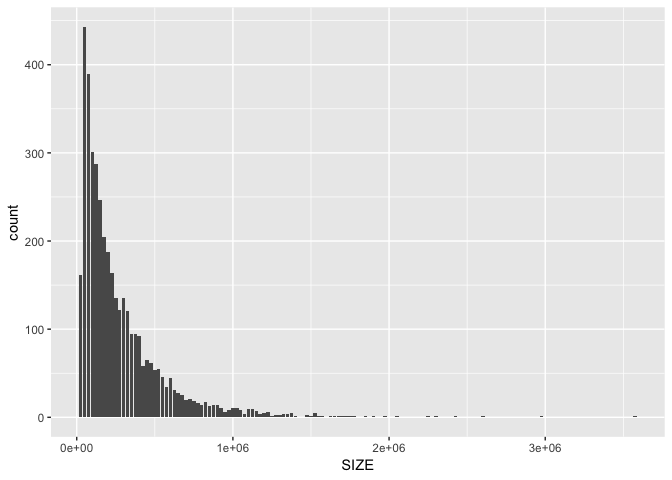
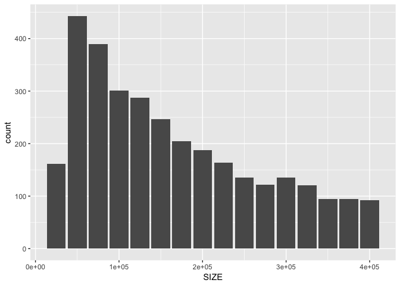
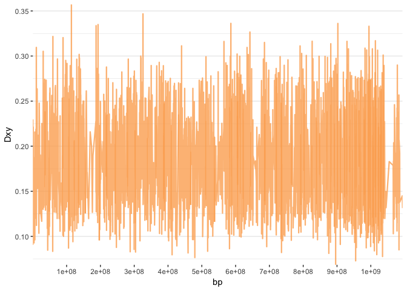
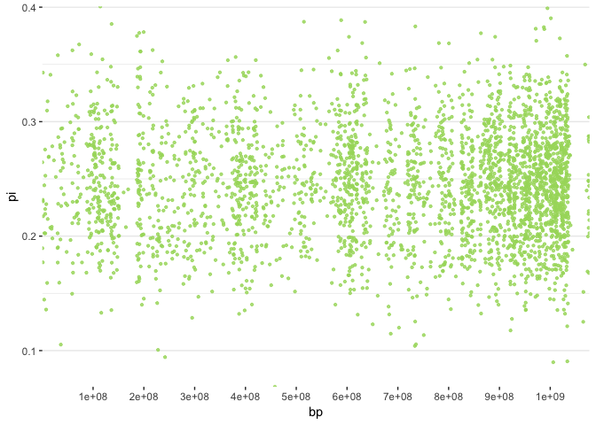
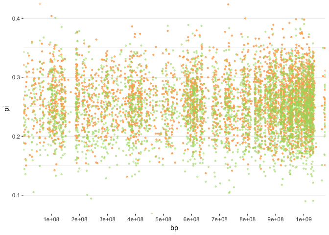
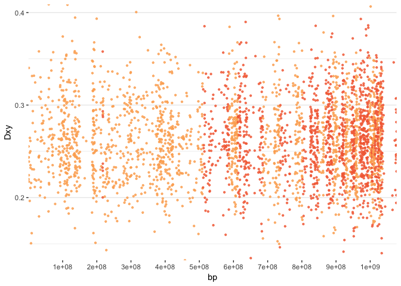
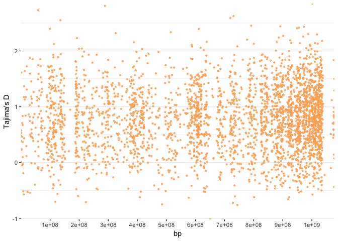
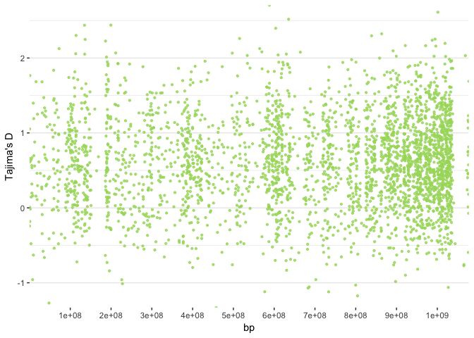
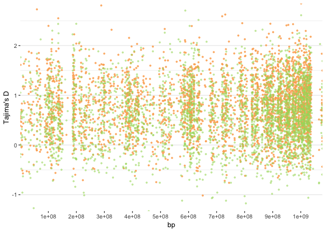

I want to plot the Fst, dxy, pi, and Tajima's D statistics on windows across the genome. I hit the problem that my SNPs are not particularly abundant across the whole genome, so to have enough snps per window I would need fairly large windows. At the same time, some areas contain more snps than others, so I would end up with a lot of snps accumulated in some windows, and that would probably smooth out any outliers in that space. So, I think the best compromise would be to split the snps in different-sized windows, so that every window contains a similar amount of SNPs. I think ~10 SNPs per window should be all right and I think I can split them using info on the chromosome and position. I say ~10 and not exactly 10 because I plan on rounding the windows boundaries to be at the lowest around 25kbp splits. So, since I have already produced windows of 25Kbp for Tajima's D values, I will use those positions to merge together windows with less than 10 SNPs. 
I will import that file first and see what I can do with it. 


```r
library(dplyr)
library(ggplot2)
library(knitr)
read.table("../selection_stats/NI_maf02_25kb.Tajima.D", header = T) -> starting_bins
starting_bins <- starting_bins[,1:3]
starting_bins %>% mutate(., BIN_END=BIN_START+25000) -> starting_bins
```

Now I have to find bin sizes based on the number of SNPs in a region. I am using a function I got from Biostars to reset the cumulative sum of snps every time it surpasses 10.  


```r
sum_reset_at <- function(thresh) {
  function(x) {
    purrr::accumulate(x, ~if_else(.x>=thresh, .y, .x+.y))
  }  
}
starting_bins %>% group_by(., CHROM) %>% mutate(c = sum_reset_at(10)(N_SNPS)) -> starting_bins
```

Then I keep only the rows where the cumsum is over 10, so I have the end positions. From those I can calculate the start position, with some fixing. 


```r
starting_bins %>% filter(., c>=10) -> bins # here I get end positions
bins %>% mutate(., BIN_START=BIN_END) %>% pull(.,BIN_START) -> bins_start # making up the start positions
bins_start <- c(0,bins_start)
bins_start <- bins_start[1:5809] # bit of fixing of first and last records
bins <- tibble(bins$CHROM, bins$c, bins_start, bins$BIN_END) # re-merging with the original dataset
colnames(bins) <- c("CHROM", "SNPS", "START", "END")
bins %>% mutate(., START=replace(START,START>END, 0)) -> bins # fixing records at the start of chromosomes
```

Quickly checking what sizes of windows I get:


```r
bins %>% mutate(., SIZE=END-START) -> bins
ggplot(bins, aes(SIZE)) +
  geom_bar()
```

<!-- -->

```r
bins %>% count(., SIZE) -> bin_sizes
bin_sizes %>% mutate(., SUM=cumsum(n)/sum(n)) -> bin_sizes
kable(bin_sizes[1:25,])
```


   SIZE     n         SUM
-------  ----  ----------
  25000   602   0.1036323
  50000   899   0.2583922
  75000   619   0.3649509
 100000   537   0.4573937
 125000   455   0.5357204
 150000   373   0.5999311
 175000   287   0.6493372
 200000   274   0.6965054
 225000   256   0.7405750
 250000   191   0.7734550
 275000   168   0.8023756
 300000   142   0.8268205
 325000   138   0.8505767
 350000   100   0.8677914
 375000    97   0.8844896
 400000    84   0.8989499
 425000    66   0.9103116
 450000    61   0.9208125
 475000    61   0.9313135
 500000    38   0.9378551
 525000    26   0.9423309
 550000    36   0.9485281
 575000    40   0.9554140
 600000    23   0.9593734
 625000    30   0.9645378

Not great, some of these windows are way too big to be of any importance, the SNPs will be too sparse. But 90% of windows are under or at 400kbp, so I will set my limit there and remove all others.


```r
bins %>% filter(., SIZE <= 400000) -> bins
ggplot(bins, aes(SIZE)) +
  geom_bar()
```

<!-- -->

```r
mean(bins$SIZE)
```

```
## [1] 138251.6
```

That's better. Now, there are two thing I need to fix next: first, I want the chromosomes to be in the correct order in the table, second I will need the bins start and end positions to be concatenated, for ease of plotting later. 


```r
bins %>% arrange(match(CHROM, c("ps_ch_1","ps_ch_1A","ps_ch_1B","ps_ch_2","ps_ch_3","ps_ch_4",
                         "ps_ch_4A","ps_ch_5","ps_ch_6","ps_ch_7","ps_ch_8","ps_ch_9",
                         "ps_ch_10","ps_ch_11","ps_ch_12","ps_ch_13","ps_ch_14","ps_ch_15",
                         "ps_ch_17","ps_ch_18","ps_ch_19","ps_ch_20","ps_ch_21","ps_ch_22",
                         "ps_ch_23","ps_ch_24","ps_ch_25","ps_ch_26","ps_ch_27","ps_ch_28",
                         "ps_ch_LG2","ps_ch_LGE22","ps_ch_Z"))) -> bins

new_bins <- bins %>% 
  
  # Compute chromosome size
  group_by(CHROM) %>% 
  summarise(chr_len=max(END)) %>% 
  arrange(match(CHROM, c("ps_ch_1","ps_ch_1A","ps_ch_1B","ps_ch_2","ps_ch_3","ps_ch_4",
                         "ps_ch_4A","ps_ch_5","ps_ch_6","ps_ch_7","ps_ch_8","ps_ch_9",
                         "ps_ch_10","ps_ch_11","ps_ch_12","ps_ch_13","ps_ch_14","ps_ch_15",
                         "ps_ch_17","ps_ch_18","ps_ch_19","ps_ch_20","ps_ch_21","ps_ch_22",
                         "ps_ch_23","ps_ch_24","ps_ch_25","ps_ch_26","ps_ch_27","ps_ch_28",
                         "ps_ch_LG2","ps_ch_LGE22","ps_ch_Z"))) %>% 
  
    # Calculate cumulative position of each chromosome
  mutate(tot=cumsum(chr_len)-chr_len) %>%
  select(-chr_len) %>%
  
  # Add this info to the initial dataset
  left_join(bins, ., by=c("CHROM"="CHROM")) %>%
  
  # Add a cumulative position of each SNP
  mutate(newSTART=START+tot) %>% mutate(newEND=END+tot)
new_bins %>% mutate(., newEND=newEND-1) -> new_bins
```

The bins are ready. 
Now on to see if I can get the Tajima's D values that I need from the PopGenome package. I should specify that to do this I had to import only one chromosome for now, because I need to specify the region that I am importing.


```r
library(PopGenome)
GENOME.class <- readVCF("../selection_stats/filtered_snps_for_selection_tests_maf02.recode.vcf.gz", 
                        tid="ps_ch_1", frompos = 1, topos = 135425000, include.unknown=TRUE, numcols = 10000)
```

```
## vcff::open : file opened, contains 92 samples
## [1] "Available ContigIdentifiers (parameter tid):"
##  [1] "ps_ch_1"     "ps_ch_10"    "ps_ch_11"    "ps_ch_12"    "ps_ch_13"   
##  [6] "ps_ch_14"    "ps_ch_15"    "ps_ch_17"    "ps_ch_18"    "ps_ch_19"   
## [11] "ps_ch_1A"    "ps_ch_1B"    "ps_ch_2"     "ps_ch_20"    "ps_ch_21"   
## [16] "ps_ch_22"    "ps_ch_23"    "ps_ch_24"    "ps_ch_25"    "ps_ch_26"   
## [21] "ps_ch_27"    "ps_ch_28"    "ps_ch_3"     "ps_ch_4"     "ps_ch_4A"   
## [26] "ps_ch_5"     "ps_ch_6"     "ps_ch_7"     "ps_ch_8"     "ps_ch_9"    
## [31] "ps_ch_LG2"   "ps_ch_LGE22" "ps_ch_Z"    
## |            :            |            :            | 100 %
## |====================================================
```

First of all I need to define my populations:


```r
NI_pop <- read.table("../selection_stats/NI.txt")
SI_pop <- read.table("../selection_stats/SI.txt")
NI_pop <- as.character(NI_pop$V1)
SI_pop <- as.character(SI_pop$V1)

GENOME.class <- set.populations(GENOME.class,
                                list(NI_pop,SI_pop), diploid=TRUE)
```

```
## |            :            |            :            | 100 %
## |====================================================
```

Then I need to define the windows I want to split the chromosome into:


```r
new_bins %>% filter(.,CHROM=="ps_ch_1") %>% select(., END) -> ps_ch_1_end
new_bins %>% filter(.,CHROM=="ps_ch_1") %>% select(., START) -> ps_ch_1_start

ranges <- list()
for (i in seq(1,to=(length(ps_ch_1_end$END)),by=1)) {
  ranges[[i]] <- c(ps_ch_1_start$START[i]:ps_ch_1_end$END[i])
}

GENOME.class.split <- splitting.data(GENOME.class,
                                     positions=ranges, type=2)
```

```
## |            :            |            :            | 100 %
## |===================================================| ;-)
```

Finally I should be able to plot the stats I want across these windows, for both populations. And save them out as new variables.


```r
GENOME.class.split <- neutrality.stats(GENOME.class.split)
```

```
## |            :            |            :            | 100 %
## |
```

```
## opening ff /private/var/folders/5k/7v2qdmp52_7f7krprpl16bb80000gq/T/RtmpLuO3cI/ffbe0342edb730.ff
```

```
## ===================================================| ;-)
```

```r
GENOME.class.split@Tajima.D[1:15,]
```

```
##             pop 1      pop 2
##  [1,] -0.16281988  0.5115251
##  [2,] -1.02301548 -1.6681942
##  [3,] -0.17530959  0.1781261
##  [4,] -0.24952652  0.6606346
##  [5,] -0.45728216 -1.3852229
##  [6,] -0.17384704  0.1086427
##  [7,] -0.17132451 -0.8120317
##  [8,] -0.55615404 -0.1179191
##  [9,]  0.29271160  0.4911120
## [10,] -0.09776309  0.2777151
## [11,] -0.21099799 -0.1293195
## [12,] -0.93734090 -0.8338438
## [13,] -0.56680139 -0.7904362
## [14,] -0.71072426 -0.7502393
## [15,] -1.03340087 -0.3105139
```

```r
GENOME.class.split@Tajima.D[,1] -> NI_Tajima
GENOME.class.split@Tajima.D[,2] -> SI_Tajima
```

Very well, now I only need to repeat this in a loop for all other chromosomes. O.O


```r
as.character(unique(new_bins$CHROM)) -> chromosomes
for (i in seq(2, to=(length(chromosomes)), by=1)) {
  chr <- paste0(chromosomes[i])
  chrend <- max(new_bins %>% filter(.,CHROM==chr) %>% select(., END))
  GENOME.class <- readVCF("../selection_stats/filtered_snps_for_selection_tests_maf02.recode.vcf.gz", 
                          tid=chr, frompos = 1, topos = chrend, include.unknown=TRUE, numcols = 10000)
  GENOME.class <- set.populations(GENOME.class,
                                  list(NI_pop,SI_pop), diploid=TRUE)
  new_bins %>% filter(.,CHROM==chr) %>% select(., END) -> range_end
  new_bins %>% filter(.,CHROM==chr) %>% select(., START) -> range_start
  range <- list()
  for (j in seq(1,to=(length(range_end$END)),by=1)) {
    range[[j]] <- c(range_start$START[j]:range_end$END[j])
  }
  GENOME.class.split <- splitting.data(GENOME.class,
                                       positions=range, type=2)
  GENOME.class.split <- neutrality.stats(GENOME.class.split)
  NI_Tajima <- c(NI_Tajima, GENOME.class.split@Tajima.D[,1])
  SI_Tajima <- c(SI_Tajima, GENOME.class.split@Tajima.D[,2])
}
```

That actually went fairly quick. Now that Tajima is done, I can dedicate myself to the other stats that need binning and averaging.
I will prepare a "coordinate scaler" that I can use to fix the positions of all other variables to plot.


```r
coordinate_scaler <- tibble(new_bins$CHROM, new_bins$tot)
unique(coordinate_scaler) -> coordinate_scaler
colnames(coordinate_scaler) <- c("CHROM", "tot")
```

Then, let's read in and prepare the Fst stats.


```r
Fst_all <- read.table("../selection_stats/NI_vs_SI_maf02.weir.fst", header=T)
Fst_all %>% arrange(match(CHROM, chromosomes)) -> Fst_all  # rearrange the chromosome order
left_join(Fst_all, coordinate_scaler) -> Fst_all
```

```
## Joining, by = "CHROM"
```

```r
Fst_all %>% mutate(., newPOS=POS+tot) -> Fst_all # scale to the new positions
# fix negative Fst values (they should be 0)
Fst_all %>% mutate(., WEIR_AND_COCKERHAM_FST=replace(WEIR_AND_COCKERHAM_FST,
                                                     WEIR_AND_COCKERHAM_FST<=0, 0)) -> Fst_all
```

And let's get the averages over the windows I chose.


```r
mean_Fst <- c()
for (i in seq(1, to=(nrow(new_bins)), by=1)) {
  mean_Fst <- c(mean_Fst, mean(Fst_all %>% filter(., newPOS >= new_bins$newSTART[i] & newPOS <= new_bins$newEND[i]) %>% 
                                 pull(., WEIR_AND_COCKERHAM_FST)))
}
```

Quick rinse and repeat for the NI and SI mean nucleotide diversity, pi.


```r
NI_pi <- read.table("../selection_stats/NI_maf02.sites.pi", header=T)
NI_pi %>% arrange(match(CHROM, chromosomes)) -> NI_pi  # rearrange the chromosome order
left_join(NI_pi, coordinate_scaler) -> NI_pi
```

```
## Joining, by = "CHROM"
```

```r
NI_pi %>% mutate(., newPOS=POS+tot) -> NI_pi # scale to the new positions
mean_NI_pi <- c()
for (i in seq(1, to=(nrow(new_bins)), by=1)) {
  mean_NI_pi <- c(mean_NI_pi, mean(NI_pi %>% filter(., newPOS >= new_bins$newSTART[i] & newPOS <= new_bins$newEND[i]) %>% 
                                 pull(., PI)))
}

SI_pi <- read.table("../selection_stats/SI_maf02.sites.pi", header=T)
SI_pi %>% arrange(match(CHROM, chromosomes)) -> SI_pi  # rearrange the chromosome order
left_join(SI_pi, coordinate_scaler) -> SI_pi
```

```
## Joining, by = "CHROM"
```

```r
SI_pi %>% mutate(., newPOS=POS+tot) -> SI_pi # scale to the new positions
mean_SI_pi <- c()
for (i in seq(1, to=(nrow(new_bins)), by=1)) {
  mean_SI_pi <- c(mean_SI_pi, mean(SI_pi %>% filter(., newPOS >= new_bins$newSTART[i] & newPOS <= new_bins$newEND[i]) %>% 
                                     pull(., PI)))
}
```

Getting dxy is going to be just slightly more complicated, because there are some calculations to perform. Importing both populations allele frequencies to get them ready.


```r
NI_frq <- read.table("../selection_stats/NI_maf02.frq", header=T, row.names = NULL)
SI_frq <- read.table("../selection_stats/SI_maf02.frq", header=T, row.names = NULL)
colnames(NI_frq) <- c(c("CHROM", "POS", "N_ALLELES", "N_CHR", "NI_p", "NI_q"))
colnames(SI_frq) <- c(c("CHROM", "POS", "N_ALLELES", "N_CHR", "SI_p", "SI_q"))
NI_frq <- NI_frq[,1:2-5:6]
SI_frq <- SI_frq[,1:2-5:6]
```

Joining them and calculating per site dxy, following the formula: 
dxy = (p1 \* q2) + (p2 \* q1)


```r
all_frq <- full_join(NI_frq, SI_frq)
```

```
## Joining, by = c("CHROM", "POS", "N_ALLELES")
```

```r
all_frq %>% mutate(., dxy=((NI_p*SI_q)+(SI_p*NI_q))) -> all_frq
```

Finally, getting the mean dxy across windows:


```r
all_frq %>% arrange(match(CHROM, chromosomes)) -> all_frq  # rearrange the chromosome order
left_join(all_frq, coordinate_scaler) -> all_frq
```

```
## Joining, by = "CHROM"
```

```
## Warning: Column `CHROM` joining character vector and factor, coercing into
## character vector
```

```r
all_frq %>% mutate(., newPOS=POS+tot) -> all_frq # scale to the new positions
mean_dxy <- c()
for (i in seq(1, to=(nrow(new_bins)), by=1)) {
  mean_dxy <- c(mean_dxy, mean(all_frq %>% filter(., newPOS >= new_bins$newSTART[i] & newPOS <= new_bins$newEND[i]) %>% 
                                     pull(., dxy)))
}
```

I have everything I need, so let's put everything together. 


```r
outlier_stats <- tibble(new_bins$CHROM, new_bins$newSTART, new_bins$newEND, mean_Fst, 
                        mean_NI_pi, mean_SI_pi, mean_dxy, NI_Tajima, SI_Tajima)
colnames(outlier_stats) <- c("CHROM", "BIN_START", "BIN_END", "Fst", 
                             "NI_pi", "SI_pi", "dxy", "NI_Tajima", "SI_Tajima")
outlier_stats %>% mutate(., BIN_MIDDLE=BIN_START + ((BIN_END-BIN_START)/2)) -> outlier_stats
```

And I will also be outputting a quick summary file for later, with the original bin positions.


```r
outfile <- tibble(new_bins$CHROM, new_bins$START, new_bins$END, mean_Fst, 
                        mean_NI_pi, mean_SI_pi, mean_dxy, NI_Tajima, SI_Tajima)
colnames(outfile) <- c("CHROM", "BIN_START", "BIN_END", "Fst", 
                             "NI_pi", "SI_pi", "dxy", "NI_Tajima", "SI_Tajima")
outfile <- arrange(outfile, desc(Fst))
write.table(outfile, "../selection_stats/outlier_stats.txt", row.names = F, col.names = T, quote = F, sep = "\t")
```

Plotting Fst.


```r
ggplot(outlier_stats, aes(x=BIN_MIDDLE, y=Fst)) +
  
  # Show all points
  geom_point( aes(color=as.factor(CHROM)), alpha=0.8, size=0.8) +
  scale_color_manual(values = rep(c("#A6D96A", "#66BD63"), 80)) +
  
  scale_y_continuous(expand = c(0, 0)) +     # remove space between plot area and x axis
  scale_x_continuous(expand = c(0, 0), breaks=seq(0, 1100000000, 100000000)) +
  
  # adding threshold line
  geom_hline(yintercept=(quantile(outlier_stats$Fst, probs = 0.999, na.rm = TRUE)), linetype="dashed", color = "#D73027") +
  geom_hline(yintercept=(quantile(outlier_stats$Fst, probs = 0.99, na.rm = TRUE)), linetype="dashed", color = "#FDAE61") +
  labs(x = "bp", y="Fst") +
  
  # Custom theme:
  theme_bw() +
  theme( 
    legend.position="none",
    panel.border = element_blank(),
    panel.grid.major.x = element_blank(),
    panel.grid.minor.x = element_blank()
  )
```

```
## Warning: Removed 14 rows containing missing values (geom_point).
```

<!-- -->

```r
ggsave("../selection_stats/Fst.png", width=8, height=4, dpi=300)
```

```
## Warning: Removed 14 rows containing missing values (geom_point).
```

Plotting pi.


```r
ggplot(outlier_stats, aes(x=BIN_MIDDLE)) +
  
  # Show all points
  geom_point(aes(y=NI_pi), alpha=0.8, size=0.8, color="#FDAE61") +
  scale_y_continuous(expand = c(0, 0)) +     # remove space between plot area and x axis
  scale_x_continuous(expand = c(0, 0), breaks=seq(0, 1100000000, 100000000)) +
  
  labs(x = "bp", y="pi") +
  
  # Custom the theme:
  theme_bw() +
  theme( 
    legend.position="none",
    panel.border = element_blank(),
    panel.grid.major.x = element_blank(),
    panel.grid.minor.x = element_blank()
  )
```

```
## Warning: Removed 2 rows containing missing values (geom_point).
```

<!-- -->

```r
ggsave("../selection_stats/NI_pi.png", width=8, height=4, dpi=300)
```

```
## Warning: Removed 2 rows containing missing values (geom_point).
```

```r
ggplot(outlier_stats, aes(x=BIN_MIDDLE)) +
  
  # Show all points
  geom_point(aes(y=SI_pi), alpha=0.8, size=0.8, color="#A6D96A") +
  scale_y_continuous(expand = c(0, 0)) +     # remove space between plot area and x axis
  scale_x_continuous(expand = c(0, 0), breaks=seq(0, 1100000000, 100000000)) +
  
  labs(x = "bp", y="pi") +
  
  # Custom the theme:
  theme_bw() +
  theme( 
    legend.position="none",
    panel.border = element_blank(),
    panel.grid.major.x = element_blank(),
    panel.grid.minor.x = element_blank()
  )
```

```
## Warning: Removed 12 rows containing missing values (geom_point).
```

<!-- -->

```r
ggsave("../selection_stats/SI_pi.png", width=8, height=4, dpi=300)
```

```
## Warning: Removed 12 rows containing missing values (geom_point).
```

```r
ggplot(outlier_stats, aes(x=BIN_MIDDLE)) +
  
  # Show all points
  geom_point(aes(y=NI_pi), alpha=0.8, size=0.8, color="#FDAE61") +
  geom_point(aes(y=SI_pi), alpha=0.5, size=0.8, color="#A6D96A") +
  scale_y_continuous(expand = c(0, 0)) +     # remove space between plot area and x axis
  scale_x_continuous(expand = c(0, 0), breaks=seq(0, 1100000000, 100000000)) +
  
  labs(x = "bp", y="pi") +
  
  # Custom the theme:
  theme_bw() +
  theme( 
    legend.position="none",
    panel.border = element_blank(),
    panel.grid.major.x = element_blank(),
    panel.grid.minor.x = element_blank()
  )
```

```
## Warning: Removed 2 rows containing missing values (geom_point).
```

```
## Warning: Removed 12 rows containing missing values (geom_point).
```

<!-- -->

```r
ggsave("../selection_stats/both_pi.png", width=8, height=4, dpi=300)
```

```
## Warning: Removed 2 rows containing missing values (geom_point).

## Warning: Removed 12 rows containing missing values (geom_point).
```

Then dxy.


```r
ggplot(outlier_stats, aes(x=BIN_MIDDLE, y=dxy)) +
  
  # Show all points
  geom_point( aes(color=as.factor(CHROM)), alpha=0.8, size=0.8) +
  scale_color_manual(values = rep(c("#FDAE61", "#F46D43"), 80)) +
  
  scale_y_continuous(expand = c(0, 0)) +     # remove space between plot area and x axis
  scale_x_continuous(expand = c(0, 0), breaks=seq(0, 1100000000, 100000000)) +
  
  labs(x = "bp", y="Dxy") +
  
  # Custom theme:
  theme_bw() +
  theme( 
    legend.position="none",
    panel.border = element_blank(),
    panel.grid.major.x = element_blank(),
    panel.grid.minor.x = element_blank()
  )
```

```
## Warning: Removed 14 rows containing missing values (geom_point).
```

<!-- -->

```r
ggsave("../selection_stats/dxy.png", width=8, height=4, dpi=300)
```

```
## Warning: Removed 14 rows containing missing values (geom_point).
```

Finally, Tajima's D.


```r
ggplot(outlier_stats, aes(x=BIN_MIDDLE)) +
  
  # Show all points
  geom_point(aes(y=NI_Tajima), alpha=0.8, size=0.8, color="#FDAE61") +
  scale_y_continuous(expand = c(0, 0)) +     # remove space between plot area and x axis
  scale_x_continuous(expand = c(0, 0), breaks=seq(0, 1100000000, 100000000)) +
  
  labs(x = "bp", y="Tajima's D") +
  
  # Custom the theme:
  theme_bw() +
  theme( 
    legend.position="none",
    panel.border = element_blank(),
    panel.grid.major.x = element_blank(),
    panel.grid.minor.x = element_blank()
  )
```

<!-- -->

```r
ggsave("../selection_stats/NI_tajima.png", width=8, height=4, dpi=300)

ggplot(outlier_stats, aes(x=BIN_MIDDLE)) +
  
  # Show all points
  geom_point(aes(y=SI_Tajima), alpha=0.8, size=0.8, color="#A6D96A") +
  scale_y_continuous(expand = c(0, 0)) +     # remove space between plot area and x axis
  scale_x_continuous(expand = c(0, 0), breaks=seq(0, 1100000000, 100000000)) +
  
  labs(x = "bp", y="Tajima's D") +
  
  # Custom the theme:
  theme_bw() +
  theme( 
    legend.position="none",
    panel.border = element_blank(),
    panel.grid.major.x = element_blank(),
    panel.grid.minor.x = element_blank()
  )
```

<!-- -->

```r
ggsave("../selection_stats/SI_tajima.png", width=8, height=4, dpi=300)

ggplot(outlier_stats, aes(x=BIN_MIDDLE)) +
  
  # Show all points
  geom_point(aes(y=NI_Tajima), alpha=0.8, size=0.8, color="#FDAE61") +
  geom_point(aes(y=SI_Tajima), alpha=0.5, size=0.8, color="#A6D96A") +
  scale_y_continuous(expand = c(0, 0)) +     # remove space between plot area and x axis
  scale_x_continuous(expand = c(0, 0), breaks=seq(0, 1100000000, 100000000)) +
  
  labs(x = "bp", y="Tajima's D") +
  
  # Custom the theme:
  theme_bw() +
  theme( 
    legend.position="none",
    panel.border = element_blank(),
    panel.grid.major.x = element_blank(),
    panel.grid.minor.x = element_blank()
  )
```

<!-- -->

```r
ggsave("../selection_stats/both_tajima.png", width=8, height=4, dpi=300)
```

