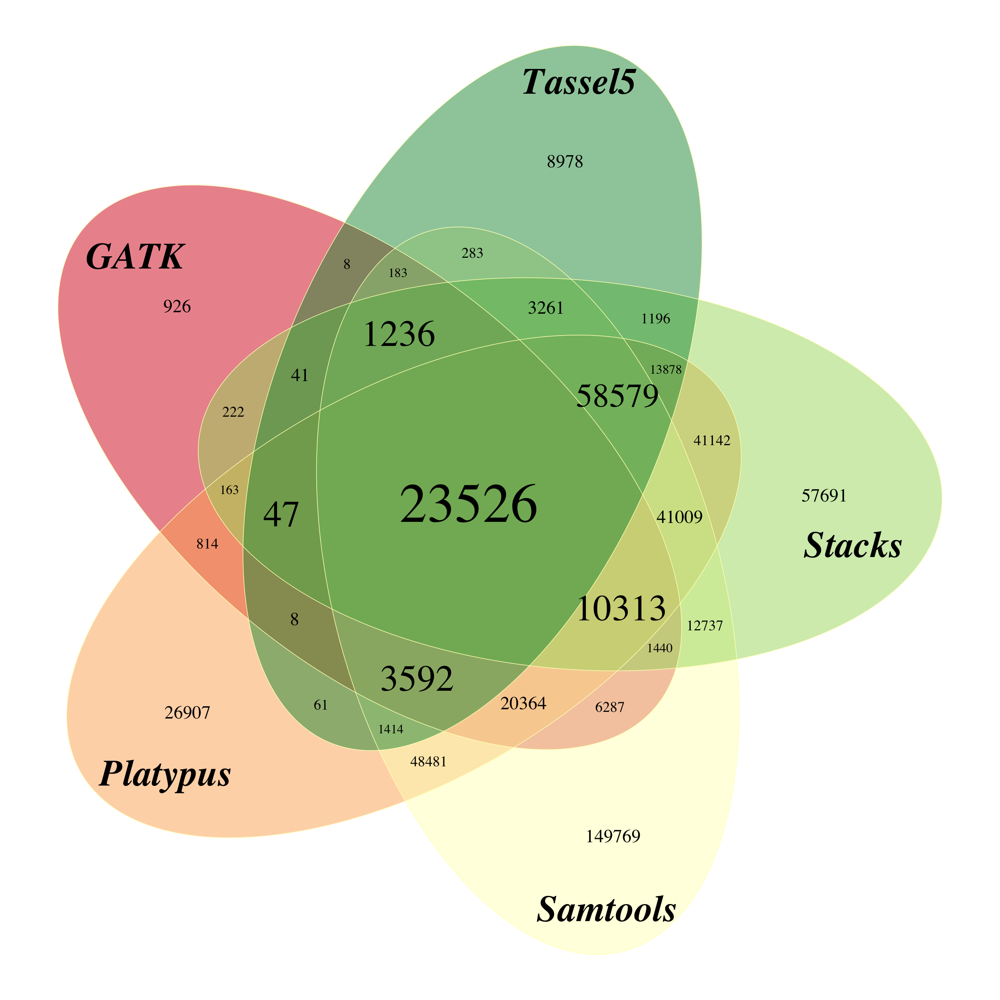
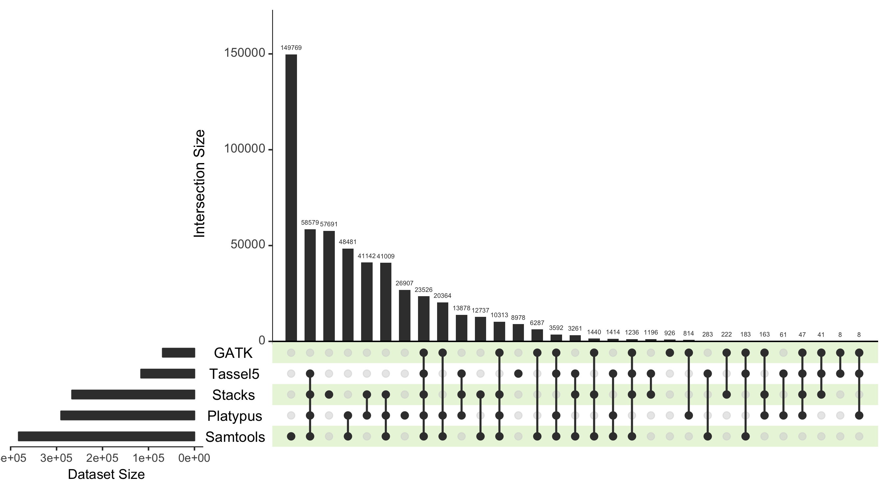

I am using two different R packages and plot types to visualise the overlap between the tested GBS pipelines.


```r
library(UpSetR)
library(VennDiagram)
```

First of all, I need to input the number of loci shared between the pipelines, that I obtained from vcftools/vcf-compare.


```r
expressionInput <- c(GATK = 926, Platypus = 26907, Samtools = 149769, Stacks = 57691, Tassel5 = 8978,
                     `GATK&Tassel5` = 8, `GATK&Platypus&Tassel5` = 8, 
                     `GATK&Stacks&Tassel5` = 41, `GATK&Platypus&Stacks&Tassel5` = 47,
                     `Platypus&Tassel5` = 61, `GATK&Platypus&Stacks` = 163, 
                     `GATK&Samtools&Tassel5` = 183, `GATK&Stacks` = 222,
                     `Samtools&Tassel5` = 283, `GATK&Platypus` = 814, 
                     `Stacks&Tassel5` = 1196, `GATK&Samtools&Stacks&Tassel5` = 1236,
                     `Platypus&Samtools&Tassel5` = 1414, `GATK&Samtools&Stacks` = 1440, 
                     `Samtools&Stacks&Tassel5` = 3261, `GATK&Platypus&Samtools&Tassel5` = 3592, 
                     `GATK&Samtools` = 6287, `GATK&Platypus&Samtools&Stacks` = 10313,
                     `Samtools&Stacks` = 12737, `Platypus&Stacks&Tassel5` = 13878, 
                     `GATK&Platypus&Samtools` =20364, `GATK&Platypus&Samtools&Stacks&Tassel5` = 23526, 
                     `Platypus&Samtools&Stacks` = 41009, `Platypus&Stacks` = 41142,
                     `Platypus&Samtools` = 48481, `Platypus&Samtools&Stacks&Tassel5` = 58579)
```

I need to rework those numbers significantly to use them in VennDiagram, because this program does not take as input the number of loci shared _exclusively_ by two sets, but all the loci shared between them, and so on for all intersections. I wrote down how these calculations go from the input above to the necessary input for the VennDiagram plot, they are present in the R code but set up as hidden in this output, you can look them up in the original Rmarkdown file. 


With the input set I can plot the Venn Diagram for the pipeline overlap:

<!-- -->

Samtools has a lot of unique loci not shared with any other pipeline, but it is also the pipeline that called more loci in general. GATK has very few private loci but it is the pipeline that called less in general. There is very good overlap between all five pipelines. 
The problem of reading a VennDiagram like this is that the size of the intersections is not proportional to the numbers they contain, so it is not immediately clear where the bigger intersections are. For this reason I decided to complement this with UpSetR, which has been created for exactly this purpose.

<!-- -->

