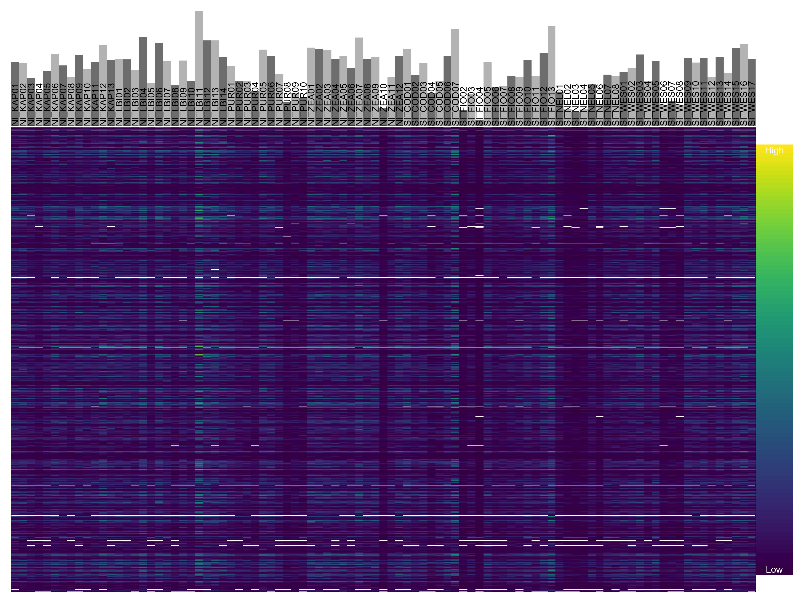
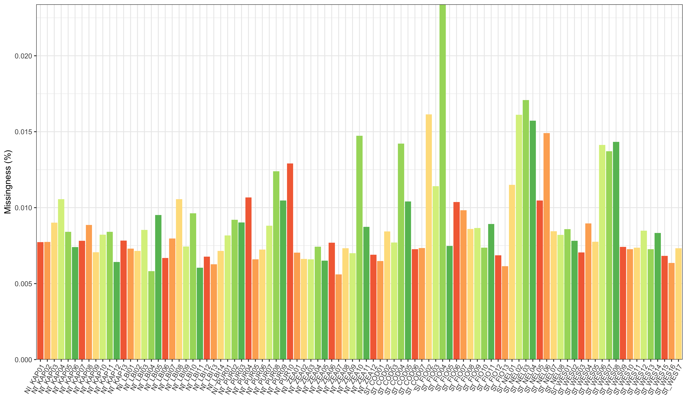
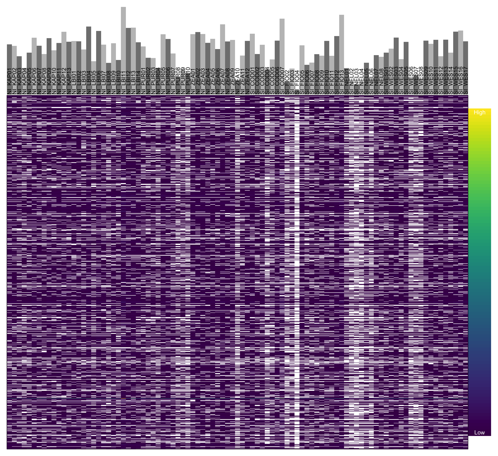
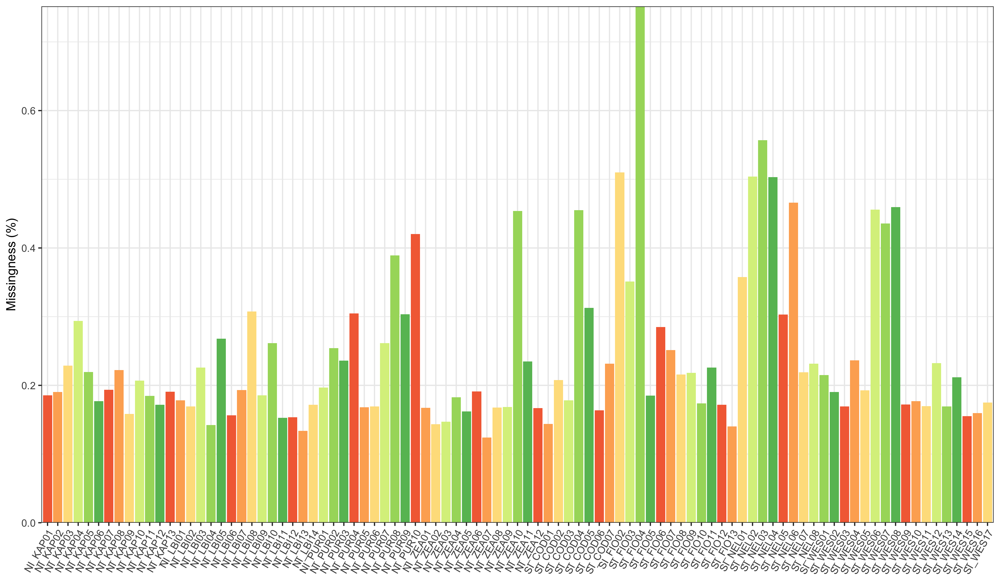

Exploratory analysis of the SNP dataset, using the common snps between 3 out of 5 pipelines, after filtering for 10% missing data. 
I am using the package vcfR to check the data distribution, in order to determine whether other filtering is necessary.


```r
library(vcfR)
library(ggplot2)
library(reshape2)
```

Loading the data and extracting the depth information (per sample and per locus, from the FORMAT field in the vcf file).


```r
setwd("/Volumes/osms-anatomy-dept-3/Users/D/Denise Martini/Denise/ModPop_analysis/vcf_filtering")
vcf <- read.vcfR('maxmiss90_common_snps_fixed.vcf')
```

```r
dp <- extract.gt(vcf, element = "DP", as.numeric=TRUE)
dp[1:4,1:6]
```

```
##               NI_KAP01 NI_KAP02 NI_KAP03 NI_KAP04 NI_KAP05 NI_KAP06
## ps_ch_1_9925        10        4       14        3        0        6
## ps_ch_1_10540        8        4        5        6        6        2
## ps_ch_1_23215        1        4        1        0        1        2
## ps_ch_1_23281        3        7        1        0        2        3
```

First, I am checking the average depth per locus at each sample.

<!-- -->

From this plot I can see that there are some outlier loci that have a very high depth per sample: this could be indicative of alignments in repetitive regions, which would not be very reliable. It would be worth applying a max depth filter to this dataset. Note that missing data is not shown in this plot, because I had to apply a logarithmic scale to the depth in order to visualise it properly.


Then, on to explore the missing data itself. I want to first take a look at the overall levels of missing data, but since the dataset is quite big I am randomly subsetting 1000 loci to take a first look at, over all samples. The heatmap plots the coverage level at the subsampled loci for each sample. 

<!-- -->

There is lower coverage overall, which confirms that those very high depth snps are not overabundant in the dataset. It is also to be expected of GBS data. But in general there doesn't seem to be that much missing data, so what about the missingness per sample?

<!-- -->

There is only one sample that has higher levels of missing data compared to the rest, but it is still only at ~2%.
But this is all based on the depth at each locus, which is not necessarily representative of missing data: a locus with only 1-2 reads at one sample should be coded as a missing genotype for that sample (at least in Platypus calls). So, this is probably an underrepresentation of the real missingness.

I need to apply a transformation to the data, to properly code as missing all sites with a depth per sample of less than 2.


```r
dp2 <- dp
dp2[dp2 < 2] <- NA
```

If I now reproduce the heatmap again, I get:

<!-- -->

This looks much closer to the real dataset. I can now clearly see that sample with higher level of missingness standing out, and a few other samples are not great either. If I check the per sample level of missingness:

<!-- -->

I can now see that sample SI_FIO04 has ~75% missing data. This is also what vcftools was reporting for this sample, so I believe it would be a good idea to exclude it from the analysis.
